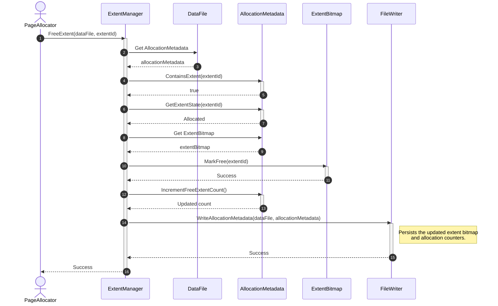
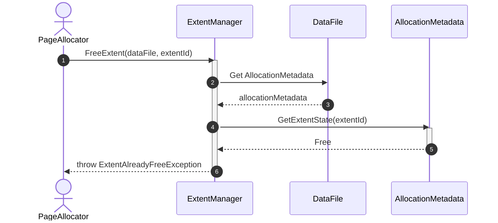
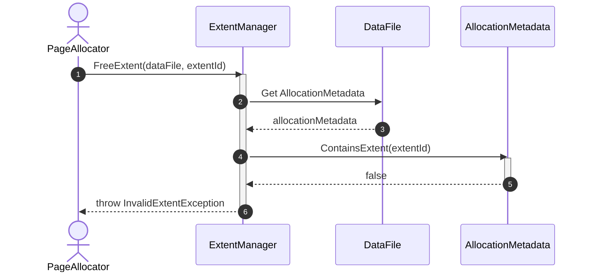
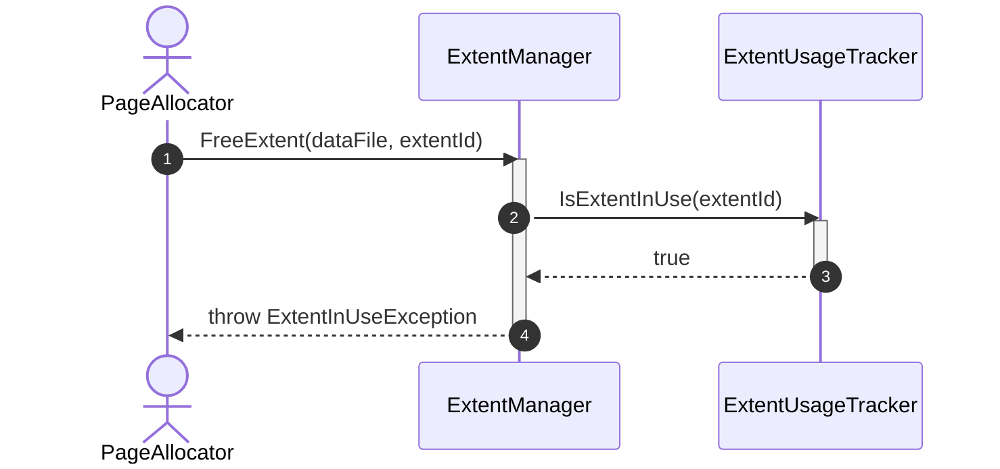
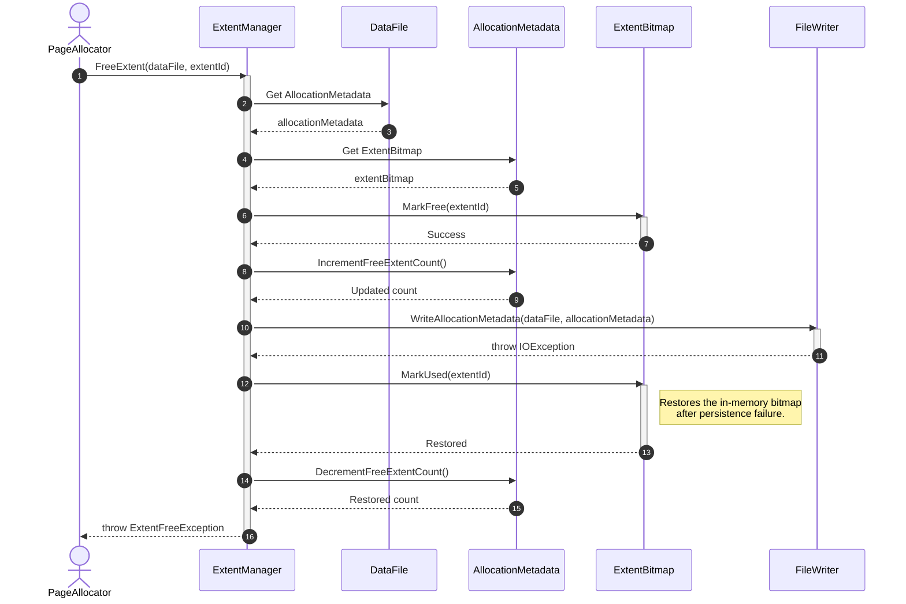

# Sequence Diagram - Free Extent

## Use Case Overview

**Actor**: `PageAllocator`, `HeapManager`, `IndexManager`, or another storage component  
**Purpose**: Releases an allocated extent and makes it available for future allocation by updating allocation metadata and the extent bitmap.

### Preconditions

- The target data file exists.
- The target extent belongs to the data file.
- The extent is currently marked as allocated.
- The caller has already released all logical pages owned by the extent.
- No active operation is still using the extent.

---

## 1. Happy Path: Extent Successfully Freed



---

## 2. Alternative Path: Extent Is Already Free



---

## 3. Failure Path: Extent Does Not Belong to File



---

## 4. Failure Path: Extent Is Still In Use



---

## 5. Failure Path: Metadata Write Error



---

## Discovered Candidates

### Method Candidates

```text
ExtentManager.FreeExtent(
    dataFile: DataFile,
    extentId: ExtentId
) : void

AllocationMetadata.ContainsExtent(
    extentId: ExtentId
) : bool

AllocationMetadata.GetExtentState(
    extentId: ExtentId
) : ExtentState

AllocationMetadata.IncrementFreeExtentCount() : void

AllocationMetadata.DecrementFreeExtentCount() : void

ExtentBitmap.MarkFree(
    extentId: ExtentId
) : void

ExtentBitmap.MarkUsed(
    extentId: ExtentId
) : void

ExtentUsageTracker.IsExtentInUse(
    extentId: ExtentId
) : bool

FileWriter.WriteAllocationMetadata(
    dataFile: DataFile,
    metadata: AllocationMetadata
) : void
```

### Property Candidates

```text
DataFile.AllocationMetadata : AllocationMetadata

AllocationMetadata.ExtentBitmap : ExtentBitmap

AllocationMetadata.TotalExtentCount : int

AllocationMetadata.FreeExtentCount : int

ExtentId.Value : long
```

### Enum Candidates

```text
ExtentState
├── Free
├── Allocated
└── Reserved
```

### Exception Candidates

```text
InvalidExtentException

ExtentAlreadyFreeException

ExtentInUseException

ExtentFreeException
```

### State Candidates

```text
ExtentBitmap[extentId]

AllocationMetadata.FreeExtentCount
```

---

## Responsibility Assignment

### `ExtentManager`

- Coordinates the extent release operation.
- Validates that the extent belongs to the file.
- Prevents double-free.
- Prevents releasing an extent that is still in use.
- Coordinates metadata persistence.

### `ExtentBitmap`

- Stores whether each extent is free or allocated.
- Changes a single extent between free and used states.
- Does not perform file I/O.

### `AllocationMetadata`

- Owns the extent bitmap.
- Maintains allocation counters.
- Validates extent boundaries.

### `FileWriter`

- Persists the updated allocation metadata.
- Does not decide which extent should be freed.

---

## Durability Note

`FreeExtent()` should not necessarily call `FileSynchronizer.Sync()` after every operation because forcing an OS-level disk flush for every extent release is expensive.

The normal DBMS flow should be:

```text
Update allocation metadata
    → mark the affected metadata page dirty
    → write the corresponding WAL record
    → checkpoint or flush later
```

For the simplified file-management version, metadata may be written immediately, while durable synchronization remains controlled by:

```text
BufferManager

CheckpointCoordinator

TransactionManager
```

---

## Design Note: Extent Usage Validation

`ExtentManager` should not inspect buffer frames or page locks directly.

A higher-level component should guarantee that pages are no longer active, or expose a small abstraction such as:

```text
ExtentUsageTracker.IsExtentInUse(extentId)
```

This prevents `ExtentManager` from depending directly on the entire `BufferManager`.
