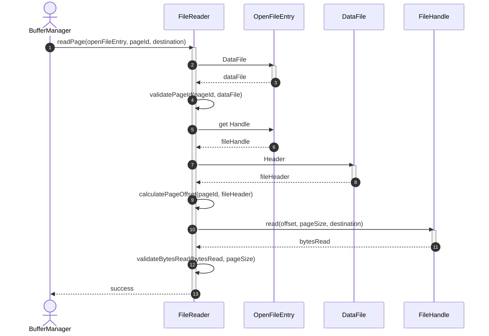
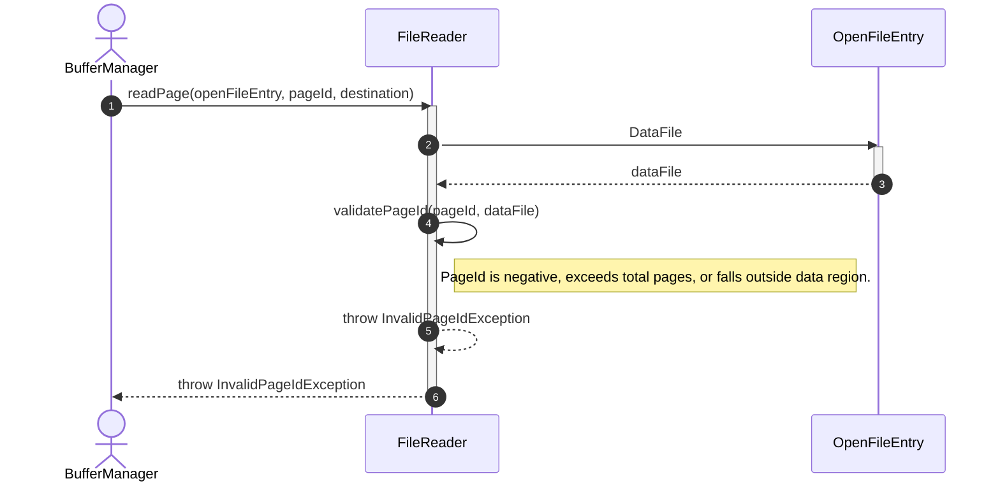
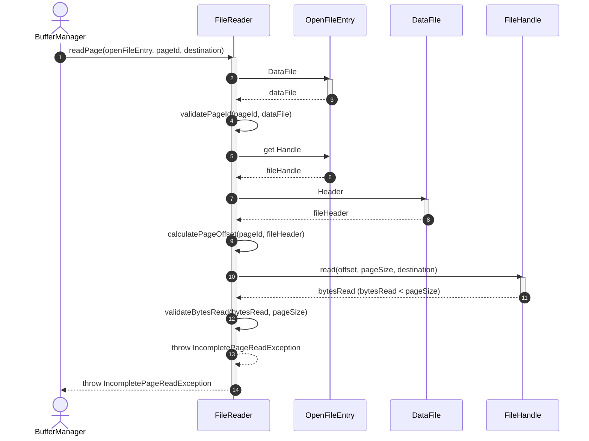
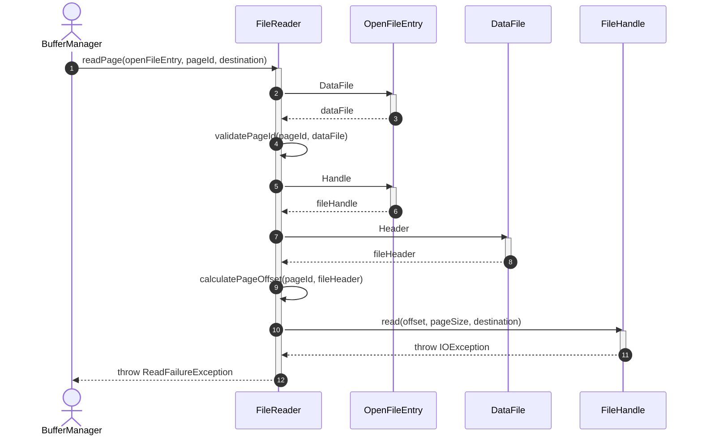

# Sequence Diagram - Read File

## Usecase Overview
**Actor**: `BufferManager`
**Purpose**: Shows how the system reads physical blocks/pages from an open database file using the active file handle.

---

## 1. Happy Path: Successful Page Read

---

## 2. Failure Path: Invalid PageId

---

## 3. Failure Path: Incomplete Page Read

---

## 4. Failure Path: OS I/O Error

---

## Discovered Candidates

### Method Candidates
- `FileReader.readPage(entry: OpenFileEntry, pageId: PageId, destination: ByteBuffer) : void`
- `FileReader.calculatePageOffset(pageId: PageId, header: FileHeader) : long`
- `FileReader.validatePageId(pageId: PageId, file: DataFile) : void`
- `FileReader.validateBytesRead(bytesRead: int, expectedBytes: int) : void`
- `FileHandle.read(offset: long, length: int, destination: ByteBuffer) : int`

### State Candidates
- `PageId` type (representing the unique identifier of a database page).
- `ByteBuffer` representing the destination stream buffer.
