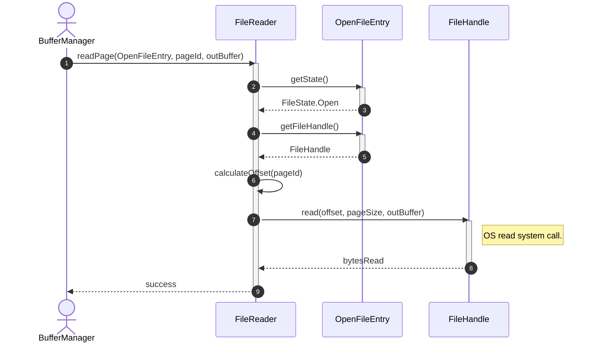
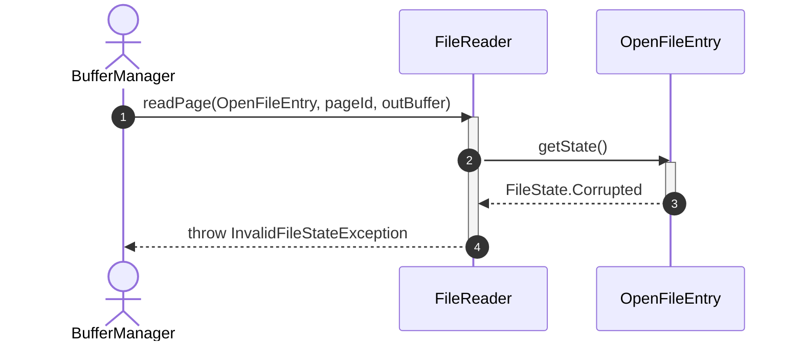
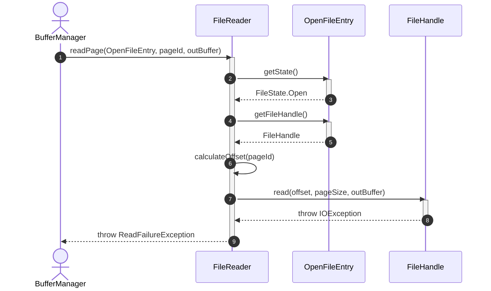

# Sequence Diagram - Read File

## Usecase Overview
**Actor**: `BufferManager`
**Purpose**: Shows how the system reads physical blocks/pages from an open database file using the active descriptor and handle.

---

## 1. Happy Path: Successful Page Read

---

## 2. Failure Path: Read Access Lock Violation

---

## 3. Failure Path: OS Level Read Error (Bad Sector/Disk Failure)

---

## Discovered Candidates

### Method Candidates
- `FileReader.readPage(entry: OpenFileEntry, pageId: int, buffer: ByteBuffer) : void`
- `FileReader.calculateOffset(pageId: int) : long`
- `OpenFileEntry.getState() : FileState`
- `OpenFileEntry.getFileHandle() : FileHandle`
- `FileHandle.read(offset: long, length: int, destination: ByteBuffer) : int`

### State Candidates
- `FileState` enum values (e.g. Open, Corrupted)
- `FileAccessMode` enum values
