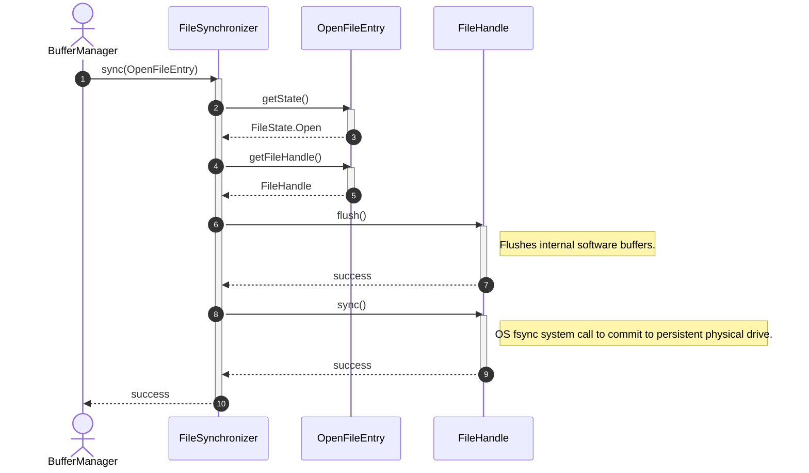
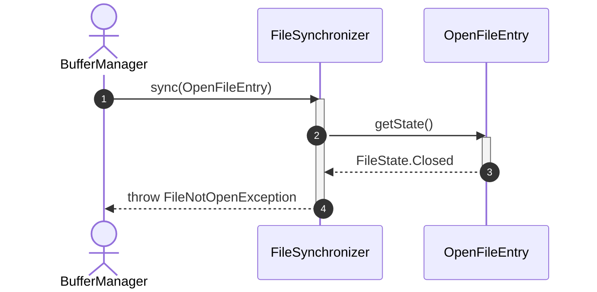
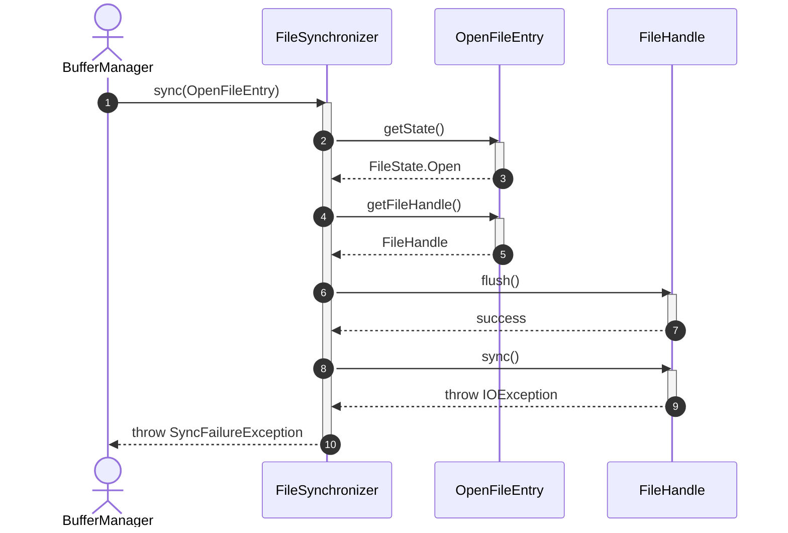

# Sequence Diagram - Sync File

## Usecase Overview
**Actor**: `BufferManager` (or `CheckpointCoordinator`)
**Purpose**: Shows how the system flushes OS-level write buffers and triggers a hardware-level flush to ensure durability (ACID Properties).

---

## 1. Happy Path: Successful File Sync

---

## 2. Failure Path: File State is Invalid

---

## 3. Failure Path: OS-level fsync Error

---

## Discovered Candidates

### Method Candidates
- `FileSynchronizer.sync(entry: OpenFileEntry) : void`
- `OpenFileEntry.getState() : FileState`
- `OpenFileEntry.getFileHandle() : FileHandle`
- `FileHandle.flush() : void`
- `FileHandle.sync() : void`

### State Candidates
- `FileState` enum values (Open, Closed)
