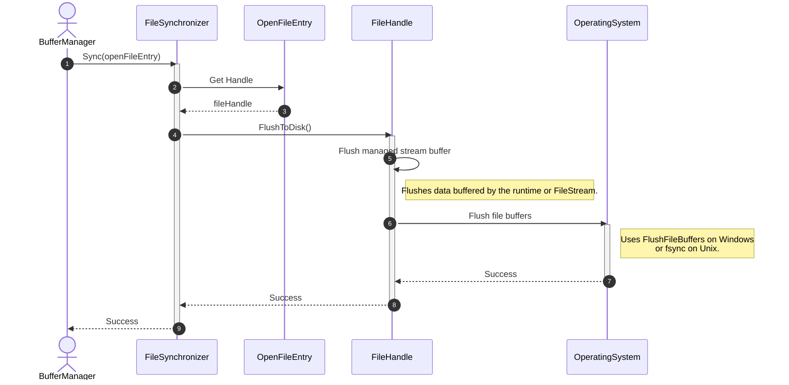
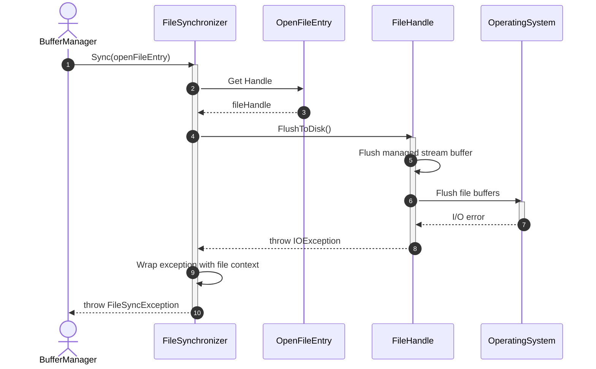

# Sequence Diagram - Sync File

## Use Case Overview

**Actor**: `BufferManager` or `CheckpointCoordinator`
**Purpose**: Ensures that data previously written to an open file is flushed through the runtime and operating-system buffers to the durability boundary provided by the operating system.

> `FileSynchronizer` does not write file data. It only requests that previously written data be persisted.

### Preconditions

* `OpenFileEntry` is not null.
* The associated `FileHandle` is open and valid.
* Required WAL records have already been flushed when WAL ordering applies.

---

## 1. Happy Path: File Successfully Flushed to Disk



---

## 2. Failure Path: Operating-System Flush Error



---

## Discovered Candidates

### Method Candidates

```text
FileSynchronizer.Sync(
    openFileEntry: OpenFileEntry
) : void

FileHandle.FlushToDisk() : void
```

### Property Candidates

```text
OpenFileEntry.Handle : FileHandle
```

### Exception Candidates

```text
FileSyncException
```

Recommended information contained by `FileSyncException`:

```text
FileName       : string
Operation      : string
InnerException : Exception
```

### State Candidates

No new persistent state is required.

The open, closed, disposed, or invalid state of the underlying handle remains encapsulated inside `FileHandle`.

---

## Responsibility Assignment

### `FileSynchronizer`

* Coordinates the file-sync operation.
* Retrieves the handle from `OpenFileEntry`.
* Converts low-level I/O exceptions into a file-management exception.
* Adds contextual information such as the affected file.

### `FileHandle`

* Encapsulates the runtime or operating-system file handle.
* Flushes managed stream buffers when they exist.
* Requests an OS-level durable flush.
* Throws an `IOException` when the flush operation fails.

### `OpenFileEntry`

* Provides access to the active `FileHandle`.
* Does not perform the sync operation itself.

---

## .NET Implementation Mapping

When `FileHandle` wraps a `FileStream`:

```csharp
public void FlushToDisk()
{
    _fileStream.Flush(flushToDisk: true);
}
```

When `FileHandle` wraps a `SafeFileHandle` and uses `RandomAccess`:

```csharp
public void FlushToDisk()
{
    RandomAccess.FlushToDisk(_safeFileHandle);
}
```

Only one implementation should be used depending on how file I/O is represented in the system.

---

## Design Decision

Do not define both:

```text
FileHandle.Flush()
FileHandle.Sync()
```

unless the system genuinely needs two different durability levels:

```text
Flush()       → flush runtime buffers only
FlushToDisk() → flush runtime and OS buffers for durability
```

For the current DBMS design, exposing only:

```text
FileHandle.FlushToDisk()
```

is simpler and avoids duplicated or ambiguous responsibilities.
