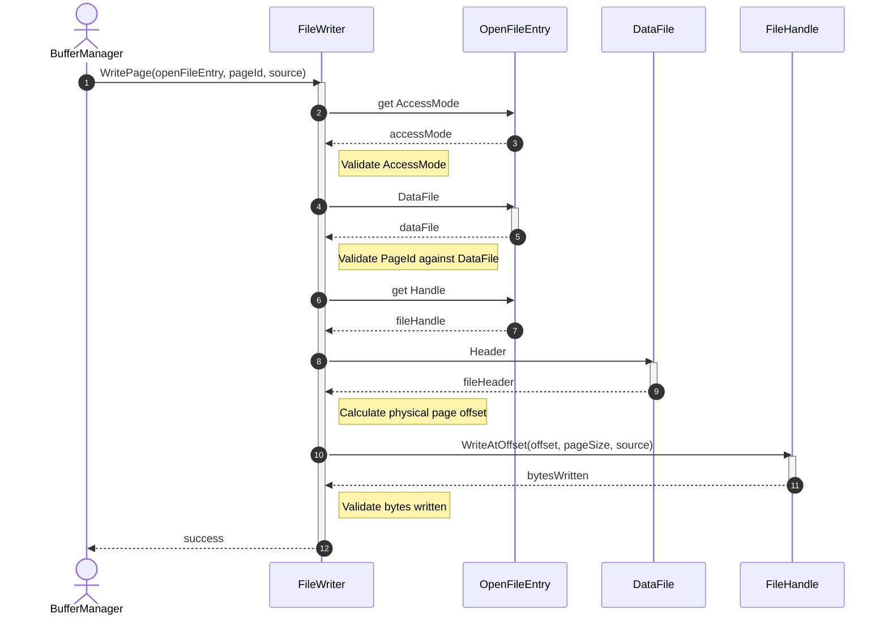
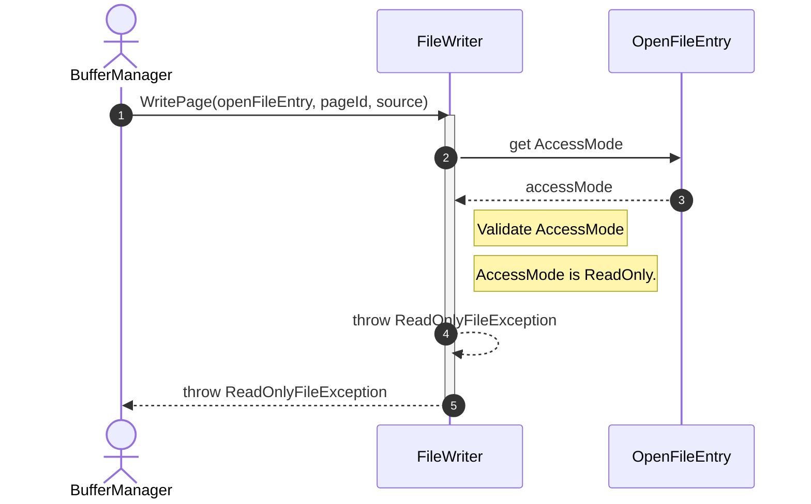
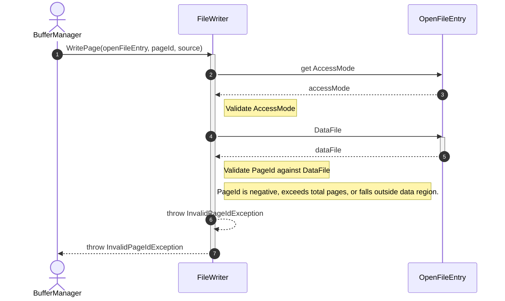
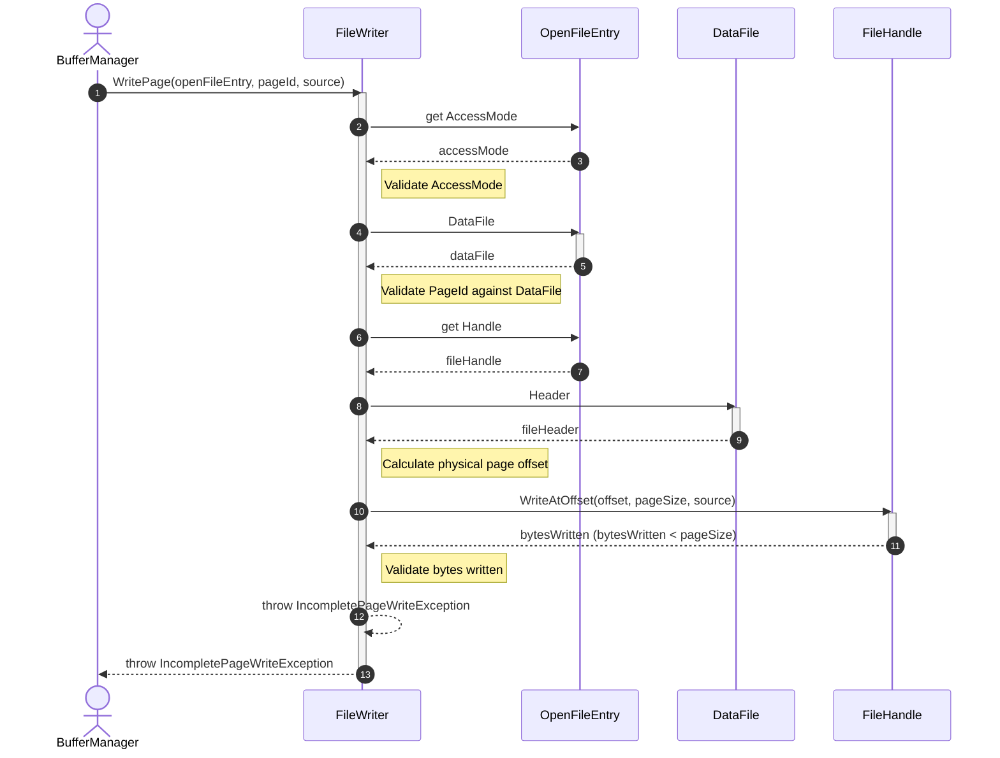
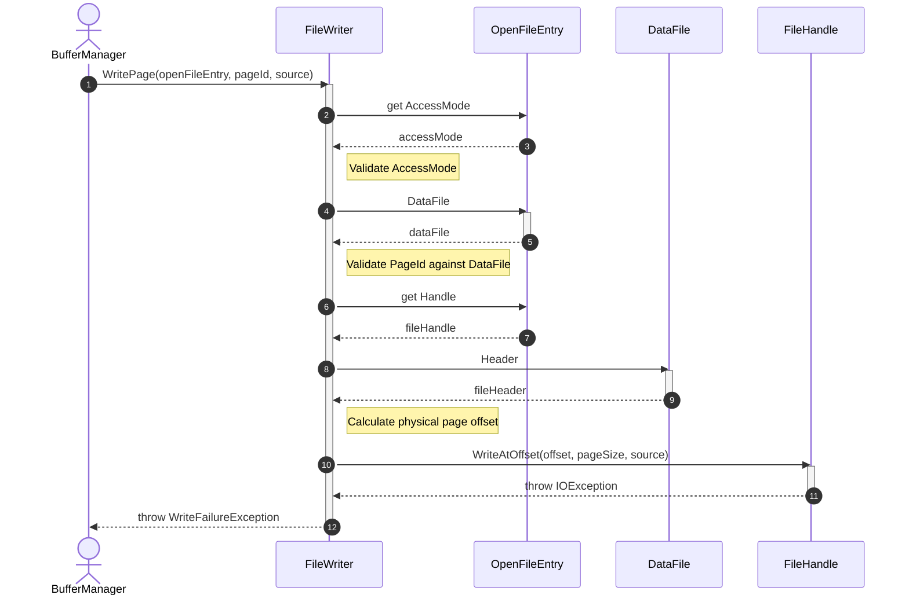

# Sequence Diagram - Write File

## Usecase Overview
**Actor**: `BufferManager`
**Purpose**: Shows how the system writes modified pages/blocks from memory to the open physical data file.

---

## 1. Happy Path: Successful Page Write

---

## 2. Failure Path: Write Lock / Read-Only Violation

---

## 3. Failure Path: Invalid PageId

---

## 4. Failure Path: Incomplete Page Write

---

## 5. Failure Path: OS I/O Error

---

## Discovered Candidates

### Method Candidates
- `FileWriter.WritePage(entry: OpenFileEntry, pageId: PageId, source: ReadOnlyMemory~byte~) : void`
- `FileHandle.WriteAtOffset(offset: long, source: ReadOnlyMemory~byte~) : void`

### State Candidates
- `PageId` type (representing the unique identifier of a database page).
- `ByteBuffer` representing the source stream buffer.
- `FileAccessMode` enum values (ReadOnly, ReadWrite).
