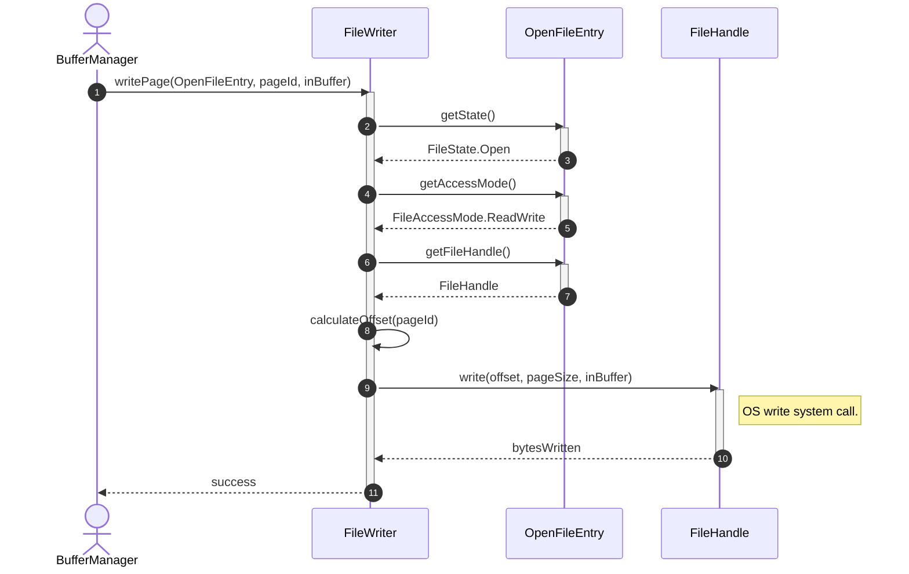
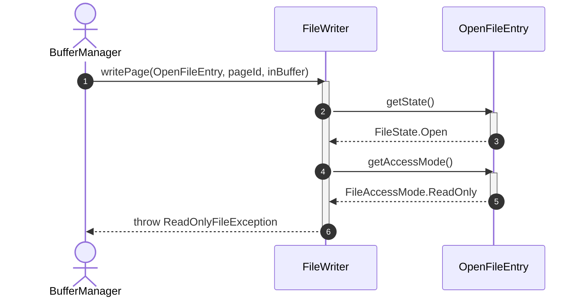
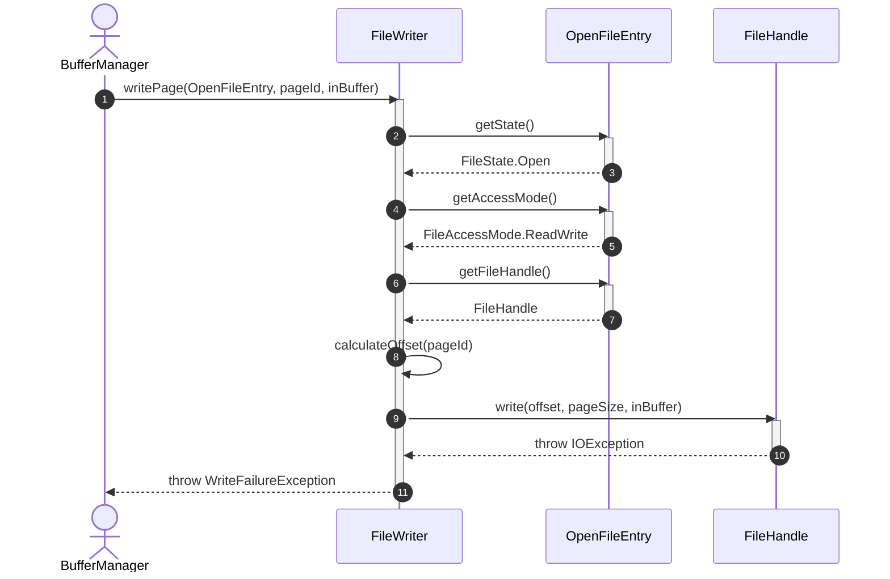

# Sequence Diagram - Write File

## Usecase Overview
**Actor**: `BufferManager`
**Purpose**: Shows how the system writes modified pages/blocks from memory to the open physical data file.

---

## 1. Happy Path: Successful Page Write

---

## 2. Failure Path: Write Lock / Read-Only Violation

---

## 3. Failure Path: OS Level Disk Write Error (Disk Failure)

---

## Discovered Candidates

### Method Candidates
- `FileWriter.writePage(entry: OpenFileEntry, pageId: int, buffer: ByteBuffer) : void`
- `FileWriter.calculateOffset(pageId: int) : long`
- `OpenFileEntry.getState() : FileState`
- `OpenFileEntry.getAccessMode() : FileAccessMode`
- `OpenFileEntry.getFileHandle() : FileHandle`
- `FileHandle.write(offset: long, length: int, source: ByteBuffer) : int`

### State Candidates
- `FileAccessMode` enum values (ReadOnly, ReadWrite)
- `FileState` enum values (Open, Closed, Corrupted)
