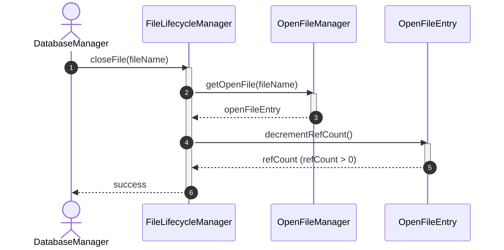
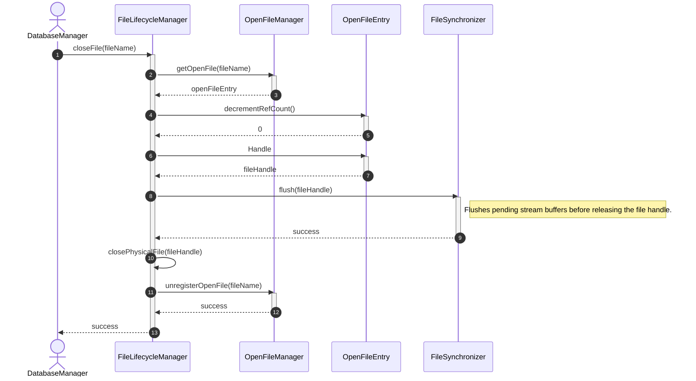
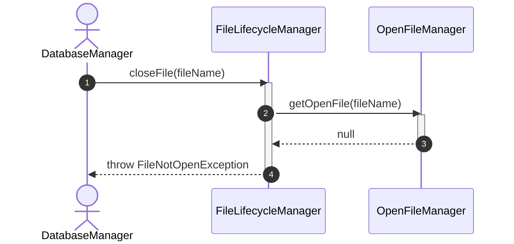

# Sequence Diagram - Close File

## Usecase Overview
**Actor**: `DatabaseManager`
**Purpose**: Shows how the system closes an open database file handle, handling reference counting to check if other components are still using the file. If the reference count drops to 0, it flushes cached changes to disk, closes the physical file descriptor, and cleans up the active file tracking entry.

---

## 1. Happy Path 1: File Closing (ReferenceCount > 0)

---

## 2. Happy Path 2: File Closing (ReferenceCount == 0)

---

## 3. Failure Path: File is Not Currently Open

---

## Concurrency & Implementation Requirements
1. **Safe Close Lifecycle (Anti-Race Condition)**: To prevent thread races where Thread A is closing the file handle (reference count has dropped to `0`) and Thread B concurrently requests the same file via `openFile()`, the final-close sequence (decrementing to `0`, flushing, closing, and unregistering) must be executed atomically under a lock. Requests must not be allowed to reuse or acquire an entry that has started its closing sequence.
2. **Internal Entry States**: If necessary, `OpenFileManager` can track internal state transitions (e.g., `Open` -> `Closing` -> `Removed`) to coordinate concurrent requests safely without exposing these transient states to the public domain model.
3. **Flushing Scopes**:
   - `FileSynchronizer.flush(fileHandle)` only flushes pending stream/file handle buffers.
   - It **does not** flush dirty database pages sitting in a DBMS buffer pool. Writing dirty pages from the buffer pool to disk is the distinct responsibility of a `BufferManager` (e.g. `BufferManager.flushFile(fileId)`) and should occur prior to closing the file.

---

## Discovered Candidates

### Method Candidates
- `FileLifecycleManager.closeFile(fileName: String) : void`
- `FileLifecycleManager.closePhysicalFile(handle: FileHandle) : void`
- `OpenFileManager.getOpenFile(fileName: String) : OpenFileEntry?`
- `OpenFileManager.unregisterOpenFile(fileName: String) : void`
- `FileSynchronizer.flush(handle: FileHandle) : void`
- `OpenFileEntry.Handle : FileHandle`
- `OpenFileEntry.decrementRefCount() : int`

### State Candidates
- None (When closed completely, `OpenFileEntry` is removed from `OpenFileManager` hence there is no active object maintaining a `Closed` state).
