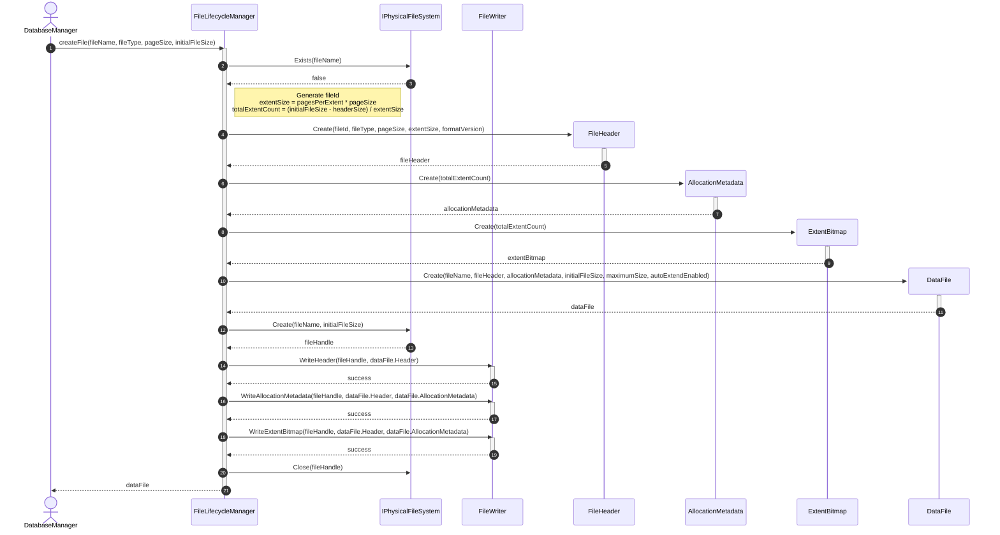
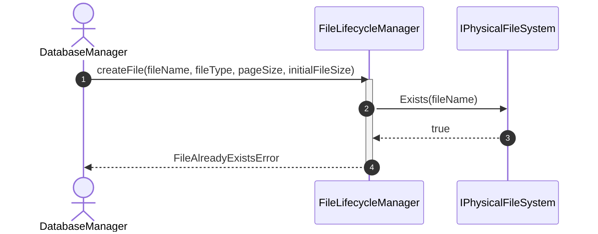
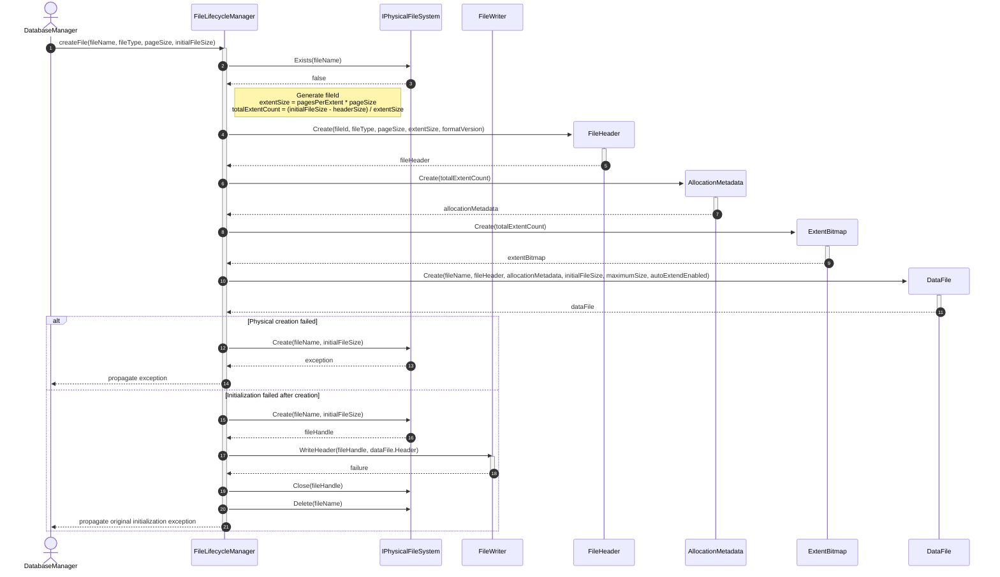

# Sequence Diagram - Create File

## Usecase Overview
**Actor**: `DatabaseManager`
**Purpose**: Shows how the system creates a new physical database file, initializes its structure, and persists the metadata.

---

## 1. Happy Path: Successful Creation

---

## 2. Failure Path: File Already Exists

---

## 3. Failure Path: Write Operation Failed (Rollback)

> [!NOTE] 
> If `PFS: Close` or `PFS: Delete` fail during rollback, the original initialization exception is preserved as the primary failure. The cleanup failure is recorded/attached according to project exception policy. Note that an `OpenFileEntry` is NEVER registered during any failure path.

## Discovered Candidates

### Method Candidates
- `FileLifecycleManager.CreateFile(fileName: String, fileType: FileType, pageSize: int, initialFileSize: long) : DataFile`
- `IPhysicalFileSystem.Exists(fileName: String) : boolean`
- `IPhysicalFileSystem.Create(fileName: String, initialFileSize: long) : FileHandle`
- `IPhysicalFileSystem.Close(handle: FileHandle) : void`
- `IPhysicalFileSystem.Delete(fileName: String) : void`
- `FileHeader.Create(fileId: FileId, fileType: FileType, pageSize: int, extentSize: int, formatVersion: int) : FileHeader`
- `AllocationMetadata.Create(totalExtentCount: int) : AllocationMetadata`
- `ExtentBitmap.Create(totalExtents: int) : ExtentBitmap`
- `DataFile.Create(fileName: String, header: FileHeader, metadata: AllocationMetadata, currentSize: long, maximumSize: long?, autoExtendEnabled: bool) : DataFile`
- `FileWriter.WriteHeader(handle: FileHandle, header: FileHeader) : void`
- `FileWriter.WriteAllocationMetadata(handle: FileHandle, header: FileHeader, metadata: AllocationMetadata) : void`
- `FileWriter.WriteExtentBitmap(handle: FileHandle, header: FileHeader, metadata: AllocationMetadata) : void`

### State Candidates
- `FileType` enum (e.g., Table, Log, Temporary)
- `pageSize` (int)
- `initialFileSize` (long)
- `formatVersion` (int)
- `totalExtents` (int)
