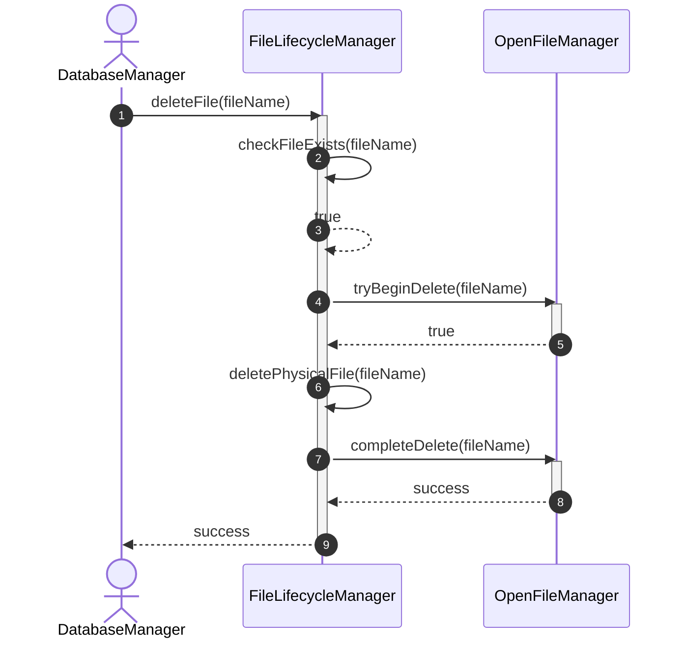
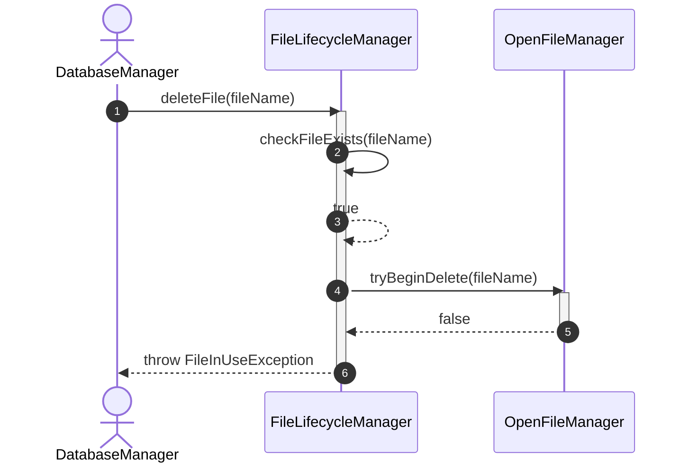
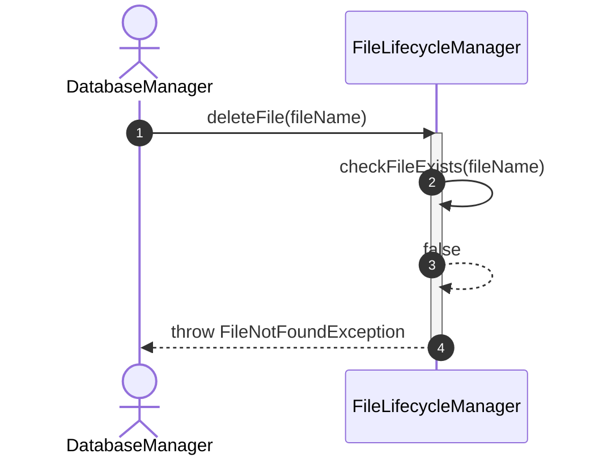
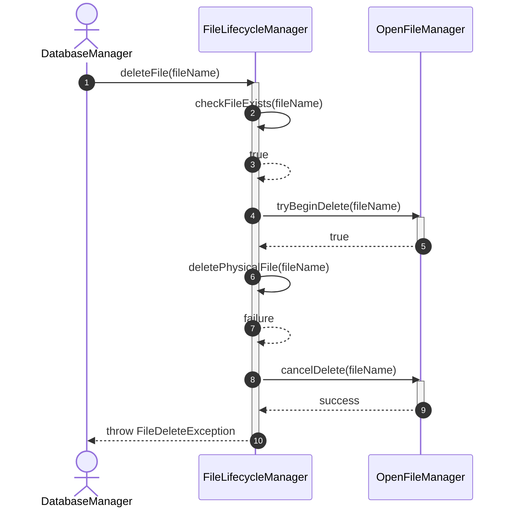

# Sequence Diagram - Delete File

## Usecase Overview
**Actor**: `DatabaseManager`
**Purpose**: Shows how the system safely deletes a physical database file, ensuring it is not currently open or locked by the system.

---

## 1. Happy Path: Successful Deletion

---

## 2. Failure Path: File is Open / In Use

---

## 3. Failure Path: File Does Not Exist

---

## 4. Failure Path: Physical Deletion Fails

---

## Concurrency & Implementation Requirements
1. **Atomic Deletion Coordination**: To prevent race conditions where a thread deletes a file while another concurrent thread is attempting to open it, `OpenFileManager` coordinates deletions atomically. Once `tryBeginDelete` returns `true`, the file transitions to a locking `Deleting` state internally. Any incoming `openFile()` request is rejected until the deletion is either completed or canceled.
2. **Encapsulated Manager State**: The temporary `Deleting` state remains an implementation detail internal to `OpenFileManager`. It is not exposed to the public domain model.

---

## Discovered Candidates

### Method Candidates
- `FileLifecycleManager.deleteFile(fileName: String) : void`
- `FileLifecycleManager.checkFileExists(fileName: String) : boolean`
- `FileLifecycleManager.deletePhysicalFile(fileName: String) : void`
- `OpenFileManager.tryBeginDelete(fileName: String) : boolean`
- `OpenFileManager.completeDelete(fileName: String) : void`
- `OpenFileManager.cancelDelete(fileName: String) : void`

### State Candidates
- None (When deleted, the physical file is removed and there is no active domain state to maintain).
