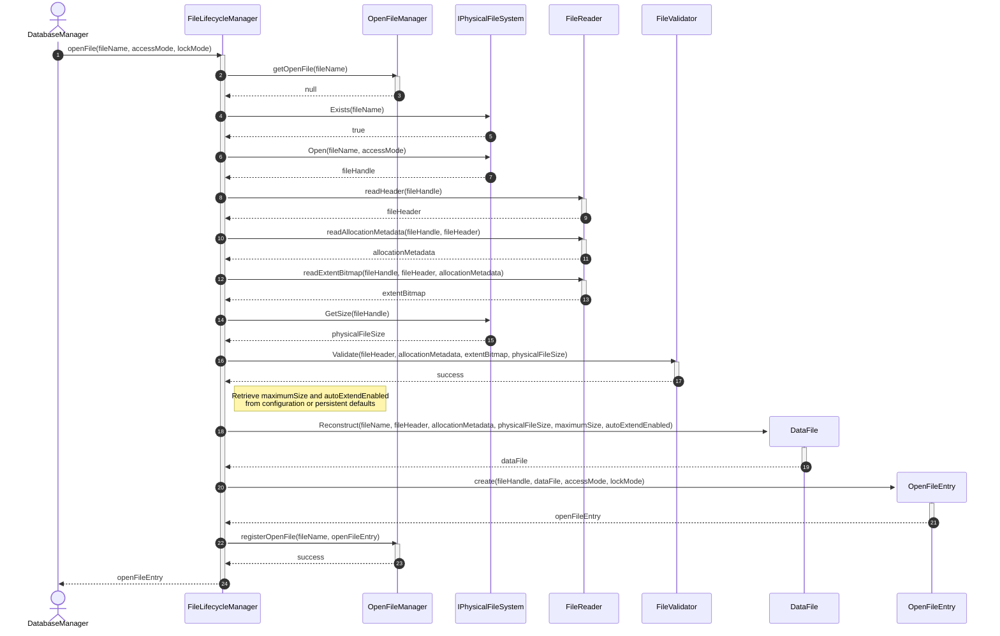
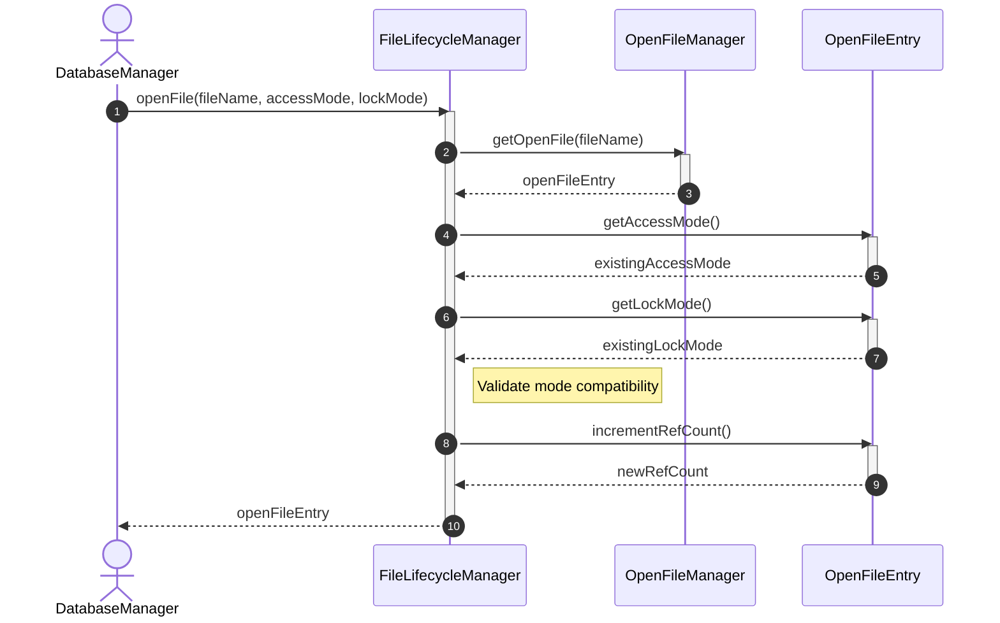
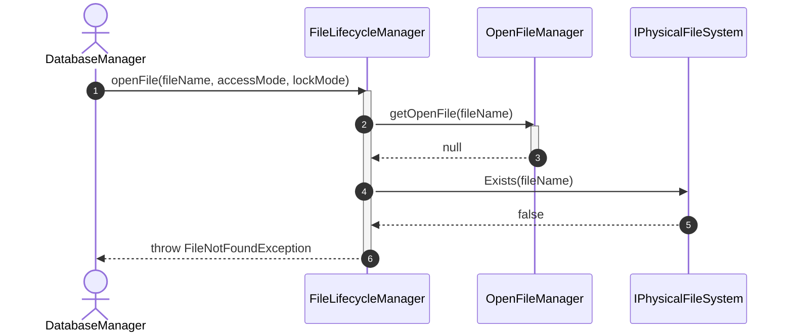
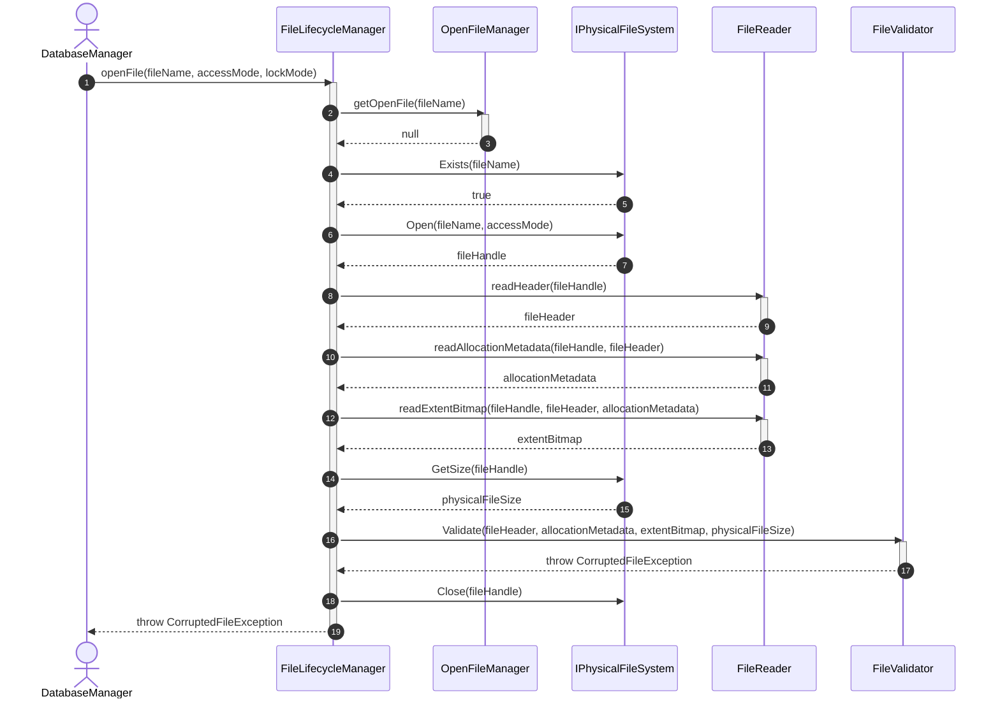
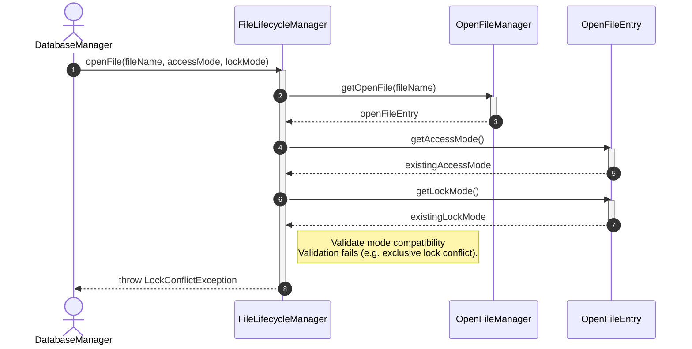

# Sequence Diagram - Open File

## Usecase Overview
**Actor**: `DatabaseManager`
**Purpose**: Shows how the system opens a physical database file, validates its format, initializes the in-memory `DataFile` representation, and registers an active `OpenFileEntry` to manage handle concurrency.

---

## 1. Happy Path: File Open (First Time)

---

## 2. Happy Path: File Already Opened

---

## 3. Failure Path: File Not Found

---

## 4. Failure Path: Invalid or Corrupted File

> [!NOTE] 
> If any step fails after `PFS.Open` succeeds (e.g., `ReadHeader`, `ReadAllocationMetadata`, `GetSize`, `Validate`), `PFS.Close(handle)` is immediately called, the entry is NOT registered, and the exception is propagated.

---

## 5. Failure Path: Mode Mismatch or Lock Conflict

---

## Concurrency & Implementation Requirements
1. **Atomic Check-and-Register**: To prevent race conditions where Request A and Request B concurrently check for the open file in `OpenFileManager` and both register different entries, the check-and-register block must be atomic or locked.
2. **Atomic Reference Counting**: In `OpenFileEntry.incrementRefCount()`, the update to the reference count must be thread-safe or atomic (e.g. using atomic integers or locks).
3. **No Redundant Open/Read**: When a file is already opened, the physical file is not reopened or reread; the existing in-memory `OpenFileEntry` is reused directly.

---

## Discovered Candidates

### Method Candidates
- `FileLifecycleManager.openFile(fileName: String, accessMode: FileAccessMode, lockMode: FileLockMode) : OpenFileEntry`
- `IPhysicalFileSystem.Exists(fileName: String) : boolean`
- `IPhysicalFileSystem.Open(fileName: String, accessMode: FileAccessMode) : FileHandle`
- `IPhysicalFileSystem.Close(handle: FileHandle) : void`
- `IPhysicalFileSystem.GetSize(handle: FileHandle) : long`
- `OpenFileManager.getOpenFile(fileName: String) : OpenFileEntry`
- `OpenFileManager.registerOpenFile(fileName: String, entry: OpenFileEntry) : void`
- `FileReader.readHeader(handle: FileHandle) : FileHeader`
- `FileReader.readAllocationMetadata(handle: FileHandle, header: FileHeader) : AllocationMetadata`
- `FileReader.readExtentBitmap(handle: FileHandle, header: FileHeader, metadata: AllocationMetadata) : ExtentBitmap`
- `DataFile.Reconstruct(fileName: String, header: FileHeader, metadata: AllocationMetadata, currentSize: long, maximumSize: long?, autoExtendEnabled: bool) : DataFile`
- `OpenFileEntry.create(handle: FileHandle, file: DataFile, accessMode: FileAccessMode, lockMode: FileLockMode) : OpenFileEntry`
- `OpenFileEntry.getAccessMode() : FileAccessMode`
- `OpenFileEntry.getLockMode() : FileLockMode`
- `OpenFileEntry.incrementRefCount() : int`
- `FileValidator.Validate(header: FileHeader, metadata: AllocationMetadata, bitmap: ExtentBitmap, physicalFileSize: long) : void`

### State Candidates
- `FileAccessMode` enum (ReadOnly, ReadWrite)
- `FileLockMode` enum (Shared, Exclusive, None)
- `OpenFileEntry` attributes:
  - `Handle: FileHandle`
  - `DataFile: DataFile`
  - `AccessMode: FileAccessMode`
  - `LockMode: FileLockMode`
  - `ReferenceCount: int`
