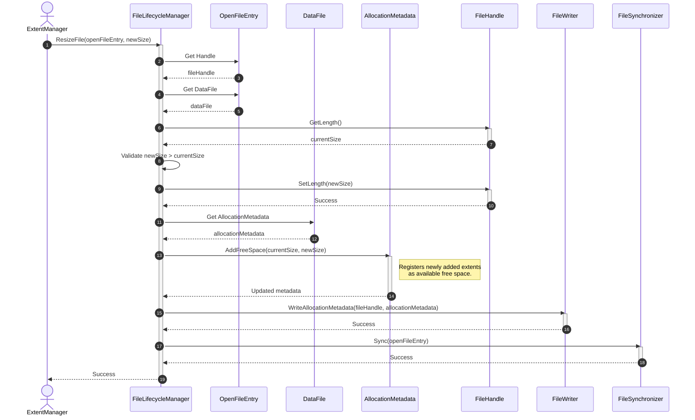
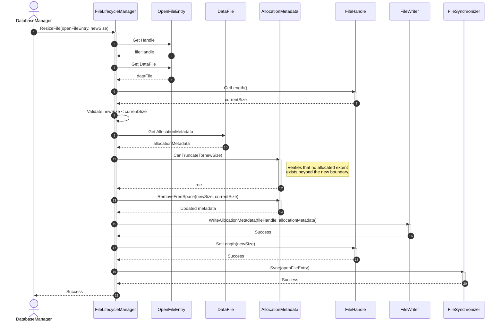
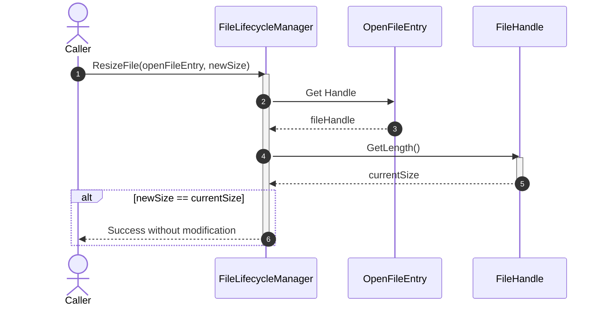
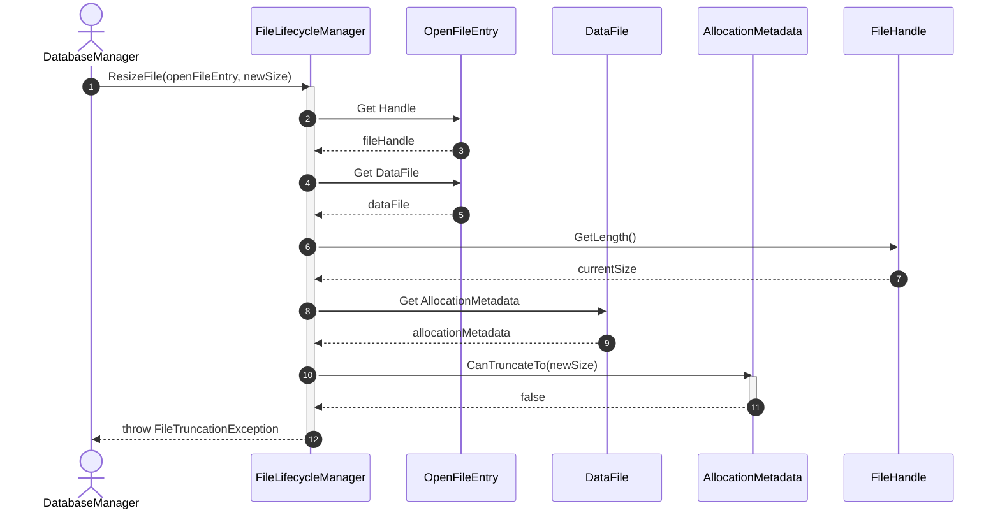
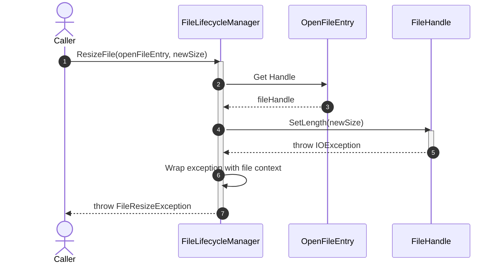

# Sequence Diagram - Resize File

## Use Case Overview

**Actor**: `ExtentManager`, `DatabaseManager`, or administrative operation  
**Purpose**: Changes the physical size of an existing data file while protecting allocated extents and keeping file metadata consistent.

### Preconditions

- The file is already open.
- The associated `FileHandle` is valid.
- The caller has sufficient permission to modify the file.
- Shrinking must not remove any extent that is still allocated.

---

## 1. Happy Path: Extend File



---

## 2. Happy Path: Truncate File



---

## 3. Alternative Path: Requested Size Equals Current Size



---

## 4. Failure Path: Truncate Removes Used Extent



---

## 5. Failure Path: Operating-System Resize Error



---

## Discovered Candidates

### Method Candidates

```text
FileLifecycleManager.ResizeFile(
    openFileEntry: OpenFileEntry,
    newSize: long
) : void

FileHandle.GetLength() : long

FileHandle.SetLength(
    newSize: long
) : void

AllocationMetadata.CanTruncateTo(
    newSize: long
) : bool

AllocationMetadata.AddFreeSpace(
    previousSize: long,
    newSize: long
) : void

AllocationMetadata.RemoveFreeSpace(
    newSize: long,
    previousSize: long
) : void

FileWriter.WriteAllocationMetadata(
    handle: FileHandle,
    metadata: AllocationMetadata
) : void
```

### Property Candidates

```text
DataFile.Size : long

DataFile.AllocationMetadata : AllocationMetadata

AllocationMetadata.ExtentSize : int

AllocationMetadata.TotalExtentCount : int

AllocationMetadata.FreeExtentCount : int
```

### Exception Candidates

```text
InvalidFileSizeException

FileResizeException

FileTruncationException

AllocatedExtentTruncationException
```

### State Candidates

```text
DataFile.Size

AllocationMetadata.TotalExtentCount

AllocationMetadata.FreeExtentCount
```

---

## Responsibility Assignment

### `FileLifecycleManager`

- Coordinates the resize operation.
- Validates the requested size.
- Prevents unsafe file truncation.
- Updates physical file size.
- Coordinates metadata persistence.

### `AllocationMetadata`

- Determines whether truncation is safe.
- Registers newly added extents.
- Removes free extents outside the new file boundary.
- Maintains extent counters.

### `FileHandle`

- Reads the current physical file length.
- Requests the operating system to change the physical file length.
- Converts low-level resize failures into `IOException`.

---

## Design Notes

`FileLifecycleManager` should not decide which extent will be allocated.

It only changes the physical file size and coordinates metadata updates.

Extent selection remains the responsibility of `ExtentManager`.

```text
ExtentManager
    → determines additional capacity is required
    → requests FileLifecycleManager.ResizeFile()
    → allocates an extent from the newly added free space
```
