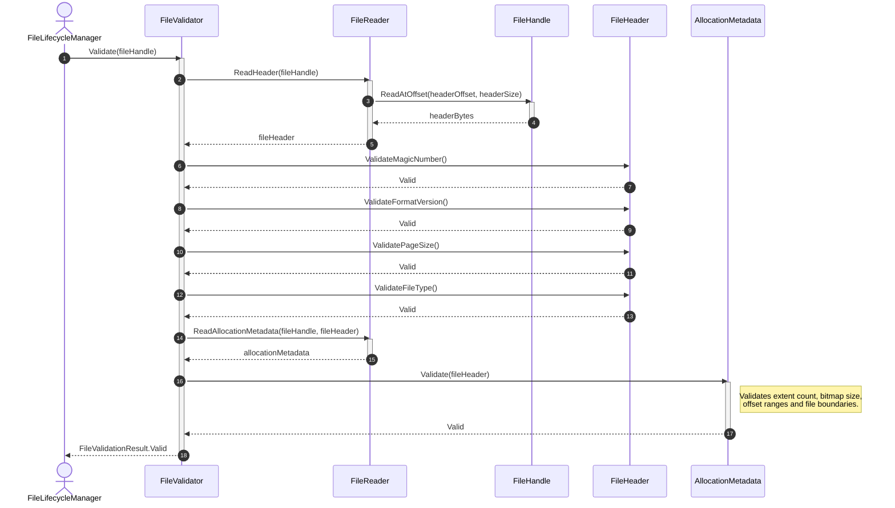
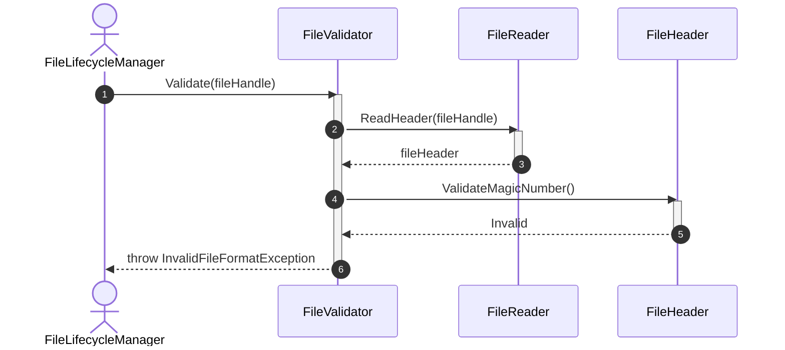
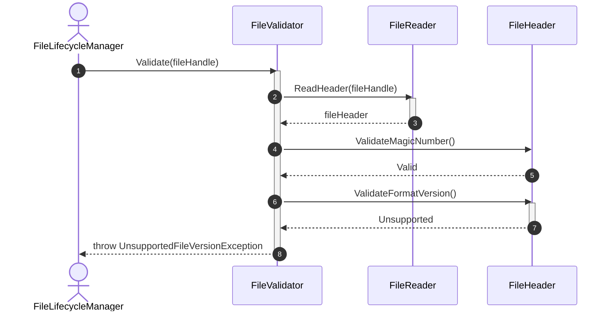
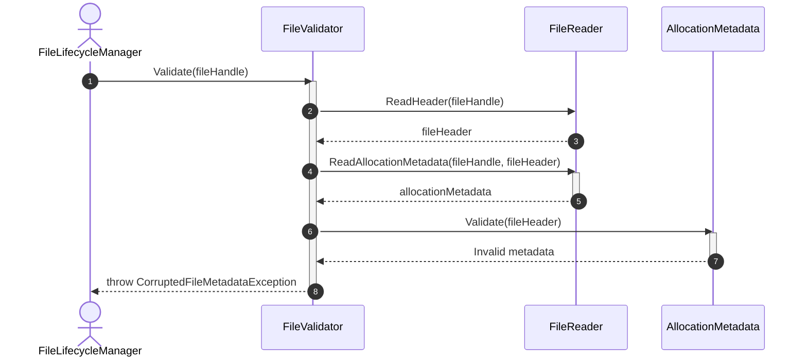

# Sequence Diagram - Validate File

## Use Case Overview

**Actor**: `FileLifecycleManager`  
**Purpose**: Validates the structure, identity, version, and metadata of a data file before it is registered as an active open file.

### Preconditions

- The physical file has already been opened.
- A valid `FileHandle` is available.
- The file has not yet been registered in `OpenFileManager`.

---

## 1. Happy Path: Valid File



---

## 2. Failure Path: Invalid Magic Number



---

## 3. Failure Path: Unsupported File Version



---

## 4. Failure Path: Corrupted Allocation Metadata



---

## Validation Rules

### File Header Validation

```text
Magic number matches the expected DBMS file signature.

Format version is supported by the current DBMS version.

File type is recognized.

Page size is greater than zero.

Page size follows the configured alignment.

Header size does not exceed the physical file size.

Metadata offsets are inside the file boundary.

File identifier is present and valid.
```

### Allocation Metadata Validation

```text
Extent size is greater than zero.

Total extent count matches the physical file size.

Free extent count does not exceed total extent count.

Extent bitmap contains enough bits for all extents.

Metadata offsets do not overlap the file header.

Metadata offsets do not exceed the physical file boundary.
```

---

## Discovered Candidates

### Method Candidates

```text
FileValidator.Validate(
    handle: FileHandle
) : FileValidationResult

FileHeader.ValidateMagicNumber() : bool

FileHeader.ValidateFormatVersion() : bool

FileHeader.ValidatePageSize() : bool

FileHeader.ValidateFileType() : bool

AllocationMetadata.Validate(
    header: FileHeader
) : bool

FileReader.ReadHeader(
    handle: FileHandle
) : FileHeader

FileReader.ReadAllocationMetadata(
    handle: FileHandle,
    header: FileHeader
) : AllocationMetadata
```

### Property Candidates

```text
FileHeader.MagicNumber : uint

FileHeader.FormatVersion : int

FileHeader.FileType : FileType

FileHeader.FileId : FileId

FileHeader.PageSize : int

FileHeader.HeaderSize : int

FileHeader.AllocationMetadataOffset : long

AllocationMetadata.ExtentSize : int

AllocationMetadata.TotalExtentCount : int

AllocationMetadata.FreeExtentCount : int
```

### Result Candidates

```text
FileValidationResult

FileValidationStatus
```

Possible validation statuses:

```text
Valid

InvalidHeader

UnsupportedVersion

InvalidMetadata

InvalidFileBoundary
```

### Exception Candidates

```text
FileValidationException

InvalidFileFormatException

UnsupportedFileVersionException

CorruptedFileMetadataException
```

### State Candidates

No runtime state change is required.

Validation only reads and verifies existing file structures.

---

## Responsibility Assignment

### `FileValidator`

- Coordinates all file validation rules.
- Validates relationships between header, metadata and physical file size.
- Converts validation failures into domain-specific exceptions.

### `FileHeader`

- Validates its own primitive values.
- Does not read data from disk.
- Does not validate unrelated file regions.

### `AllocationMetadata`

- Validates extent counters and bitmap consistency.
- Validates allocation boundaries.

### `FileReader`

- Reads and deserializes file structures.
- Does not determine whether the structures are logically valid.

---

## Integration with Open File

`Validate File` is normally a subflow of `Open File`.

```text
Open physical file
    → Read file structures
    → Validate file
    → Create DataFile
    → Create OpenFileEntry
    → Register OpenFileEntry
```

The file must not be registered in `OpenFileManager` before validation succeeds.
