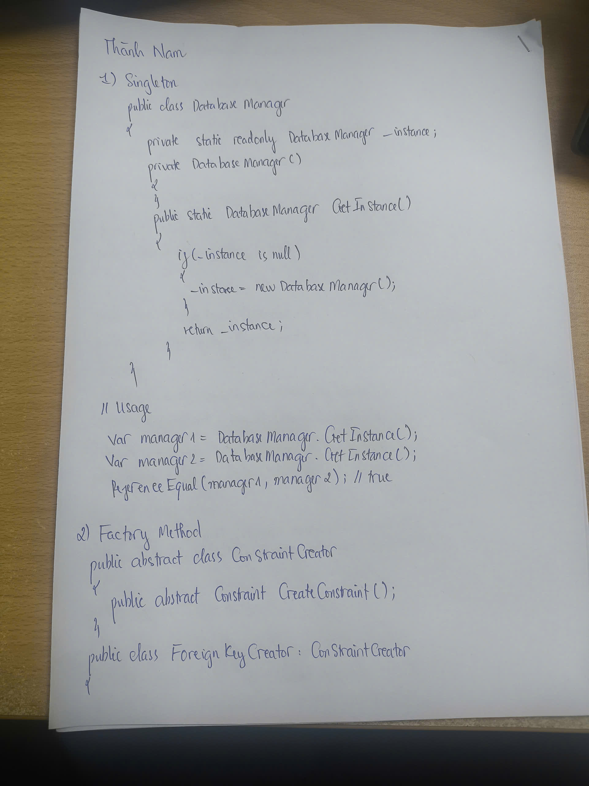
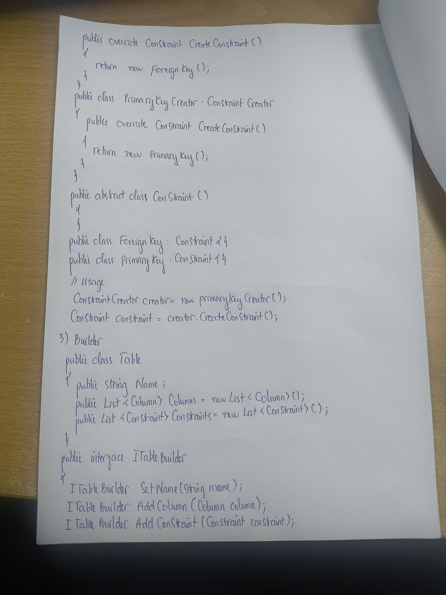
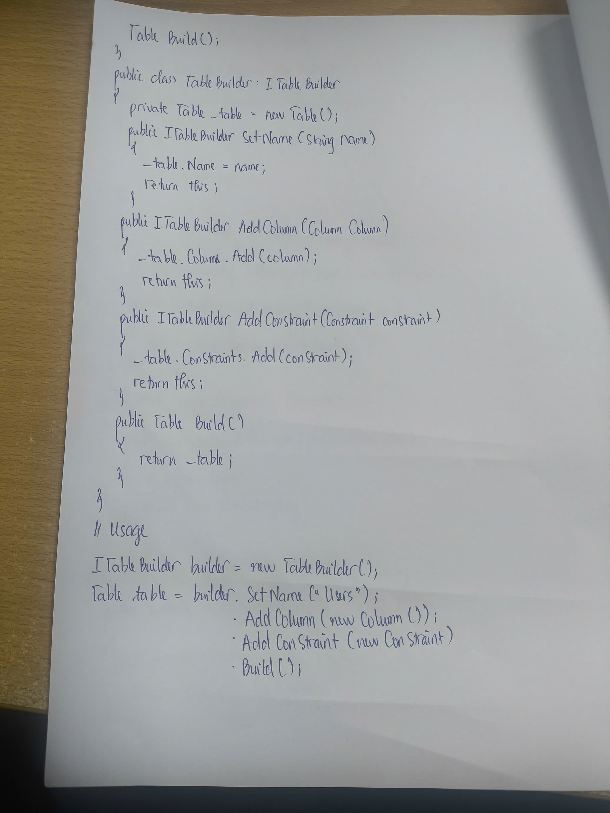
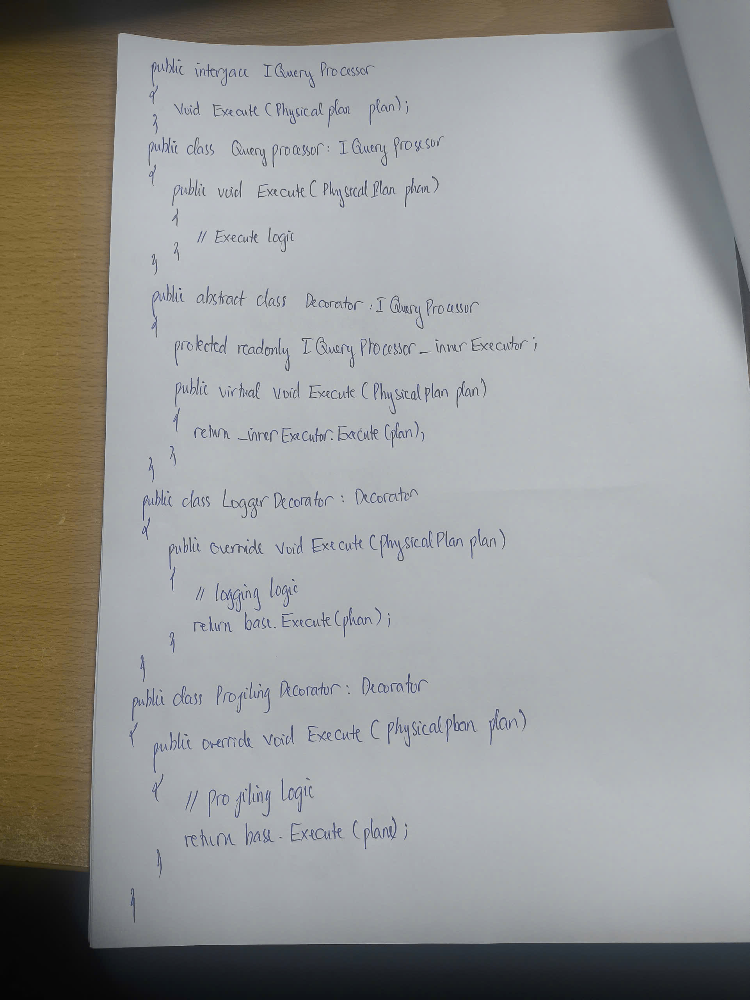
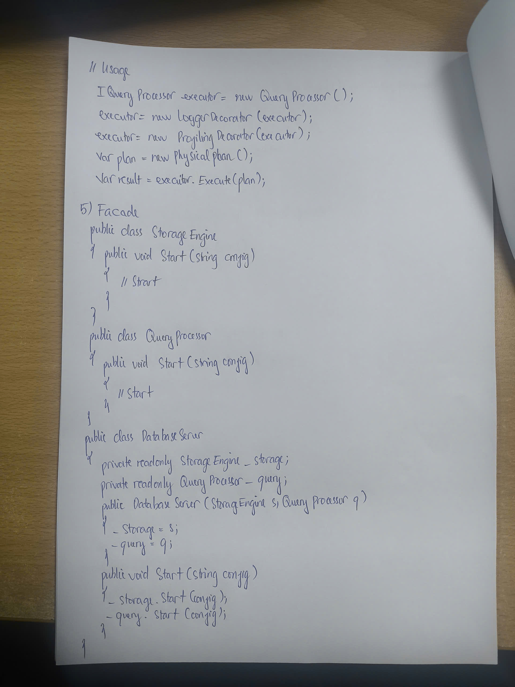
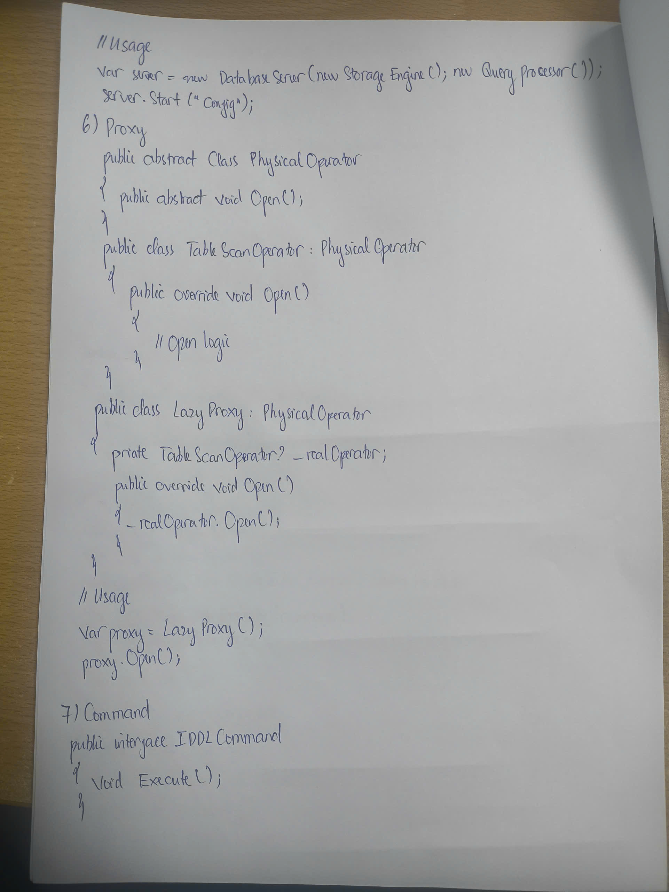
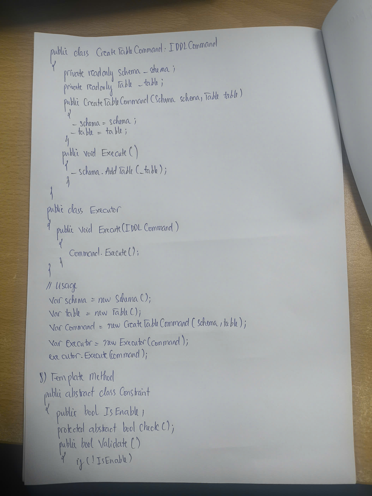
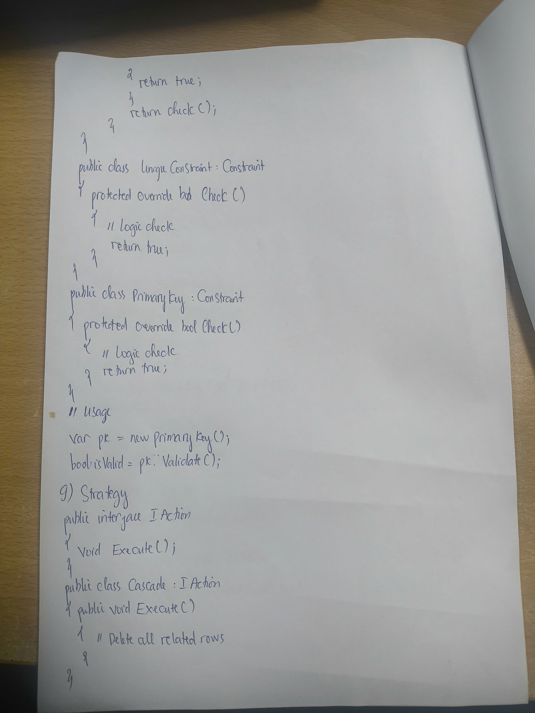
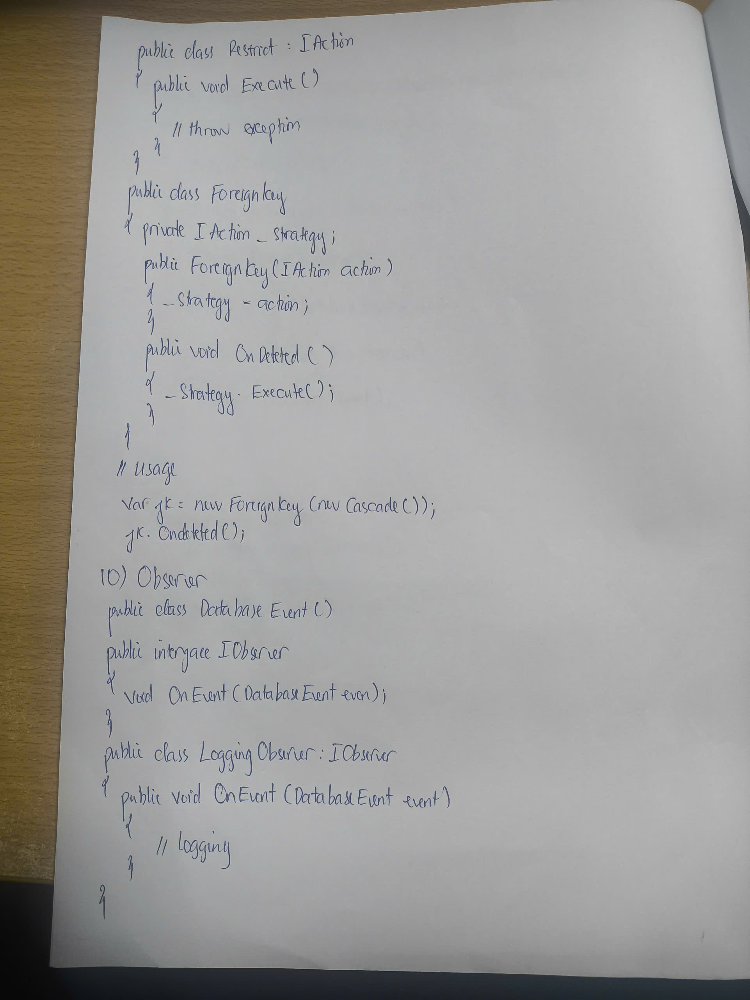
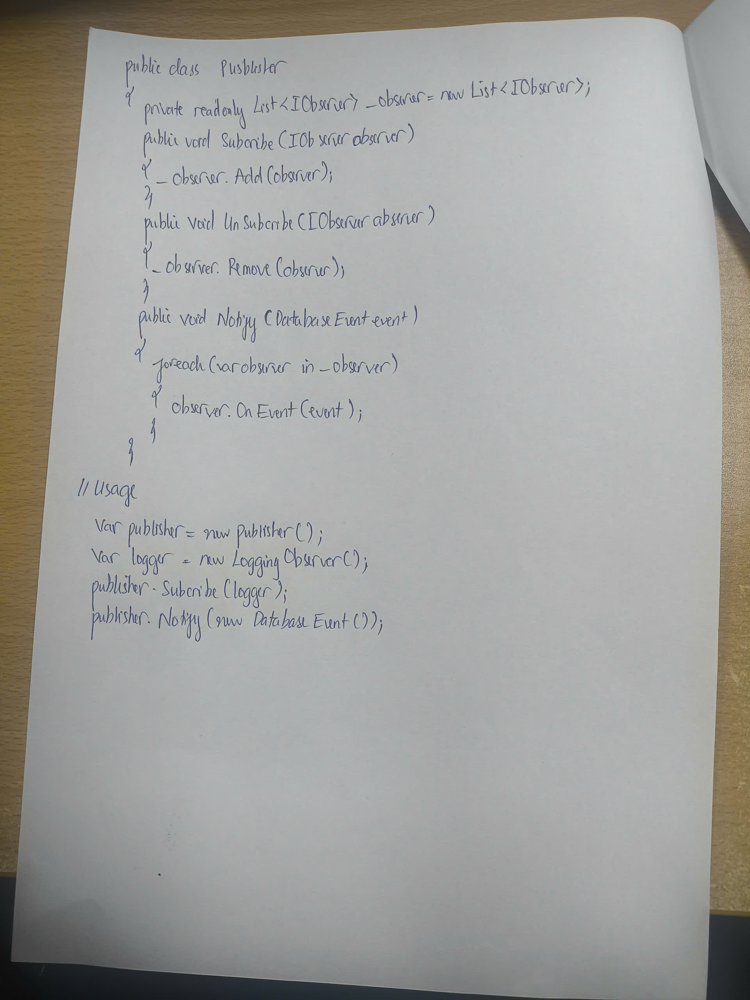

# Documentation Images

## API .NET

## Dependency Injection

## Life Cycle

## Authen, Author, JWT

## OAuth 2.0

## MVC

## Clean Architecture

## EFCore

## GraphQL

## CleanCode

## SOLID

## Design Pattern 1

## Design Pattern 2

## Design Pattern 3

## Design Pattern 4

## Design Pattern 5

## Design Pattern 6

## Design Pattern 7

## Design Pattern 8

## Design Pattern 9

## Design Pattern 10

