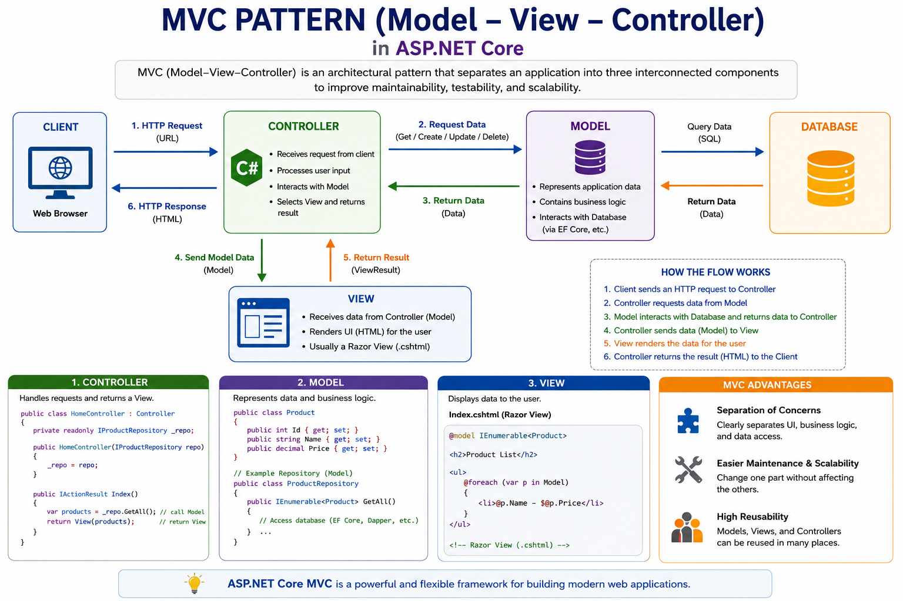
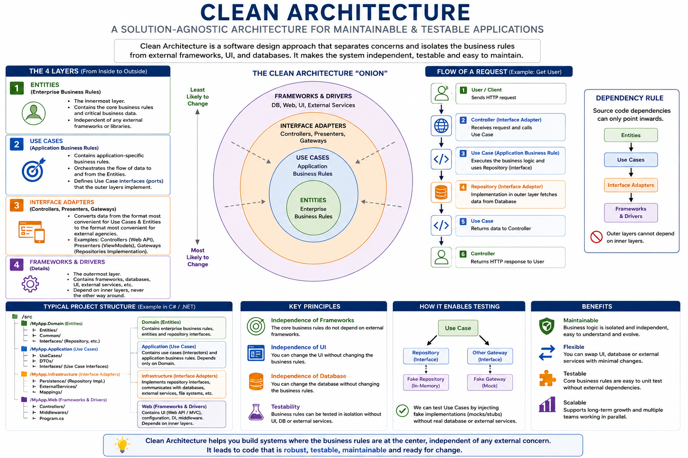
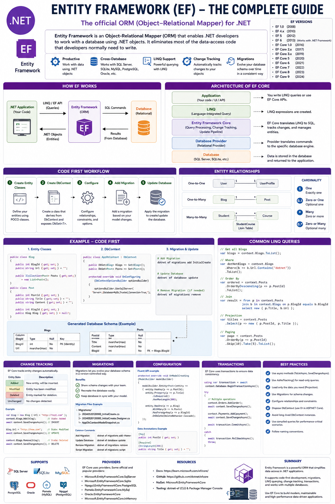
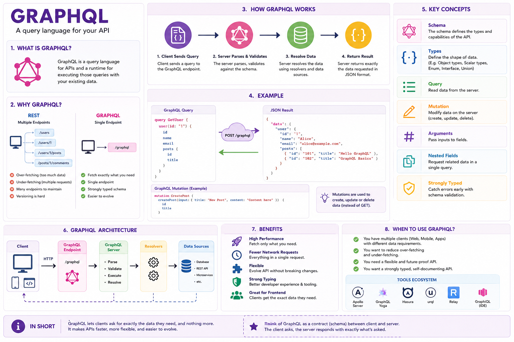
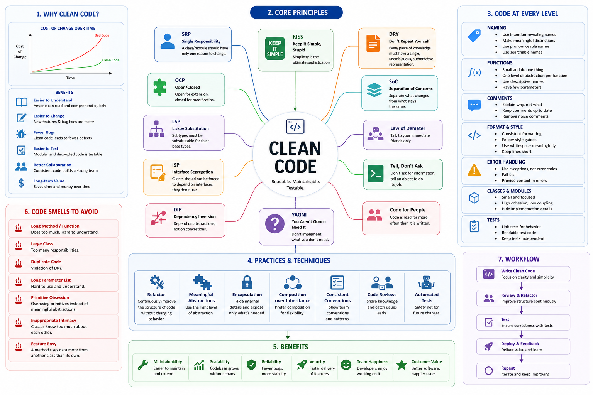
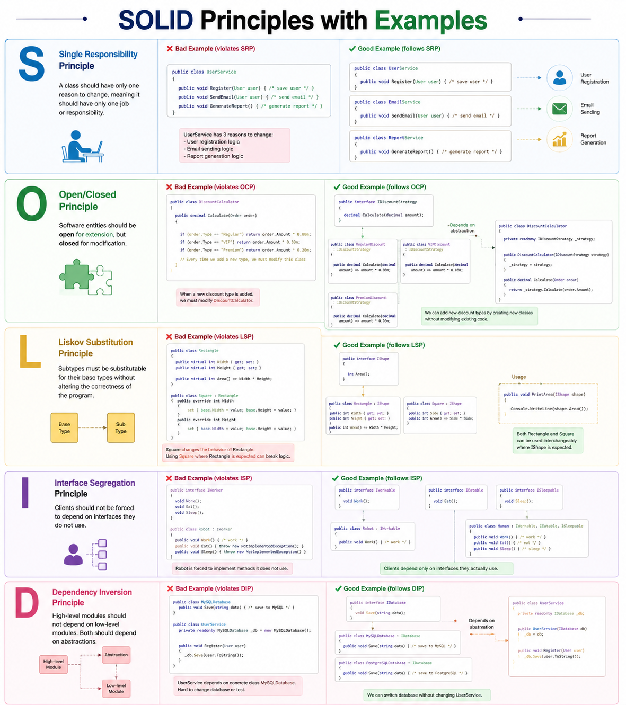

# Documentation Images

## API .NET

## Dependency Injection

## Life Cycle

## Authen, Author, JWT

## OAuth 2.0

## MVC

## Clean Architecture

## EFCore

## GraphQL

## CleanCode

## SOLID

