# Database Management Unit Test Design

## 1. Overview

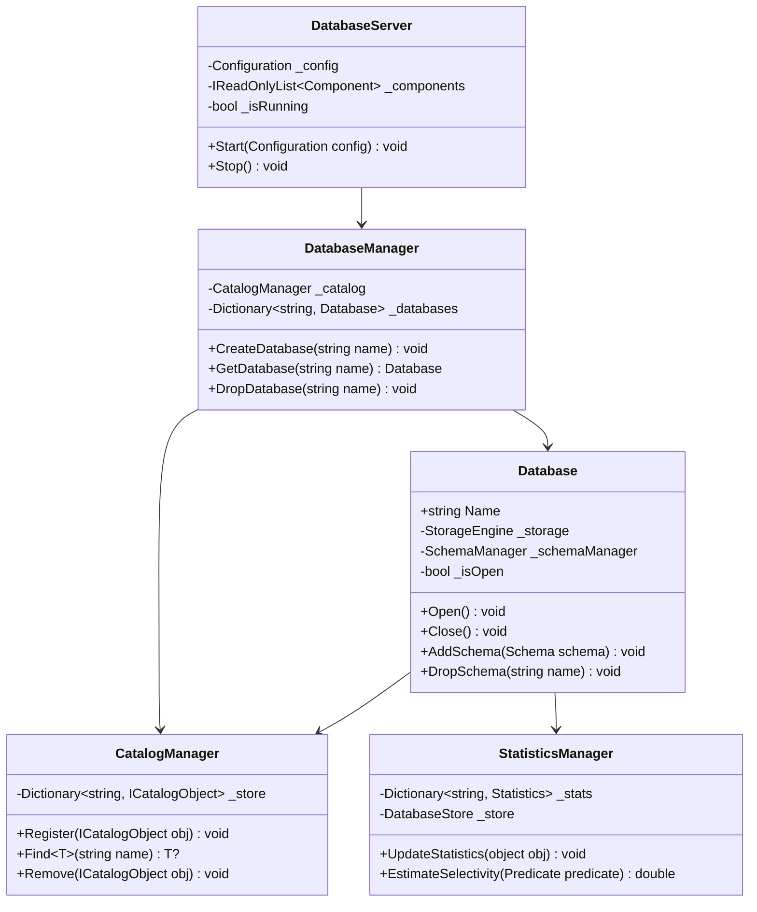
```mermaid
classDiagram
    direction TB

    class DatabaseServer {
        -Configuration _config
        -IReadOnlyList~Component~ _components
        -bool _isRunning
        +Start(Configuration config) void
        +Stop() void
    }

    class DatabaseManager {
        -CatalogManager _catalog
        -Dictionary~string, Database~ _databases
        +CreateDatabase(string name) void
        +GetDatabase(string name) Database
        +DropDatabase(string name) void
    }

    class Database {
        +string Name
        -StorageEngine _storage
        -SchemaManager _schemaManager
        -bool _isOpen
        +Open() void
        +Close() void
        +AddSchema(Schema schema) void
        +DropSchema(string name) void
    }

    class CatalogManager {
        -Dictionary~string, ICatalogObject~ _store
        +Register(ICatalogObject obj) void
        +Find~T~(string name) T?
        +Remove(ICatalogObject obj) void
    }

    class StatisticsManager {
        -Dictionary~string, Statistics~ _stats
        -DatabaseStore _store
        +UpdateStatistics(object obj) void
        +EstimateSelectivity(Predicate predicate) double
    }

    DatabaseServer --> DatabaseManager
    DatabaseManager --> Database
    DatabaseManager --> CatalogManager
    Database --> CatalogManager
    Database --> StatisticsManager
```

## 2. DatabaseServer Tests

### 2.1 Start_WhenConfigurationIsValid_ShouldStartServer

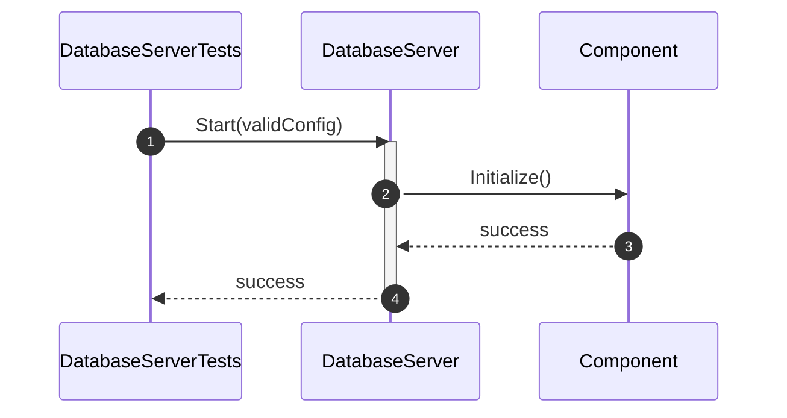
```mermaid
sequenceDiagram
    autonumber

    participant Test as DatabaseServerTests
    participant Server as DatabaseServer
    participant Component as Component

    Test->>Server: Start(validConfig)
    activate Server
    Server->>Component: Initialize()
    Component-->>Server: success
    Server-->>Test: success
    deactivate Server
```

### 2.2 Start_WhenServerIsAlreadyRunning_ShouldNotInitializeComponentsAgain

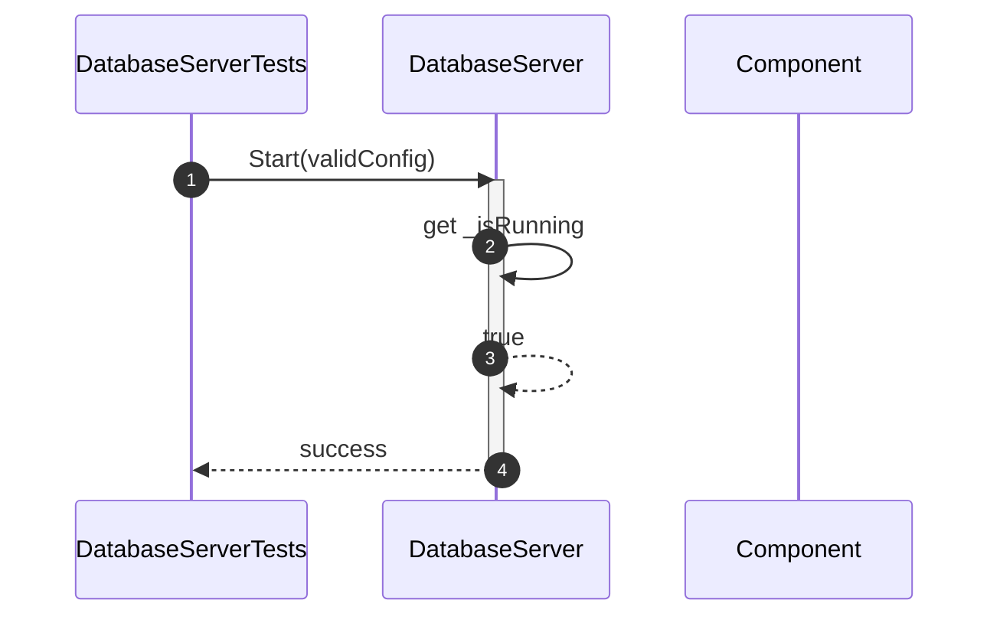
```mermaid
sequenceDiagram
    autonumber

    participant Test as DatabaseServerTests
    participant Server as DatabaseServer
    participant Component as Component

    Test->>Server: Start(validConfig)
    activate Server
    Server->>Server: get _isRunning
    Server-->>Server: true
    Server-->>Test: success
    deactivate Server
```

### 2.3 Start_WhenComponentInitializationFails_ShouldRemainStopped

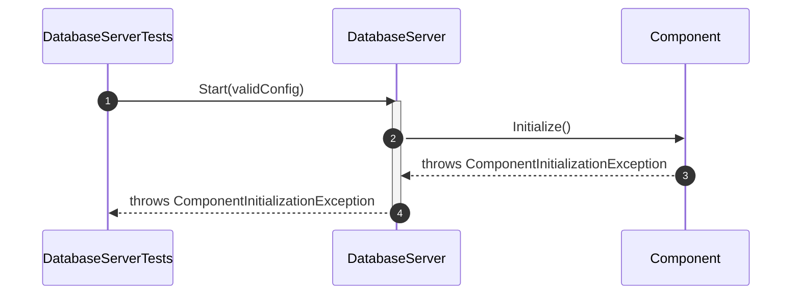
```mermaid
sequenceDiagram
    autonumber

    participant Test as DatabaseServerTests
    participant Server as DatabaseServer
    participant Component as Component

    Test->>Server: Start(validConfig)
    activate Server
    Server->>Component: Initialize()
    Component-->>Server: throws ComponentInitializationException
    Server-->>Test: throws ComponentInitializationException
    deactivate Server
```

### 2.4 Stop_WhenServerIsRunning_ShouldStopAllComponents

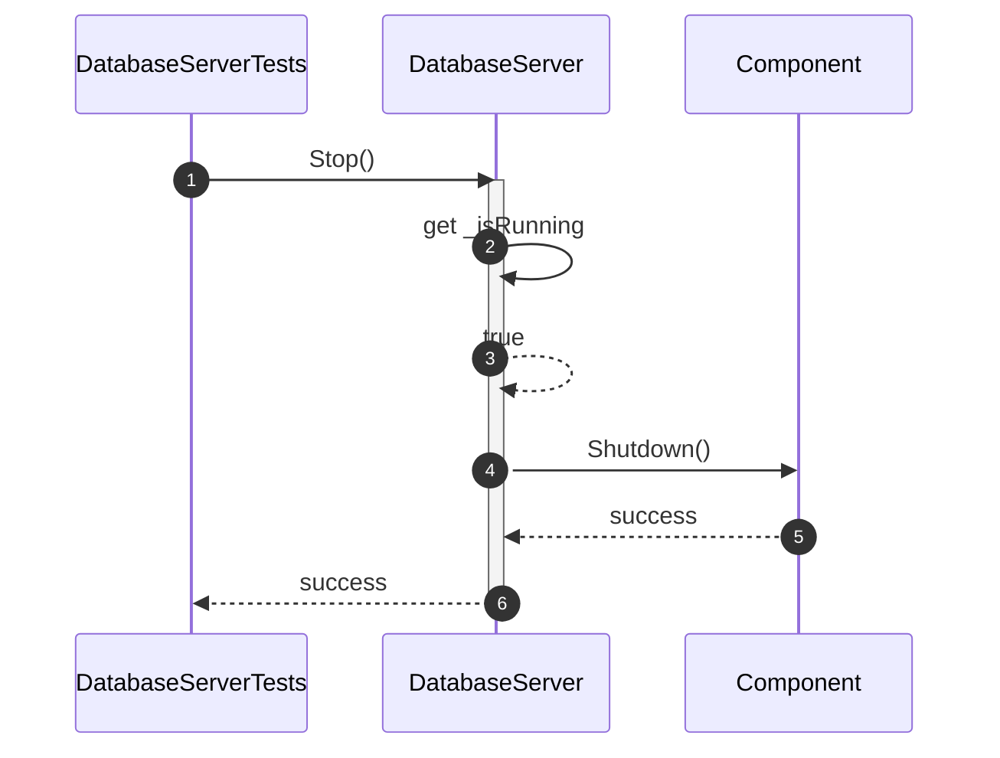
```mermaid
sequenceDiagram
    autonumber

    participant Test as DatabaseServerTests
    participant Server as DatabaseServer
    participant Component as Component

    Test->>Server: Stop()
    activate Server
    Server->>Server: get _isRunning
    Server-->>Server: true
    Server->>Component: Shutdown()
    Component-->>Server: success
    Server-->>Test: success
    deactivate Server
```

### 2.5 Stop_WhenComponentShutdownFails_ShouldReportFailureAndRemainConsistent

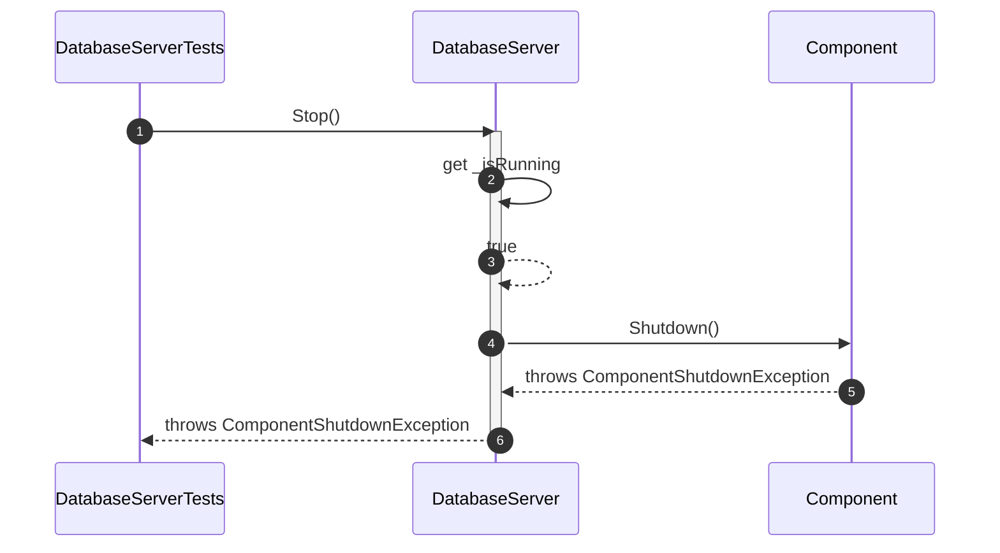
```mermaid
sequenceDiagram
    autonumber

    participant Test as DatabaseServerTests
    participant Server as DatabaseServer
    participant Component as Component

    Test->>Server: Stop()
    activate Server
    Server->>Server: get _isRunning
    Server-->>Server: true
    Server->>Component: Shutdown()
    Component-->>Server: throws ComponentShutdownException
    Server-->>Test: throws ComponentShutdownException
    deactivate Server
```

## 3. DatabaseManager Tests

### 3.1 CreateDatabase_WhenNameIsValid_ShouldRegisterDatabase

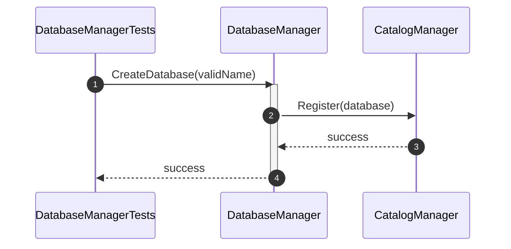
```mermaid
sequenceDiagram
    autonumber

    participant Test as DatabaseManagerTests
    participant Manager as DatabaseManager
    participant Catalog as CatalogManager

    Test->>Manager: CreateDatabase(validName)
    activate Manager
    Manager->>Catalog: Register(database)
    Catalog-->>Manager: success
    Manager-->>Test: success
    deactivate Manager
```

### 3.2 CreateDatabase_WhenNameAlreadyExists_ShouldThrow

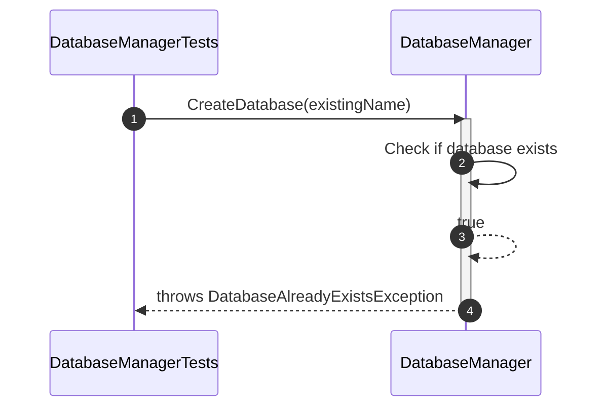
```mermaid
sequenceDiagram
    autonumber

    participant Test as DatabaseManagerTests
    participant Manager as DatabaseManager

    Test->>Manager: CreateDatabase(existingName)
    activate Manager
    Manager->>Manager: Check if database exists
    Manager-->>Manager: true
    Manager-->>Test: throws DatabaseAlreadyExistsException
    deactivate Manager
```

### 3.3 CreateDatabase_WhenCreationFails_ShouldNotRegisterDatabase

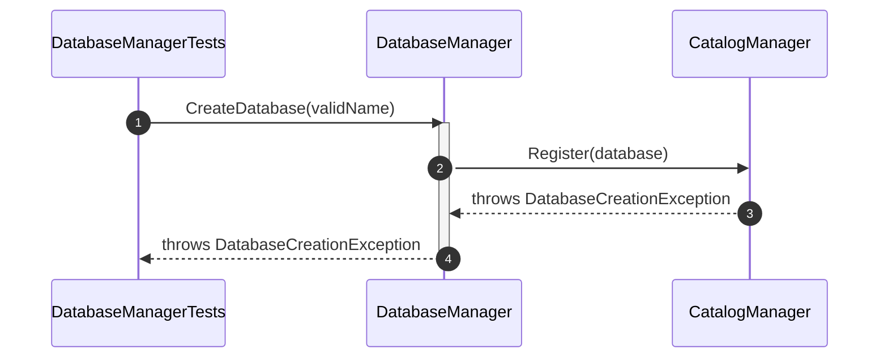
```mermaid
sequenceDiagram
    autonumber

    participant Test as DatabaseManagerTests
    participant Manager as DatabaseManager
    participant Catalog as CatalogManager

    Test->>Manager: CreateDatabase(validName)
    activate Manager
    Manager->>Catalog: Register(database)
    Catalog-->>Manager: throws DatabaseCreationException
    Manager-->>Test: throws DatabaseCreationException
    deactivate Manager
```

### 3.4 GetDatabase_WhenDatabaseExists_ShouldReturnDatabase

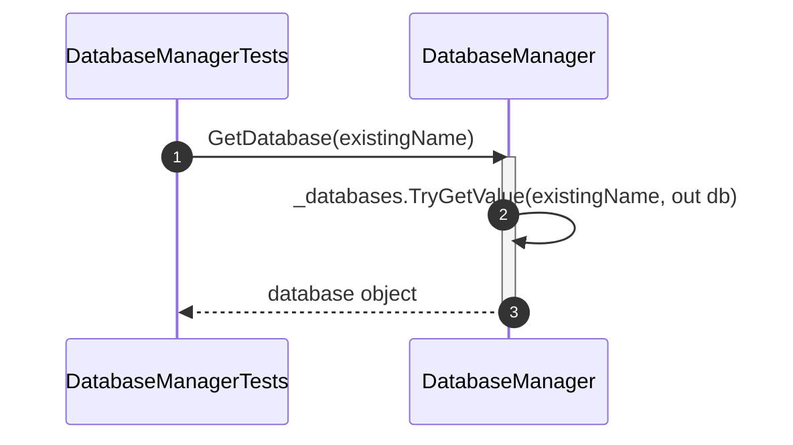
```mermaid
sequenceDiagram
    autonumber

    participant Test as DatabaseManagerTests
    participant Manager as DatabaseManager

    Test->>Manager: GetDatabase(existingName)
    activate Manager
    Manager->>Manager: _databases.TryGetValue(existingName, out db)
    Manager-->>Test: database object
    deactivate Manager
```

### 3.5 DropDatabase_WhenDatabaseExists_ShouldRemoveDatabase

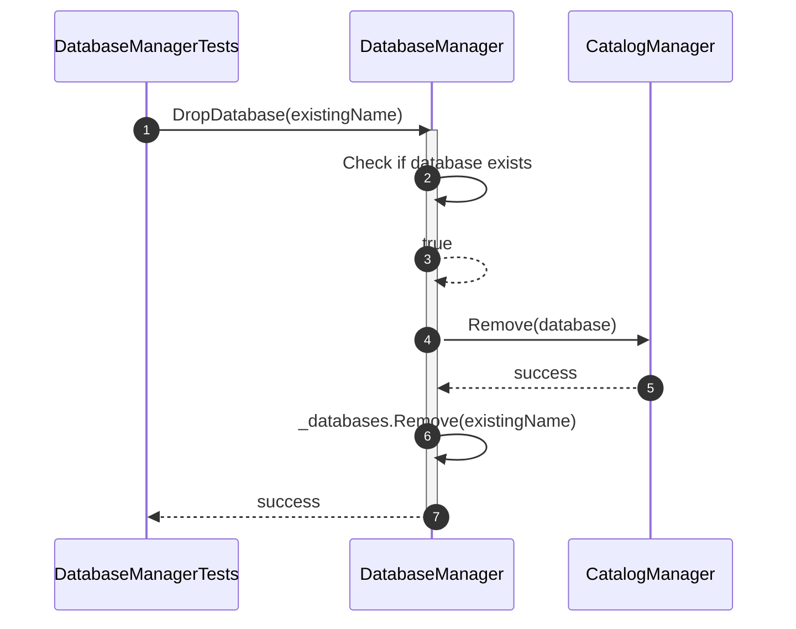
```mermaid
sequenceDiagram
    autonumber

    participant Test as DatabaseManagerTests
    participant Manager as DatabaseManager
    participant Catalog as CatalogManager

    Test->>Manager: DropDatabase(existingName)
    activate Manager
    Manager->>Manager: Check if database exists
    Manager-->>Manager: true
    Manager->>Catalog: Remove(database)
    Catalog-->>Manager: success
    Manager->>Manager: _databases.Remove(existingName)
    Manager-->>Test: success
    deactivate Manager
```

### 3.6 DropDatabase_WhenDatabaseDoesNotExist_ShouldThrow

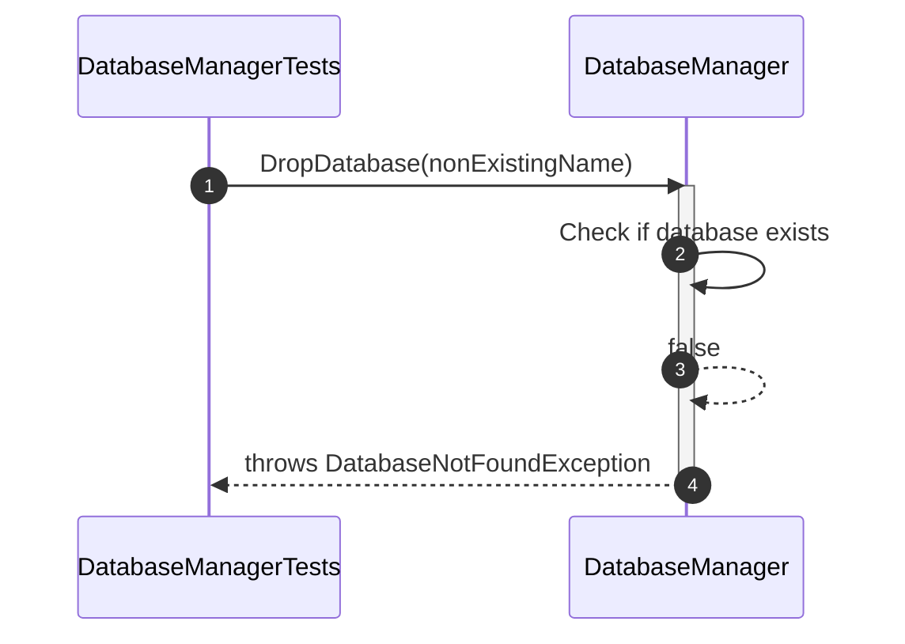
```mermaid
sequenceDiagram
    autonumber

    participant Test as DatabaseManagerTests
    participant Manager as DatabaseManager

    Test->>Manager: DropDatabase(nonExistingName)
    activate Manager
    Manager->>Manager: Check if database exists
    Manager-->>Manager: false
    Manager-->>Test: throws DatabaseNotFoundException
    deactivate Manager
```

## 4. Database Tests

### 4.1 Open_WhenDatabaseIsClosed_ShouldOpenDatabase

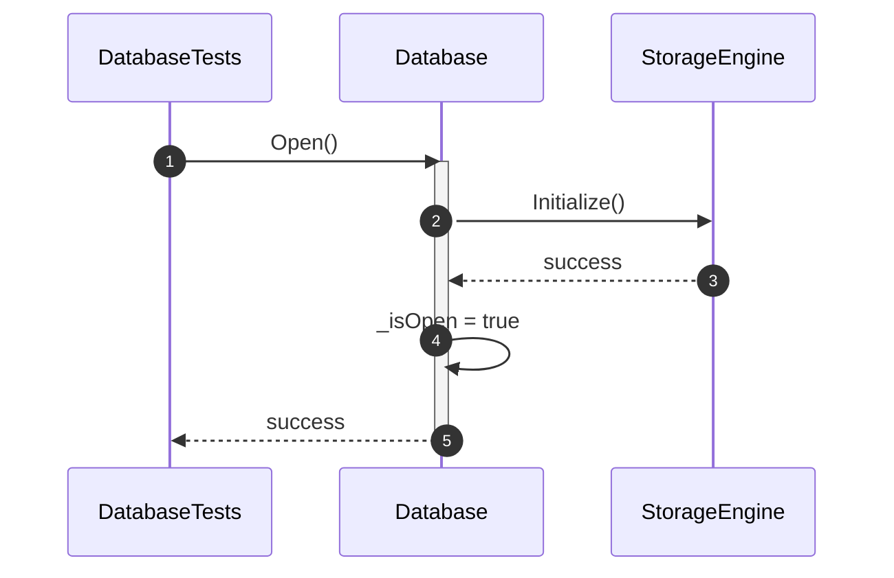
```mermaid
sequenceDiagram
    autonumber

    participant Test as DatabaseTests
    participant DB as Database
    participant Storage as StorageEngine

    Test->>DB: Open()
    activate DB
    DB->>Storage: Initialize()
    Storage-->>DB: success
    DB->>DB: _isOpen = true
    DB-->>Test: success
    deactivate DB
```

### 4.2 Open_WhenStorageInitializationFails_ShouldRemainClosed

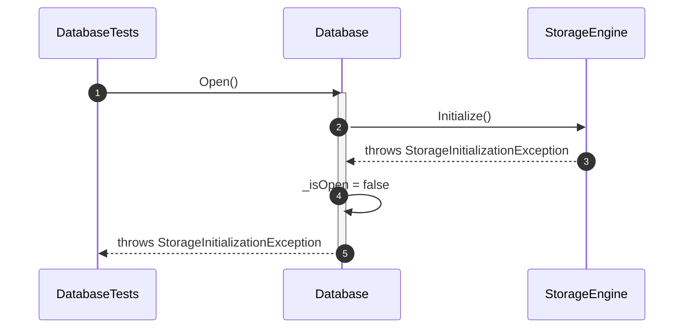
```mermaid
sequenceDiagram
    autonumber

    participant Test as DatabaseTests
    participant DB as Database
    participant Storage as StorageEngine

    Test->>DB: Open()
    activate DB
    DB->>Storage: Initialize()
    Storage-->>DB: throws StorageInitializationException
    DB->>DB: _isOpen = false
    DB-->>Test: throws StorageInitializationException
    deactivate DB
```

### 4.3 Close_WhenDatabaseIsOpen_ShouldCloseDatabase

```mermaid
sequenceDiagram
    autonumber

    participant Test as DatabaseTests
    participant DB as Database
    participant Storage as StorageEngine

    Test->>DB: Close()
    activate DB
    DB->>Storage: Flush()
    Storage-->>DB: success
    DB->>DB: _isOpen = false
    DB-->>Test: success
    deactivate DB
```

### 4.4 Close_WhenFlushFails_ShouldNotReportSuccessfulClose

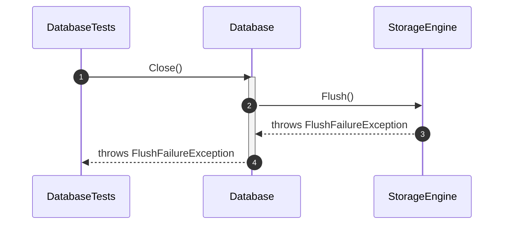
```mermaid
sequenceDiagram
    autonumber

    participant Test as DatabaseTests
    participant DB as Database
    participant Storage as StorageEngine

    Test->>DB: Close()
    activate DB
    DB->>Storage: Flush()
    Storage-->>DB: throws FlushFailureException
    DB-->>Test: throws FlushFailureException
    deactivate DB
```

### 4.5 AddSchema_WhenSchemaIsValid_ShouldRegisterSchema

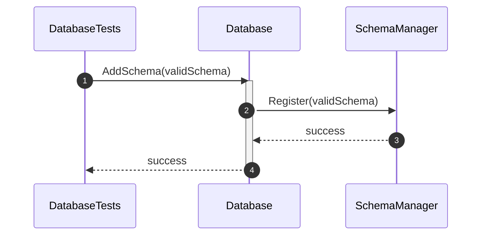
```mermaid
sequenceDiagram
    autonumber

    participant Test as DatabaseTests
    participant DB as Database
    participant SchemaManager as SchemaManager

    Test->>DB: AddSchema(validSchema)
    activate DB
    DB->>SchemaManager: Register(validSchema)
    SchemaManager-->>DB: success
    DB-->>Test: success
    deactivate DB
```

### 4.6 AddSchema_WhenNameAlreadyExists_ShouldThrow

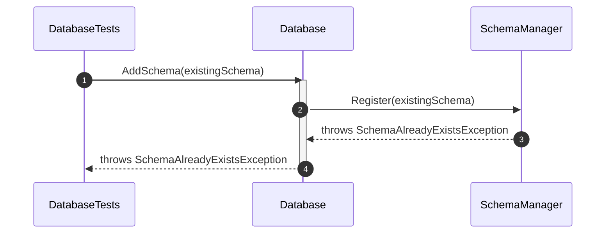
```mermaid
sequenceDiagram
    autonumber

    participant Test as DatabaseTests
    participant DB as Database
    participant SchemaManager as SchemaManager

    Test->>DB: AddSchema(existingSchema)
    activate DB
    DB->>SchemaManager: Register(existingSchema)
    SchemaManager-->>DB: throws SchemaAlreadyExistsException
    DB-->>Test: throws SchemaAlreadyExistsException
    deactivate DB
```

### 4.7 DropSchema_WhenSchemaExists_ShouldRemoveSchema

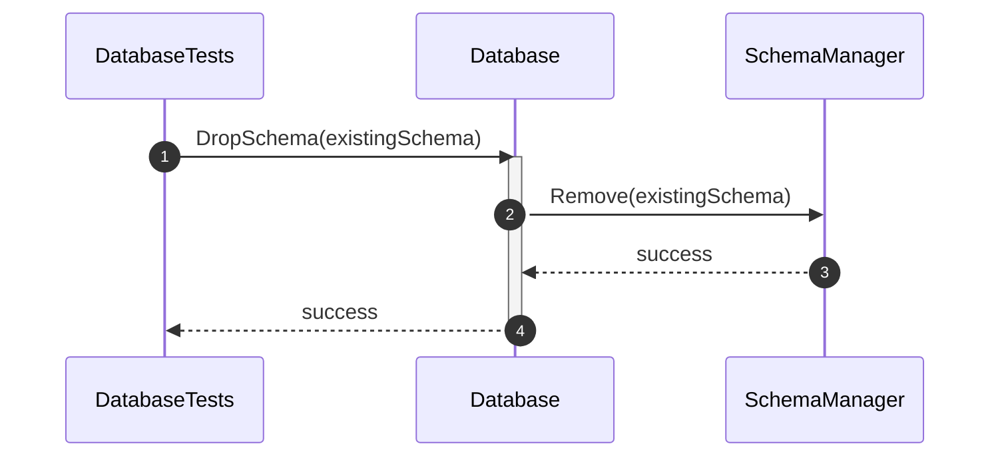
```mermaid
sequenceDiagram
    autonumber

    participant Test as DatabaseTests
    participant DB as Database
    participant SchemaManager as SchemaManager

    Test->>DB: DropSchema(existingSchema)
    activate DB
    DB->>SchemaManager: Remove(existingSchema)
    SchemaManager-->>DB: success
    DB-->>Test: success
    deactivate DB
```

### 4.8 DropSchema_WhenSchemaIsReferenced_ShouldThrow

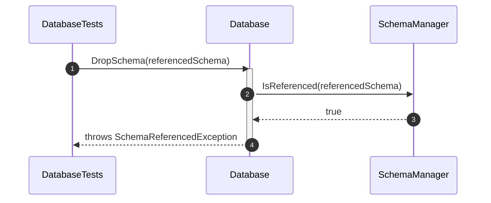
```mermaid
sequenceDiagram
    autonumber

    participant Test as DatabaseTests
    participant DB as Database
    participant SchemaManager as SchemaManager

    Test->>DB: DropSchema(referencedSchema)
    activate DB
    DB->>SchemaManager: IsReferenced(referencedSchema)
    SchemaManager-->>DB: true
    DB-->>Test: throws SchemaReferencedException
    deactivate DB
```

## 5. CatalogManager Tests

### 5.1 Register_WhenObjectIsValid_ShouldAddToCatalog

```mermaid
sequenceDiagram
    autonumber

    participant Test as CatalogManagerTests
    participant Catalog as CatalogManager

    Test->>Catalog: Register(validObject)
    activate Catalog
    Catalog->>Catalog: _store.ContainsKey(validObject.Name)
    Catalog-->>Catalog: false
    Catalog->>Catalog: _store.Add(validObject.Name, validObject)
    Catalog-->>Test: success
    deactivate Catalog
```

### 5.2 Register_WhenObjectAlreadyExists_ShouldThrow

```mermaid
sequenceDiagram
    autonumber

    participant Test as CatalogManagerTests
    participant Catalog as CatalogManager

    Test->>Catalog: Register(existingObject)
    activate Catalog
    Catalog->>Catalog: _store.ContainsKey(existingObject.Name)
    Catalog-->>Catalog: true
    Catalog-->>Test: throws ObjectAlreadyExistsException
    deactivate Catalog
```

### 5.3 Find_WhenObjectExists_ShouldReturnObject

```mermaid
sequenceDiagram
    autonumber

    participant Test as CatalogManagerTests
    participant Catalog as CatalogManager

    Test->>Catalog: Find(objectName)
    activate Catalog
    Catalog->>Catalog: _store.TryGetValue(objectName, out obj)
    Catalog-->>Test: obj
    deactivate Catalog
```

### 5.4 Remove_WhenObjectExists_ShouldRemoveObject

```mermaid
sequenceDiagram
    autonumber

    participant Test as CatalogManagerTests
    participant Catalog as CatalogManager

    Test->>Catalog: Remove(existingObject)
    activate Catalog
    Catalog->>Catalog: _store.ContainsKey(existingObject.Name)
    Catalog-->>Catalog: true
    Catalog->>Catalog: _store.Remove(existingObject.Name)
    Catalog-->>Test: success
    deactivate Catalog
```

### 5.5 Remove_WhenObjectDoesNotExist_ShouldThrow

```mermaid
sequenceDiagram
    autonumber

    participant Test as CatalogManagerTests
    participant Catalog as CatalogManager

    Test->>Catalog: Remove(nonExistingObject)
    activate Catalog
    Catalog->>Catalog: _store.ContainsKey(nonExistingObject.Name)
    Catalog-->>Catalog: false
    Catalog-->>Test: throws ObjectNotFoundException
    deactivate Catalog
```

## 6. StatisticsManager Tests

### 6.1 UpdateStatistics_WhenDataChanges_ShouldRefreshStatistics

```mermaid
sequenceDiagram
    autonumber

    participant Test as StatisticsManagerTests
    participant Stats as StatisticsManager
    participant Store as DatabaseStore

    Test->>Stats: UpdateStatistics(object)
    activate Stats
    Stats->>Store: ReadLatestData(object)
    Store-->>Stats: dataSample
    Stats->>Stats: Calculate statistics
    Stats->>Stats: _stats[object.Name] = newStats
    Stats-->>Test: success
    deactivate Stats
```

### 6.2 UpdateStatistics_WhenObjectDoesNotExist_ShouldThrow

```mermaid
sequenceDiagram
    autonumber

    participant Test as StatisticsManagerTests
    participant Stats as StatisticsManager
    participant Store as DatabaseStore

    Test->>Stats: UpdateStatistics(nonExistingObject)
    activate Stats
    Stats->>Store: ReadLatestData(nonExistingObject)
    Store-->>Stats: throws ObjectNotFoundException
    Stats-->>Test: throws ObjectNotFoundException
    deactivate Stats
```

### 6.3 EstimateSelectivity_WhenStatisticsExist_ShouldReturnEstimate

```mermaid
sequenceDiagram
    autonumber

    participant Test as StatisticsManagerTests
    participant Stats as StatisticsManager

    Test->>Stats: EstimateSelectivity(predicate)
    activate Stats
    Stats->>Stats: _stats.TryGetValue(predicate.Target, out stat)
    Stats-->>Stats: true
    Stats->>Stats: Calculate estimate using stat
    Stats-->>Test: estimated selectivity
    deactivate Stats
```

### 6.4 EstimateSelectivity_WhenStatisticsAreMissing_ShouldUseFallback

```mermaid
sequenceDiagram
    autonumber

    participant Test as StatisticsManagerTests
    participant Stats as StatisticsManager

    Test->>Stats: EstimateSelectivity(predicate)
    activate Stats
    Stats->>Stats: _stats.TryGetValue(predicate.Target, out stat)
    Stats-->>Stats: false
    Stats->>Stats: Calculate fallback estimate
    Stats-->>Test: fallback selectivity
    deactivate Stats
```
