# Database Objects Unit Test Design — Balanced Internal Flows

# 1. Overview

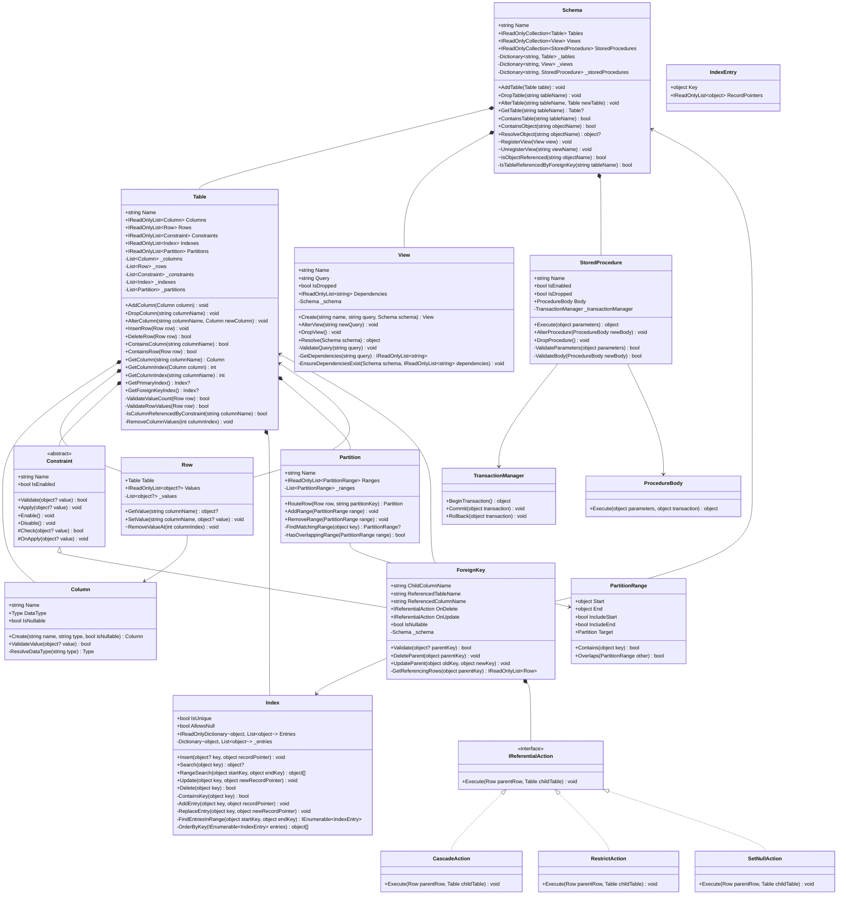
```mermaid
classDiagram
    direction TB

    class Schema {
        +string Name
        +IReadOnlyCollection~Table~ Tables
        +IReadOnlyCollection~View~ Views
        +IReadOnlyCollection~StoredProcedure~ StoredProcedures
        -Dictionary~string, Table~ _tables
        -Dictionary~string, View~ _views
        -Dictionary~string, StoredProcedure~ _storedProcedures
        +AddTable(Table table) void
        +DropTable(string tableName) void
        +AlterTable(string tableName, Table newTable) void
        +GetTable(string tableName) Table?
        +ContainsTable(string tableName) bool
        +ContainsObject(string objectName) bool
        +ResolveObject(string objectName) object?
        ~RegisterView(View view) void
        ~UnregisterView(string viewName) void
        ~IsObjectReferenced(string objectName) bool
        -IsTableReferencedByForeignKey(string tableName) bool
    }

    class Table {
        +string Name
        +IReadOnlyList~Column~ Columns
        +IReadOnlyList~Row~ Rows
        +IReadOnlyList~Constraint~ Constraints
        +IReadOnlyList~Index~ Indexes
        +IReadOnlyList~Partition~ Partitions
        -List~Column~ _columns
        -List~Row~ _rows
        -List~Constraint~ _constraints
        -List~Index~ _indexes
        -List~Partition~ _partitions
        +AddColumn(Column column) void
        +DropColumn(string columnName) void
        +AlterColumn(string columnName, Column newColumn) void
        +InsertRow(Row row) void
        +DeleteRow(Row row) bool
        +ContainsColumn(string columnName) bool
        +ContainsRow(Row row) bool
        +GetColumn(string columnName) Column
        +GetColumnIndex(Column column) int
        +GetColumnIndex(string columnName) int
        +GetPrimaryIndex() Index?
        +GetForeignKeyIndex() Index?
        -ValidateValueCount(Row row) bool
        -ValidateRowValues(Row row) bool
        -IsColumnReferencedByConstraint(string columnName) bool
        -RemoveColumnValues(int columnIndex) void
    }

    class Column {
        +string Name
        +Type DataType
        +bool IsNullable
        +Create(string name, string type, bool isNullable) Column
        +ValidateValue(object? value) bool
        -ResolveDataType(string type) Type
    }

    class Row {
        +Table Table
        +IReadOnlyList~object?~ Values
        -List~object?~ _values
        +GetValue(string columnName) object?
        +SetValue(string columnName, object? value) void
        ~RemoveValueAt(int columnIndex) void
    }

    class Constraint {
        <<abstract>>
        +string Name
        +bool IsEnabled
        +Validate(object? value) bool
        +Apply(object? value) void
        +Enable() void
        +Disable() void
        #Check(object? value) bool
        #OnApply(object? value) void
    }

    class ForeignKey {
        +string ChildColumnName
        +string ReferencedTableName
        +string ReferencedColumnName
        +IReferentialAction OnDelete
        +IReferentialAction OnUpdate
        +bool IsNullable
        -Schema _schema
        +Validate(object? parentKey) bool
        +DeleteParent(object parentKey) void
        +UpdateParent(object oldKey, object newKey) void
        -GetReferencingRows(object parentKey) IReadOnlyList~Row~
    }

    class IReferentialAction {
        <<interface>>
        +Execute(Row parentRow, Table childTable) void
    }

    class CascadeAction {
        +Execute(Row parentRow, Table childTable) void
    }

    class RestrictAction {
        +Execute(Row parentRow, Table childTable) void
    }

    class SetNullAction {
        +Execute(Row parentRow, Table childTable) void
    }

    class Index {
        +bool IsUnique
        +bool AllowsNull
        +IReadOnlyDictionary~object, List~object~~ Entries
        -Dictionary~object, List~object~~ _entries
        +Insert(object? key, object recordPointer) void
        +Search(object key) object?
        +RangeSearch(object startKey, object endKey) object[]
        +Update(object key, object newRecordPointer) void
        +Delete(object key) bool
        -ContainsKey(object key) bool
        -AddEntry(object key, object recordPointer) void
        -ReplaceEntry(object key, object newRecordPointer) void
        -FindEntriesInRange(object startKey, object endKey) IEnumerable~IndexEntry~
        -OrderByKey(IEnumerable~IndexEntry~ entries) object[]
    }

    class IndexEntry {
        +object Key
        +IReadOnlyList~object~ RecordPointers
    }

    class Partition {
        +string Name
        +IReadOnlyList~PartitionRange~ Ranges
        -List~PartitionRange~ _ranges
        +RouteRow(Row row, string partitionKey) Partition
        +AddRange(PartitionRange range) void
        +RemoveRange(PartitionRange range) void
        -FindMatchingRange(object key) PartitionRange?
        -HasOverlappingRange(PartitionRange range) bool
    }

    class PartitionRange {
        +object Start
        +object End
        +bool IncludeStart
        +bool IncludeEnd
        +Partition Target
        +Contains(object key) bool
        +Overlaps(PartitionRange other) bool
    }

    class View {
        +string Name
        +string Query
        +bool IsDropped
        +IReadOnlyList~string~ Dependencies
        -Schema _schema
        +Create(string name, string query, Schema schema) View
        +AlterView(string newQuery) void
        +DropView() void
        +Resolve(Schema schema) object
        -ValidateQuery(string query) void
        -GetDependencies(string query) IReadOnlyList~string~
        -EnsureDependenciesExist(Schema schema, IReadOnlyList~string~ dependencies) void
    }

    class StoredProcedure {
        +string Name
        +bool IsEnabled
        +bool IsDropped
        +ProcedureBody Body
        -TransactionManager _transactionManager
        +Execute(object parameters) object
        +AlterProcedure(ProcedureBody newBody) void
        +DropProcedure() void
        -ValidateParameters(object parameters) bool
        -ValidateBody(ProcedureBody newBody) bool
    }

    class TransactionManager {
        +BeginTransaction() object
        +Commit(object transaction) void
        +Rollback(object transaction) void
    }

    class ProcedureBody {
        +Execute(object parameters, object transaction) object
    }

    Schema *-- Table
    Schema *-- View
    Schema *-- StoredProcedure

    Table *-- Column
    Table *-- Row
    Table *-- Constraint
    Table *-- Index
    Table *-- Partition

    Constraint <|-- ForeignKey
    Row --> Table
    Row --> Column
    ForeignKey --> Schema
    ForeignKey --> Table
    ForeignKey --> Index
    Partition --> PartitionRange
    StoredProcedure --> TransactionManager
    StoredProcedure --> ProcedureBody

    IReferentialAction <|.. CascadeAction
    IReferentialAction <|.. RestrictAction
    IReferentialAction <|.. SetNullAction
    ForeignKey *-- IReferentialAction
```

## 2. Schema Tests

### 2.1 AddTable_WhenTableIsValid_ShouldRegisterTable

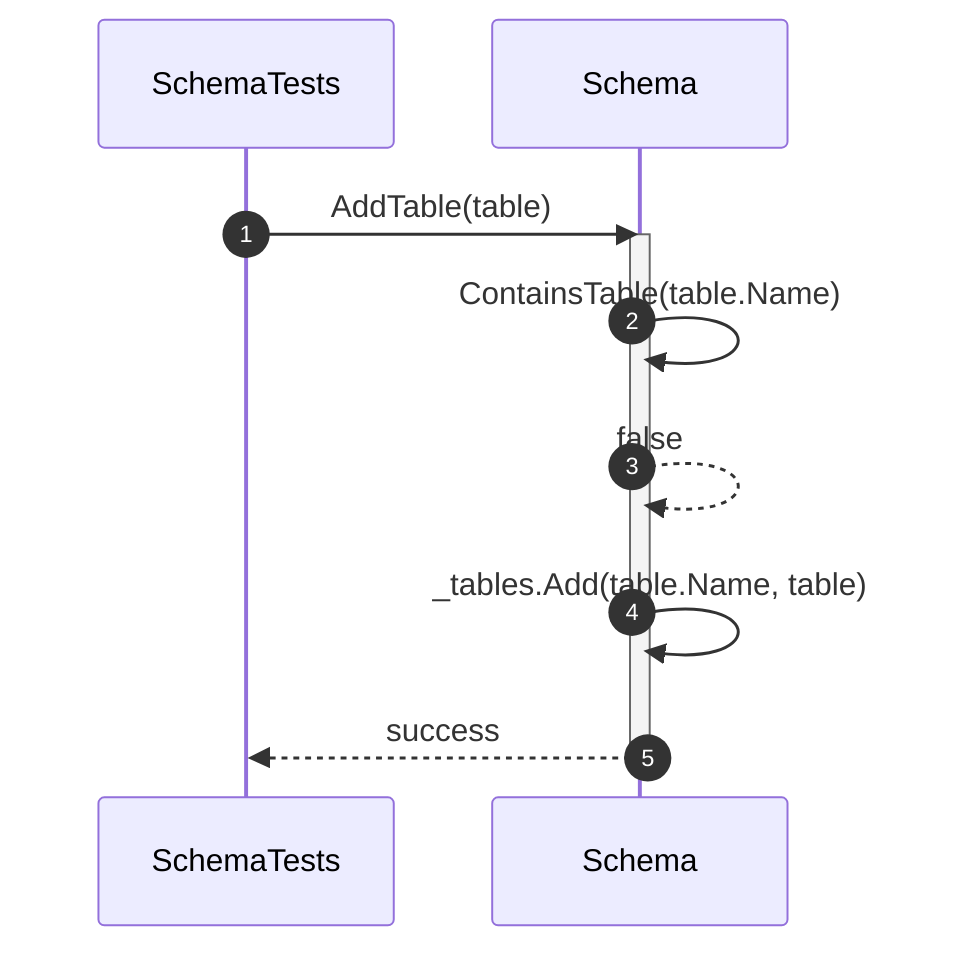
```mermaid
sequenceDiagram
    autonumber

    participant Test as SchemaTests
    participant Schema as Schema

    Test->>Schema: AddTable(table)
    activate Schema
    Schema->>Schema: ContainsTable(table.Name)
    Schema-->>Schema: false
    Schema->>Schema: _tables.Add(table.Name, table)
    Schema-->>Test: success
    deactivate Schema
```

### 2.2 AddTable_WhenTableIsNull_ShouldThrow

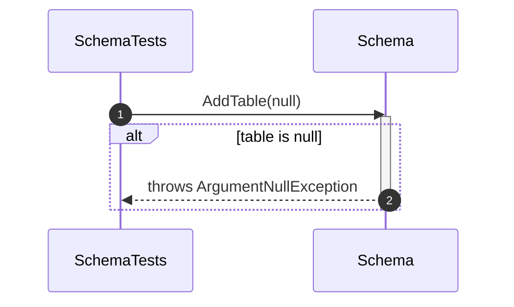
```mermaid
sequenceDiagram
    autonumber

    participant Test as SchemaTests
    participant Schema as Schema

    Test->>Schema: AddTable(null)
    activate Schema
    alt table is null
        Schema-->>Test: throws ArgumentNullException
    end
    deactivate Schema
```

### 2.3 AddTable_WhenNameAlreadyExists_ShouldThrow

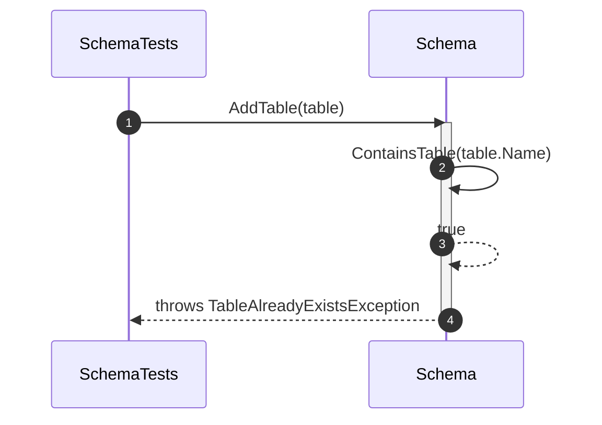
```mermaid
sequenceDiagram
    autonumber

    participant Test as SchemaTests
    participant Schema as Schema

    Test->>Schema: AddTable(table)
    activate Schema
    Schema->>Schema: ContainsTable(table.Name)
    Schema-->>Schema: true
    Schema-->>Test: throws TableAlreadyExistsException
    deactivate Schema
```

### 2.4 GetTable_WhenTableExists_ShouldReturnTable

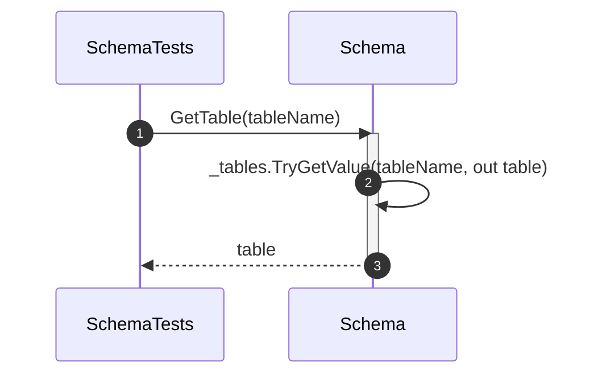
```mermaid
sequenceDiagram
    autonumber

    participant Test as SchemaTests
    participant Schema as Schema

    Test->>Schema: GetTable(tableName)
    activate Schema
    Schema->>Schema: _tables.TryGetValue(tableName, out table)
    Schema-->>Test: table
    deactivate Schema
```

### 2.5 GetTable_WhenTableDoesNotExist_ShouldReturnNull

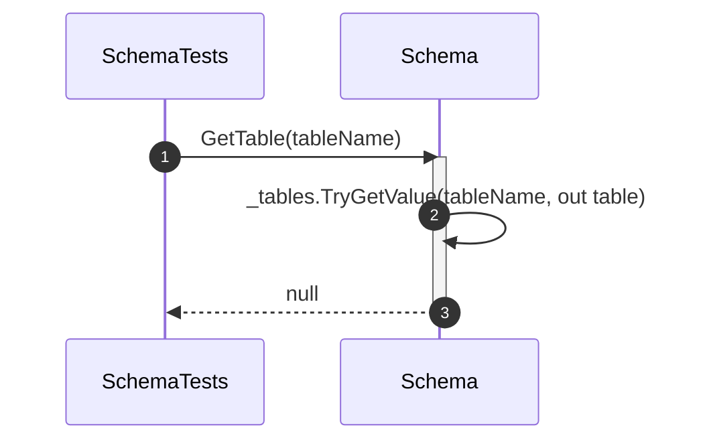
```mermaid
sequenceDiagram
    autonumber

    participant Test as SchemaTests
    participant Schema as Schema

    Test->>Schema: GetTable(tableName)
    activate Schema
    Schema->>Schema: _tables.TryGetValue(tableName, out table)
    Schema-->>Test: null
    deactivate Schema
```

### 2.6 ContainsTable_WhenTableExists_ShouldReturnTrue

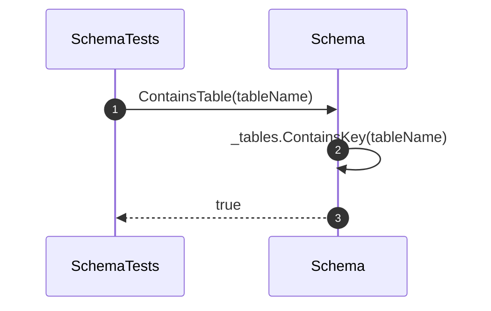
```mermaid
sequenceDiagram
    autonumber

    participant Test as SchemaTests
    participant Schema as Schema

    Test->>Schema: ContainsTable(tableName)
    Schema->>Schema: _tables.ContainsKey(tableName)
    Schema-->>Test: true
```

### 2.7 ContainsTable_WhenTableDoesNotExist_ShouldReturnFalse

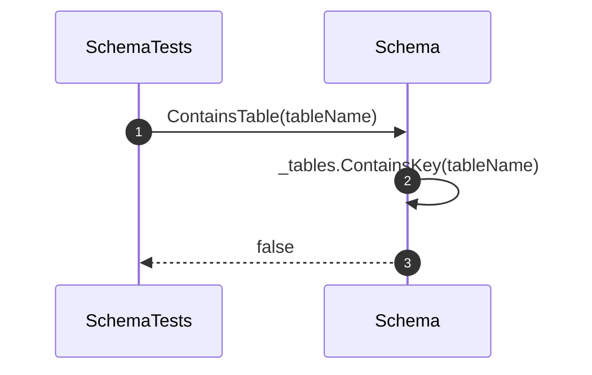
```mermaid
sequenceDiagram
    autonumber

    participant Test as SchemaTests
    participant Schema as Schema

    Test->>Schema: ContainsTable(tableName)
    Schema->>Schema: _tables.ContainsKey(tableName)
    Schema-->>Test: false
```

### 2.8 DropTable_WhenTableIsNotReferenced_ShouldRemoveTable

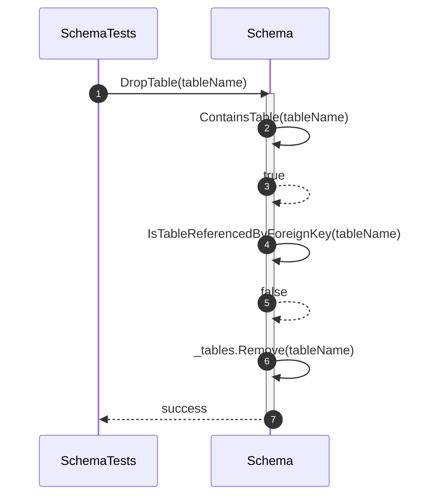
```mermaid
sequenceDiagram
    autonumber

    participant Test as SchemaTests
    participant Schema as Schema

    Test->>Schema: DropTable(tableName)
    activate Schema
    Schema->>Schema: ContainsTable(tableName)
    Schema-->>Schema: true
    Schema->>Schema: IsTableReferencedByForeignKey(tableName)
    Schema-->>Schema: false
    Schema->>Schema: _tables.Remove(tableName)
    Schema-->>Test: success
    deactivate Schema
```

### 2.9 DropTable_WhenTableIsReferencedByForeignKey_ShouldThrow

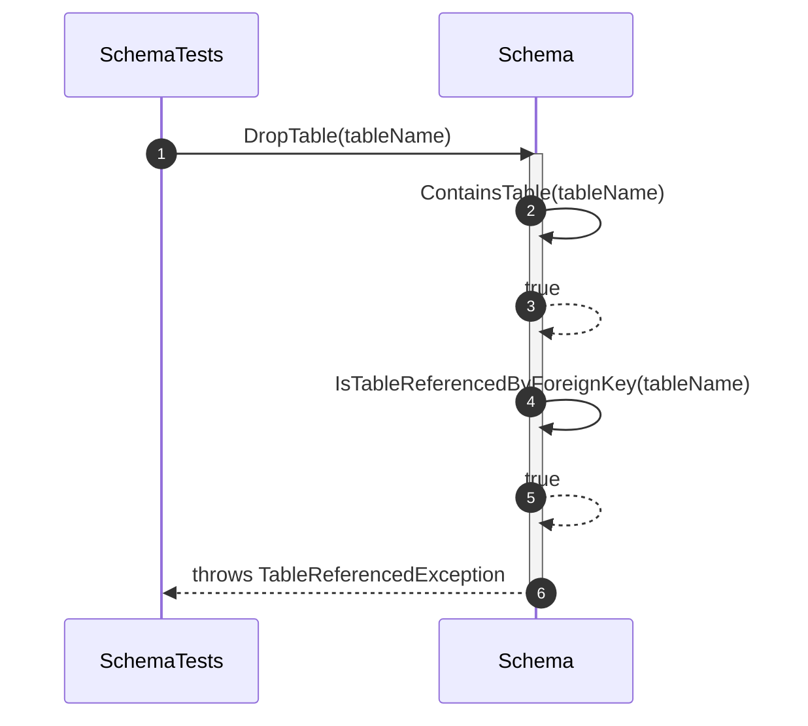
```mermaid
sequenceDiagram
    autonumber

    participant Test as SchemaTests
    participant Schema as Schema

    Test->>Schema: DropTable(tableName)
    activate Schema
    Schema->>Schema: ContainsTable(tableName)
    Schema-->>Schema: true
    Schema->>Schema: IsTableReferencedByForeignKey(tableName)
    Schema-->>Schema: true
    Schema-->>Test: throws TableReferencedException
    deactivate Schema
```

### 2.10 DropTable_WhenTableDoesNotExist_ShouldThrow

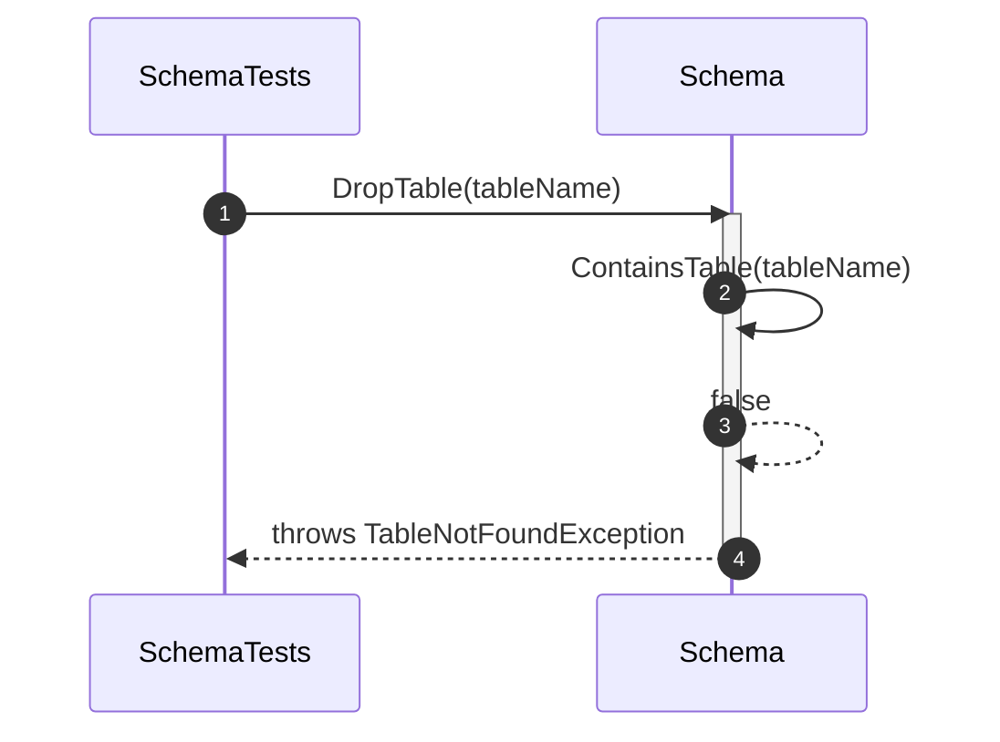
```mermaid
sequenceDiagram
    autonumber

    participant Test as SchemaTests
    participant Schema as Schema

    Test->>Schema: DropTable(tableName)
    activate Schema
    Schema->>Schema: ContainsTable(tableName)
    Schema-->>Schema: false
    Schema-->>Test: throws TableNotFoundException
    deactivate Schema
```

### 2.11 AlterTable_WhenTableExists_ShouldUpdateTable

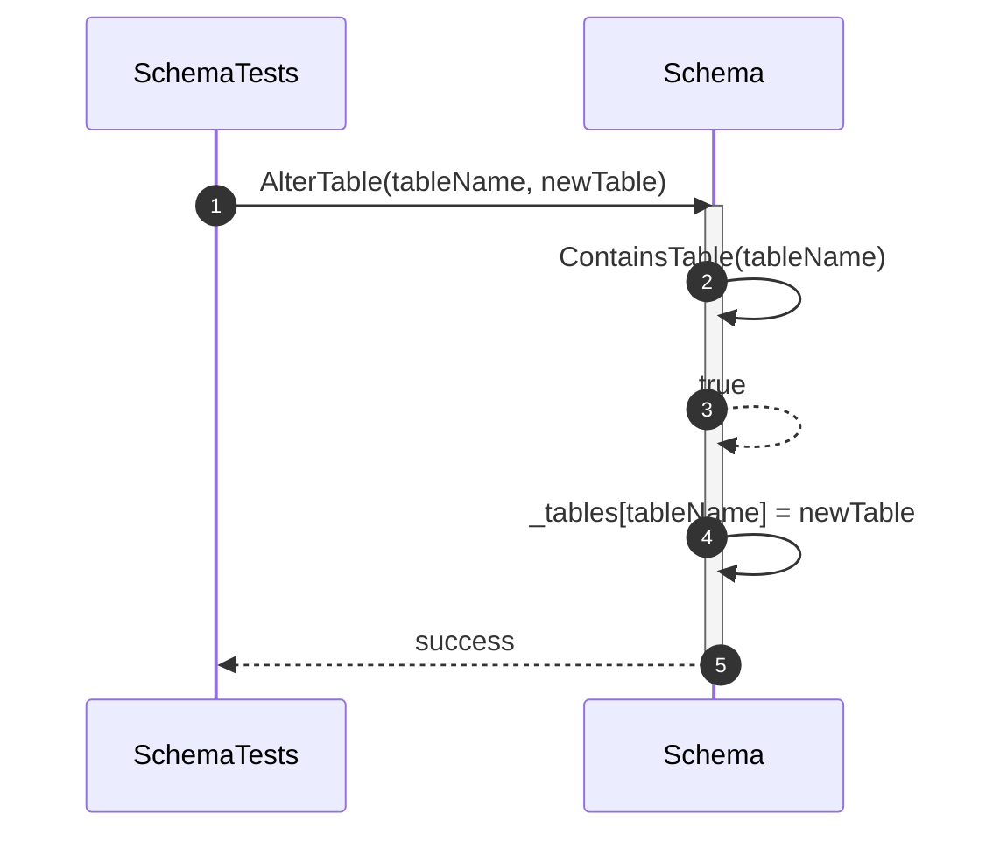
```mermaid
sequenceDiagram
    autonumber

    participant Test as SchemaTests
    participant Schema as Schema

    Test->>Schema: AlterTable(tableName, newTable)
    activate Schema
    Schema->>Schema: ContainsTable(tableName)
    Schema-->>Schema: true
    Schema->>Schema: _tables[tableName] = newTable
    Schema-->>Test: success
    deactivate Schema
```

### 2.12 AlterTable_WhenTableDoesNotExist_ShouldThrow

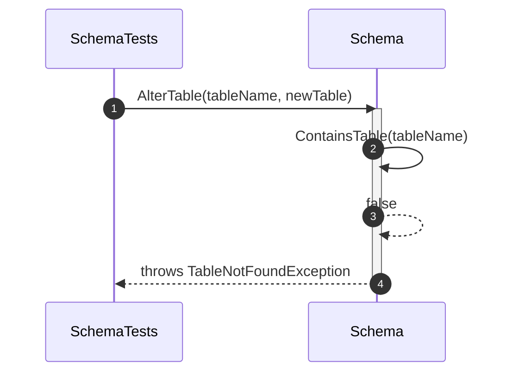
```mermaid
sequenceDiagram
    autonumber

    participant Test as SchemaTests
    participant Schema as Schema

    Test->>Schema: AlterTable(tableName, newTable)
    activate Schema
    Schema->>Schema: ContainsTable(tableName)
    Schema-->>Schema: false
    Schema-->>Test: throws TableNotFoundException
    deactivate Schema
```

## 3. Table Tests

### 3.1 AddColumn_WhenColumnIsValid_ShouldAddColumn

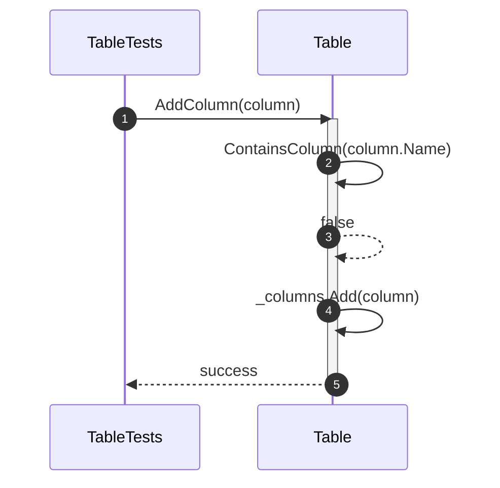
```mermaid
sequenceDiagram
    autonumber

    participant Test as TableTests
    participant Table as Table

    Test->>Table: AddColumn(column)
    activate Table
    Table->>Table: ContainsColumn(column.Name)
    Table-->>Table: false
    Table->>Table: _columns.Add(column)
    Table-->>Test: success
    deactivate Table
```

### 3.2 AddColumn_WhenColumnIsNull_ShouldThrow

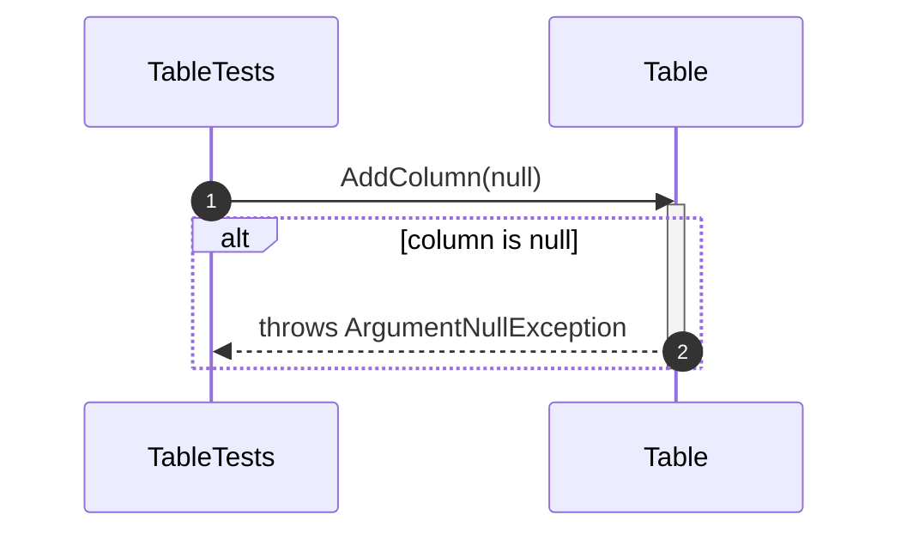
```mermaid
sequenceDiagram
    autonumber

    participant Test as TableTests
    participant Table as Table

    Test->>Table: AddColumn(null)
    activate Table
    alt column is null
        Table-->>Test: throws ArgumentNullException
    end
    deactivate Table
```

### 3.3 AddColumn_WhenNameAlreadyExists_ShouldThrow

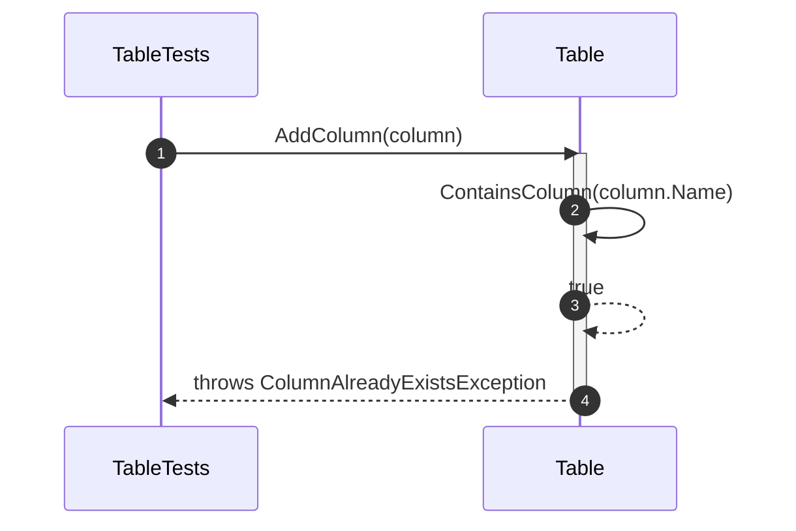
```mermaid
sequenceDiagram
    autonumber

    participant Test as TableTests
    participant Table as Table

    Test->>Table: AddColumn(column)
    activate Table
    Table->>Table: ContainsColumn(column.Name)
    Table-->>Table: true
    Table-->>Test: throws ColumnAlreadyExistsException
    deactivate Table
```

### 3.4 InsertRow_WhenRowIsValid_ShouldInsertRow

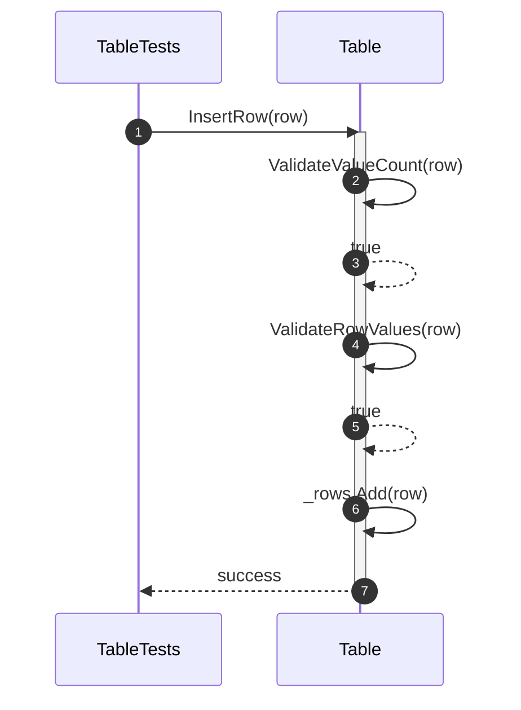
```mermaid
sequenceDiagram
    autonumber

    participant Test as TableTests
    participant Table as Table

    Test->>Table: InsertRow(row)
    activate Table
    Table->>Table: ValidateValueCount(row)
    Table-->>Table: true
    Table->>Table: ValidateRowValues(row)
    Table-->>Table: true
    Table->>Table: _rows.Add(row)
    Table-->>Test: success
    deactivate Table
```

### 3.5 InsertRow_WhenRowIsNull_ShouldThrow

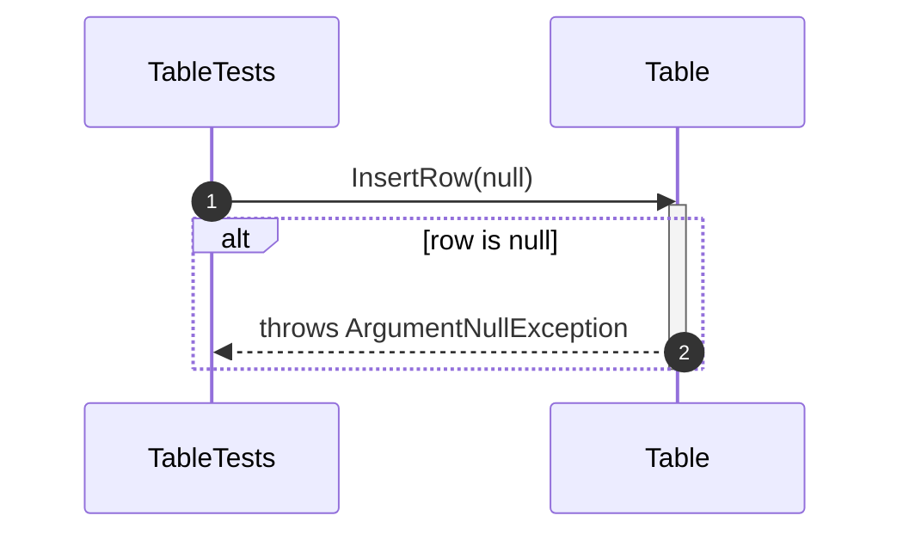
```mermaid
sequenceDiagram
    autonumber

    participant Test as TableTests
    participant Table as Table

    Test->>Table: InsertRow(null)
    activate Table
    alt row is null
        Table-->>Test: throws ArgumentNullException
    end
    deactivate Table
```

### 3.6 InsertRow_WhenValueCountDoesNotMatch_ShouldThrow

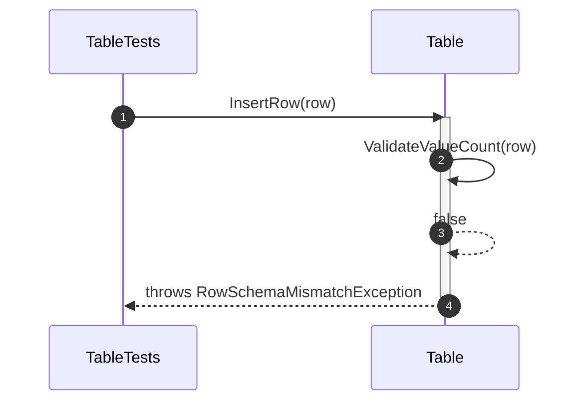
```mermaid
sequenceDiagram
    autonumber

    participant Test as TableTests
    participant Table as Table

    Test->>Table: InsertRow(row)
    activate Table
    Table->>Table: ValidateValueCount(row)
    Table-->>Table: false
    Table-->>Test: throws RowSchemaMismatchException
    deactivate Table
```

### 3.7 InsertRow_WhenValueTypeDoesNotMatch_ShouldThrow

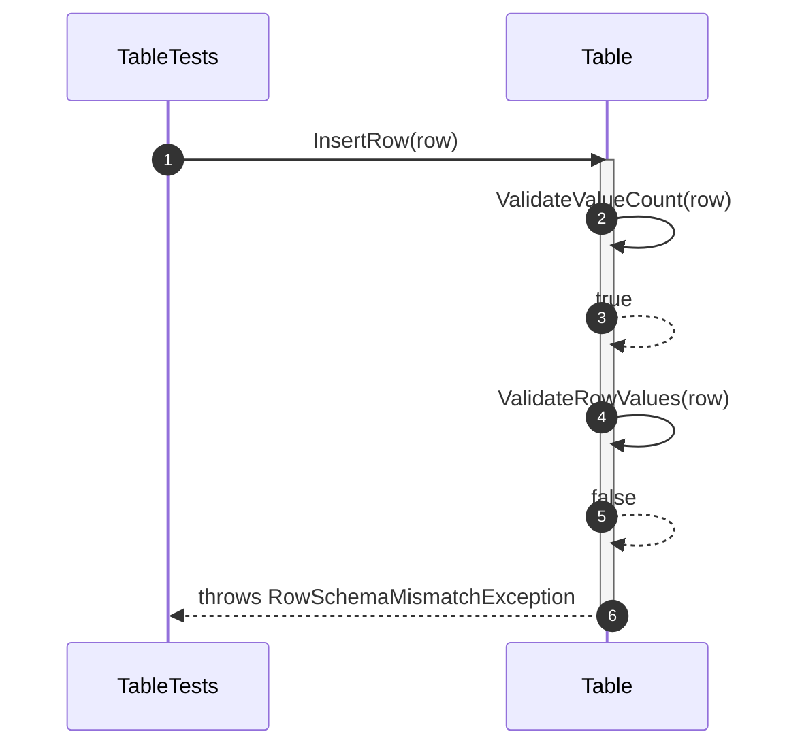
```mermaid
sequenceDiagram
    autonumber

    participant Test as TableTests
    participant Table as Table

    Test->>Table: InsertRow(row)
    activate Table
    Table->>Table: ValidateValueCount(row)
    Table-->>Table: true
    Table->>Table: ValidateRowValues(row)
    Table-->>Table: false
    Table-->>Test: throws RowSchemaMismatchException
    deactivate Table
```

### 3.8 InsertRow_WhenNullValueIsAllowed_ShouldInsertRow

```mermaid
sequenceDiagram
    autonumber

    participant Test as TableTests
    participant Table as Table

    Test->>Table: InsertRow(row)
    activate Table
    Table->>Table: ValidateValueCount(row)
    Table-->>Table: true
    Table->>Table: ValidateRowValues(row)
    Note right of Table: Nullable column accepts null
    Table-->>Table: true
    Table->>Table: _rows.Add(row)
    Table-->>Test: success
    deactivate Table
```

### 3.9 InsertRow_WhenNullValueIsNotAllowed_ShouldThrow

```mermaid
sequenceDiagram
    autonumber

    participant Test as TableTests
    participant Table as Table

    Test->>Table: InsertRow(row)
    activate Table
    Table->>Table: ValidateRowValues(row)
    Note right of Table: Non-nullable column rejects null
    Table-->>Table: false
    Table-->>Test: throws RowSchemaMismatchException
    deactivate Table
```

### 3.10 DeleteRow_WhenRowExists_ShouldRemoveRow

```mermaid
sequenceDiagram
    autonumber

    participant Test as TableTests
    participant Table as Table

    Test->>Table: DeleteRow(row)
    activate Table
    Table->>Table: _rows.Remove(row)
    Table-->>Test: true
    deactivate Table
```

### 3.11 DeleteRow_WhenRowDoesNotExist_ShouldReturnFalse

```mermaid
sequenceDiagram
    autonumber

    participant Test as TableTests
    participant Table as Table

    Test->>Table: DeleteRow(row)
    activate Table
    Table->>Table: _rows.Remove(row)
    Table-->>Test: false
    deactivate Table
```

### 3.12 DropColumn_WhenColumnExists_ShouldRemoveColumn

```mermaid
sequenceDiagram
    autonumber

    participant Test as TableTests
    participant Table as Table

    Test->>Table: DropColumn(columnName)
    activate Table
    Table->>Table: GetColumnIndex(columnName)
    Table-->>Table: columnIndex
    Table->>Table: IsColumnReferencedByConstraint(columnName)
    Table-->>Table: false
    Table->>Table: RemoveColumnValues(columnIndex)
    Table->>Table: _columns.RemoveAt(columnIndex)
    Table-->>Test: success
    deactivate Table
```

### 3.13 DropColumn_WhenColumnDoesNotExist_ShouldThrow

```mermaid
sequenceDiagram
    autonumber

    participant Test as TableTests
    participant Table as Table

    Test->>Table: DropColumn(columnName)
    activate Table
    Table->>Table: GetColumnIndex(columnName)
    Table-->>Table: -1
    Table-->>Test: throws ColumnNotFoundException
    deactivate Table
```

### 3.14 DropColumn_WhenColumnIsReferencedByConstraint_ShouldThrow

```mermaid
sequenceDiagram
    autonumber

    participant Test as TableTests
    participant Table as Table

    Test->>Table: DropColumn(columnName)
    activate Table
    Table->>Table: GetColumnIndex(columnName)
    Table-->>Table: columnIndex
    Table->>Table: IsColumnReferencedByConstraint(columnName)
    Table-->>Table: true
    Table-->>Test: throws ColumnReferencedException
    deactivate Table
```

### 3.15 DropColumn_WhenRowsExist_ShouldRemoveCorrespondingValues

```mermaid
sequenceDiagram
    autonumber

    participant Test as TableTests
    participant Table as Table

    Test->>Table: DropColumn(columnName)
    activate Table
    Table->>Table: GetColumnIndex(columnName)
    Table-->>Table: columnIndex
    Table->>Table: RemoveColumnValues(columnIndex)
    loop each row
        Table->>Table: row.RemoveValueAt(columnIndex)
    end
    Table->>Table: _columns.RemoveAt(columnIndex)
    Table-->>Test: success
    deactivate Table
```

### 3.16 AlterColumn_WhenColumnExists_ShouldUpdateDefinition

```mermaid
sequenceDiagram
    autonumber

    participant Test as TableTests
    participant Table as Table

    Test->>Table: AlterColumn(columnName, newColumn)
    activate Table
    Table->>Table: GetColumnIndex(columnName)
    Table-->>Table: columnIndex
    Table->>Table: _columns[columnIndex] = newColumn
    Table-->>Test: success
    deactivate Table
```

### 3.17 AlterColumn_WhenColumnDoesNotExist_ShouldThrow

```mermaid
sequenceDiagram
    autonumber

    participant Test as TableTests
    participant Table as Table

    Test->>Table: AlterColumn(columnName, newColumn)
    activate Table
    Table->>Table: GetColumnIndex(columnName)
    Table-->>Table: -1
    Table-->>Test: throws ColumnNotFoundException
    deactivate Table
```

## 4. Column Tests

### 4.1 Create_WhenDefinitionIsValid_ShouldCreateColumn

```mermaid
sequenceDiagram
    autonumber

    participant Test as ColumnTests
    participant Column as Column

    Test->>Column: Create(name, type)
    activate Column
    Column->>Column: ResolveDataType(type)
    Column-->>Column: dataType
    Column-->>Test: new Column(name, dataType)
    deactivate Column
```

### 4.2 Create_WhenNameIsInvalid_ShouldThrow

```mermaid
sequenceDiagram
    autonumber

    participant Test as ColumnTests
    participant Column as Column

    Test->>Column: Create(name, type)
    activate Column
    alt name is null or whitespace
        Column-->>Test: throws InvalidColumnNameException
    end
    deactivate Column
```

### 4.3 Create_WhenDataTypeIsNull_ShouldThrow

```mermaid
sequenceDiagram
    autonumber

    participant Test as ColumnTests
    participant Column as Column

    Test->>Column: Create(name, null)
    activate Column
    alt type is null
        Column-->>Test: throws ArgumentNullException
    end
    deactivate Column
```

### 4.4 ValidateValue_WhenTypeMatches_ShouldReturnTrue

```mermaid
sequenceDiagram
    autonumber

    participant Test as ColumnTests
    participant Column as Column

    Test->>Column: ValidateValue(value)
    Column->>Column: DataType.IsInstanceOfType(value)
    Column-->>Test: true
```

### 4.5 ValidateValue_WhenTypeDoesNotMatch_ShouldReturnFalse

```mermaid
sequenceDiagram
    autonumber

    participant Test as ColumnTests
    participant Column as Column

    Test->>Column: ValidateValue(value)
    Column->>Column: DataType.IsInstanceOfType(value)
    Column-->>Test: false
```

### 4.6 ValidateValue_WhenValueIsNullAndNullable_ShouldReturnTrue

```mermaid
sequenceDiagram
    autonumber

    participant Test as ColumnTests
    participant Column as Column

    Test->>Column: ValidateValue(null)
    Column->>Column: check IsNullable
    Column-->>Test: true
```

### 4.7 ValidateValue_WhenValueIsNullAndNotNullable_ShouldReturnFalse

```mermaid
sequenceDiagram
    autonumber

    participant Test as ColumnTests
    participant Column as Column

    Test->>Column: ValidateValue(null)
    Column->>Column: check IsNullable
    Column-->>Test: false
```

## 5. Row Tests

### 5.1 GetValue_WhenColumnExists_ShouldReturnValue

```mermaid
sequenceDiagram
    autonumber

    participant Test as RowTests
    participant Row as Row
    participant Table as Table
    participant Column as Column

    Test->>Row: GetValue(columnName)
    activate Row
    Row->>Table: GetColumn(columnName)
    Table-->>Row: column
    Row->>Table: GetColumnIndex(column)
    Table-->>Row: columnIndex
    Row-->>Test: Values[columnIndex]
    deactivate Row
```

### 5.2 GetValue_WhenColumnDoesNotExist_ShouldThrow

```mermaid
sequenceDiagram
    autonumber

    participant Test as RowTests
    participant Row as Row
    participant Table as Table
    participant Column as Column

    Test->>Row: GetValue(columnName)
    activate Row
    Row->>Table: GetColumn(columnName)
    Table-->>Row: throws ColumnNotFoundException
    Row-->>Test: propagates exception
    deactivate Row
```

### 5.3 SetValue_WhenValueIsValid_ShouldUpdateValue

```mermaid
sequenceDiagram
    autonumber

    participant Test as RowTests
    participant Row as Row
    participant Table as Table
    participant Column as Column

    Test->>Row: SetValue(columnName, value)
    activate Row
    Row->>Table: GetColumn(columnName)
    Table-->>Row: column
    Row->>Column: ValidateValue(value)
    Column-->>Row: true
    Row->>Table: GetColumnIndex(column)
    Table-->>Row: columnIndex
    Row->>Row: _values[columnIndex] = value
    Row-->>Test: success
    deactivate Row
```

### 5.4 SetValue_WhenTypeDoesNotMatch_ShouldThrow

```mermaid
sequenceDiagram
    autonumber

    participant Test as RowTests
    participant Row as Row
    participant Table as Table
    participant Column as Column

    Test->>Row: SetValue(columnName, value)
    activate Row
    Row->>Table: GetColumn(columnName)
    Table-->>Row: column
    Row->>Column: ValidateValue(value)
    Column-->>Row: false
    Row-->>Test: throws InvalidColumnValueException
    deactivate Row
```

### 5.5 SetValue_WhenColumnDoesNotExist_ShouldThrow

```mermaid
sequenceDiagram
    autonumber

    participant Test as RowTests
    participant Row as Row
    participant Table as Table
    participant Column as Column

    Test->>Row: SetValue(columnName, value)
    activate Row
    Row->>Table: GetColumn(columnName)
    Table-->>Row: throws ColumnNotFoundException
    Row-->>Test: propagates exception
    deactivate Row
```

### 5.6 SetValue_WhenNullIsAllowed_ShouldUpdateValue

```mermaid
sequenceDiagram
    autonumber

    participant Test as RowTests
    participant Row as Row
    participant Table as Table
    participant Column as Column

    Test->>Row: SetValue(columnName, null)
    activate Row
    Row->>Column: ValidateValue(null)
    Column-->>Row: true
    Row->>Row: _values[columnIndex] = null
    Row-->>Test: success
    deactivate Row
```

### 5.7 SetValue_WhenNullIsNotAllowed_ShouldThrow

```mermaid
sequenceDiagram
    autonumber

    participant Test as RowTests
    participant Row as Row
    participant Table as Table
    participant Column as Column

    Test->>Row: SetValue(columnName, null)
    activate Row
    Row->>Column: ValidateValue(null)
    Column-->>Row: false
    Row-->>Test: throws InvalidColumnValueException
    deactivate Row
```

### 5.8 SetValue_WhenValidationFails_ShouldPreserveExistingValue

```mermaid
sequenceDiagram
    autonumber

    participant Test as RowTests
    participant Row as Row
    participant Table as Table
    participant Column as Column

    Test->>Row: SetValue(columnName, invalidValue)
    activate Row
    Row->>Column: ValidateValue(invalidValue)
    Column-->>Row: false
    Note right of Row: _values is not modified
    Row-->>Test: throws InvalidColumnValueException
    deactivate Row
```

## 6. Constraint Tests

### 6.1 Validate_WhenConstraintIsEnabled_ShouldCallCheck

```mermaid
sequenceDiagram
    autonumber
    participant Test as ConstraintTests
    participant Constraint as Constraint

    Test->>Constraint: Validate(context)
    activate Constraint
    Constraint->>Constraint: Check(context)
    Constraint-->>Test: true
    deactivate Constraint
```

### 6.2 Validate_WhenCheckReturnsTrue_ShouldReturnTrue

```mermaid
sequenceDiagram
    autonumber
    participant Test as ConstraintTests
    participant Constraint as Constraint

    Test->>Constraint: Validate(context)
    activate Constraint
    Constraint->>Constraint: Check(context)
    Constraint-->>Constraint: true
    Constraint-->>Test: true
    deactivate Constraint
```

### 6.3 Validate_WhenCheckReturnsFalse_ShouldReturnFalse

```mermaid
sequenceDiagram
    autonumber
    participant Test as ConstraintTests
    participant Constraint as Constraint

    Test->>Constraint: Validate(context)
    activate Constraint
    Constraint->>Constraint: Check(context)
    Constraint-->>Constraint: false
    Constraint-->>Test: false
    deactivate Constraint
```

### 6.4 Validate_WhenConstraintIsDisabled_ShouldSkipCheck

```mermaid
sequenceDiagram
    autonumber
    participant Test as ConstraintTests
    participant Constraint as Constraint

    Test->>Constraint: Validate(context)
    activate Constraint
    Constraint->>Constraint: IsEnabled
    Constraint-->>Constraint: false
    Constraint-->>Test: true
    deactivate Constraint
```

### 6.5 Enable_WhenConstraintIsDisabled_ShouldEnable

```mermaid
sequenceDiagram
    autonumber
    participant Test as ConstraintTests
    participant Constraint as Constraint

    Test->>Constraint: Enable()
    Constraint->>Constraint: IsEnabled = true
    Constraint-->>Test: success
```

### 6.6 Disable_WhenConstraintIsEnabled_ShouldDisable

```mermaid
sequenceDiagram
    autonumber
    participant Test as ConstraintTests
    participant Constraint as Constraint

    Test->>Constraint: Disable()
    Constraint->>Constraint: IsEnabled = false
    Constraint-->>Test: success
```

## 7. CheckConstraint Tests

### 7.1 Validate_WhenPredicateReturnsTrue_ShouldReturnTrue

```mermaid
sequenceDiagram
    autonumber
    participant Test as CheckConstraintTests
    participant Constraint as CheckConstraint

    Test->>Constraint: Validate(row)
    activate Constraint
    Constraint->>Constraint: Invoke Predicate(row)
    Constraint-->>Constraint: true
    Constraint-->>Test: true
    deactivate Constraint
```

### 7.2 Validate_WhenPredicateReturnsFalse_ShouldReturnFalse

```mermaid
sequenceDiagram
    autonumber
    participant Test as CheckConstraintTests
    participant Constraint as CheckConstraint

    Test->>Constraint: Validate(row)
    activate Constraint
    Constraint->>Constraint: Invoke Predicate(row)
    Constraint-->>Constraint: false
    Constraint-->>Test: false
    deactivate Constraint
```

### 7.3 Validate_WhenPredicateUsesMultipleColumns_ShouldEvaluateCandidateRow

```mermaid
sequenceDiagram
    autonumber
    participant Test as CheckConstraintTests
    participant Constraint as CheckConstraint

    Test->>Constraint: Validate(row)
    activate Constraint
    Constraint->>Constraint: Invoke Predicate(row)
    Note right of Constraint: Evaluates multiple columns from row
    Constraint-->>Constraint: true/false
    Constraint-->>Test: result
    deactivate Constraint
```

## 8. UniqueConstraint Tests

### 8.1 Validate_WhenKeyIsUnique_ShouldReturnTrue

```mermaid
sequenceDiagram
    autonumber
    participant Test as UniqueConstraintTests
    participant Constraint as UniqueConstraint
    participant Index as Index

    Test->>Constraint: Validate(row)
    activate Constraint
    Constraint->>Index: Search(row.Key)
    Index-->>Constraint: null
    Constraint-->>Test: true
    deactivate Constraint
```

### 8.2 Validate_WhenDuplicateKeyExists_ShouldReturnFalse

```mermaid
sequenceDiagram
    autonumber
    participant Test as UniqueConstraintTests
    participant Constraint as UniqueConstraint
    participant Index as Index

    Test->>Constraint: Validate(row)
    activate Constraint
    Constraint->>Index: Search(row.Key)
    Index-->>Constraint: existingRecord
    Constraint-->>Test: false
    deactivate Constraint
```

### 8.3 Validate_WhenUpdatingSameRow_ShouldIgnoreExistingRow

```mermaid
sequenceDiagram
    autonumber
    participant Test as UniqueConstraintTests
    participant Constraint as UniqueConstraint
    participant Index as Index

    Test->>Constraint: Validate(row)
    activate Constraint
    Constraint->>Index: Search(row.Key)
    Index-->>Constraint: existingRecord
    Constraint->>Constraint: existingRecord == row
    Constraint-->>Constraint: true
    Constraint-->>Test: true
    deactivate Constraint
```

### 8.4 Validate_WhenCompositeKeyAlreadyExists_ShouldReturnFalse

```mermaid
sequenceDiagram
    autonumber
    participant Test as UniqueConstraintTests
    participant Constraint as UniqueConstraint
    participant Index as Index

    Test->>Constraint: Validate(row)
    activate Constraint
    Constraint->>Index: Search(compositeKey)
    Index-->>Constraint: existingRecord
    Constraint-->>Test: false
    deactivate Constraint
```

## 9. PrimaryKeyConstraint Tests

### 9.1 Validate_WhenKeyIsUniqueAndNotNull_ShouldReturnTrue

```mermaid
sequenceDiagram
    autonumber
    participant Test as PrimaryKeyConstraintTests
    participant Constraint as PrimaryKeyConstraint
    participant Index as Index

    Test->>Constraint: Validate(row)
    activate Constraint
    Constraint->>Constraint: ContainsNull(row.Key)
    Constraint-->>Constraint: false
    Constraint->>Index: Search(row.Key)
    Index-->>Constraint: null
    Constraint-->>Test: true
    deactivate Constraint
```

### 9.2 Validate_WhenKeyContainsNull_ShouldReturnFalse

```mermaid
sequenceDiagram
    autonumber
    participant Test as PrimaryKeyConstraintTests
    participant Constraint as PrimaryKeyConstraint

    Test->>Constraint: Validate(row)
    activate Constraint
    Constraint->>Constraint: ContainsNull(row.Key)
    Constraint-->>Constraint: true
    Constraint-->>Test: false
    deactivate Constraint
```

### 9.3 Validate_WhenDuplicateKeyExists_ShouldReturnFalse

```mermaid
sequenceDiagram
    autonumber
    participant Test as PrimaryKeyConstraintTests
    participant Constraint as PrimaryKeyConstraint
    participant Index as Index

    Test->>Constraint: Validate(row)
    activate Constraint
    Constraint->>Constraint: ContainsNull(row.Key)
    Constraint-->>Constraint: false
    Constraint->>Index: Search(row.Key)
    Index-->>Constraint: existingRecord
    Constraint-->>Test: false
    deactivate Constraint
```

### 9.4 Validate_WhenUpdatingSameRow_ShouldIgnoreExistingRow

```mermaid
sequenceDiagram
    autonumber
    participant Test as PrimaryKeyConstraintTests
    participant Constraint as PrimaryKeyConstraint
    participant Index as Index

    Test->>Constraint: Validate(row)
    activate Constraint
    Constraint->>Index: Search(row.Key)
    Index-->>Constraint: existingRecord
    Constraint->>Constraint: existingRecord == row
    Constraint-->>Constraint: true
    Constraint-->>Test: true
    deactivate Constraint
```

## 10. ForeignKeyConstraint Tests

### 10.1 Validate_WhenReferencedValueExists_ShouldReturnTrue

```mermaid
sequenceDiagram
    autonumber
    participant Test as ForeignKeyConstraintTests
    participant FK as ForeignKeyConstraint
    participant Schema as Schema
    participant Table as Table
    participant Index as Index

    Test->>FK: Validate(row)
    activate FK
    FK->>Schema: GetTable(ReferencedTableName)
    Schema-->>FK: parentTable
    FK->>Table: GetPrimaryIndex()
    Table-->>FK: parentIndex
    FK->>Index: Search(row.ForeignKeyValue)
    Index-->>FK: recordPointer
    FK-->>Test: true
    deactivate FK
```

### 10.2 Validate_WhenReferencedValueDoesNotExist_ShouldReturnFalse

```mermaid
sequenceDiagram
    autonumber
    participant Test as ForeignKeyConstraintTests
    participant FK as ForeignKeyConstraint
    participant Schema as Schema
    participant Table as Table
    participant Index as Index

    Test->>FK: Validate(row)
    activate FK
    FK->>Schema: GetTable(ReferencedTableName)
    Schema-->>FK: parentTable
    FK->>Table: GetPrimaryIndex()
    Table-->>FK: parentIndex
    FK->>Index: Search(row.ForeignKeyValue)
    Index-->>FK: null
    FK-->>Test: false
    deactivate FK
```

### 10.3 Validate_WhenForeignKeyValueIsNull_ShouldSkipReferenceCheck

```mermaid
sequenceDiagram
    autonumber
    participant Test as ForeignKeyConstraintTests
    participant FK as ForeignKeyConstraint

    Test->>FK: Validate(row)
    activate FK
    FK->>FK: row.ForeignKeyValue is null
    FK-->>FK: true
    FK-->>Test: true
    deactivate FK
```

### 10.4 Validate_WhenReferencedTableDoesNotExist_ShouldThrow

```mermaid
sequenceDiagram
    autonumber
    participant Test as ForeignKeyConstraintTests
    participant FK as ForeignKeyConstraint
    participant Schema as Schema

    Test->>FK: Validate(row)
    activate FK
    FK->>Schema: GetTable(ReferencedTableName)
    Schema-->>FK: null
    FK-->>Test: throws TableNotFoundException
    deactivate FK
```

### 10.5 Validate_WhenReferencedColumnDoesNotExist_ShouldThrow

```mermaid
sequenceDiagram
    autonumber
    participant Test as ForeignKeyConstraintTests
    participant FK as ForeignKeyConstraint
    participant Schema as Schema
    participant Table as Table

    Test->>FK: Validate(row)
    activate FK
    FK->>Schema: GetTable(ReferencedTableName)
    Schema-->>FK: parentTable
    FK->>Table: GetColumn(ReferencedColumnName)
    Table-->>FK: throws ColumnNotFoundException
    FK-->>Test: propagates exception
    deactivate FK
```

## 11. Index Tests

### 11.1 Insert_WhenKeyIsValid_ShouldAddEntry

```mermaid
sequenceDiagram
    autonumber
    participant Test as IndexTests
    participant Index as Index

    Test->>Index: Insert(key, recordPointer)
    activate Index
    Index->>Index: AddEntry(key, recordPointer)
    Index-->>Test: success
    deactivate Index
```

### 11.2 Insert_WhenUniqueKeyAlreadyExists_ShouldThrow

```mermaid
sequenceDiagram
    autonumber
    participant Test as IndexTests
    participant Index as Index

    Test->>Index: Insert(key, recordPointer)
    activate Index
    Index->>Index: ContainsKey(key)
    Index-->>Index: true
    Index->>Index: check IsUnique
    Index-->>Test: throws DuplicateKeyException
    deactivate Index
```

### 11.3 Insert_WhenIndexIsNonUnique_ShouldAllowDuplicateKeys

```mermaid
sequenceDiagram
    autonumber
    participant Test as IndexTests
    participant Index as Index

    Test->>Index: Insert(key, recordPointer)
    activate Index
    Index->>Index: ContainsKey(key)
    Index-->>Index: true
    Index->>Index: check IsUnique
    Index-->>Index: false
    Index->>Index: AddEntry(key, recordPointer)
    Index-->>Test: success
    deactivate Index
```

### 11.4 Search_WhenKeyExists_ShouldReturnRecordPointer

```mermaid
sequenceDiagram
    autonumber
    participant Test as IndexTests
    participant Index as Index

    Test->>Index: Search(key)
    Index->>Index: _entries.TryGetValue(key)
    Index-->>Test: recordPointer
```

### 11.5 Search_WhenKeyDoesNotExist_ShouldReturnNull

```mermaid
sequenceDiagram
    autonumber
    participant Test as IndexTests
    participant Index as Index

    Test->>Index: Search(key)
    Index->>Index: _entries.TryGetValue(key)
    Index-->>Test: null
```

### 11.6 Delete_WhenKeyExists_ShouldRemoveEntry

```mermaid
sequenceDiagram
    autonumber
    participant Test as IndexTests
    participant Index as Index

    Test->>Index: Delete(key)
    Index->>Index: _entries.Remove(key)
    Index-->>Test: true
```

### 11.7 Update_WhenKeyExists_ShouldReplaceRecordPointer

```mermaid
sequenceDiagram
    autonumber
    participant Test as IndexTests
    participant Index as Index

    Test->>Index: Update(key, newRecordPointer)
    activate Index
    Index->>Index: ContainsKey(key)
    Index-->>Index: true
    Index->>Index: ReplaceEntry(key, newRecordPointer)
    Index-->>Test: success
    deactivate Index
```

### 11.8 Insert_WhenKeyIsNullAndNullsAreNotAllowed_ShouldThrow

```mermaid
sequenceDiagram
    autonumber
    participant Test as IndexTests
    participant Index as Index

    Test->>Index: Insert(null, recordPointer)
    activate Index
    Index->>Index: check AllowsNull
    Index-->>Test: throws InvalidIndexKeyException
    deactivate Index
```

