# Database Objects Unit Test Design

# 1. Overview

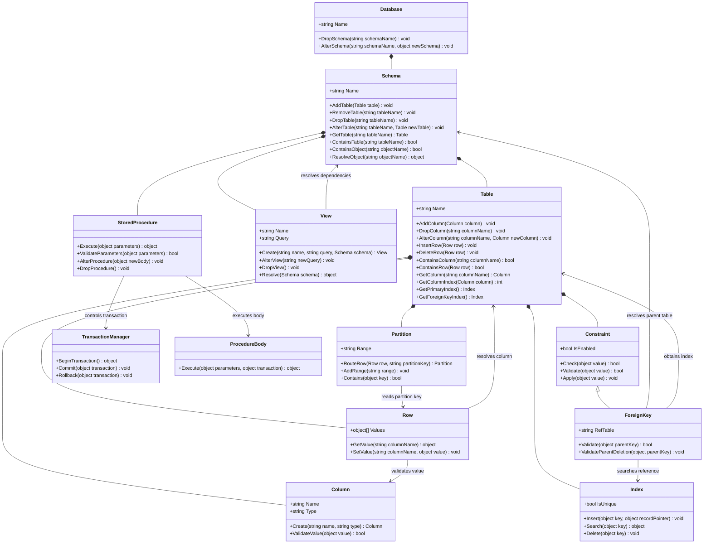
```mermaid
classDiagram
    direction TB

    class Database {
        +string Name
        +DropSchema(string schemaName) void
        +AlterSchema(string schemaName, object newSchema) void
    }

    class Schema {
        +string Name
        +AddTable(Table table) void
        +RemoveTable(string tableName) void
        +DropTable(string tableName) void
        +AlterTable(string tableName, Table newTable) void
        +GetTable(string tableName) Table
        +ContainsTable(string tableName) bool
        +ContainsObject(string objectName) bool
        +ResolveObject(string objectName) object
    }

    class Table {
        +string Name
        +AddColumn(Column column) void
        +DropColumn(string columnName) void
        +AlterColumn(string columnName, Column newColumn) void
        +InsertRow(Row row) void
        +DeleteRow(Row row) void
        +ContainsColumn(string columnName) bool
        +ContainsRow(Row row) bool
        +GetColumn(string columnName) Column
        +GetColumnIndex(Column column) int
        +GetPrimaryIndex() Index
        +GetForeignKeyIndex() Index
    }

    class Column {
        +string Name
        +string Type
        +Create(string name, string type) Column
        +ValidateValue(object value) bool
    }

    class Row {
        +object[] Values
        +GetValue(string columnName) object
        +SetValue(string columnName, object value) void
    }

    class Constraint {
        +bool IsEnabled
        +Check(object value) bool
        +Validate(object value) bool
        +Apply(object value) void
    }

    class ForeignKey {
        +string RefTable
        +Validate(object parentKey) bool
        +ValidateParentDeletion(object parentKey) void
    }

    class Index {
        +bool IsUnique
        +Insert(object key, object recordPointer) void
        +Search(object key) object
        +Delete(object key) void
    }

    class Partition {
        +string Range
        +RouteRow(Row row, string partitionKey) Partition
        +AddRange(string range) void
        +Contains(object key) bool
    }

    class View {
        +string Name
        +string Query
        +Create(string name, string query, Schema schema) View
        +AlterView(string newQuery) void
        +DropView() void
        +Resolve(Schema schema) object
    }

    class StoredProcedure {
        +Execute(object parameters) object
        +ValidateParameters(object parameters) bool
        +AlterProcedure(object newBody) void
        +DropProcedure() void
    }

    class TransactionManager {
        +BeginTransaction() object
        +Commit(object transaction) void
        +Rollback(object transaction) void
    }

    class ProcedureBody {
        +Execute(object parameters, object transaction) object
    }

    Database *-- Schema
    Schema *-- Table
    Schema *-- View
    Schema *-- StoredProcedure

    Table *-- Column
    Table *-- Row
    Table *-- Constraint
    Table *-- Index
    Table *-- Partition

    Constraint <|-- ForeignKey

    Row --> Table : resolves column
    Row --> Column : validates value

    ForeignKey --> Schema : resolves parent table
    ForeignKey --> Table : obtains index
    ForeignKey --> Index : searches reference

    Partition --> Row : reads partition key

    View --> Schema : resolves dependencies

    StoredProcedure --> TransactionManager : controls transaction
    StoredProcedure --> ProcedureBody : executes body
```
# 2. Schema Unit Tests

## 2.1 AddTable_WhenTableIsValid_ShouldRegisterTable

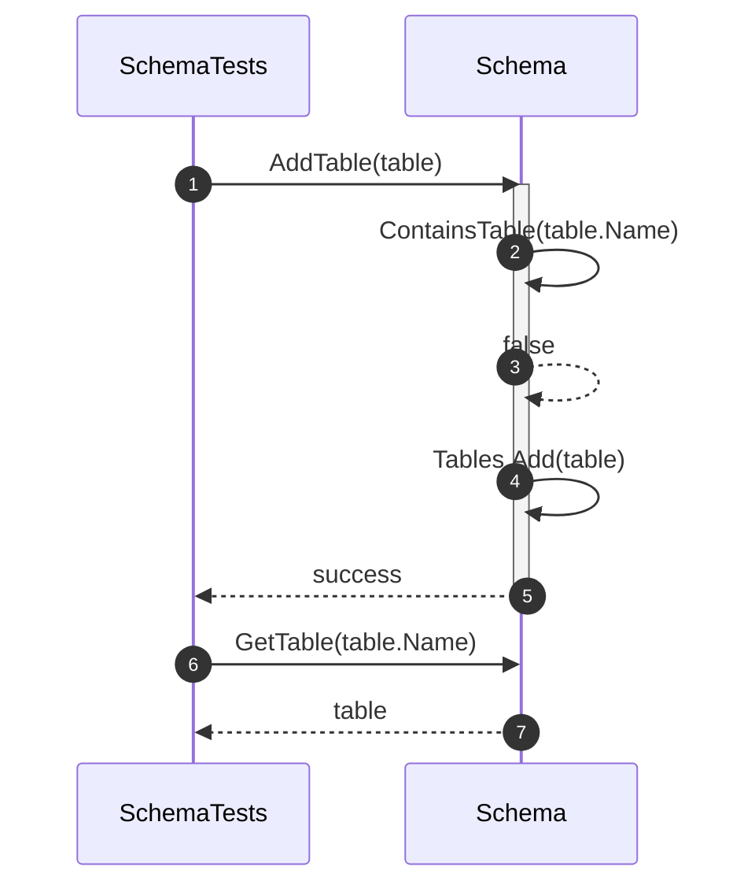
```mermaid
sequenceDiagram
    autonumber

    participant Test as SchemaTests
    participant Schema

    Test->>Schema: AddTable(table)
    activate Schema

    Schema->>Schema: ContainsTable(table.Name)
    Schema-->>Schema: false

    Schema->>Schema: Tables.Add(table)
    Schema-->>Test: success

    deactivate Schema

    Test->>Schema: GetTable(table.Name)
    Schema-->>Test: table
```

## 2.2 AddTable_WhenNameAlreadyExists_ShouldThrow

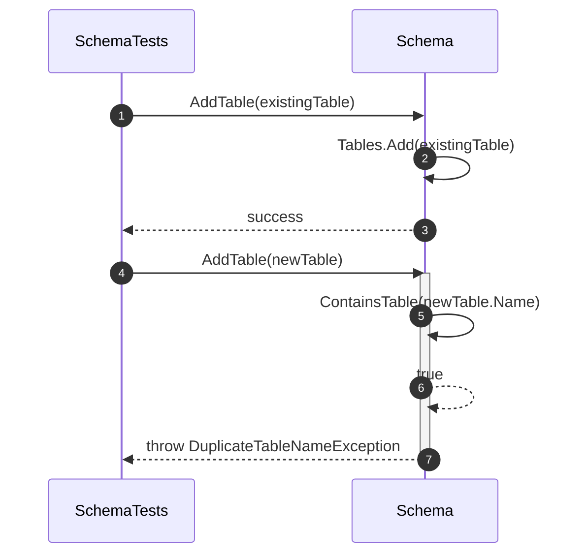
```mermaid
sequenceDiagram
    autonumber

    participant Test as SchemaTests
    participant Schema

    Test->>Schema: AddTable(existingTable)
    Schema->>Schema: Tables.Add(existingTable)
    Schema-->>Test: success

    Test->>Schema: AddTable(newTable)
    activate Schema

    Schema->>Schema: ContainsTable(newTable.Name)
    Schema-->>Schema: true

    Schema-->>Test: throw DuplicateTableNameException

    deactivate Schema
```

## 2.3 RemoveTable_WhenTableExists_ShouldRemoveTable

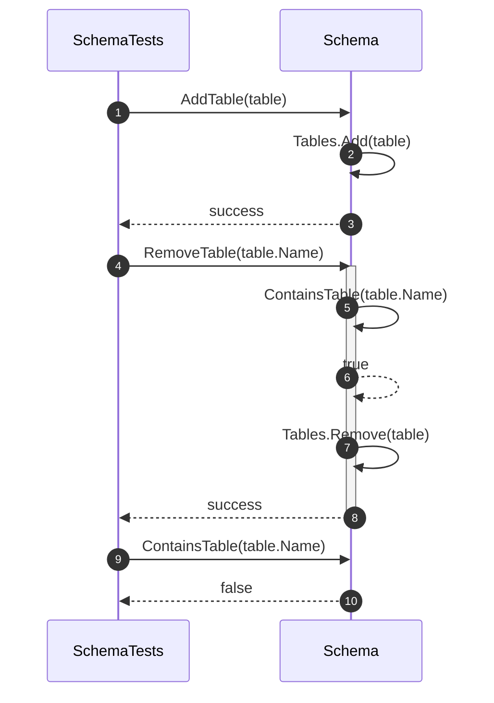
```mermaid
sequenceDiagram
    autonumber

    participant Test as SchemaTests
    participant Schema

    Test->>Schema: AddTable(table)
    Schema->>Schema: Tables.Add(table)
    Schema-->>Test: success

    Test->>Schema: RemoveTable(table.Name)
    activate Schema

    Schema->>Schema: ContainsTable(table.Name)
    Schema-->>Schema: true

    Schema->>Schema: Tables.Remove(table)
    Schema-->>Test: success

    deactivate Schema

    Test->>Schema: ContainsTable(table.Name)
    Schema-->>Test: false
```

---

# 3. Table Unit Tests

## 3.1 InsertRow_WhenRowIsValid_ShouldInsertRow

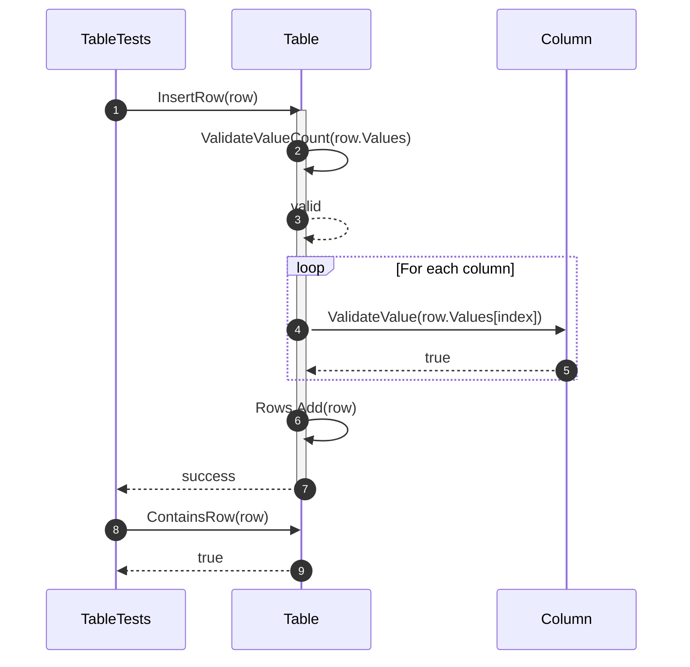
```mermaid
sequenceDiagram
    autonumber

    participant Test as TableTests
    participant Table
    participant Column

    Test->>Table: InsertRow(row)
    activate Table

    Table->>Table: ValidateValueCount(row.Values)
    Table-->>Table: valid

    loop For each column
        Table->>Column: ValidateValue(row.Values[index])
        Column-->>Table: true
    end

    Table->>Table: Rows.Add(row)
    Table-->>Test: success

    deactivate Table

    Test->>Table: ContainsRow(row)
    Table-->>Test: true
```

## 3.2 InsertRow_WhenSchemaDoesNotMatch_ShouldThrow

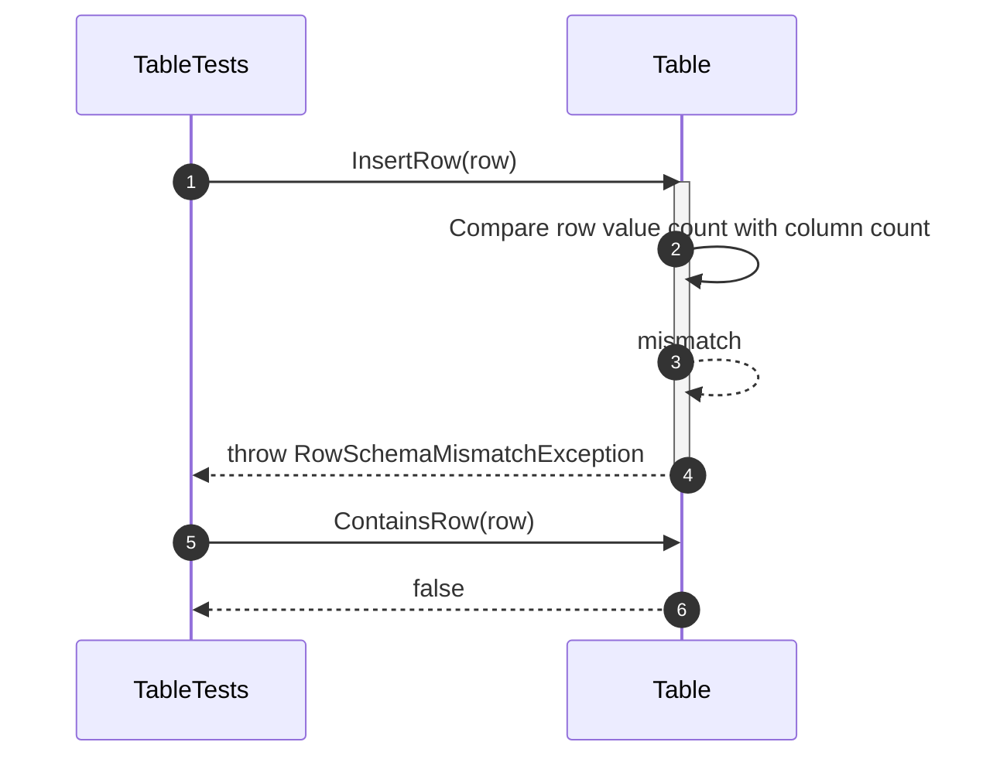
```mermaid
sequenceDiagram
    autonumber

    participant Test as TableTests
    participant Table

    Test->>Table: InsertRow(row)
    activate Table

    Table->>Table: Compare row value count with column count
    Table-->>Table: mismatch

    Table-->>Test: throw RowSchemaMismatchException

    deactivate Table

    Test->>Table: ContainsRow(row)
    Table-->>Test: false
```

## 3.3 AddColumn_WhenNameAlreadyExists_ShouldThrow

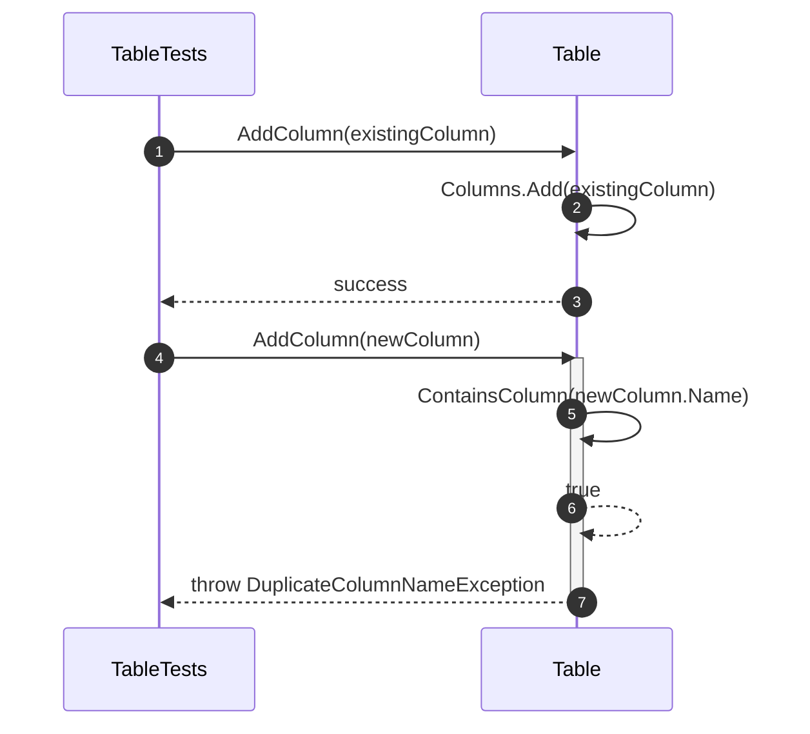
```mermaid
sequenceDiagram
    autonumber

    participant Test as TableTests
    participant Table

    Test->>Table: AddColumn(existingColumn)
    Table->>Table: Columns.Add(existingColumn)
    Table-->>Test: success

    Test->>Table: AddColumn(newColumn)
    activate Table

    Table->>Table: ContainsColumn(newColumn.Name)
    Table-->>Table: true

    Table-->>Test: throw DuplicateColumnNameException

    deactivate Table
```

---

# 4. Column Unit Tests

## 4.1 Create_WhenDefinitionIsValid_ShouldCreateColumn

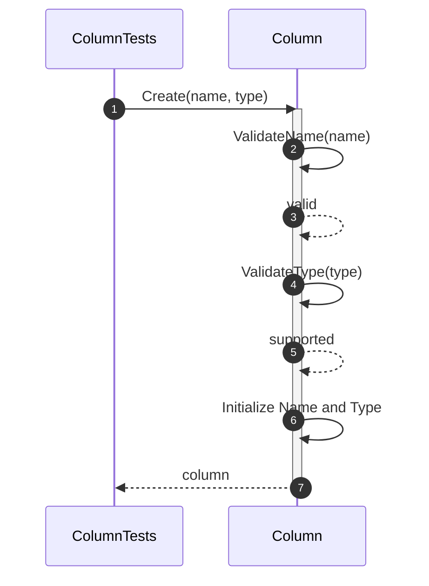
```mermaid
sequenceDiagram
    autonumber

    participant Test as ColumnTests
    participant Column

    Test->>Column: Create(name, type)
    activate Column

    Column->>Column: ValidateName(name)
    Column-->>Column: valid

    Column->>Column: ValidateType(type)
    Column-->>Column: supported

    Column->>Column: Initialize Name and Type
    Column-->>Test: column

    deactivate Column
```

## 4.2 Create_WhenNameIsInvalid_ShouldThrow

```mermaid
sequenceDiagram
    autonumber

    participant Test as ColumnTests
    participant Column

    Test->>Column: Create(invalidName, type)
    activate Column

    Column->>Column: ValidateName(invalidName)
    Column-->>Column: invalid

    Column-->>Test: throw InvalidColumnNameException

    deactivate Column
```

## 4.3 ValidateValue_WhenTypeDoesNotMatch_ShouldReturnFalse

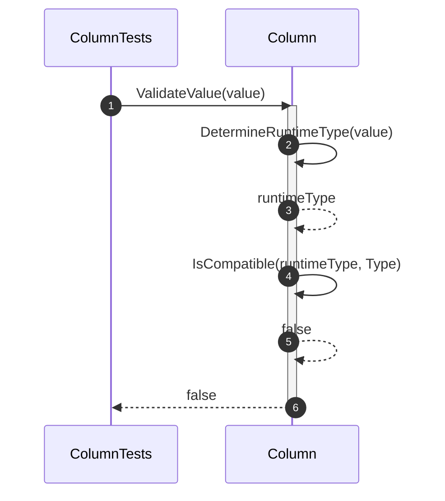
```mermaid
sequenceDiagram
    autonumber

    participant Test as ColumnTests
    participant Column

    Test->>Column: ValidateValue(value)
    activate Column

    Column->>Column: DetermineRuntimeType(value)
    Column-->>Column: runtimeType

    Column->>Column: IsCompatible(runtimeType, Type)
    Column-->>Column: false

    Column-->>Test: false

    deactivate Column
```

---

# 5. Row Unit Tests

## 5.1 GetValue_WhenColumnExists_ShouldReturnValue

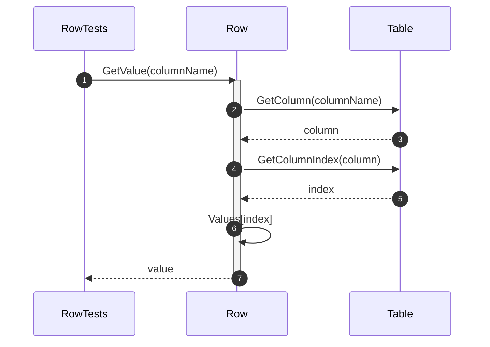
```mermaid
sequenceDiagram
    autonumber

    participant Test as RowTests
    participant Row
    participant Table

    Test->>Row: GetValue(columnName)
    activate Row

    Row->>Table: GetColumn(columnName)
    Table-->>Row: column

    Row->>Table: GetColumnIndex(column)
    Table-->>Row: index

    Row->>Row: Values[index]
    Row-->>Test: value

    deactivate Row
```

## 5.2 SetValue_WhenValueIsValid_ShouldUpdateValue

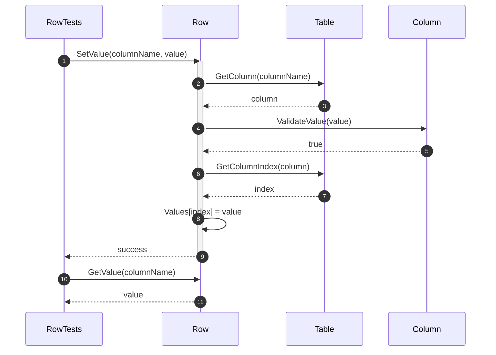
```mermaid
sequenceDiagram
    autonumber

    participant Test as RowTests
    participant Row
    participant Table
    participant Column

    Test->>Row: SetValue(columnName, value)
    activate Row

    Row->>Table: GetColumn(columnName)
    Table-->>Row: column

    Row->>Column: ValidateValue(value)
    Column-->>Row: true

    Row->>Table: GetColumnIndex(column)
    Table-->>Row: index

    Row->>Row: Values[index] = value
    Row-->>Test: success

    deactivate Row

    Test->>Row: GetValue(columnName)
    Row-->>Test: value
```

## 5.3 SetValue_WhenTypeDoesNotMatch_ShouldThrow

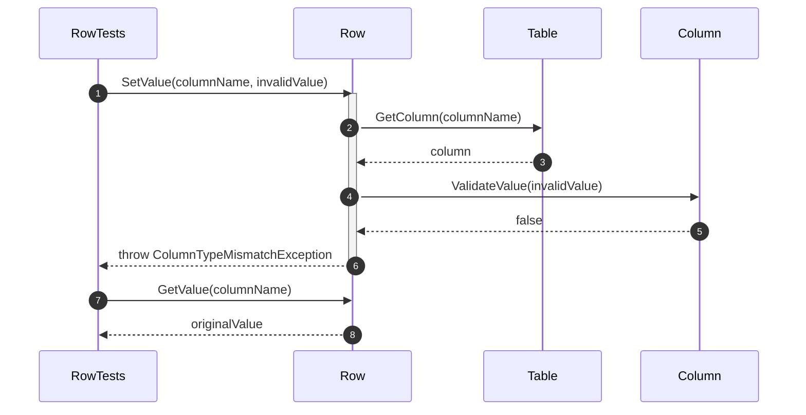
```mermaid
sequenceDiagram
    autonumber

    participant Test as RowTests
    participant Row
    participant Table
    participant Column

    Test->>Row: SetValue(columnName, invalidValue)
    activate Row

    Row->>Table: GetColumn(columnName)
    Table-->>Row: column

    Row->>Column: ValidateValue(invalidValue)
    Column-->>Row: false

    Row-->>Test: throw ColumnTypeMismatchException

    deactivate Row

    Test->>Row: GetValue(columnName)
    Row-->>Test: originalValue
```

---

# 6. Constraint Unit Tests

## 6.1 Validate_WhenValueSatisfiesConstraint_ShouldSucceed

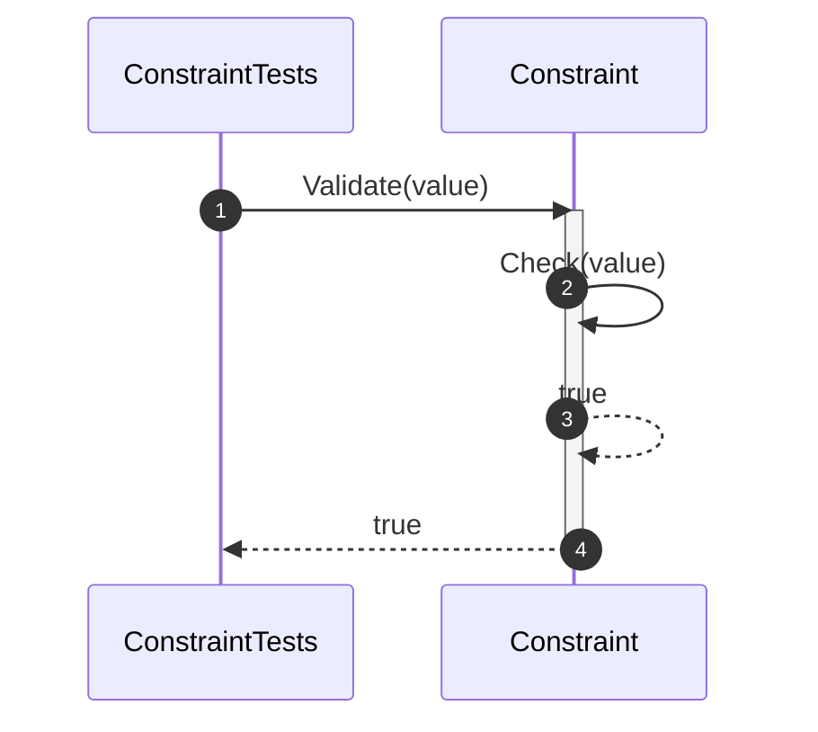
```mermaid
sequenceDiagram
    autonumber

    participant Test as ConstraintTests
    participant Constraint

    Test->>Constraint: Validate(value)
    activate Constraint

    Constraint->>Constraint: Check(value)
    Constraint-->>Constraint: true

    Constraint-->>Test: true

    deactivate Constraint
```

## 6.2 Validate_WhenValueViolatesConstraint_ShouldFail

```mermaid
sequenceDiagram
    autonumber

    participant Test as ConstraintTests
    participant Constraint

    Test->>Constraint: Validate(value)
    activate Constraint

    Constraint->>Constraint: Check(value)
    Constraint-->>Constraint: false

    Constraint-->>Test: false

    deactivate Constraint
```

## 6.3 Apply_WhenConstraintIsDisabled_ShouldSkipValidation

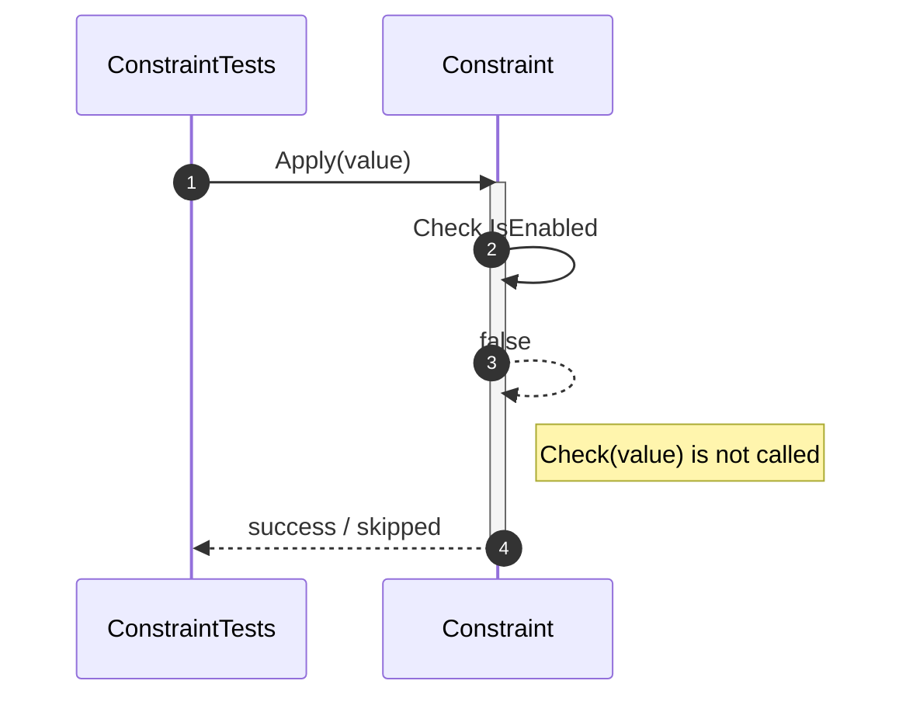
```mermaid
sequenceDiagram
    autonumber

    participant Test as ConstraintTests
    participant Constraint

    Test->>Constraint: Apply(value)
    activate Constraint

    Constraint->>Constraint: Check IsEnabled
    Constraint-->>Constraint: false

    Note right of Constraint: Check(value) is not called

    Constraint-->>Test: success / skipped

    deactivate Constraint
```

---

# 7. Foreign Key Unit Tests

## 7.1 Validate_WhenParentRecordExists_ShouldSucceed

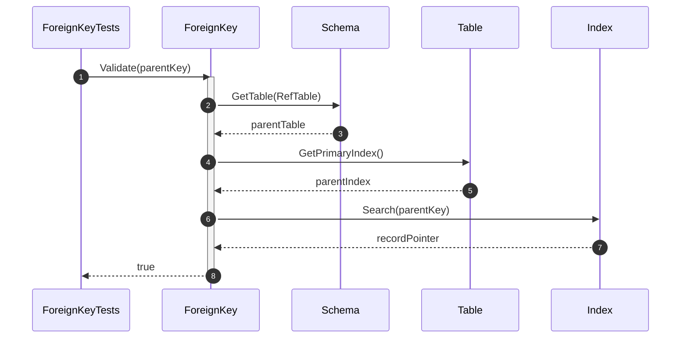
```mermaid
sequenceDiagram
    autonumber

    participant Test as ForeignKeyTests
    participant ForeignKey
    participant Schema
    participant ParentTable as Table
    participant ParentIndex as Index

    Test->>ForeignKey: Validate(parentKey)
    activate ForeignKey

    ForeignKey->>Schema: GetTable(RefTable)
    Schema-->>ForeignKey: parentTable

    ForeignKey->>ParentTable: GetPrimaryIndex()
    ParentTable-->>ForeignKey: parentIndex

    ForeignKey->>ParentIndex: Search(parentKey)
    ParentIndex-->>ForeignKey: recordPointer

    ForeignKey-->>Test: true

    deactivate ForeignKey
```

## 7.2 Validate_WhenParentRecordDoesNotExist_ShouldFail

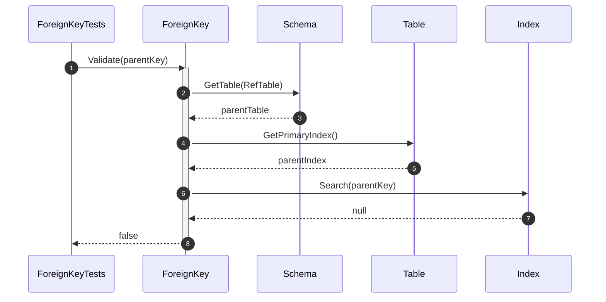
```mermaid
sequenceDiagram
    autonumber

    participant Test as ForeignKeyTests
    participant ForeignKey
    participant Schema
    participant ParentTable as Table
    participant ParentIndex as Index

    Test->>ForeignKey: Validate(parentKey)
    activate ForeignKey

    ForeignKey->>Schema: GetTable(RefTable)
    Schema-->>ForeignKey: parentTable

    ForeignKey->>ParentTable: GetPrimaryIndex()
    ParentTable-->>ForeignKey: parentIndex

    ForeignKey->>ParentIndex: Search(parentKey)
    ParentIndex-->>ForeignKey: null

    ForeignKey-->>Test: false

    deactivate ForeignKey
```

## 7.3 DeleteParent_WhenRestricted_ShouldRejectDeletion

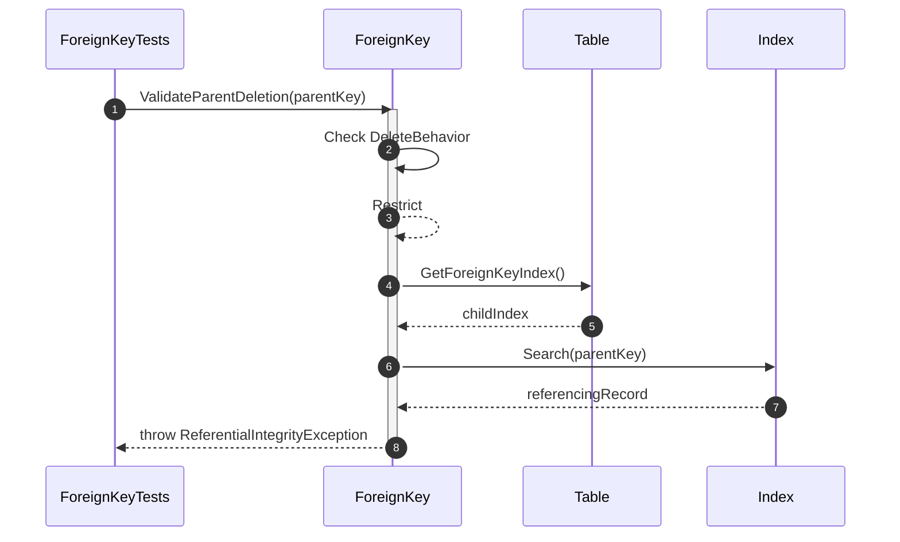
```mermaid
sequenceDiagram
    autonumber

    participant Test as ForeignKeyTests
    participant ForeignKey
    participant ChildTable as Table
    participant ChildIndex as Index

    Test->>ForeignKey: ValidateParentDeletion(parentKey)
    activate ForeignKey

    ForeignKey->>ForeignKey: Check DeleteBehavior
    ForeignKey-->>ForeignKey: Restrict

    ForeignKey->>ChildTable: GetForeignKeyIndex()
    ChildTable-->>ForeignKey: childIndex

    ForeignKey->>ChildIndex: Search(parentKey)
    ChildIndex-->>ForeignKey: referencingRecord

    ForeignKey-->>Test: throw ReferentialIntegrityException

    deactivate ForeignKey
```

---

# 8. Index Unit Tests

## 8.1 Insert_WhenKeyIsValid_ShouldAddEntry

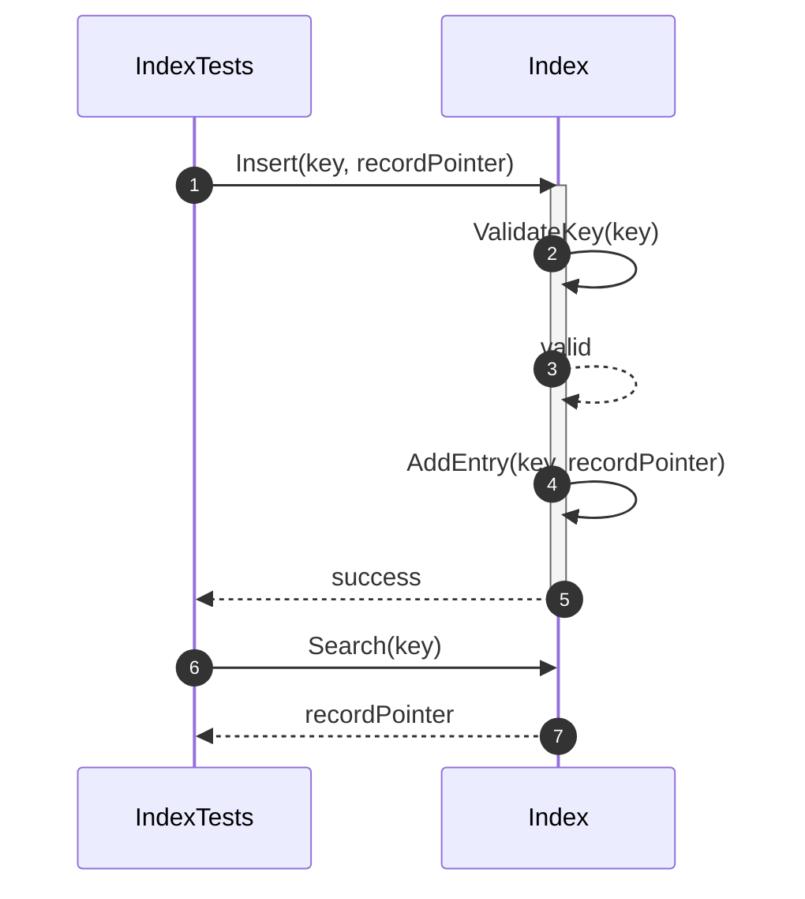
```mermaid
sequenceDiagram
    autonumber

    participant Test as IndexTests
    participant Index

    Test->>Index: Insert(key, recordPointer)
    activate Index

    Index->>Index: ValidateKey(key)
    Index-->>Index: valid

    Index->>Index: AddEntry(key, recordPointer)
    Index-->>Test: success

    deactivate Index

    Test->>Index: Search(key)
    Index-->>Test: recordPointer
```

## 8.2 Search_WhenKeyExists_ShouldReturnRecordPointer

```mermaid
sequenceDiagram
    autonumber

    participant Test as IndexTests
    participant Index

    Test->>Index: Search(key)
    activate Index

    Index->>Index: LocateEntry(key)
    Index-->>Index: entry

    Index->>Index: GetRecordPointer(entry)
    Index-->>Test: recordPointer

    deactivate Index
```

## 8.3 Insert_WhenUniqueKeyAlreadyExists_ShouldThrow

```mermaid
sequenceDiagram
    autonumber

    participant Test as IndexTests
    participant Index

    Test->>Index: Insert(key, firstRecordPointer)
    Index->>Index: AddEntry(key, firstRecordPointer)
    Index-->>Test: success

    Test->>Index: Insert(key, secondRecordPointer)
    activate Index

    Index->>Index: Check IsUnique
    Index-->>Index: true

    Index->>Index: LocateEntry(key)
    Index-->>Index: existingEntry

    Index-->>Test: throw DuplicateKeyException

    deactivate Index
```

---

# 9. Partition Unit Tests

## 9.1 RouteRow_WhenKeyMatchesRange_ShouldReturnPartition

```mermaid
sequenceDiagram
    autonumber

    participant Test as PartitionTests
    participant Partition
    participant Row

    Test->>Partition: RouteRow(row, partitionKey)
    activate Partition

    Partition->>Row: GetValue(partitionKey)
    Row-->>Partition: keyValue

    Partition->>Partition: Contains(keyValue)
    Partition-->>Partition: true

    Partition-->>Test: partition

    deactivate Partition
```

## 9.2 RouteRow_WhenKeyIsOutsideRange_ShouldFail

```mermaid
sequenceDiagram
    autonumber

    participant Test as PartitionTests
    participant Partition
    participant Row

    Test->>Partition: RouteRow(row, partitionKey)
    activate Partition

    Partition->>Row: GetValue(partitionKey)
    Row-->>Partition: keyValue

    Partition->>Partition: Contains(keyValue)
    Partition-->>Partition: false

    Partition-->>Test: throw PartitionRouteNotFoundException

    deactivate Partition
```

## 9.3 AddRange_WhenRangesOverlap_ShouldThrow

```mermaid
sequenceDiagram
    autonumber

    participant Test as PartitionTests
    participant Partition

    Test->>Partition: AddRange(existingRange)
    Partition->>Partition: Ranges.Add(existingRange)
    Partition-->>Test: success

    Test->>Partition: AddRange(newRange)
    activate Partition

    loop For each existing range
        Partition->>Partition: Overlaps(existingRange, newRange)
        Partition-->>Partition: true
    end

    Partition-->>Test: throw OverlappingPartitionRangeException

    deactivate Partition
```

---

# 10. View Unit Tests

## 10.1 Create_WhenQueryIsValid_ShouldCreateView

```mermaid
sequenceDiagram
    autonumber

    participant Test as ViewTests
    participant View
    participant Schema

    Test->>View: Create(name, query, schema)
    activate View

    View->>View: ValidateQuerySyntax(query)
    View-->>View: valid

    View->>View: ExtractDependencies(query)
    View-->>View: dependencies

    loop For each dependency
        View->>Schema: ContainsObject(dependency)
        Schema-->>View: true
    end

    View->>View: Initialize Name and Query
    View-->>Test: view

    deactivate View
```

## 10.2 Resolve_WhenDependenciesExist_ShouldReturnDefinition

```mermaid
sequenceDiagram
    autonumber

    participant Test as ViewTests
    participant View
    participant Schema

    Test->>View: Resolve(schema)
    activate View

    View->>View: ExtractDependencies(Query)
    View-->>View: dependencies

    loop For each dependency
        View->>Schema: ResolveObject(dependency)
        Schema-->>View: objectDefinition
    end

    View->>View: BuildResolvedDefinition()
    View-->>Test: resolvedDefinition

    deactivate View
```

## 10.3 Resolve_WhenDependencyIsMissing_ShouldThrow

```mermaid
sequenceDiagram
    autonumber

    participant Test as ViewTests
    participant View
    participant Schema

    Test->>View: Resolve(schema)
    activate View

    View->>View: ExtractDependencies(Query)
    View-->>View: dependencies

    View->>Schema: ResolveObject(missingDependency)
    Schema-->>View: null

    View-->>Test: throw ViewDependencyNotFoundException

    deactivate View
```

---

# 11. Stored Procedure Unit Tests

## 11.1 Execute_WhenParametersAreValid_ShouldReturnResult

```mermaid
sequenceDiagram
    autonumber

    participant Test as StoredProcedureTests
    participant Procedure as StoredProcedure
    participant TransactionManager
    participant ProcedureBody

    Test->>Procedure: Execute(parameters)
    activate Procedure

    Procedure->>Procedure: ValidateParameters(parameters)
    Procedure-->>Procedure: valid

    Procedure->>TransactionManager: BeginTransaction()
    TransactionManager-->>Procedure: transaction

    Procedure->>ProcedureBody: Execute(parameters, transaction)
    activate ProcedureBody
    ProcedureBody-->>Procedure: result
    deactivate ProcedureBody

    Procedure->>TransactionManager: Commit(transaction)
    TransactionManager-->>Procedure: success

    Procedure-->>Test: result

    deactivate Procedure
```

## 11.2 Execute_WhenRequiredParameterIsMissing_ShouldThrow

```mermaid
sequenceDiagram
    autonumber

    participant Test as StoredProcedureTests
    participant Procedure as StoredProcedure

    Test->>Procedure: Execute(parameters)
    activate Procedure

    Procedure->>Procedure: ValidateParameters(parameters)
    Procedure-->>Procedure: required parameter missing

    Note right of Procedure: No transaction is started

    Procedure-->>Test: throw MissingProcedureParameterException

    deactivate Procedure
```

## 11.3 Execute_WhenTransactionFails_ShouldPropagateFailure

```mermaid
sequenceDiagram
    autonumber

    participant Test as StoredProcedureTests
    participant Procedure as StoredProcedure
    participant TransactionManager
    participant ProcedureBody

    Test->>Procedure: Execute(parameters)
    activate Procedure

    Procedure->>Procedure: ValidateParameters(parameters)
    Procedure-->>Procedure: valid

    Procedure->>TransactionManager: BeginTransaction()
    TransactionManager-->>Procedure: transaction

    Procedure->>ProcedureBody: Execute(parameters, transaction)
    activate ProcedureBody
    ProcedureBody-->>Procedure: throw TransactionExecutionException
    deactivate ProcedureBody

    Procedure->>TransactionManager: Rollback(transaction)
    TransactionManager-->>Procedure: rollback completed

    Procedure-->>Test: propagate TransactionExecutionException

    deactivate Procedure
```

---

# 12. Database Unit Tests

## 12.1 DropSchema_WhenSchemaExists_ShouldRemoveSchema

```mermaid
sequenceDiagram
    autonumber

    participant Test as DatabaseTests
    participant Database

    Test->>Database: DropSchema(schemaName)
    activate Database

    Database->>Database: RemoveSchemaMetadata(schemaName)
    Database-->>Test: success

    deactivate Database
```

## 12.2 AlterSchema_WhenSchemaExists_ShouldUpdateSchema

```mermaid
sequenceDiagram
    autonumber

    participant Test as DatabaseTests
    participant Database

    Test->>Database: AlterSchema(schemaName, newSchema)
    activate Database

    Database->>Database: ValidateSchemaModifications(newSchema)
    Database->>Database: ApplySchemaChanges(newSchema)
    Database-->>Test: success

    deactivate Database
```

---

# 13. Drop and Alter Unit Tests (Objects)

## 13.1 DropTable_WhenTableExists_ShouldRemoveTable

```mermaid
sequenceDiagram
    autonumber

    participant Test as SchemaTests
    participant Schema

    Test->>Schema: DropTable(tableName)
    activate Schema

    Schema->>Schema: RemoveTable(tableName)
    Schema-->>Test: success

    deactivate Schema
```

## 13.2 AlterTable_WhenTableExists_ShouldUpdateTable

```mermaid
sequenceDiagram
    autonumber

    participant Test as SchemaTests
    participant Schema

    Test->>Schema: AlterTable(tableName, newTable)
    activate Schema

    Schema->>Schema: ValidateTableModifications(newTable)
    Schema->>Schema: ApplyTableChanges(newTable)
    Schema-->>Test: success

    deactivate Schema
```

## 13.3 DeleteRow_WhenRowExists_ShouldRemoveRow

```mermaid
sequenceDiagram
    autonumber

    participant Test as TableTests
    participant Table

    Test->>Table: DeleteRow(row)
    activate Table

    Table->>Table: ContainsRow(row)
    Table->>Table: RemoveRowData(row)
    Table-->>Test: success

    deactivate Table
```

## 13.4 DropColumn_WhenColumnExists_ShouldRemoveColumn

```mermaid
sequenceDiagram
    autonumber

    participant Test as TableTests
    participant Table

    Test->>Table: DropColumn(columnName)
    activate Table

    Table->>Table: ContainsColumn(columnName)
    Table->>Table: RemoveColumnMetadata(columnName)
    Table-->>Test: success

    deactivate Table
```

## 13.5 AlterColumn_WhenColumnExists_ShouldUpdateDefinition

```mermaid
sequenceDiagram
    autonumber

    participant Test as TableTests
    participant Table

    Test->>Table: AlterColumn(columnName, newColumn)
    activate Table

    Table->>Table: ContainsColumn(columnName)
    Table->>Table: ValidateColumnTypeChanges(newColumn)
    Table->>Table: ApplyColumnChanges(newColumn)
    Table-->>Test: success

    deactivate Table
```

## 13.6 Index_Delete_WhenKeyExists_ShouldRemoveEntry

```mermaid
sequenceDiagram
    autonumber

    participant Test as IndexTests
    participant Index

    Test->>Index: Delete(key)
    activate Index

    Index->>Index: Search(key)
    Index->>Index: RemoveEntry(key)
    Index-->>Test: success

    deactivate Index
```

## 13.7 AlterView_WhenQueryIsValid_ShouldUpdateDefinition

```mermaid
sequenceDiagram
    autonumber

    participant Test as ViewTests
    participant View

    Test->>View: AlterView(newQuery)
    activate View

    View->>View: ValidateQuerySyntax(newQuery)
    View->>View: ExtractDependencies(newQuery)
    View->>View: UpdateQuery(newQuery)
    View-->>Test: success

    deactivate View
```

## 13.8 DropView_WhenViewExists_ShouldRemoveView

```mermaid
sequenceDiagram
    autonumber

    participant Test as ViewTests
    participant View

    Test->>View: DropView()
    activate View

    View->>View: CleanupDependencies()
    View-->>Test: success

    deactivate View
```

## 13.9 AlterProcedure_WhenBodyIsValid_ShouldUpdateProcedure

```mermaid
sequenceDiagram
    autonumber

    participant Test as StoredProcedureTests
    participant Procedure as StoredProcedure

    Test->>Procedure: AlterProcedure(newBody)
    activate Procedure

    Procedure->>Procedure: ValidateProcedureBody(newBody)
    Procedure->>Procedure: UpdateProcedureBody(newBody)
    Procedure-->>Test: success

    deactivate Procedure
```

## 13.10 DropProcedure_WhenProcedureExists_ShouldRemoveProcedure

```mermaid
sequenceDiagram
    autonumber

    participant Test as StoredProcedureTests
    participant Procedure as StoredProcedure

    Test->>Procedure: DropProcedure()
    activate Procedure

    Procedure->>Procedure: CleanupProcedureContext()
    Procedure-->>Test: success

    deactivate Procedure
```