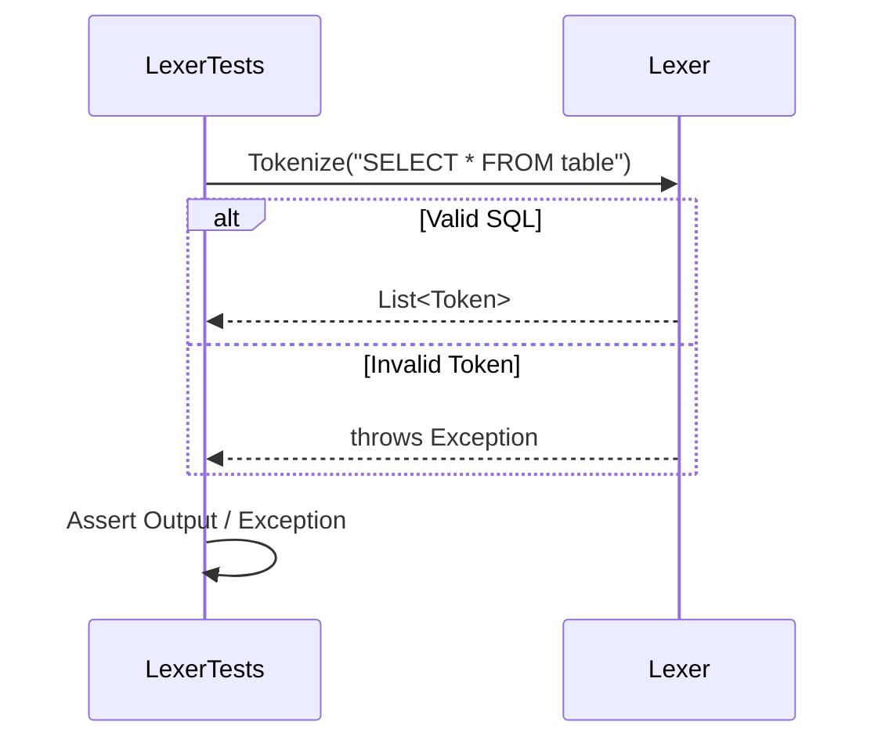
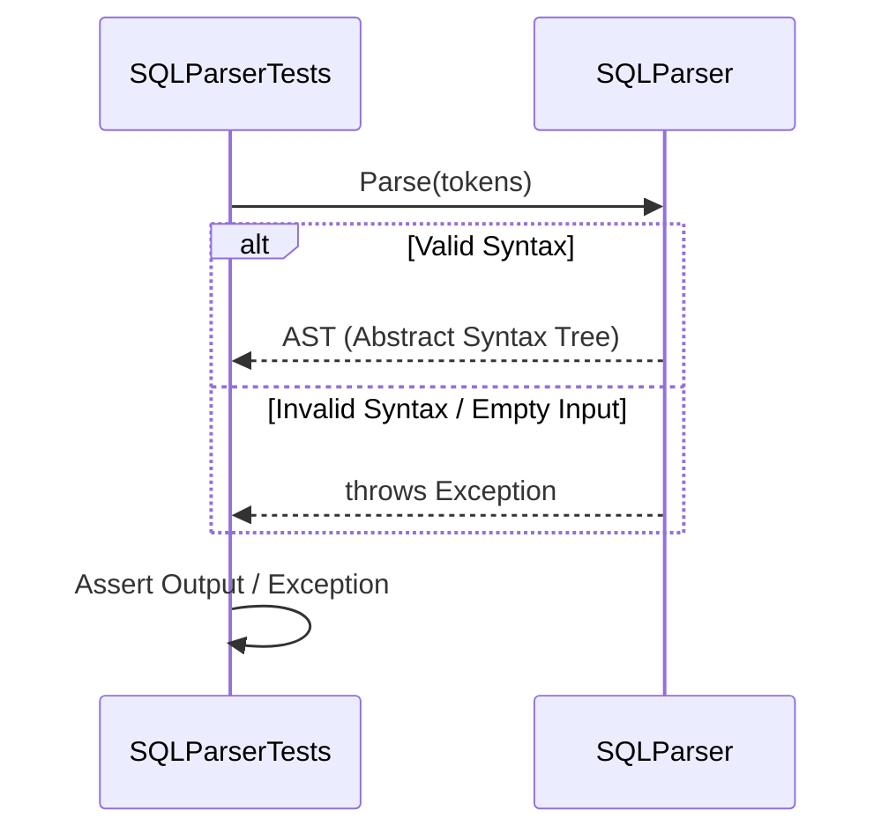
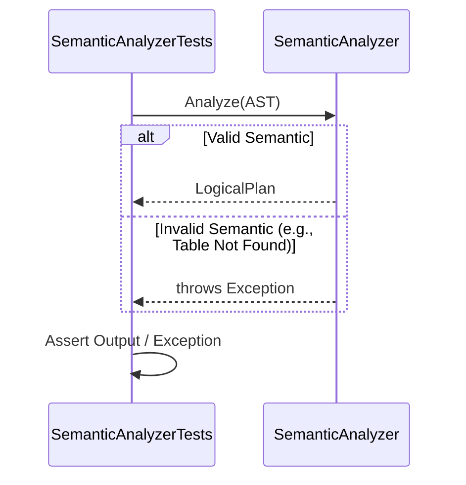
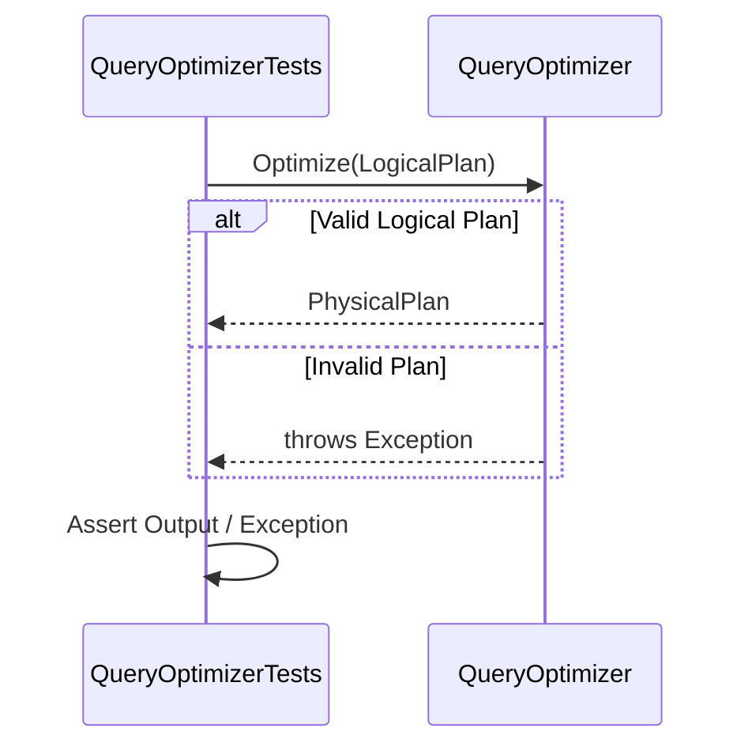
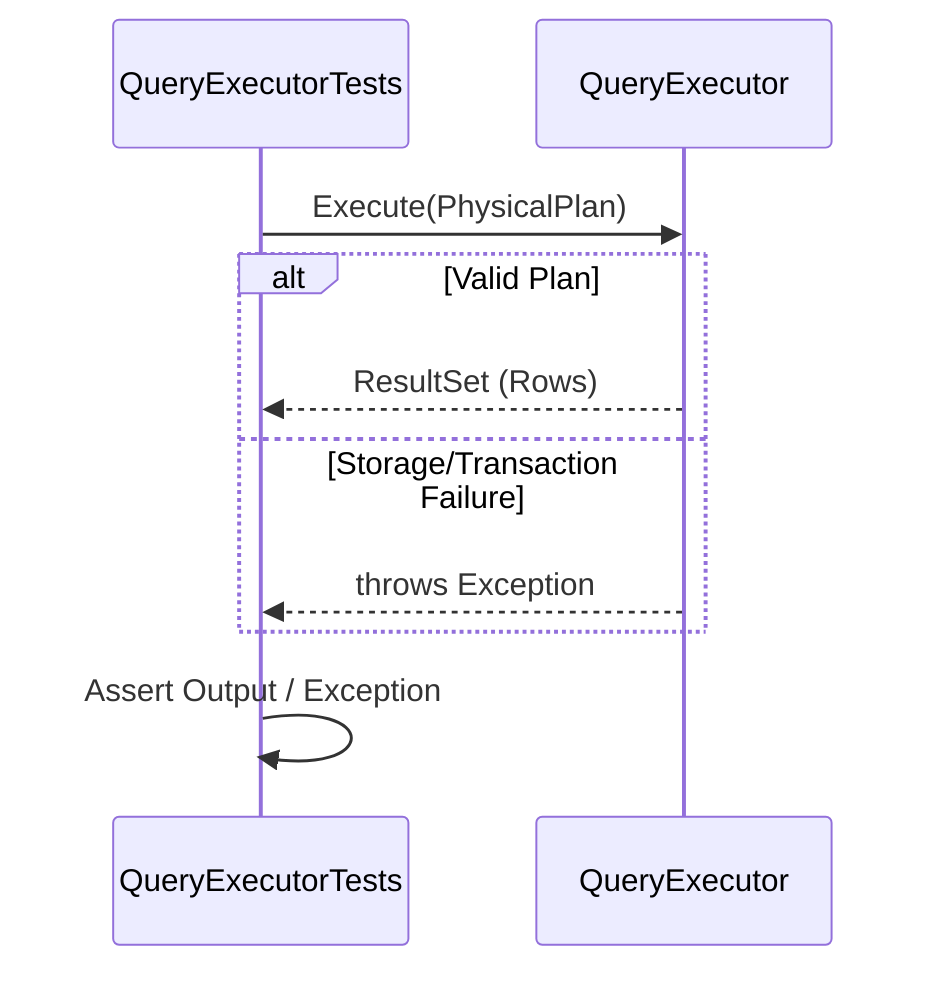
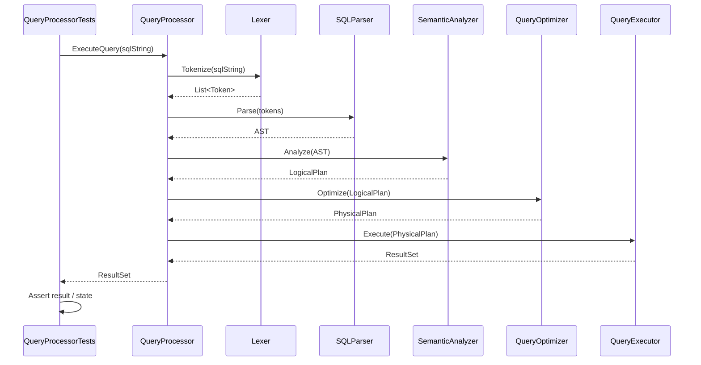

# Query Processor Sequence Diagrams

This document contains the sequence diagrams for the Query Processor components and their associated unit tests.

## 1. Lexer

## 2. Parser

## 3. Semantic Analyzer

## 4. Optimizer

## 5. Executor

## 6. Main Query Execution Flow

This demonstrates the end-to-end orchestration by the `QueryProcessor` Facade during integration testing or execution.

