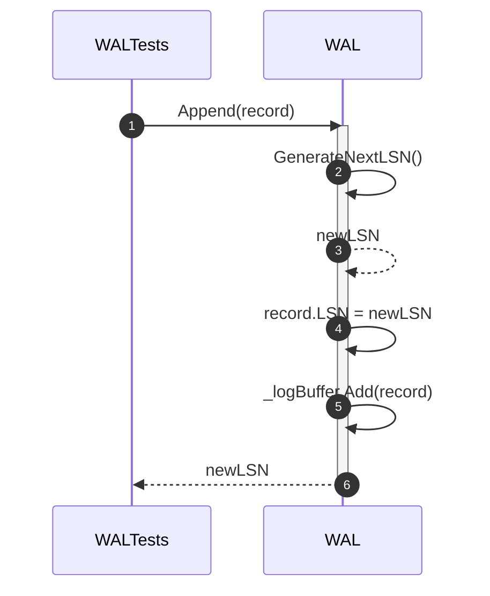
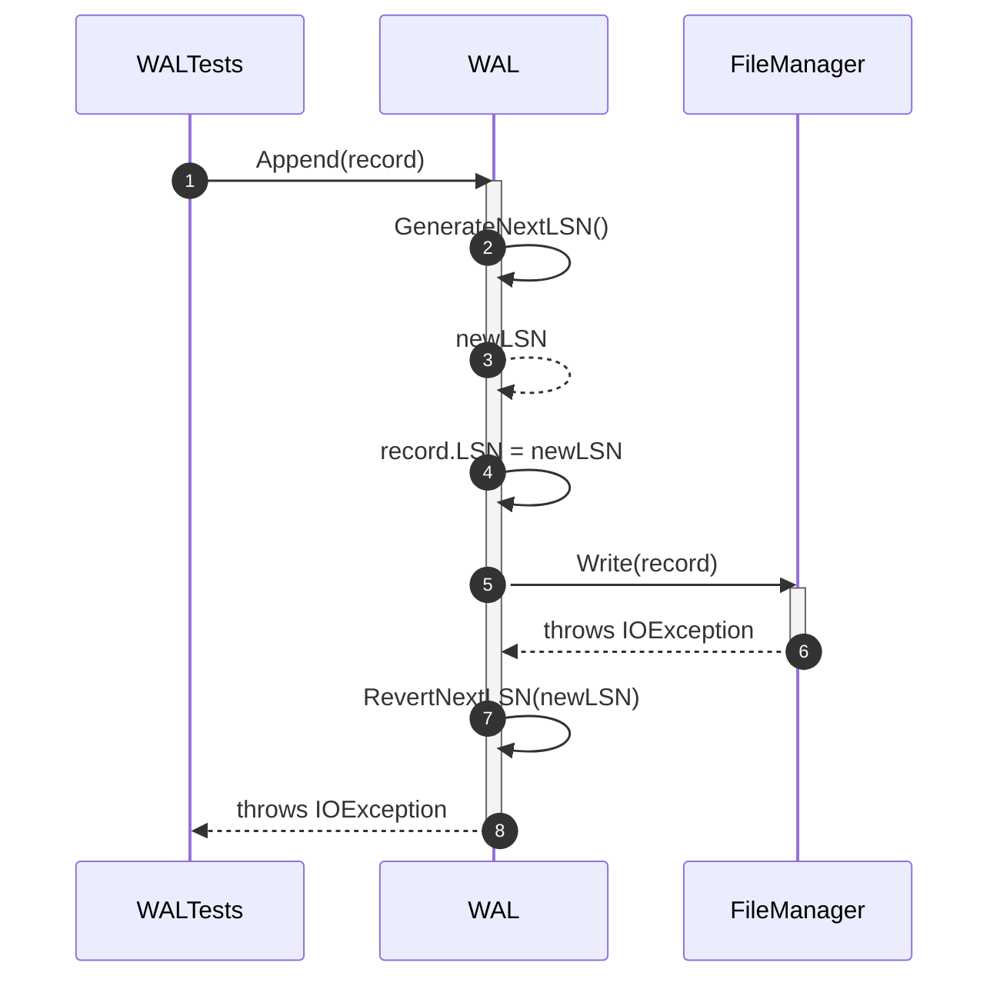
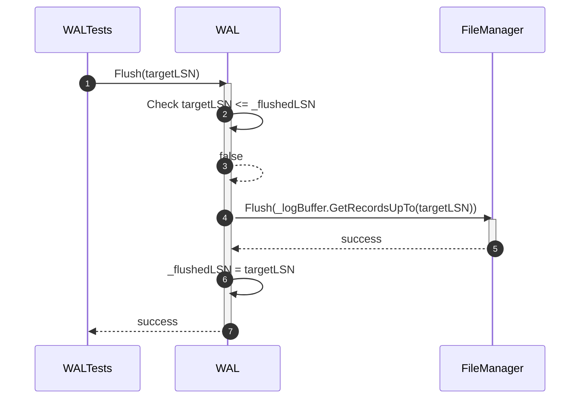
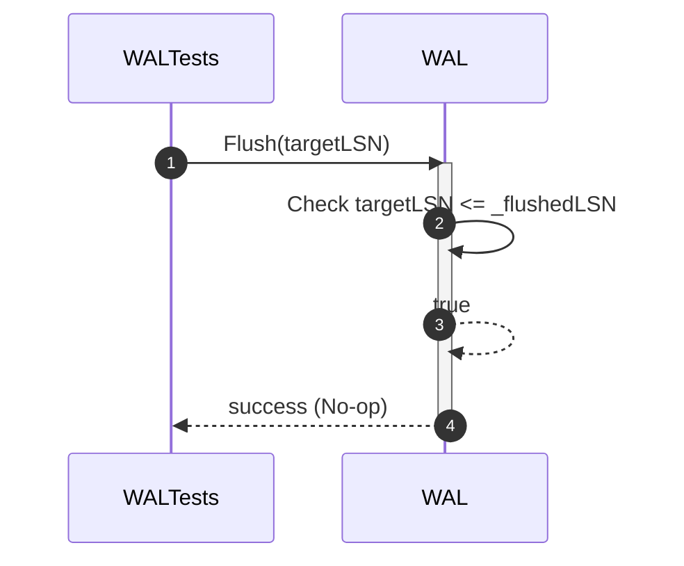
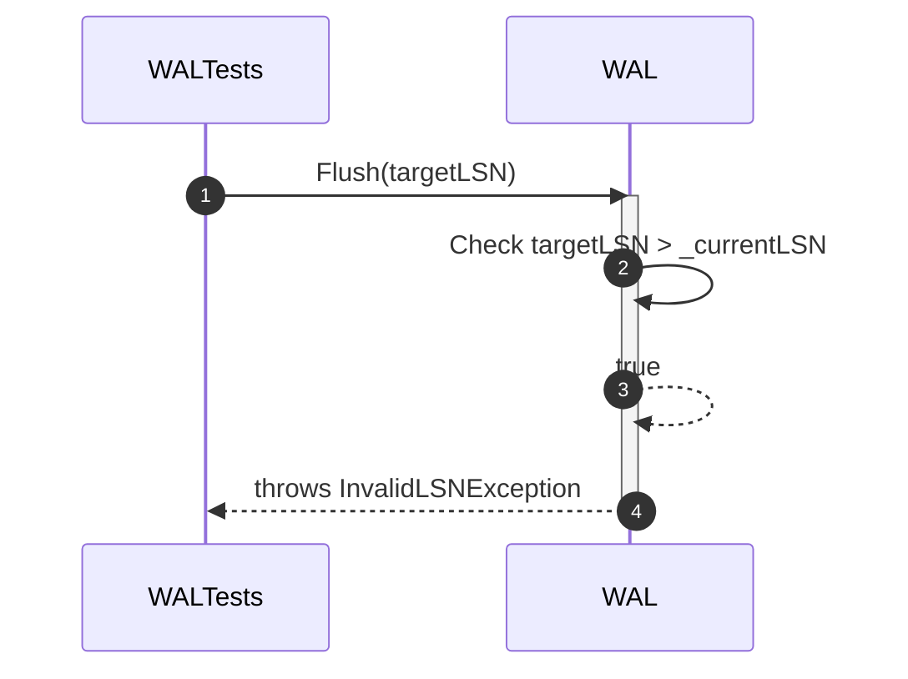
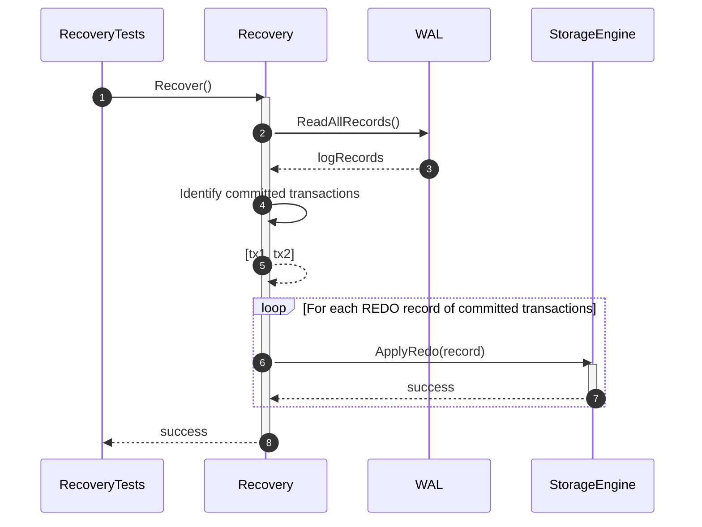
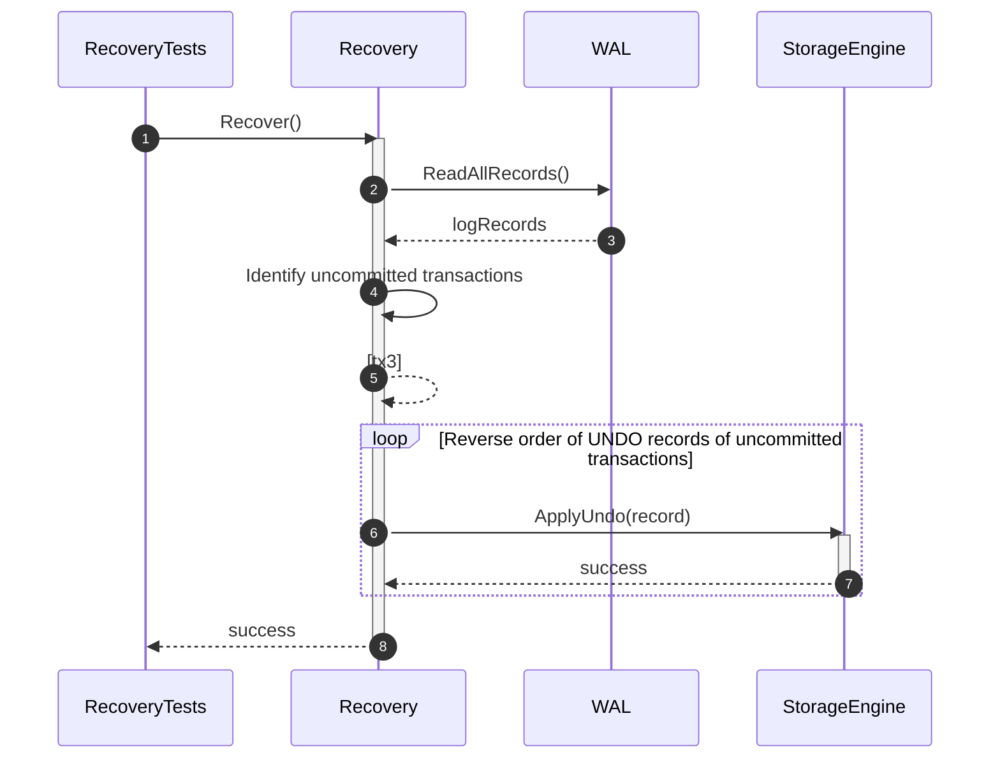
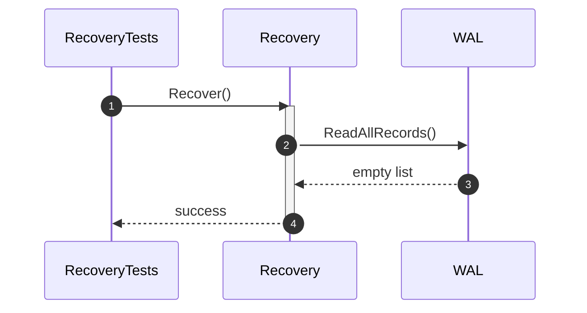
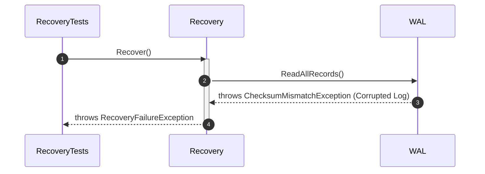
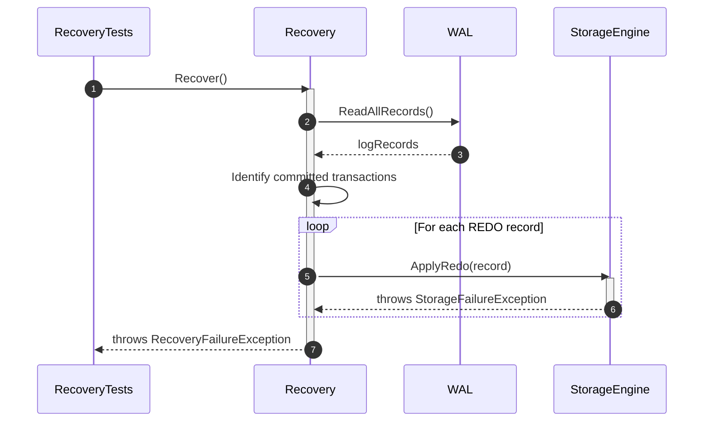

# Recovery & WAL Unit Test Sequence Diagrams

## 1. WAL Tests

### 1.1 Append_WhenRecordIsValid_ShouldAssignLSN

### 1.2 Append_WhenWriteFails_ShouldNotAdvanceDurableLSN

### 1.3 Flush_WhenTargetLSNExists_ShouldPersistRecords

### 1.4 Flush_WhenTargetLSNIsAlreadyDurable_ShouldDoNothing

### 1.5 Flush_WhenTargetLSNDoesNotExist_ShouldThrow

## 2. Recovery Tests

### 2.1 Recover_ShouldRedoCommittedTransactions

### 2.2 Recover_ShouldUndoUncommittedTransactions

### 2.3 Recover_WhenLogIsEmpty_ShouldCompleteSuccessfully

### 2.4 Recover_WhenLogRecordIsCorrupted_ShouldFailSafely

### 2.5 Recover_WhenRedoFails_ShouldNotReportSuccessfulRecovery

