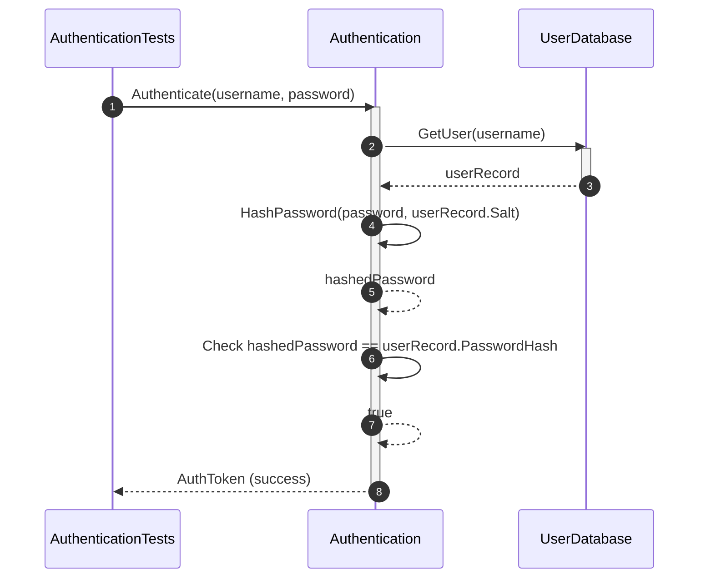
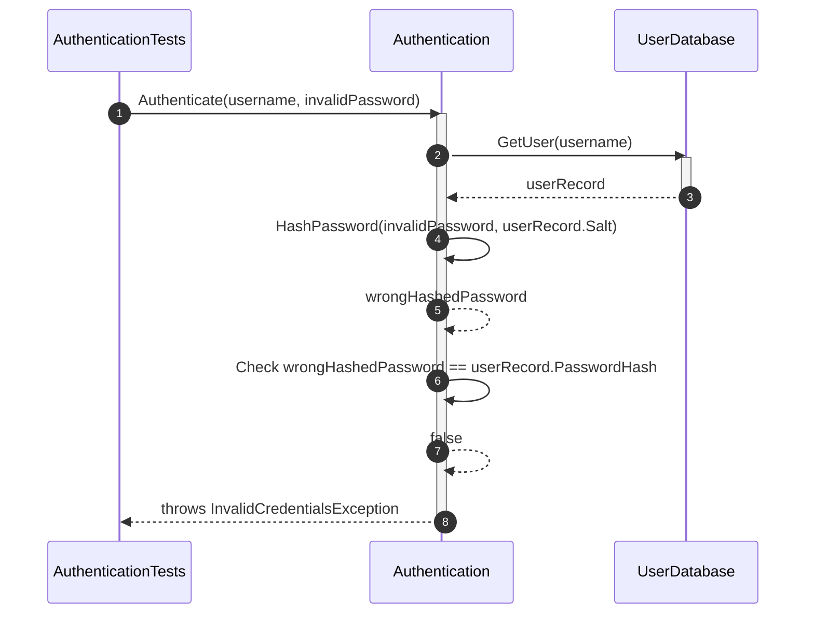
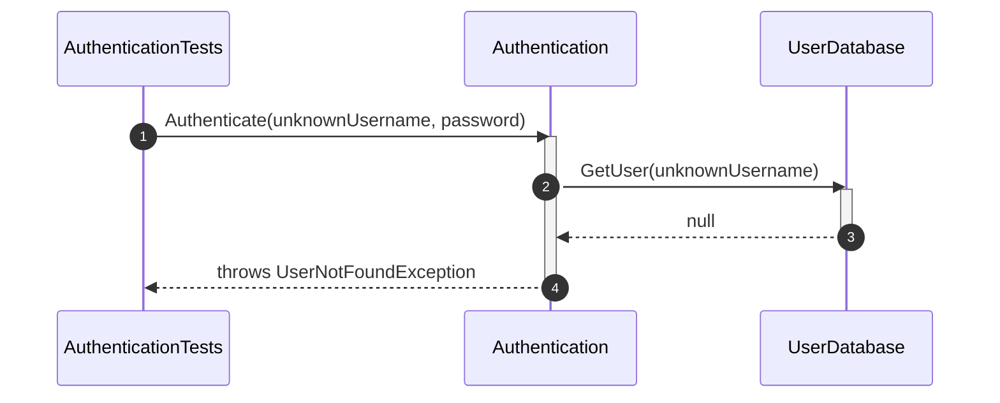
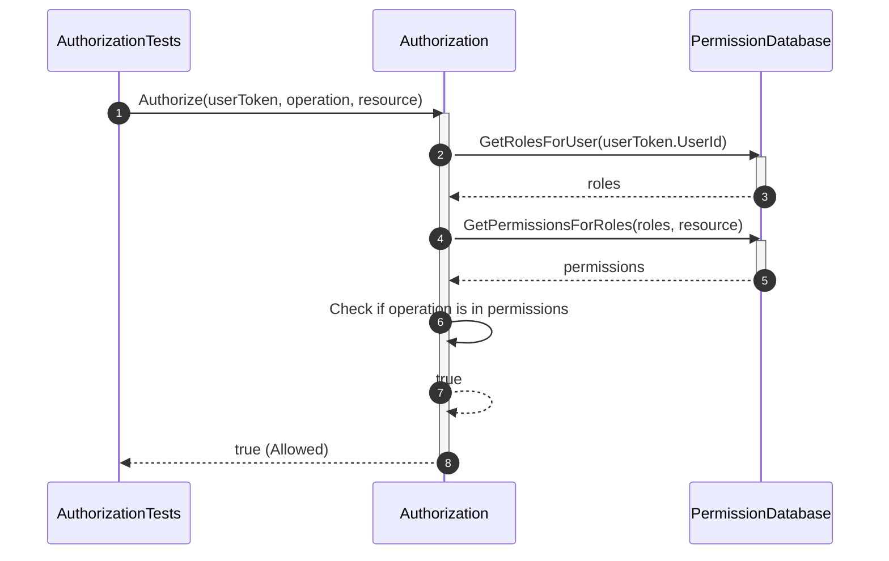
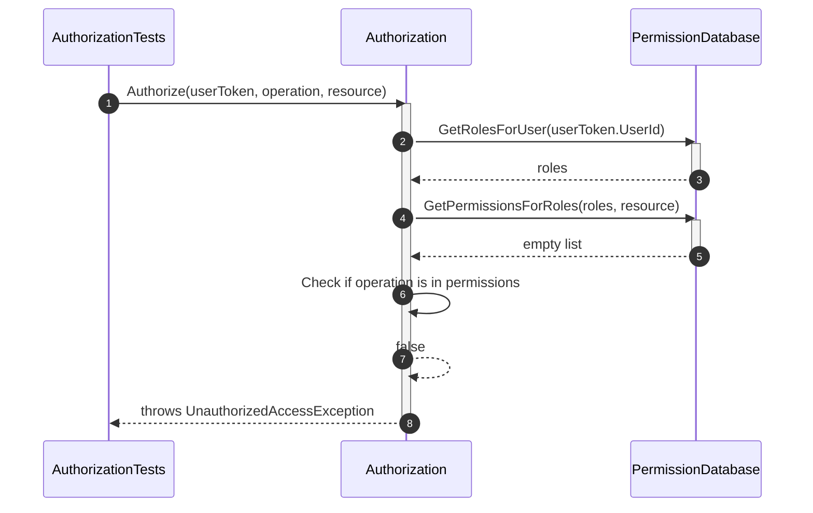
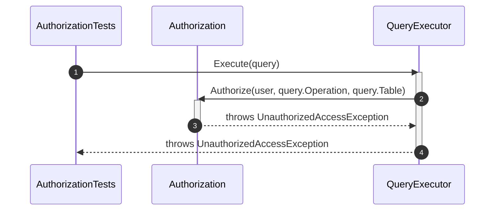
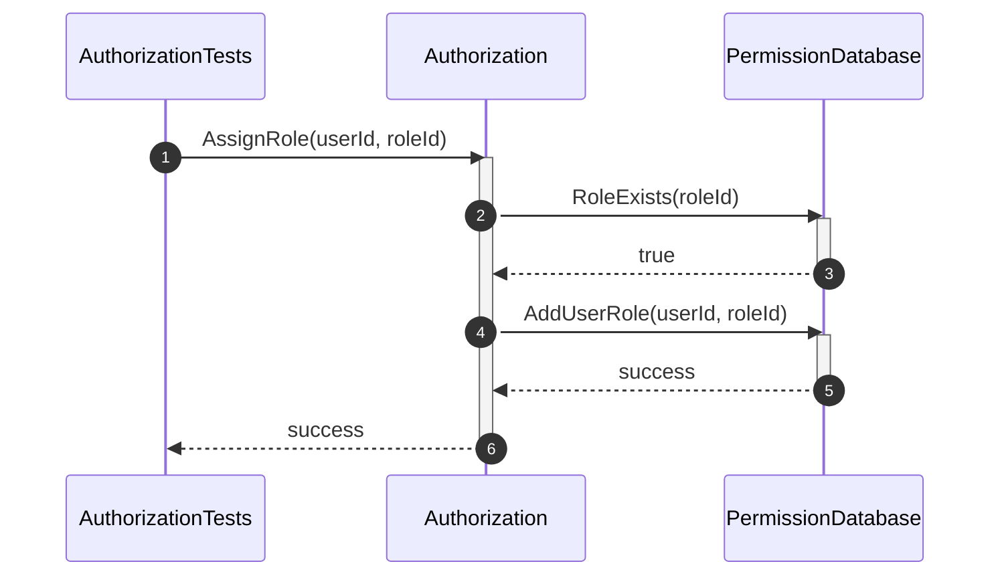
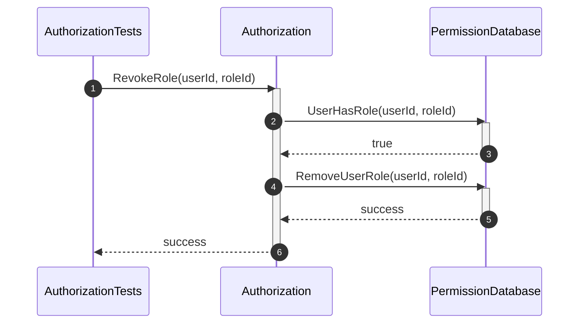

# Security Unit Test Sequence Diagrams

## 1. Authentication Tests

### 1.1 Authenticate_WhenCredentialsAreValid_ShouldSucceed

### 1.2 Authenticate_WhenPasswordIsInvalid_ShouldFail

### 1.3 Authenticate_WhenUserDoesNotExist_ShouldFail

## 2. Authorization Tests

### 2.1 Authorize_WhenPermissionExists_ShouldAllowOperation

### 2.2 Authorize_WhenPermissionDoesNotExist_ShouldDenyOperation

### 2.3 Authorize_ShouldCheckPermissionBeforeExecutingOperation

### 2.4 AssignRole_WhenRoleIsValid_ShouldAddRole

### 2.5 RevokeRole_WhenRoleExists_ShouldRemoveRole

