# Storage Engine Unit Test Design

# 1. Overview

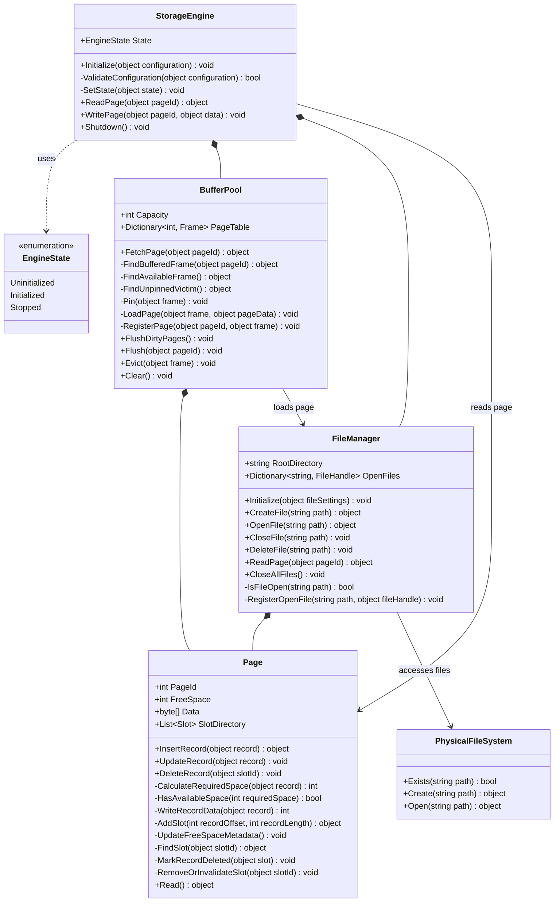
```mermaid
classDiagram
    direction TB

    class BufferPool {
        +int Capacity
        +Dictionary~int, Frame~ PageTable
        +FetchPage(object pageId) object
        -FindBufferedFrame(object pageId) object
        -FindAvailableFrame() object
        -FindUnpinnedVictim() object
        -Pin(object frame) void
        -LoadPage(object frame, object pageData) void
        -RegisterPage(object pageId, object frame) void
        +FlushDirtyPages() void
        +Flush(object pageId) void
        +Evict(object frame) void
        +Clear() void
    }

    class Page {
        +int PageId
        +int FreeSpace
        +byte[] Data
        +List~Slot~ SlotDirectory
        +InsertRecord(object record) object
        +UpdateRecord(object record) void
        +DeleteRecord(object slotId) void
        -CalculateRequiredSpace(object record) int
        -HasAvailableSpace(int requiredSpace) bool
        -WriteRecordData(object record) int
        -AddSlot(int recordOffset, int recordLength) object
        -UpdateFreeSpaceMetadata() void
        -FindSlot(object slotId) object
        -MarkRecordDeleted(object slot) void
        -RemoveOrInvalidateSlot(object slotId) void
        +Read() object
    }

    
    class EngineState {
        <<enumeration>>
        Uninitialized
        Initialized
        Stopped
    }

    class StorageEngine {
        +EngineState State
        +Initialize(object configuration) void
        -ValidateConfiguration(object configuration) bool
        -SetState(object state) void
        +ReadPage(object pageId) object
        +WritePage(object pageId, object data) void
        +Shutdown() void
    }

    class FileManager {
        +string RootDirectory
        +Dictionary~string, FileHandle~ OpenFiles
        +Initialize(object fileSettings) void
        +CreateFile(string path) object
        +OpenFile(string path) object
        +CloseFile(string path) void
        +DeleteFile(string path) void
        +ReadPage(object pageId) object
        +CloseAllFiles() void
        -IsFileOpen(string path) bool
        -RegisterOpenFile(string path, object fileHandle) void
    }

    class PhysicalFileSystem {
        +Exists(string path) bool
        +Create(string path) object
        +Open(string path) object
    }

    StorageEngine ..> EngineState : uses
    StorageEngine *-- BufferPool
    StorageEngine *-- FileManager
    BufferPool *-- Page
    FileManager *-- Page

    BufferPool --> FileManager : loads page
    StorageEngine --> Page : reads page
    FileManager --> PhysicalFileSystem : accesses files
```

# 2. BufferPool Unit Tests

## 2.1 FetchPage_WhenPageIsBuffered_ShouldReturnExistingFrame

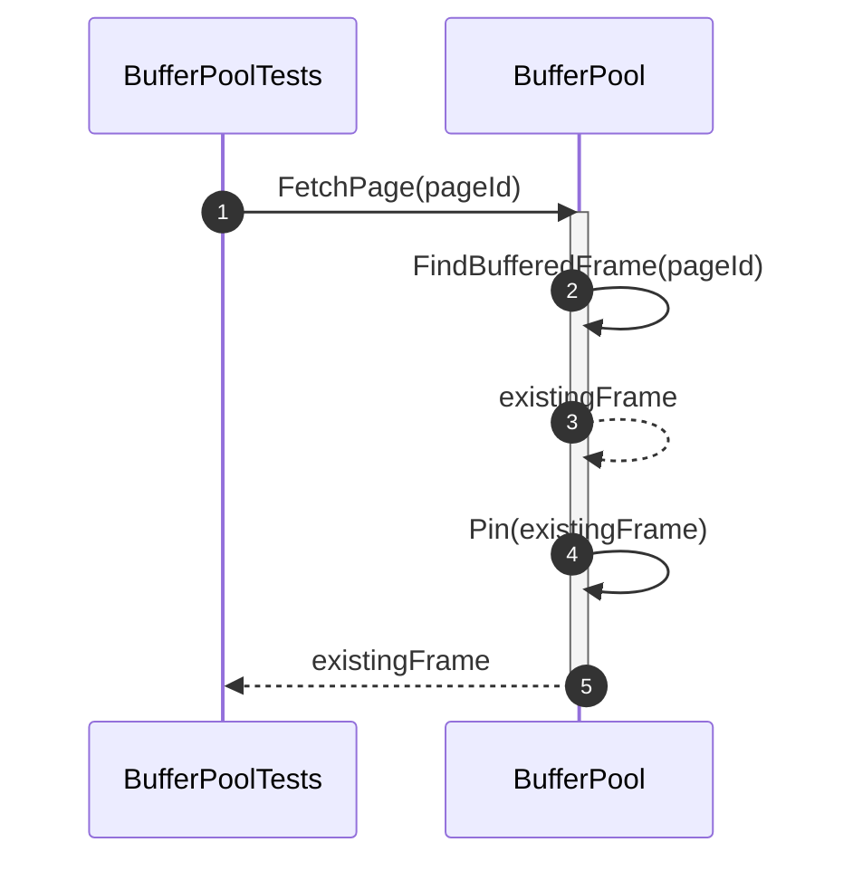
```mermaid
sequenceDiagram
    autonumber

    participant Test as BufferPoolTests
    participant BP as BufferPool

    Test->>BP: FetchPage(pageId)
    activate BP

    BP->>BP: FindBufferedFrame(pageId)
    BP-->>BP: existingFrame

    BP->>BP: Pin(existingFrame)
    BP-->>Test: existingFrame

    deactivate BP
```

---

## 2.2 FetchPage_WhenSpaceIsAvailable_ShouldLoadPage

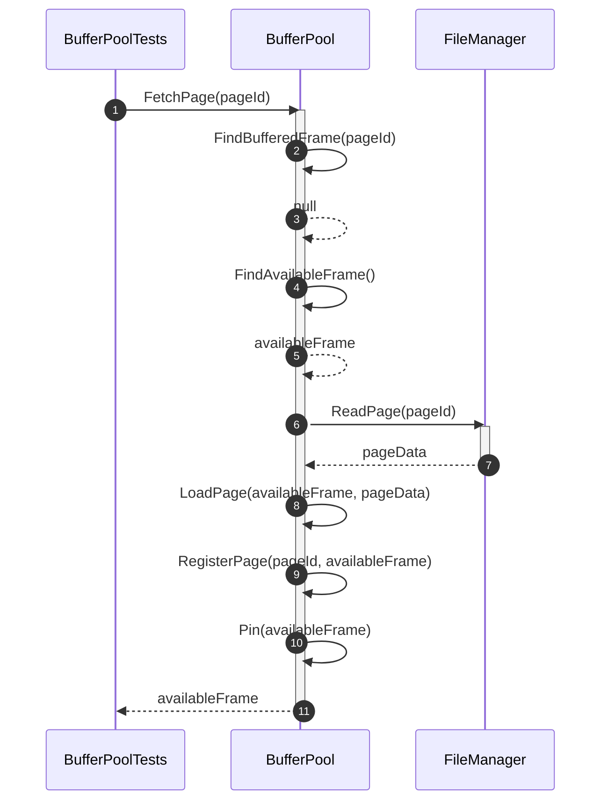
```mermaid
sequenceDiagram
    autonumber

    participant Test as BufferPoolTests
    participant BP as BufferPool
    participant FM as FileManager

    Test->>BP: FetchPage(pageId)
    activate BP

    BP->>BP: FindBufferedFrame(pageId)
    BP-->>BP: null

    BP->>BP: FindAvailableFrame()
    BP-->>BP: availableFrame

    BP->>FM: ReadPage(pageId)
    activate FM
    FM-->>BP: pageData
    deactivate FM

    BP->>BP: LoadPage(availableFrame, pageData)
    BP->>BP: RegisterPage(pageId, availableFrame)
    BP->>BP: Pin(availableFrame)

    BP-->>Test: availableFrame

    deactivate BP
```

---

## 2.3 FetchPage_WhenAllFramesArePinned_ShouldThrow

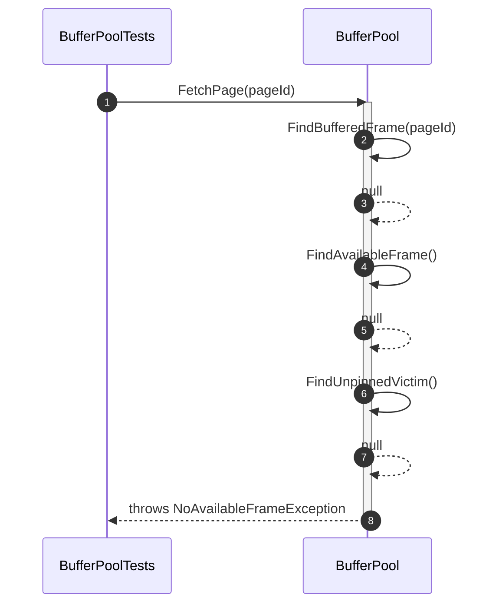
```mermaid
sequenceDiagram
    autonumber

    participant Test as BufferPoolTests
    participant BP as BufferPool

    Test->>BP: FetchPage(pageId)
    activate BP

    BP->>BP: FindBufferedFrame(pageId)
    BP-->>BP: null

    BP->>BP: FindAvailableFrame()
    BP-->>BP: null

    BP->>BP: FindUnpinnedVictim()
    BP-->>BP: null

    BP-->>Test: throws NoAvailableFrameException

    deactivate BP
```

---

# 3. Page Unit Tests

## 3.1 InsertRecord_WhenSpaceIsAvailable_ShouldInsertRecord

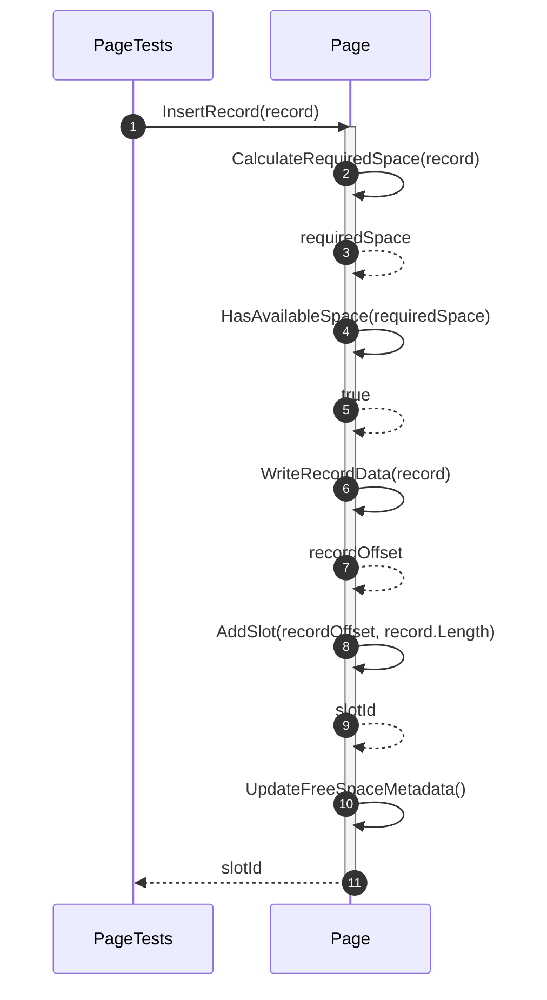
```mermaid
sequenceDiagram
    autonumber

    participant Test as PageTests
    participant Page

    Test->>Page: InsertRecord(record)
    activate Page

    Page->>Page: CalculateRequiredSpace(record)
    Page-->>Page: requiredSpace

    Page->>Page: HasAvailableSpace(requiredSpace)
    Page-->>Page: true

    Page->>Page: WriteRecordData(record)
    Page-->>Page: recordOffset

    Page->>Page: AddSlot(recordOffset, record.Length)
    Page-->>Page: slotId

    Page->>Page: UpdateFreeSpaceMetadata()
    Page-->>Test: slotId

    deactivate Page
```

---

## 3.2 InsertRecord_WhenSpaceIsInsufficient_ShouldFail

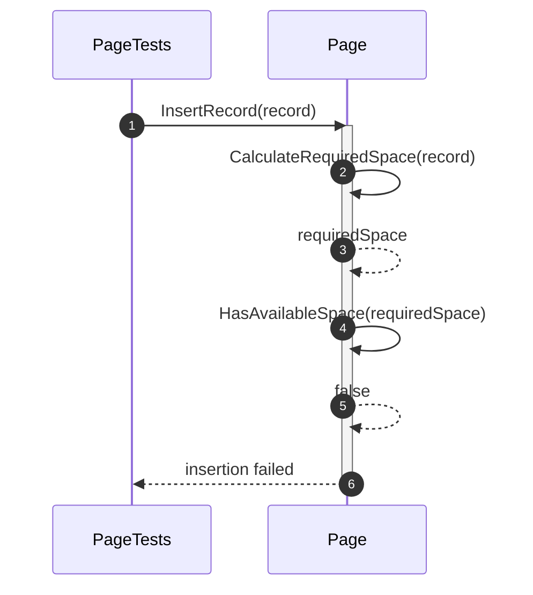
```mermaid
sequenceDiagram
    autonumber

    participant Test as PageTests
    participant Page

    Test->>Page: InsertRecord(record)
    activate Page

    Page->>Page: CalculateRequiredSpace(record)
    Page-->>Page: requiredSpace

    Page->>Page: HasAvailableSpace(requiredSpace)
    Page-->>Page: false

    Page-->>Test: insertion failed

    deactivate Page
```

---

## 3.3 DeleteRecord_WhenRecordExists_ShouldUpdateSlotDirectory

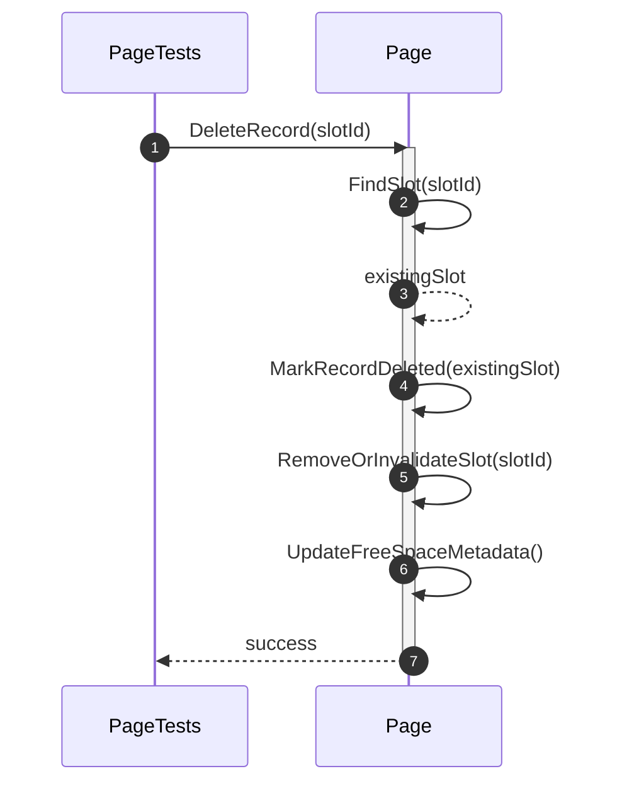
```mermaid
sequenceDiagram
    autonumber

    participant Test as PageTests
    participant Page

    Test->>Page: DeleteRecord(slotId)
    activate Page

    Page->>Page: FindSlot(slotId)
    Page-->>Page: existingSlot

    Page->>Page: MarkRecordDeleted(existingSlot)
    Page->>Page: RemoveOrInvalidateSlot(slotId)
    Page->>Page: UpdateFreeSpaceMetadata()

    Page-->>Test: success

    deactivate Page
```

---

# 4. Storage Engine Unit Tests

## 4.1 Initialize_WhenConfigurationIsValid_ShouldInitializeComponents

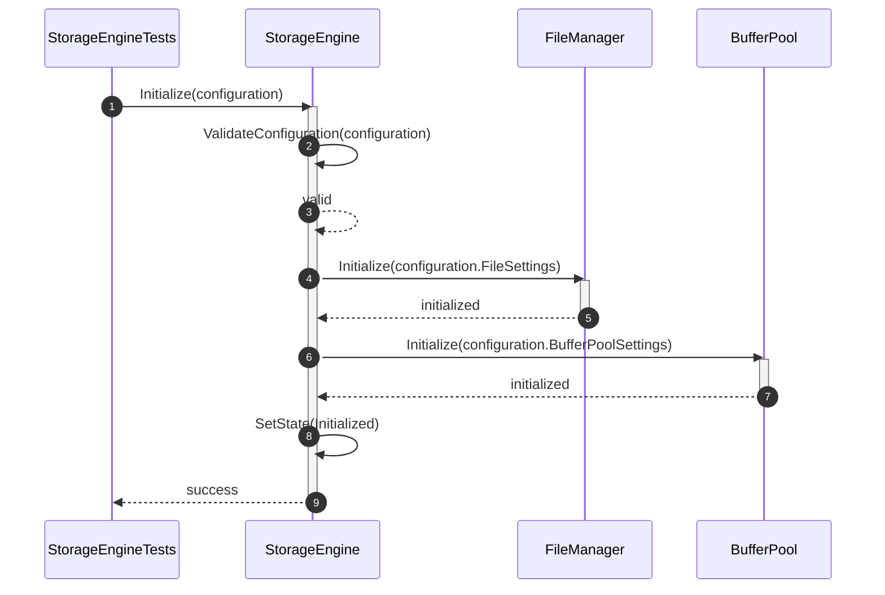
```mermaid
sequenceDiagram
    autonumber

    participant Test as StorageEngineTests
    participant SE as StorageEngine
    participant FM as FileManager
    participant BP as BufferPool

    Test->>SE: Initialize(configuration)
    activate SE

    SE->>SE: ValidateConfiguration(configuration)
    SE-->>SE: valid

    SE->>FM: Initialize(configuration.FileSettings)
    activate FM
    FM-->>SE: initialized
    deactivate FM

    SE->>BP: Initialize(configuration.BufferPoolSettings)
    activate BP
    BP-->>SE: initialized
    deactivate BP

    SE->>SE: SetState(Initialized)
    SE-->>Test: success

    deactivate SE
```

---

## 4.2 ReadPage_ShouldDelegateToBufferPool

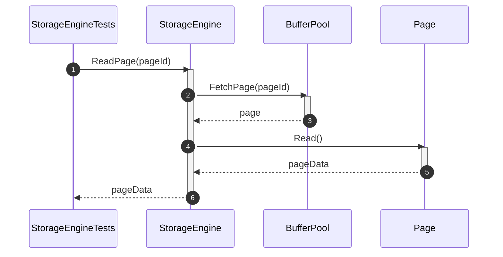
```mermaid
sequenceDiagram
    autonumber

    participant Test as StorageEngineTests
    participant SE as StorageEngine
    participant BP as BufferPool
    participant Page

    Test->>SE: ReadPage(pageId)
    activate SE

    SE->>BP: FetchPage(pageId)
    activate BP
    BP-->>SE: page
    deactivate BP

    SE->>Page: Read()
    activate Page
    Page-->>SE: pageData
    deactivate Page

    SE-->>Test: pageData

    deactivate SE
```

---

## 4.3 Shutdown_ShouldFlushDirtyPagesAndCloseFiles

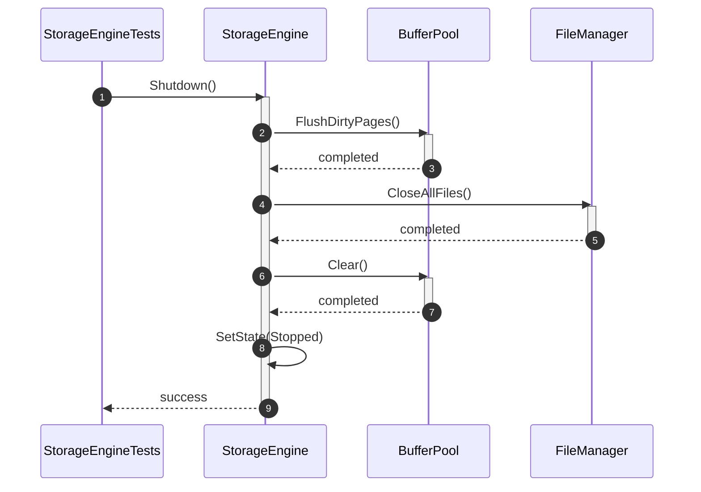
```mermaid
sequenceDiagram
    autonumber

    participant Test as StorageEngineTests
    participant SE as StorageEngine
    participant BP as BufferPool
    participant FM as FileManager

    Test->>SE: Shutdown()
    activate SE

    SE->>BP: FlushDirtyPages()
    activate BP
    BP-->>SE: completed
    deactivate BP

    SE->>FM: CloseAllFiles()
    activate FM
    FM-->>SE: completed
    deactivate FM

    SE->>BP: Clear()
    activate BP
    BP-->>SE: completed
    deactivate BP

    SE->>SE: SetState(Stopped)
    SE-->>Test: success

    deactivate SE
```

---

# 5. File Manager Unit Tests

## 5.1 CreateFile_WhenPathIsValid_ShouldCreateFile

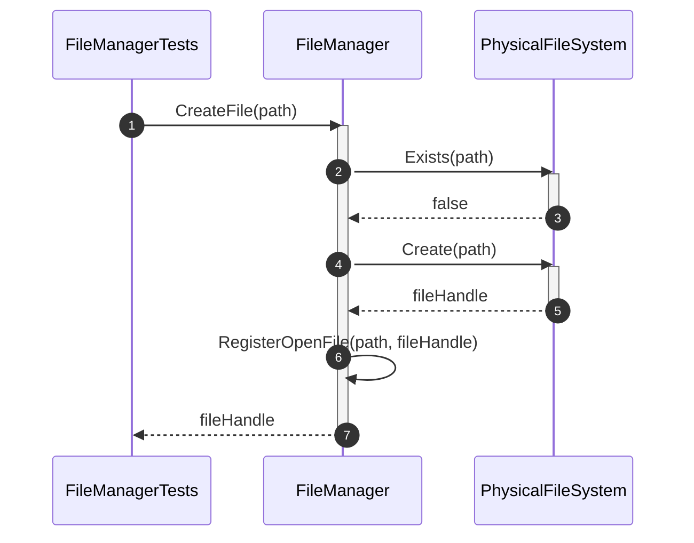
```mermaid
sequenceDiagram
    autonumber

    participant Test as FileManagerTests
    participant FM as FileManager
    participant FS as PhysicalFileSystem

    Test->>FM: CreateFile(path)
    activate FM

    FM->>FS: Exists(path)
    activate FS
    FS-->>FM: false
    deactivate FS

    FM->>FS: Create(path)
    activate FS
    FS-->>FM: fileHandle
    deactivate FS

    FM->>FM: RegisterOpenFile(path, fileHandle)
    FM-->>Test: fileHandle

    deactivate FM
```

---

## 5.2 OpenFile_WhenFileExists_ShouldReturnHandle

```mermaid
sequenceDiagram
    autonumber

    participant Test as FileManagerTests
    participant FM as FileManager
    participant FS as PhysicalFileSystem

    Test->>FM: OpenFile(path)
    activate FM

    FM->>FS: Exists(path)
    activate FS
    FS-->>FM: true
    deactivate FS

    FM->>FS: Open(path)
    activate FS
    FS-->>FM: fileHandle
    deactivate FS

    FM->>FM: RegisterOpenFile(path, fileHandle)
    FM-->>Test: fileHandle

    deactivate FM
```

---

## 5.3 DeleteFile_WhenFileIsInUse_ShouldThrow

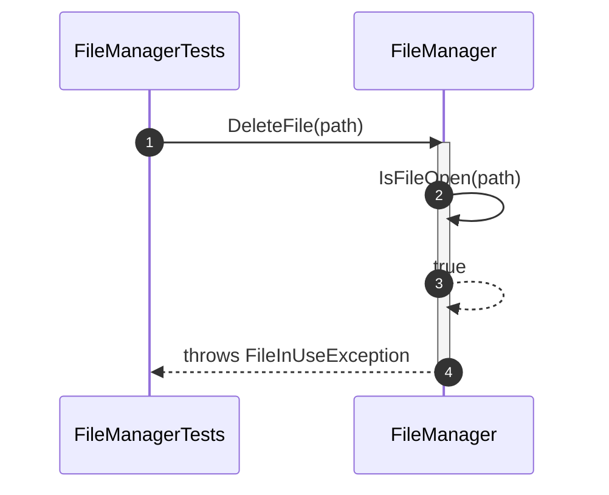
```mermaid
sequenceDiagram
    autonumber

    participant Test as FileManagerTests
    participant FM as FileManager

    Test->>FM: DeleteFile(path)
    activate FM

    FM->>FM: IsFileOpen(path)
    FM-->>FM: true

    FM-->>Test: throws FileInUseException

    deactivate FM
```

---

# 6. Additional Operations Unit Tests

## 6.1 Flush_WhenPageIsDirty_ShouldWriteToDisk

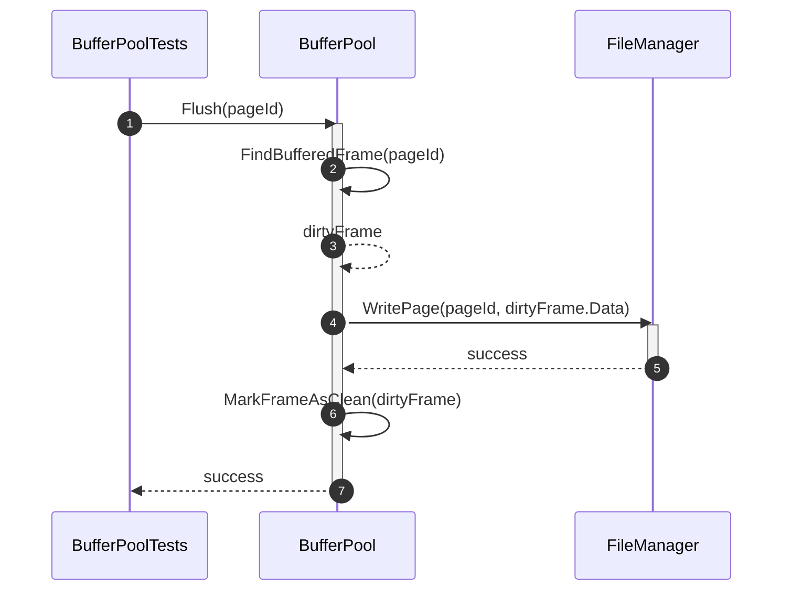
```mermaid
sequenceDiagram
    autonumber

    participant Test as BufferPoolTests
    participant BP as BufferPool
    participant FM as FileManager

    Test->>BP: Flush(pageId)
    activate BP

    BP->>BP: FindBufferedFrame(pageId)
    BP-->>BP: dirtyFrame

    BP->>FM: WritePage(pageId, dirtyFrame.Data)
    activate FM
    FM-->>BP: success
    deactivate FM

    BP->>BP: MarkFrameAsClean(dirtyFrame)
    BP-->>Test: success

    deactivate BP
```

## 6.3 UpdateRecord_WhenSpaceIsSufficient_ShouldModifyRecord

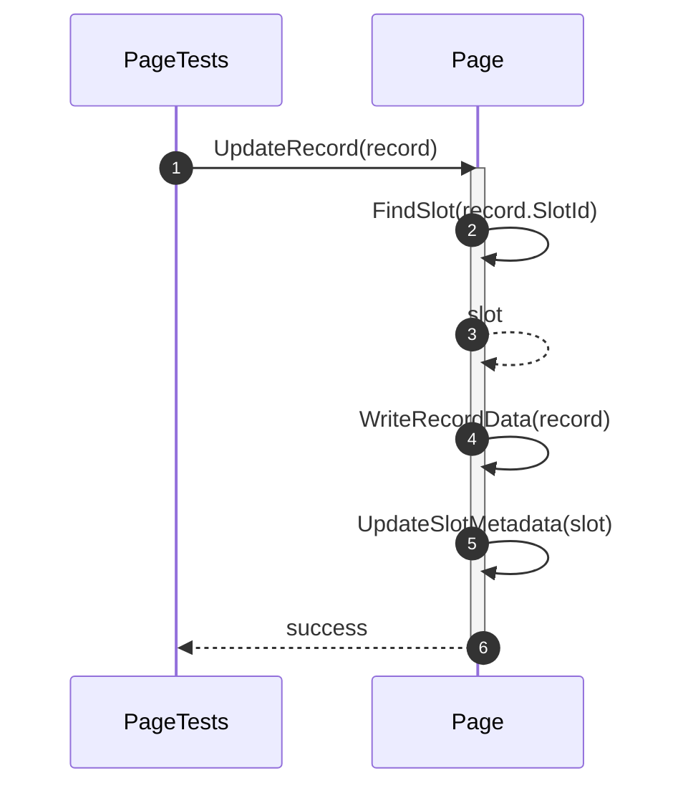
```mermaid
sequenceDiagram
    autonumber

    participant Test as PageTests
    participant Page

    Test->>Page: UpdateRecord(record)
    activate Page

    Page->>Page: FindSlot(record.SlotId)
    Page-->>Page: slot

    Page->>Page: WriteRecordData(record)
    Page->>Page: UpdateSlotMetadata(slot)

    Page-->>Test: success

    deactivate Page
```

## 6.4 WritePage_ShouldMarkPageAsDirty

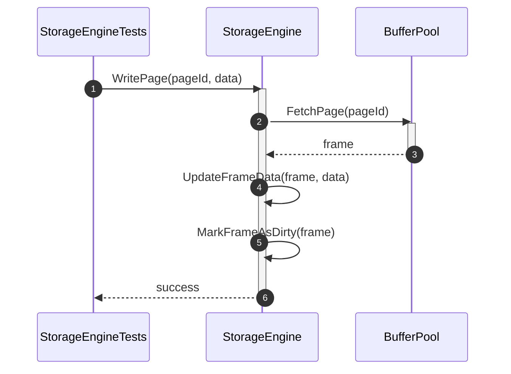
```mermaid
sequenceDiagram
    autonumber

    participant Test as StorageEngineTests
    participant SE as StorageEngine
    participant BP as BufferPool

    Test->>SE: WritePage(pageId, data)
    activate SE

    SE->>BP: FetchPage(pageId)
    activate BP
    BP-->>SE: frame
    deactivate BP

    SE->>SE: UpdateFrameData(frame, data)
    SE->>SE: MarkFrameAsDirty(frame)

    SE-->>Test: success

    deactivate SE
```

# 7. Additional Missing Storage Engine Tests

## 1. BufferPool (Missing) Tests

### 1.1 FetchPage_WhenPageIsBuffered_ShouldIncrementPinCount

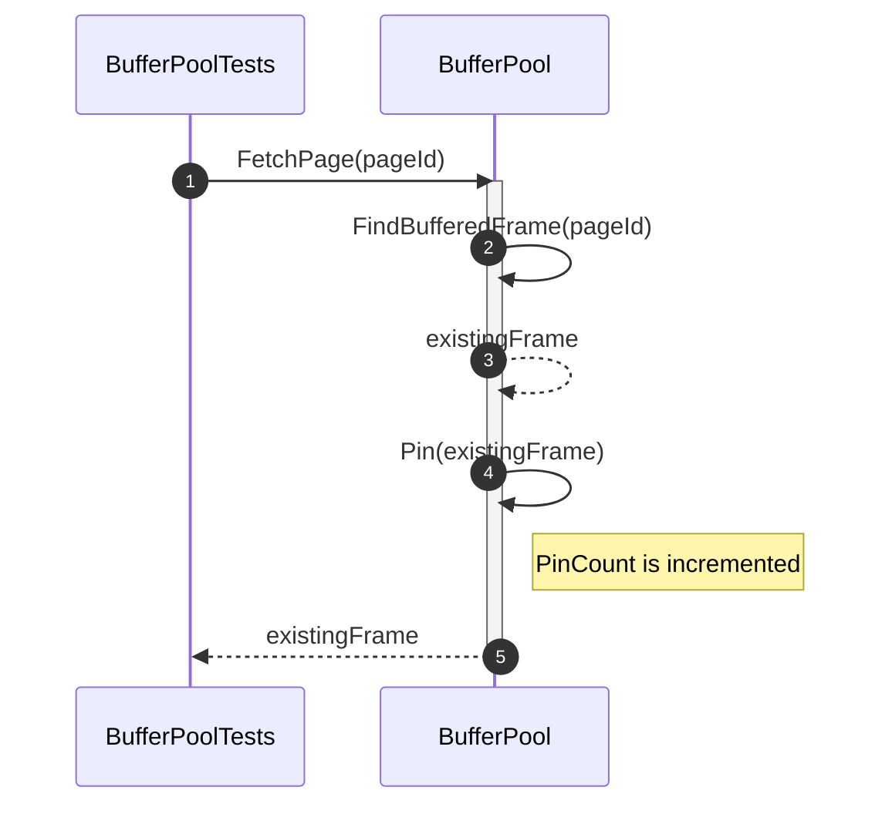
```mermaid
sequenceDiagram
    autonumber
    participant Test as BufferPoolTests
    participant BP as BufferPool

    Test->>BP: FetchPage(pageId)
    activate BP
    BP->>BP: FindBufferedFrame(pageId)
    BP-->>BP: existingFrame
    BP->>BP: Pin(existingFrame)
    Note right of BP: PinCount is incremented
    BP-->>Test: existingFrame
    deactivate BP
```

### 1.2 FetchPage_WhenDirtyVictimExists_ShouldFlushThenEvictVictim

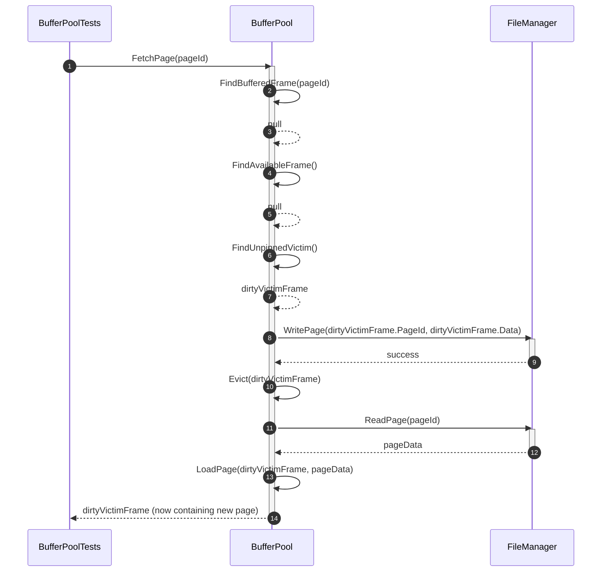
```mermaid
sequenceDiagram
    autonumber
    participant Test as BufferPoolTests
    participant BP as BufferPool
    participant FM as FileManager

    Test->>BP: FetchPage(pageId)
    activate BP
    BP->>BP: FindBufferedFrame(pageId)
    BP-->>BP: null
    BP->>BP: FindAvailableFrame()
    BP-->>BP: null
    BP->>BP: FindUnpinnedVictim()
    BP-->>BP: dirtyVictimFrame
    BP->>FM: WritePage(dirtyVictimFrame.PageId, dirtyVictimFrame.Data)
    activate FM
    FM-->>BP: success
    deactivate FM
    BP->>BP: Evict(dirtyVictimFrame)
    BP->>FM: ReadPage(pageId)
    activate FM
    FM-->>BP: pageData
    deactivate FM
    BP->>BP: LoadPage(dirtyVictimFrame, pageData)
    BP-->>Test: dirtyVictimFrame (now containing new page)
    deactivate BP
```

### 1.3 FetchPage_WhenFileReadFails_ShouldNotRegisterPage

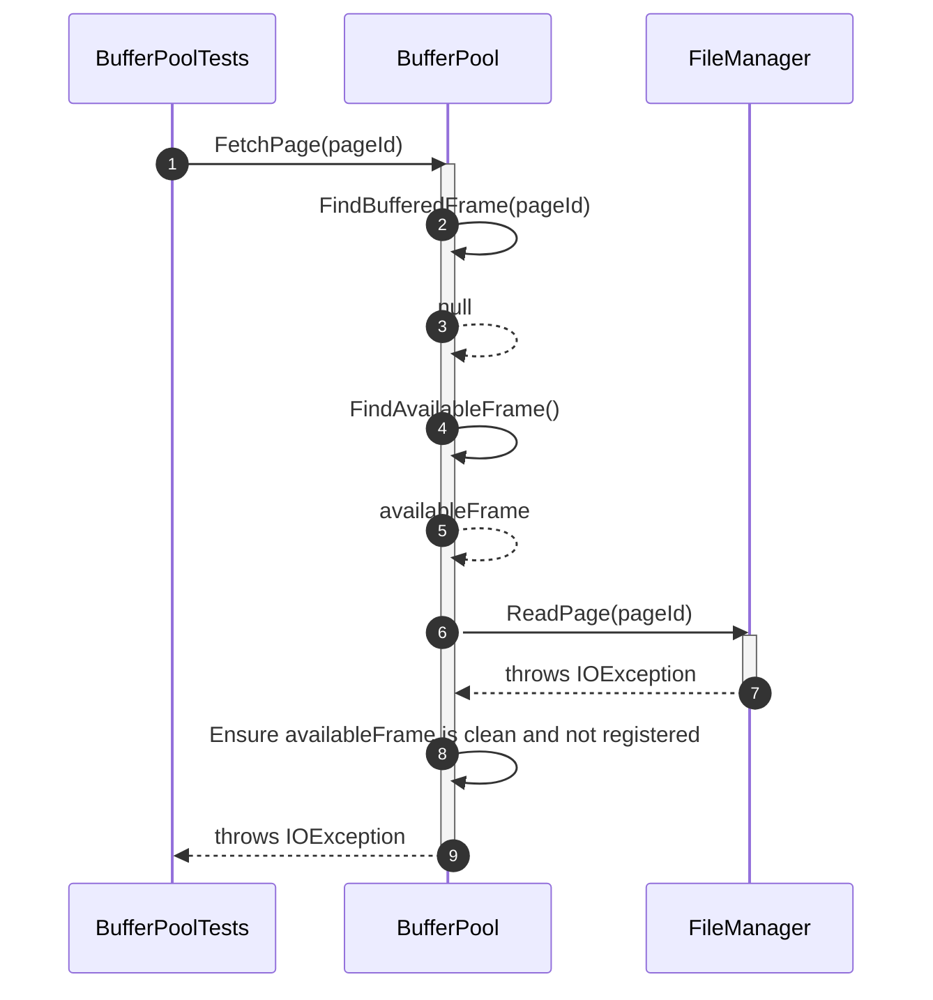
```mermaid
sequenceDiagram
    autonumber
    participant Test as BufferPoolTests
    participant BP as BufferPool
    participant FM as FileManager

    Test->>BP: FetchPage(pageId)
    activate BP
    BP->>BP: FindBufferedFrame(pageId)
    BP-->>BP: null
    BP->>BP: FindAvailableFrame()
    BP-->>BP: availableFrame
    BP->>FM: ReadPage(pageId)
    activate FM
    FM-->>BP: throws IOException
    deactivate FM
    BP->>BP: Ensure availableFrame is clean and not registered
    BP-->>Test: throws IOException
    deactivate BP
```

### 1.4 Unpin_WhenPageIsPinned_ShouldDecreasePinCount

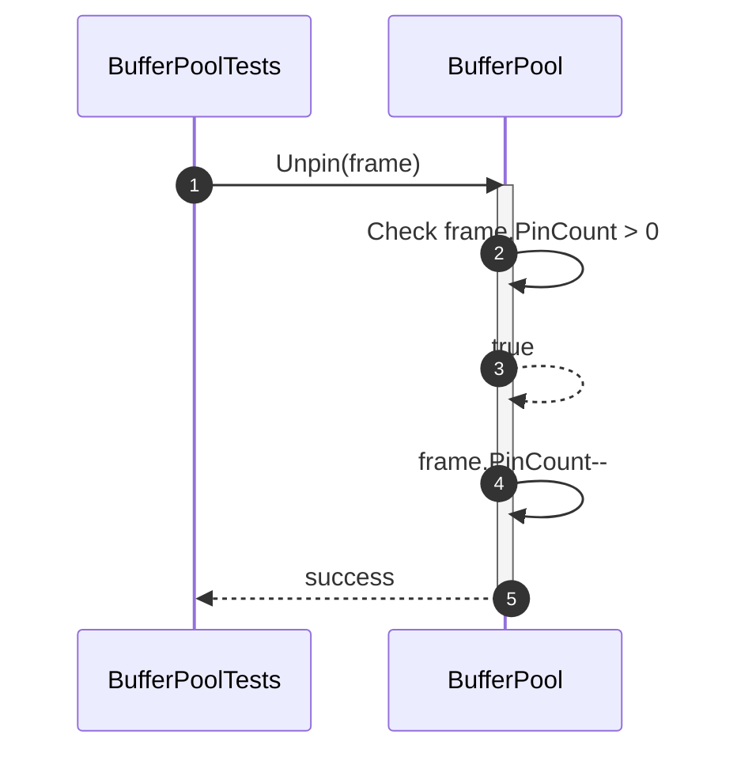
```mermaid
sequenceDiagram
    autonumber
    participant Test as BufferPoolTests
    participant BP as BufferPool

    Test->>BP: Unpin(frame)
    activate BP
    BP->>BP: Check frame.PinCount > 0
    BP-->>BP: true
    BP->>BP: frame.PinCount--
    BP-->>Test: success
    deactivate BP
```

### 1.5 Evict_WhenFrameIsPinned_ShouldThrow

```mermaid
sequenceDiagram
    autonumber
    participant Test as BufferPoolTests
    participant BP as BufferPool

    Test->>BP: Evict(frame)
    activate BP
    BP->>BP: Check frame.PinCount > 0
    BP-->>BP: true
    BP-->>Test: throws FramePinnedException
    deactivate BP
```

## 2. Page (Missing) Tests

### 2.1 GetRecord_WhenSlotExists_ShouldReturnRecord

```mermaid
sequenceDiagram
    autonumber
    participant Test as PageTests
    participant Page as Page

    Test->>Page: GetRecord(slotId)
    activate Page
    Page->>Page: FindSlot(slotId)
    Page-->>Page: slot
    Page->>Page: Read data at slot.Offset with slot.Length
    Page-->>Page: recordData
    Page-->>Test: recordData
    deactivate Page
```

### 2.2 UpdateRecord_WhenSpaceIsInsufficient_ShouldPreserveOriginalRecord

```mermaid
sequenceDiagram
    autonumber
    participant Test as PageTests
    participant Page as Page

    Test->>Page: UpdateRecord(record)
    activate Page
    Page->>Page: FindSlot(record.SlotId)
    Page-->>Page: existingSlot
    Page->>Page: CalculateRequiredSpace(record)
    Page-->>Page: requiredSpace
    Page->>Page: HasAvailableSpace(requiredSpace - existingSlot.Length)
    Page-->>Page: false
    Page-->>Test: throws InsufficientSpaceException (Original Data Preserved)
    deactivate Page
```

### 2.3 Compact_WhenDeletedRecordsExist_ShouldReclaimSpace

```mermaid
sequenceDiagram
    autonumber
    participant Test as PageTests
    participant Page as Page

    Test->>Page: Compact()
    activate Page
    Page->>Page: Iterate slots
    loop For each slot
        Page->>Page: If slot is active, shift data to beginning
    end
    Page->>Page: UpdateFreeSpaceMetadata()
    Page-->>Test: success
    deactivate Page
```

### 2.4 InsertRecord_WhenDeletedSlotExists_ShouldReuseSlot

```mermaid
sequenceDiagram
    autonumber
    participant Test as PageTests
    participant Page as Page

    Test->>Page: InsertRecord(record)
    activate Page
    Page->>Page: Find first deleted/inactive slot
    Page-->>Page: inactiveSlot
    Page->>Page: WriteRecordData(record)
    Page-->>Page: recordOffset
    Page->>Page: Reactivate slot (update Offset and Length)
    Page->>Page: UpdateFreeSpaceMetadata()
    Page-->>Test: slotId (Reused)
    deactivate Page
```

## 3. StorageEngine (Missing) Tests

### 3.1 Initialize_WhenComponentFails_ShouldCleanUpInitializedComponents

```mermaid
sequenceDiagram
    autonumber
    participant Test as StorageEngineTests
    participant SE as StorageEngine
    participant FM as FileManager
    participant BP as BufferPool

    Test->>SE: Initialize(configuration)
    activate SE
    SE->>FM: Initialize(configuration.FileSettings)
    activate FM
    FM-->>SE: success
    deactivate FM
    SE->>BP: Initialize(configuration.BufferPoolSettings)
    activate BP
    BP-->>SE: throws InitializationException
    deactivate BP
    SE->>FM: CloseAllFiles()
    activate FM
    FM-->>SE: success
    deactivate FM
    SE->>SE: SetState(Uninitialized)
    SE-->>Test: throws InitializationException
    deactivate SE
```

### 3.2 Shutdown_WhenFlushFails_ShouldPropagateFailure

```mermaid
sequenceDiagram
    autonumber
    participant Test as StorageEngineTests
    participant SE as StorageEngine
    participant BP as BufferPool

    Test->>SE: Shutdown()
    activate SE
    SE->>BP: FlushDirtyPages()
    activate BP
    BP-->>SE: throws FlushFailureException
    deactivate BP
    SE-->>Test: throws FlushFailureException
    deactivate SE
```

## 4. FileManager (Missing) Tests

### 4.1 CreateFile_WhenFileAlreadyExists_ShouldThrow

```mermaid
sequenceDiagram
    autonumber
    participant Test as FileManagerTests
    participant FM as FileManager
    participant FS as PhysicalFileSystem

    Test->>FM: CreateFile(path)
    activate FM
    FM->>FS: Exists(path)
    activate FS
    FS-->>FM: true
    deactivate FS
    FM-->>Test: throws FileAlreadyExistsException
    deactivate FM
```

### 4.2 CreateFile_WhenPhysicalCreationFails_ShouldNotRegisterFile

```mermaid
sequenceDiagram
    autonumber
    participant Test as FileManagerTests
    participant FM as FileManager
    participant FS as PhysicalFileSystem

    Test->>FM: CreateFile(path)
    activate FM
    FM->>FS: Exists(path)
    activate FS
    FS-->>FM: false
    deactivate FS
    FM->>FS: Create(path)
    activate FS
    FS-->>FM: throws IOException
    deactivate FS
    FM->>FM: Ensure path is not registered in OpenFiles
    FM-->>Test: throws IOException
    deactivate FM
```

### 4.3 OpenFile_WhenAccessModeConflicts_ShouldThrow

```mermaid
sequenceDiagram
    autonumber
    participant Test as FileManagerTests
    participant FM as FileManager

    Test->>FM: OpenFile(path, ExclusiveMode)
    activate FM
    FM->>FM: IsFileOpen(path)
    FM-->>FM: true (Already opened in SharedMode)
    FM-->>Test: throws FileAccessConflictException
    deactivate FM
```

### 4.4 ReadPage_WhenFileIsClosed_ShouldThrow

```mermaid
sequenceDiagram
    autonumber
    participant Test as FileManagerTests
    participant FM as FileManager

    Test->>FM: ReadPage(pageId)
    activate FM
    FM->>FM: IsFileOpen(pageId.FilePath)
    FM-->>FM: false
    FM-->>Test: throws FileClosedException
    deactivate FM
```

### 4.5 WritePage_WhenFileIsReadOnly_ShouldThrow

```mermaid
sequenceDiagram
    autonumber
    participant Test as FileManagerTests
    participant FM as FileManager

    Test->>FM: WritePage(pageId, data)
    activate FM
    FM->>FM: GetFileHandle(pageId.FilePath)
    FM-->>FM: fileHandle
    FM->>FM: Check fileHandle.IsReadOnly
    FM-->>FM: true
    FM-->>Test: throws InvalidFileOperationException
    deactivate FM
```

### 4.6 CloseFile_WhenFileIsOpen_ShouldCloseHandle

```mermaid
sequenceDiagram
    autonumber
    participant Test as FileManagerTests
    participant FM as FileManager

    Test->>FM: CloseFile(path)
    activate FM
    FM->>FM: GetFileHandle(path)
    FM-->>FM: fileHandle
    FM->>FM: fileHandle.Close()
    FM->>FM: OpenFiles.Remove(path)
    FM-->>Test: success
    deactivate FM
```
