# Transaction Management Unit Test Sequence Diagrams

## 1. Transaction Tests

### 1.1 Begin_WhenTransactionIsNew_ShouldBecomeActive

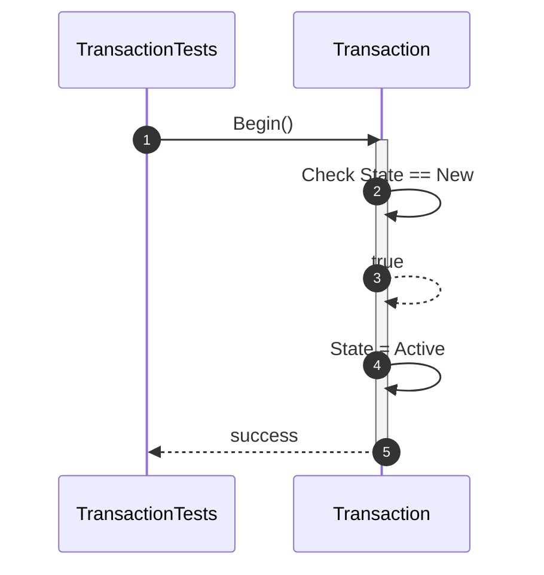
```mermaid
sequenceDiagram
    autonumber
    participant Test as TransactionTests
    participant TX as Transaction

    Test->>TX: Begin()
    activate TX
    TX->>TX: Check State == New
    TX-->>TX: true
    TX->>TX: State = Active
    TX-->>Test: success
    deactivate TX
```

### 1.2 Commit_WhenTransactionIsActive_ShouldCommit

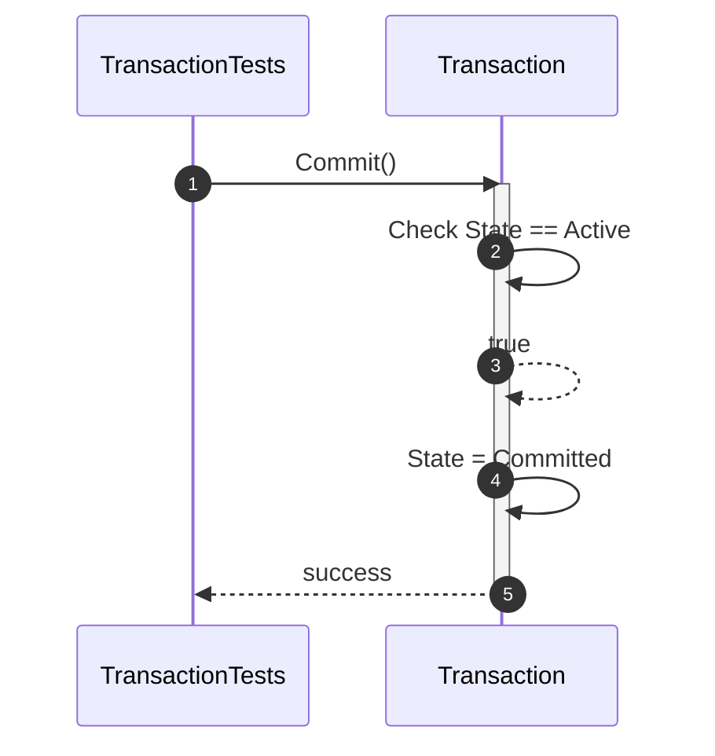
```mermaid
sequenceDiagram
    autonumber
    participant Test as TransactionTests
    participant TX as Transaction

    Test->>TX: Commit()
    activate TX
    TX->>TX: Check State == Active
    TX-->>TX: true
    TX->>TX: State = Committed
    TX-->>Test: success
    deactivate TX
```

### 1.3 Commit_WhenTransactionIsNotActive_ShouldThrow

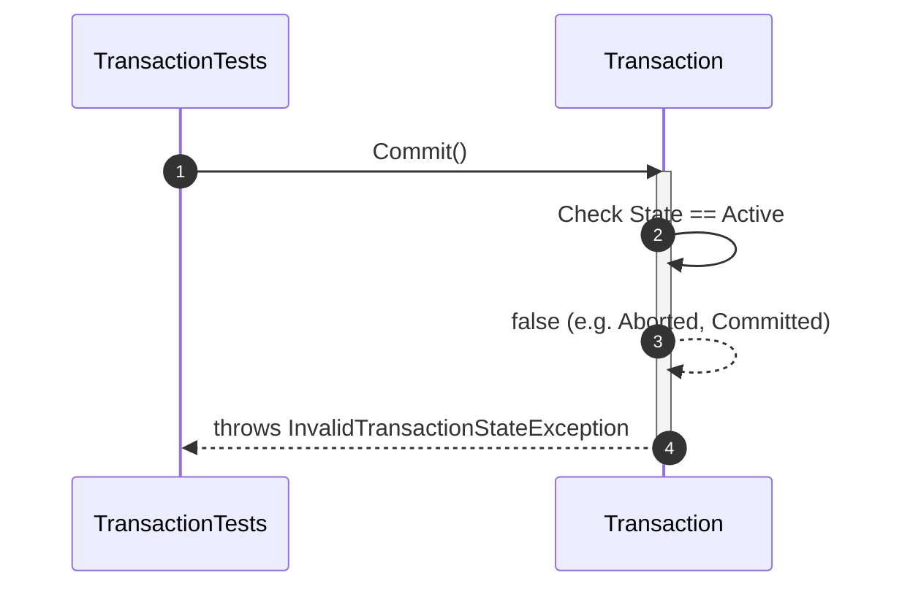
```mermaid
sequenceDiagram
    autonumber
    participant Test as TransactionTests
    participant TX as Transaction

    Test->>TX: Commit()
    activate TX
    TX->>TX: Check State == Active
    TX-->>TX: false (e.g. Aborted, Committed)
    TX-->>Test: throws InvalidTransactionStateException
    deactivate TX
```

### 1.4 Rollback_WhenTransactionIsActive_ShouldRollback

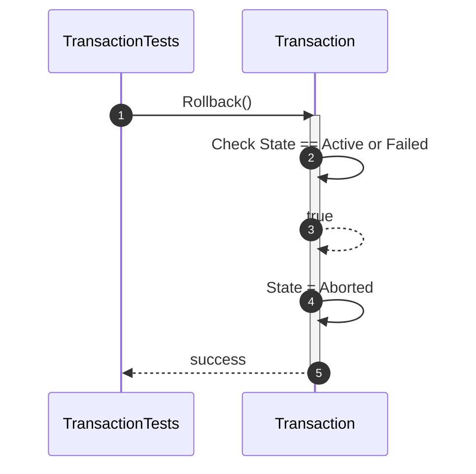
```mermaid
sequenceDiagram
    autonumber
    participant Test as TransactionTests
    participant TX as Transaction

    Test->>TX: Rollback()
    activate TX
    TX->>TX: Check State == Active or Failed
    TX-->>TX: true
    TX->>TX: State = Aborted
    TX-->>Test: success
    deactivate TX
```

### 1.5 Rollback_WhenTransactionAlreadyCommitted_ShouldThrow

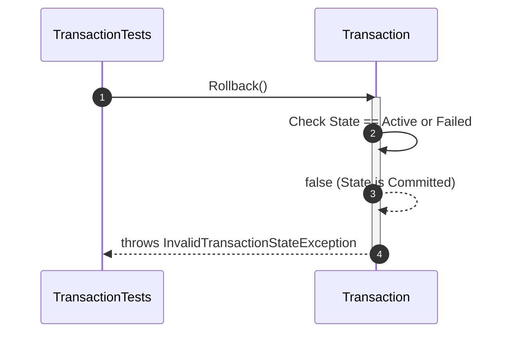
```mermaid
sequenceDiagram
    autonumber
    participant Test as TransactionTests
    participant TX as Transaction

    Test->>TX: Rollback()
    activate TX
    TX->>TX: Check State == Active or Failed
    TX-->>TX: false (State is Committed)
    TX-->>Test: throws InvalidTransactionStateException
    deactivate TX
```

### 1.6 MarkFailed_WhenTransactionIsActive_ShouldEnterFailedState

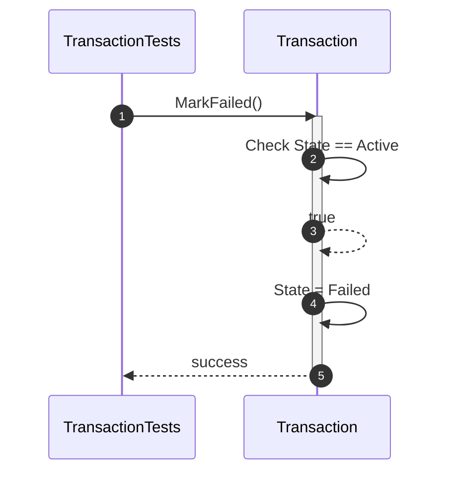
```mermaid
sequenceDiagram
    autonumber
    participant Test as TransactionTests
    participant TX as Transaction

    Test->>TX: MarkFailed()
    activate TX
    TX->>TX: Check State == Active
    TX-->>TX: true
    TX->>TX: State = Failed
    TX-->>Test: success
    deactivate TX
```

## 2. TransactionManager Tests

### 2.1 BeginTransaction_ShouldReturnActiveTransaction

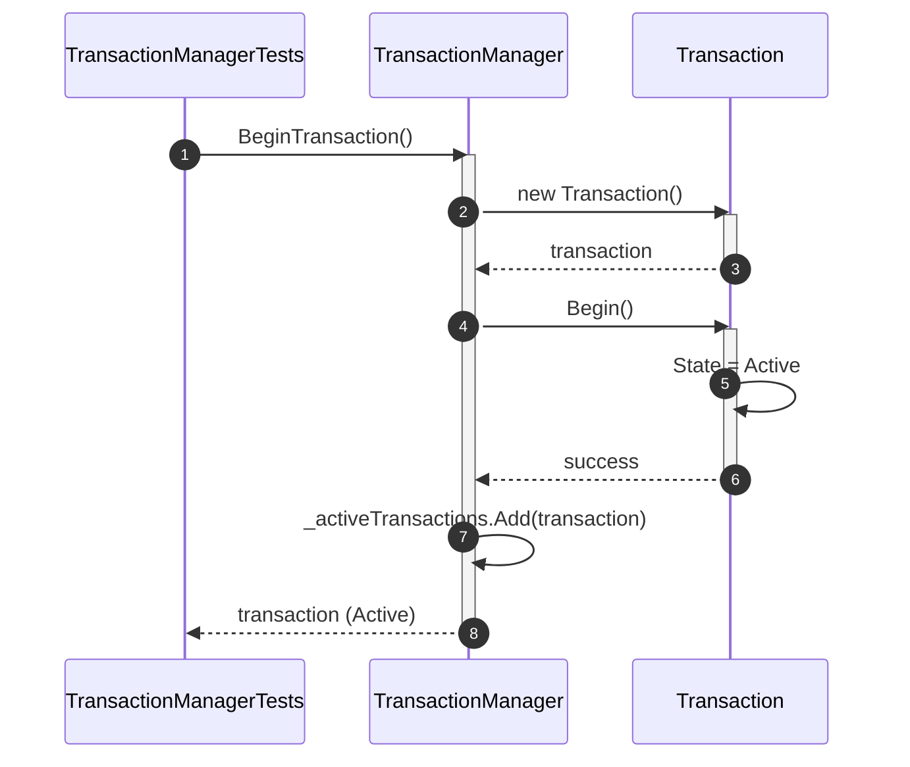
```mermaid
sequenceDiagram
    autonumber
    participant Test as TransactionManagerTests
    participant TM as TransactionManager
    participant TX as Transaction

    Test->>TM: BeginTransaction()
    activate TM
    TM->>TX: new Transaction()
    activate TX
    TX-->>TM: transaction
    deactivate TX
    TM->>TX: Begin()
    activate TX
    TX->>TX: State = Active
    TX-->>TM: success
    deactivate TX
    TM->>TM: _activeTransactions.Add(transaction)
    TM-->>Test: transaction (Active)
    deactivate TM
```

### 2.2 BeginTransaction_ShouldAssignUniqueTransactionId

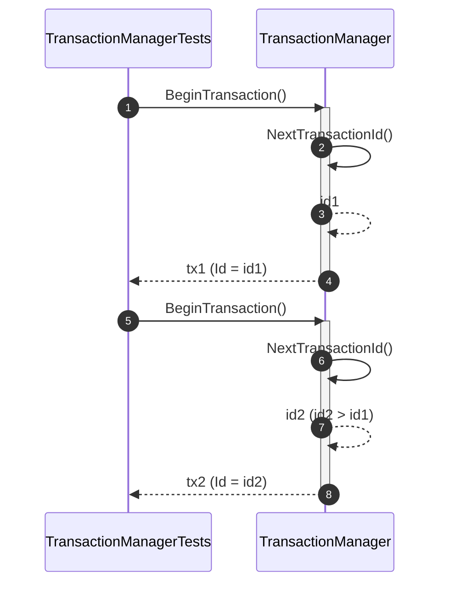
```mermaid
sequenceDiagram
    autonumber
    participant Test as TransactionManagerTests
    participant TM as TransactionManager

    Test->>TM: BeginTransaction()
    activate TM
    TM->>TM: NextTransactionId()
    TM-->>TM: id1
    TM-->>Test: tx1 (Id = id1)
    deactivate TM

    Test->>TM: BeginTransaction()
    activate TM
    TM->>TM: NextTransactionId()
    TM-->>TM: id2 (id2 > id1)
    TM-->>Test: tx2 (Id = id2)
    deactivate TM
```

### 2.3 Commit_WhenTransactionExists_ShouldCommitTransaction

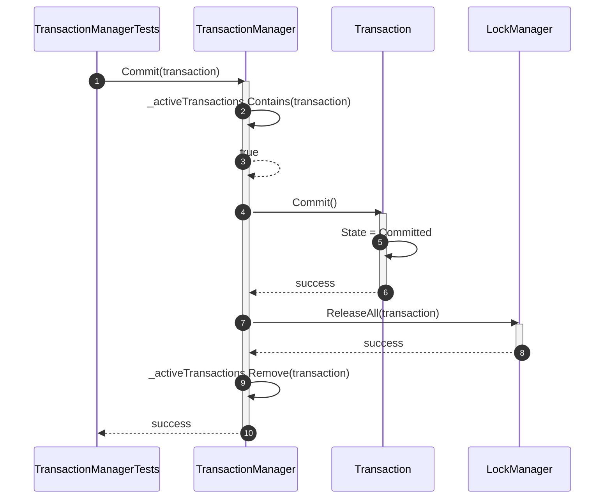
```mermaid
sequenceDiagram
    autonumber
    participant Test as TransactionManagerTests
    participant TM as TransactionManager
    participant TX as Transaction
    participant LM as LockManager

    Test->>TM: Commit(transaction)
    activate TM
    TM->>TM: _activeTransactions.Contains(transaction)
    TM-->>TM: true
    TM->>TX: Commit()
    activate TX
    TX->>TX: State = Committed
    TX-->>TM: success
    deactivate TX
    TM->>LM: ReleaseAll(transaction)
    activate LM
    LM-->>TM: success
    deactivate LM
    TM->>TM: _activeTransactions.Remove(transaction)
    TM-->>Test: success
    deactivate TM
```

### 2.4 Rollback_WhenTransactionExists_ShouldAbortTransaction

```mermaid
sequenceDiagram
    autonumber
    participant Test as TransactionManagerTests
    participant TM as TransactionManager
    participant TX as Transaction
    participant LM as LockManager

    Test->>TM: Rollback(transaction)
    activate TM
    TM->>TM: _activeTransactions.Contains(transaction)
    TM-->>TM: true
    TM->>TX: Rollback()
    activate TX
    TX->>TX: State = Aborted
    TX-->>TM: success
    deactivate TX
    TM->>LM: ReleaseAll(transaction)
    activate LM
    LM-->>TM: success
    deactivate LM
    TM->>TM: _activeTransactions.Remove(transaction)
    TM-->>Test: success
    deactivate TM
```

### 2.5 Complete_WhenTransactionFinishes_ShouldRemoveFromActiveTransactions

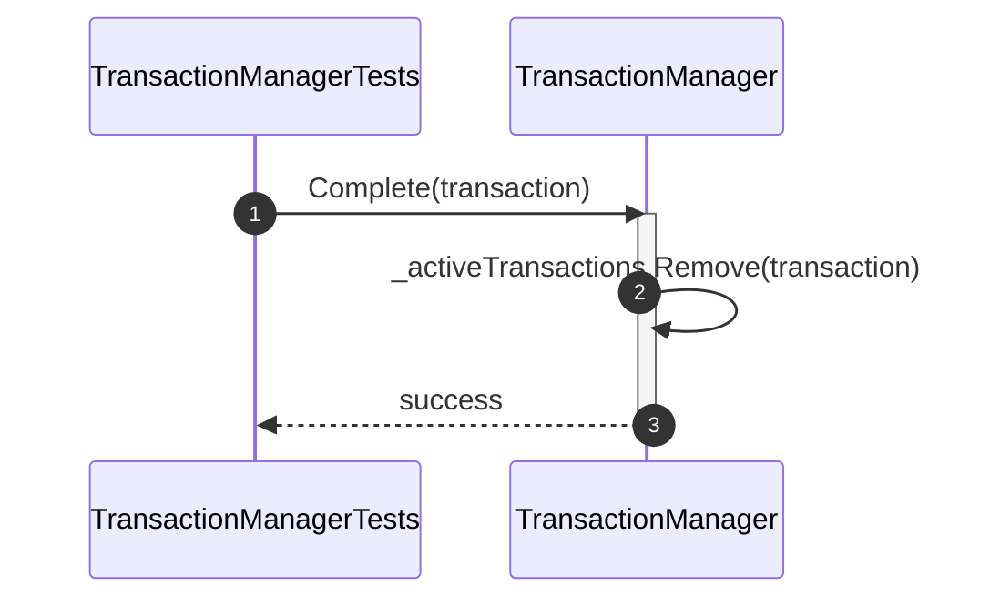
```mermaid
sequenceDiagram
    autonumber
    participant Test as TransactionManagerTests
    participant TM as TransactionManager

    Test->>TM: Complete(transaction)
    activate TM
    TM->>TM: _activeTransactions.Remove(transaction)
    TM-->>Test: success
    deactivate TM
```

## 3. LockManager Tests

### 3.1 Acquire_WhenSharedLocksAreCompatible_ShouldGrantLock

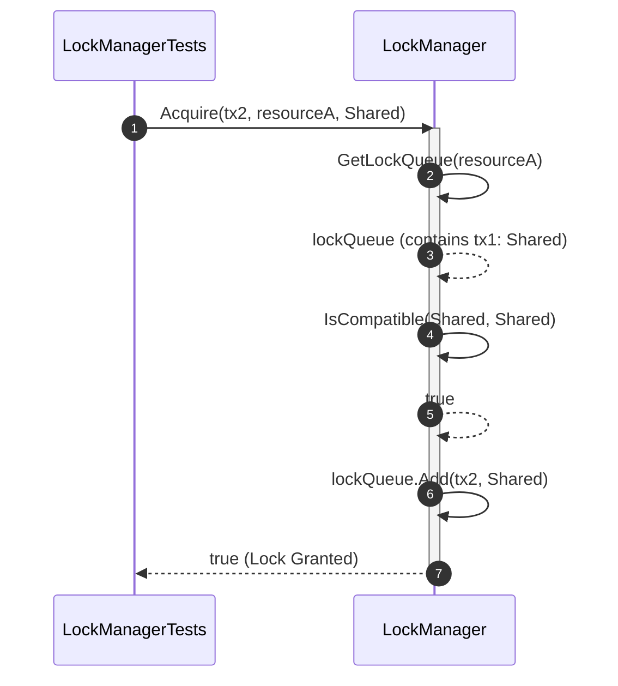
```mermaid
sequenceDiagram
    autonumber
    participant Test as LockManagerTests
    participant LM as LockManager

    Test->>LM: Acquire(tx2, resourceA, Shared)
    activate LM
    LM->>LM: GetLockQueue(resourceA)
    LM-->>LM: lockQueue (contains tx1: Shared)
    LM->>LM: IsCompatible(Shared, Shared)
    LM-->>LM: true
    LM->>LM: lockQueue.Add(tx2, Shared)
    LM-->>Test: true (Lock Granted)
    deactivate LM
```

### 3.2 Acquire_WhenLocksConflict_ShouldRejectOrWait

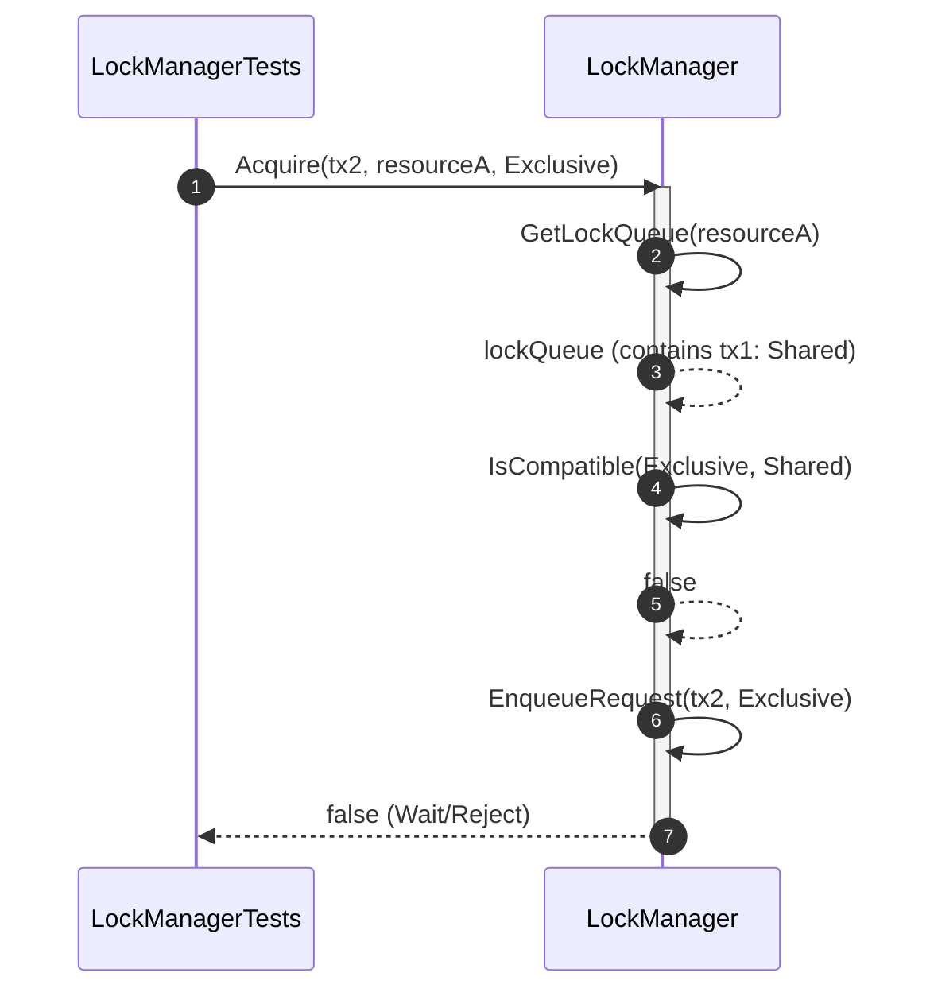
```mermaid
sequenceDiagram
    autonumber
    participant Test as LockManagerTests
    participant LM as LockManager

    Test->>LM: Acquire(tx2, resourceA, Exclusive)
    activate LM
    LM->>LM: GetLockQueue(resourceA)
    LM-->>LM: lockQueue (contains tx1: Shared)
    LM->>LM: IsCompatible(Exclusive, Shared)
    LM-->>LM: false
    LM->>LM: EnqueueRequest(tx2, Exclusive)
    LM-->>Test: false (Wait/Reject)
    deactivate LM
```

### 3.3 Acquire_WhenExclusiveLockExists_ShouldRejectOtherTransactions

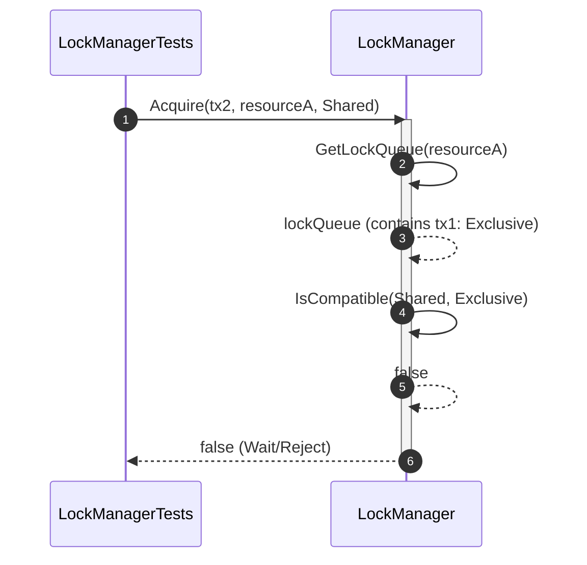
```mermaid
sequenceDiagram
    autonumber
    participant Test as LockManagerTests
    participant LM as LockManager

    Test->>LM: Acquire(tx2, resourceA, Shared)
    activate LM
    LM->>LM: GetLockQueue(resourceA)
    LM-->>LM: lockQueue (contains tx1: Exclusive)
    LM->>LM: IsCompatible(Shared, Exclusive)
    LM-->>LM: false
    LM-->>Test: false (Wait/Reject)
    deactivate LM
```

### 3.4 Upgrade_WhenTransactionIsSoleReader_ShouldGrantExclusiveLock

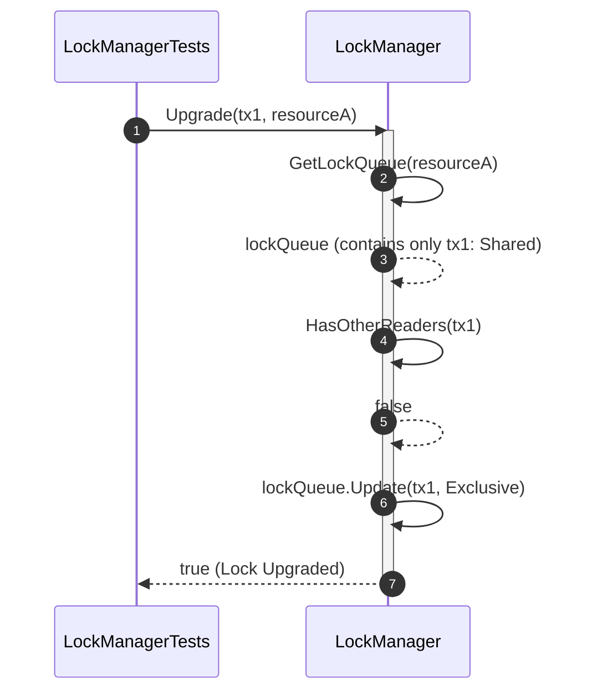
```mermaid
sequenceDiagram
    autonumber
    participant Test as LockManagerTests
    participant LM as LockManager

    Test->>LM: Upgrade(tx1, resourceA)
    activate LM
    LM->>LM: GetLockQueue(resourceA)
    LM-->>LM: lockQueue (contains only tx1: Shared)
    LM->>LM: HasOtherReaders(tx1)
    LM-->>LM: false
    LM->>LM: lockQueue.Update(tx1, Exclusive)
    LM-->>Test: true (Lock Upgraded)
    deactivate LM
```

### 3.5 Upgrade_WhenOtherReadersExist_ShouldRejectOrWait

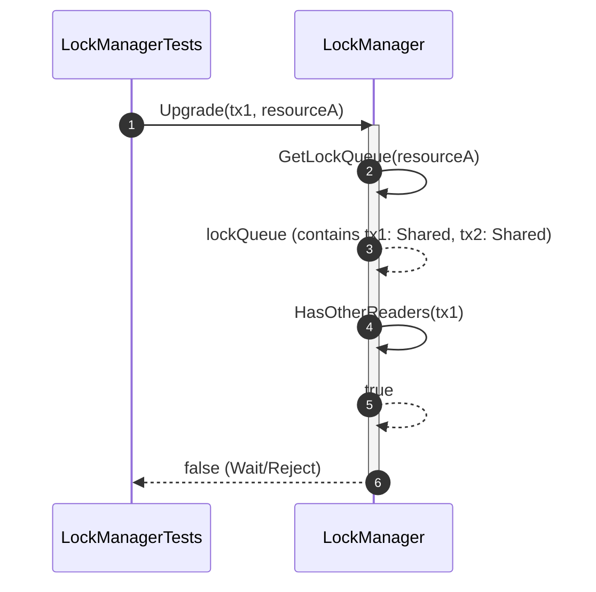
```mermaid
sequenceDiagram
    autonumber
    participant Test as LockManagerTests
    participant LM as LockManager

    Test->>LM: Upgrade(tx1, resourceA)
    activate LM
    LM->>LM: GetLockQueue(resourceA)
    LM-->>LM: lockQueue (contains tx1: Shared, tx2: Shared)
    LM->>LM: HasOtherReaders(tx1)
    LM-->>LM: true
    LM-->>Test: false (Wait/Reject)
    deactivate LM
```

### 3.6 Release_WhenLockExists_ShouldRemoveLock

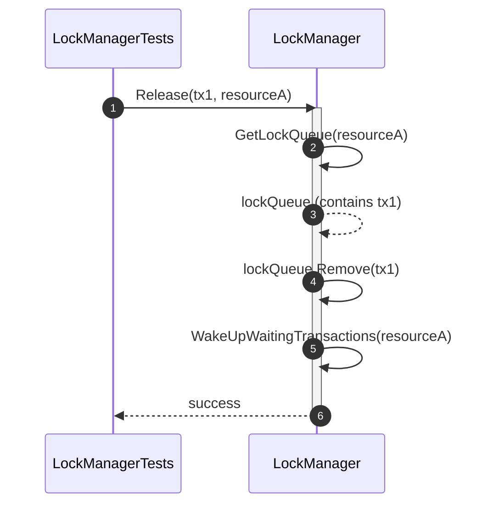
```mermaid
sequenceDiagram
    autonumber
    participant Test as LockManagerTests
    participant LM as LockManager

    Test->>LM: Release(tx1, resourceA)
    activate LM
    LM->>LM: GetLockQueue(resourceA)
    LM-->>LM: lockQueue (contains tx1)
    LM->>LM: lockQueue.Remove(tx1)
    LM->>LM: WakeUpWaitingTransactions(resourceA)
    LM-->>Test: success
    deactivate LM
```

### 3.7 ReleaseAll_WhenTransactionHasLocks_ShouldRemoveAllLocks

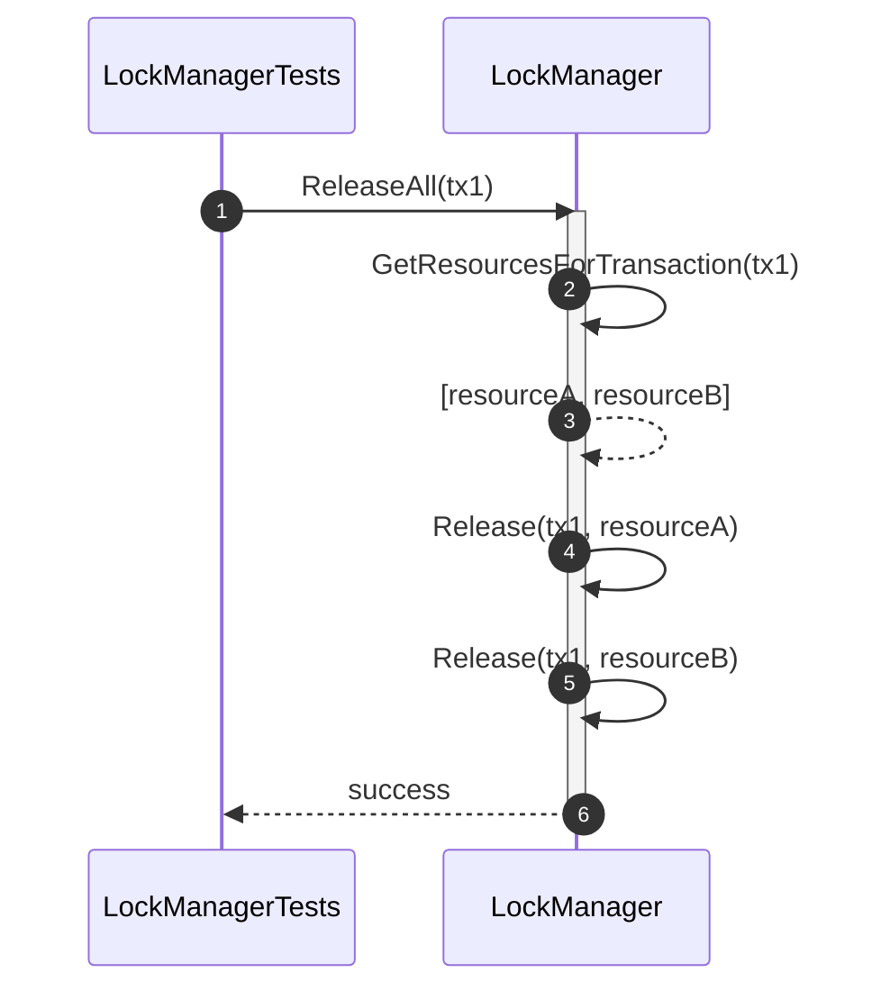
```mermaid
sequenceDiagram
    autonumber
    participant Test as LockManagerTests
    participant LM as LockManager

    Test->>LM: ReleaseAll(tx1)
    activate LM
    LM->>LM: GetResourcesForTransaction(tx1)
    LM-->>LM: [resourceA, resourceB]
    LM->>LM: Release(tx1, resourceA)
    LM->>LM: Release(tx1, resourceB)
    LM-->>Test: success
    deactivate LM
```

### 3.8 DetectDeadlock_WhenCycleExists_ShouldAbortVictimTransaction

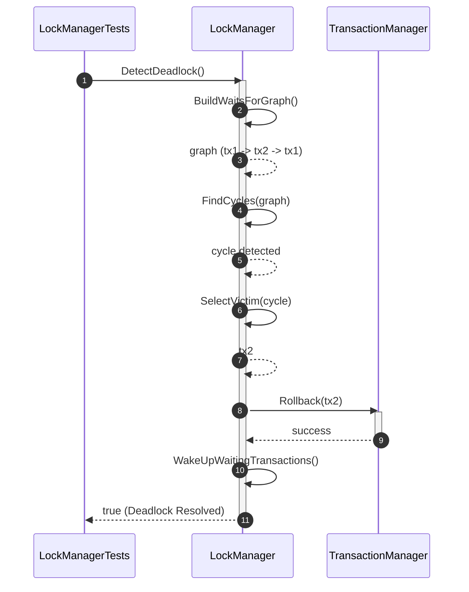
```mermaid
sequenceDiagram
    autonumber
    participant Test as LockManagerTests
    participant LM as LockManager
    participant TM as TransactionManager

    Test->>LM: DetectDeadlock()
    activate LM
    LM->>LM: BuildWaitsForGraph()
    LM-->>LM: graph (tx1 -> tx2 -> tx1)
    LM->>LM: FindCycles(graph)
    LM-->>LM: cycle detected
    LM->>LM: SelectVictim(cycle)
    LM-->>LM: tx2
    LM->>TM: Rollback(tx2)
    activate TM
    TM-->>LM: success
    deactivate TM
    LM->>LM: WakeUpWaitingTransactions()
    LM-->>Test: true (Deadlock Resolved)
    deactivate LM
```
