# Most Important Unit Tests Plan

## Progress Summary

| Category | Class | Total | Completed | Missing | Progress |
| --- | --- | --- | --- | --- | --- |
| Database Objects | Schema | 5 | 5 | 0 | 100% |
| Database Objects | Table | 11 | 11 | 0 | 100% |
| Database Objects | Column | 6 | 6 | 0 | 100% |
| Database Objects | Row | 6 | 6 | 0 | 100% |
| Database Objects | Constraint | 6 | 6 | 0 | 100% |
| Database Objects | CheckConstraint | 3 | 3 | 0 | 100% |
| Database Objects | UniqueConstraint | 4 | 4 | 0 | 100% |
| Database Objects | PrimaryKeyConstraint | 4 | 4 | 0 | 100% |
| Database Objects | ForeignKeyConstraint | 5 | 5 | 0 | 100% |
| Database Objects | Index | 8 | 8 | 0 | 100% |
| Database Management | DatabaseServer | 5 | 5 | 0 | 100% |
| Database Management | DatabaseManager | 6 | 6 | 0 | 100% |
| Database Management | Database | 8 | 8 | 0 | 100% |
| Database Management | CatalogManager | 5 | 5 | 0 | 100% |
| Transaction Management | Transaction | 6 | 6 | 0 | 100% |
| Transaction Management | TransactionManager | 5 | 5 | 0 | 100% |
| Transaction Management | LockManager | 8 | 8 | 0 | 100% |
| Storage Engine | BufferPool | 9 | 9 | 0 | 100% |
| Storage Engine | Page | 8 | 8 | 0 | 100% |
| Storage Engine | StorageEngine | 6 | 6 | 0 | 100% |
| Storage Engine | FileManager | 9 | 9 | 0 | 100% |
| Recovery & WAL | WAL | 5 | 0 | 5 | 0% |
| Recovery & WAL | Recovery | 5 | 0 | 5 | 0% |
| Query Processor | Lexer | 2 | 2 | 0 | 100% |
| Query Processor | Parser | 3 | 3 | 0 | 100% |
| Query Processor | Optimizer | 2 | 2 | 0 | 100% |
| Query Processor | Executor | 11 | 11 | 0 | 100% |
| Security | Authentication | 3 | 0 | 3 | 0% |
| Security | Authorization | 5 | 0 | 5 | 0% |
| **Total** | | **169** | **151** | **18** | **89%** |

## Database Objects

### Schema

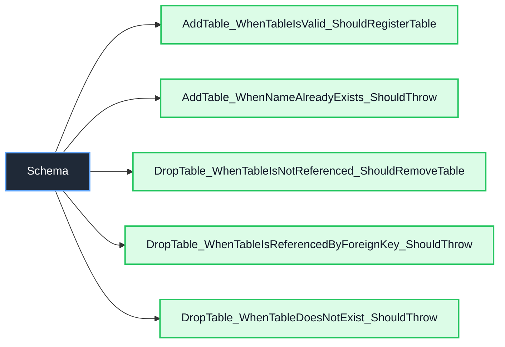
```mermaid
flowchart LR
    Class_Schema["Schema"]

    Class_Schema --> SCH_001["AddTable_WhenTableIsValid_ShouldRegisterTable"]
    Class_Schema --> SCH_002["AddTable_WhenNameAlreadyExists_ShouldThrow"]
    Class_Schema --> SCH_003["DropTable_WhenTableIsNotReferenced_ShouldRemoveTable"]
    Class_Schema --> SCH_004["DropTable_WhenTableIsReferencedByForeignKey_ShouldThrow"]
    Class_Schema --> SCH_005["DropTable_WhenTableDoesNotExist_ShouldThrow"]

    classDef classNode fill:#1f2937,stroke:#60a5fa,color:#ffffff,stroke-width:2px
    classDef completedTest fill:#dcfce7,stroke:#22c55e,color:#111827,stroke-width:2px
    classDef missingTest fill:#fee2e2,stroke:#ef4444,color:#111827,stroke-width:2px,stroke-dasharray:5 5

    class Class_Schema classNode
    class SCH_001,SCH_002,SCH_003,SCH_004,SCH_005 completedTest
```

### Table

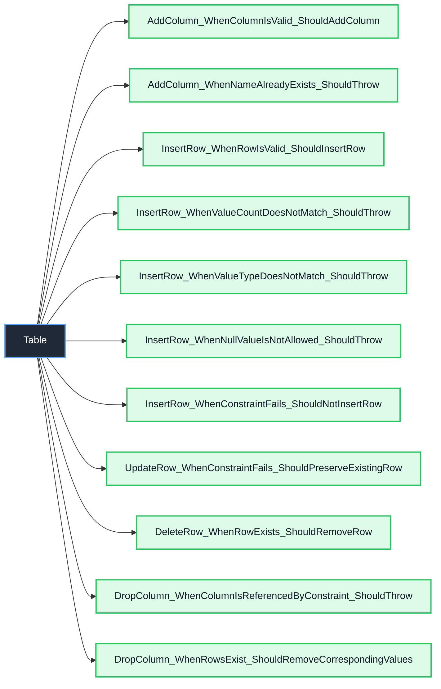
```mermaid
flowchart LR
    Class_Table["Table"]

    Class_Table --> TBL_001["AddColumn_WhenColumnIsValid_ShouldAddColumn"]
    Class_Table --> TBL_002["AddColumn_WhenNameAlreadyExists_ShouldThrow"]
    Class_Table --> TBL_003["InsertRow_WhenRowIsValid_ShouldInsertRow"]
    Class_Table --> TBL_004["InsertRow_WhenValueCountDoesNotMatch_ShouldThrow"]
    Class_Table --> TBL_005["InsertRow_WhenValueTypeDoesNotMatch_ShouldThrow"]
    Class_Table --> TBL_006["InsertRow_WhenNullValueIsNotAllowed_ShouldThrow"]
    Class_Table --> TBL_007["InsertRow_WhenConstraintFails_ShouldNotInsertRow"]
    Class_Table --> TBL_008["UpdateRow_WhenConstraintFails_ShouldPreserveExistingRow"]
    Class_Table --> TBL_009["DeleteRow_WhenRowExists_ShouldRemoveRow"]
    Class_Table --> TBL_010["DropColumn_WhenColumnIsReferencedByConstraint_ShouldThrow"]
    Class_Table --> TBL_011["DropColumn_WhenRowsExist_ShouldRemoveCorrespondingValues"]

    classDef classNode fill:#1f2937,stroke:#60a5fa,color:#ffffff,stroke-width:2px
    classDef completedTest fill:#dcfce7,stroke:#22c55e,color:#111827,stroke-width:2px
    classDef missingTest fill:#fee2e2,stroke:#ef4444,color:#111827,stroke-width:2px,stroke-dasharray: 5 5

    class Class_Table classNode
    class TBL_001,TBL_002,TBL_003,TBL_004,TBL_005,TBL_006,TBL_007,TBL_008,TBL_009,TBL_010,TBL_011 completedTest
```

### Column

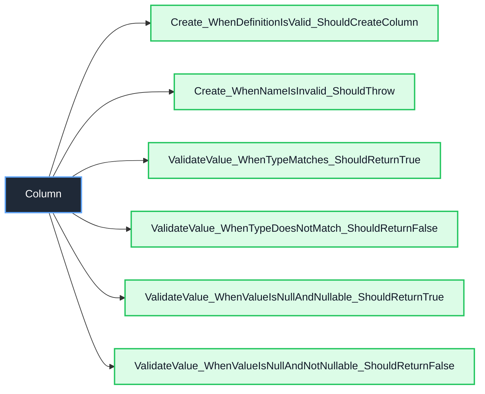
```mermaid
flowchart LR
    Class_Column["Column"]

    Class_Column --> COL_001["Create_WhenDefinitionIsValid_ShouldCreateColumn"]
    Class_Column --> COL_002["Create_WhenNameIsInvalid_ShouldThrow"]
    Class_Column --> COL_003["ValidateValue_WhenTypeMatches_ShouldReturnTrue"]
    Class_Column --> COL_004["ValidateValue_WhenTypeDoesNotMatch_ShouldReturnFalse"]
    Class_Column --> COL_005["ValidateValue_WhenValueIsNullAndNullable_ShouldReturnTrue"]
    Class_Column --> COL_006["ValidateValue_WhenValueIsNullAndNotNullable_ShouldReturnFalse"]

    classDef classNode fill:#1f2937,stroke:#60a5fa,color:#ffffff,stroke-width:2px
    classDef completedTest fill:#dcfce7,stroke:#22c55e,color:#111827,stroke-width:2px
    classDef missingTest fill:#fee2e2,stroke:#ef4444,color:#111827,stroke-width:2px,stroke-dasharray: 5 5

    class Class_Column classNode
    class COL_001,COL_002,COL_003,COL_004,COL_005,COL_006 completedTest
```

### Row

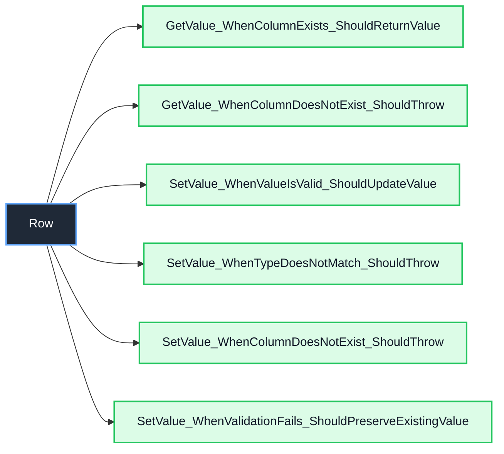
```mermaid
flowchart LR
    Class_Row["Row"]

    Class_Row --> ROW_001["GetValue_WhenColumnExists_ShouldReturnValue"]
    Class_Row --> ROW_002["GetValue_WhenColumnDoesNotExist_ShouldThrow"]
    Class_Row --> ROW_003["SetValue_WhenValueIsValid_ShouldUpdateValue"]
    Class_Row --> ROW_004["SetValue_WhenTypeDoesNotMatch_ShouldThrow"]
    Class_Row --> ROW_005["SetValue_WhenColumnDoesNotExist_ShouldThrow"]
    Class_Row --> ROW_006["SetValue_WhenValidationFails_ShouldPreserveExistingValue"]

    classDef classNode fill:#1f2937,stroke:#60a5fa,color:#ffffff,stroke-width:2px
    classDef completedTest fill:#dcfce7,stroke:#22c55e,color:#111827,stroke-width:2px
    classDef missingTest fill:#fee2e2,stroke:#ef4444,color:#111827,stroke-width:2px,stroke-dasharray: 5 5

    class Class_Row classNode
    class ROW_001,ROW_002,ROW_003,ROW_004,ROW_005,ROW_006 completedTest
```

### Constraint

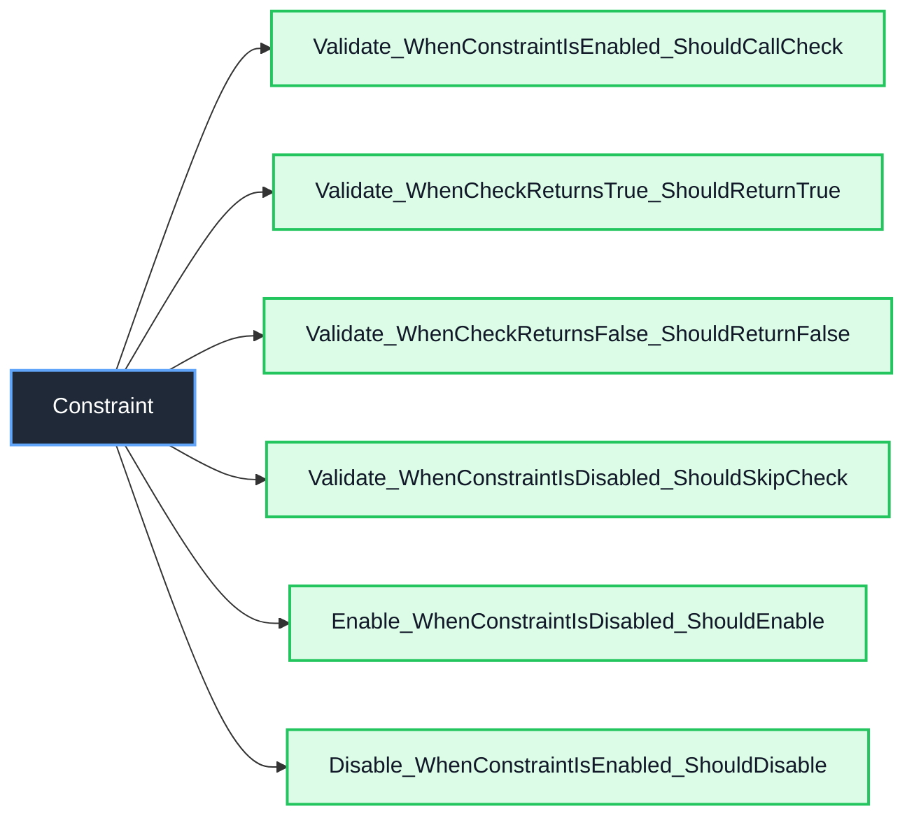
```mermaid
flowchart LR
    Class_Constraint["Constraint"]

    Class_Constraint --> CST_001["Validate_WhenConstraintIsEnabled_ShouldCallCheck"]
    Class_Constraint --> CST_002["Validate_WhenCheckReturnsTrue_ShouldReturnTrue"]
    Class_Constraint --> CST_003["Validate_WhenCheckReturnsFalse_ShouldReturnFalse"]
    Class_Constraint --> CST_004["Validate_WhenConstraintIsDisabled_ShouldSkipCheck"]
    Class_Constraint --> CST_005["Enable_WhenConstraintIsDisabled_ShouldEnable"]
    Class_Constraint --> CST_006["Disable_WhenConstraintIsEnabled_ShouldDisable"]

    classDef classNode fill:#1f2937,stroke:#60a5fa,color:#ffffff,stroke-width:2px
    classDef completedTest fill:#dcfce7,stroke:#22c55e,color:#111827,stroke-width:2px
    classDef missingTest fill:#fee2e2,stroke:#ef4444,color:#111827,stroke-width:2px,stroke-dasharray: 5 5

    class Class_Constraint classNode
    class CST_001,CST_002,CST_003,CST_004,CST_005,CST_006 completedTest
```

### CheckConstraint

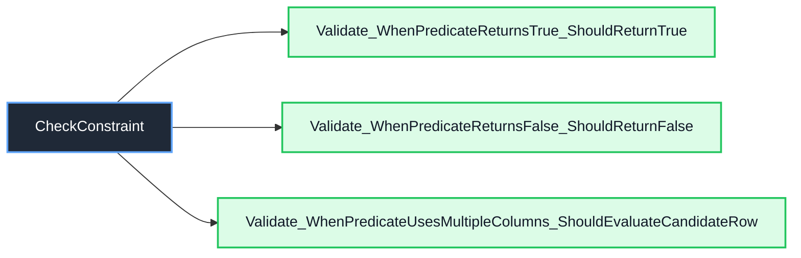
```mermaid
flowchart LR
    Class_CheckConstraint["CheckConstraint"]

    Class_CheckConstraint --> CHK_001["Validate_WhenPredicateReturnsTrue_ShouldReturnTrue"]
    Class_CheckConstraint --> CHK_002["Validate_WhenPredicateReturnsFalse_ShouldReturnFalse"]
    Class_CheckConstraint --> CHK_003["Validate_WhenPredicateUsesMultipleColumns_ShouldEvaluateCandidateRow"]

    classDef classNode fill:#1f2937,stroke:#60a5fa,color:#ffffff,stroke-width:2px
    classDef completedTest fill:#dcfce7,stroke:#22c55e,color:#111827,stroke-width:2px
    classDef missingTest fill:#fee2e2,stroke:#ef4444,color:#111827,stroke-width:2px,stroke-dasharray: 5 5

    class Class_CheckConstraint classNode
    class CHK_001,CHK_002,CHK_003 completedTest
```

### UniqueConstraint

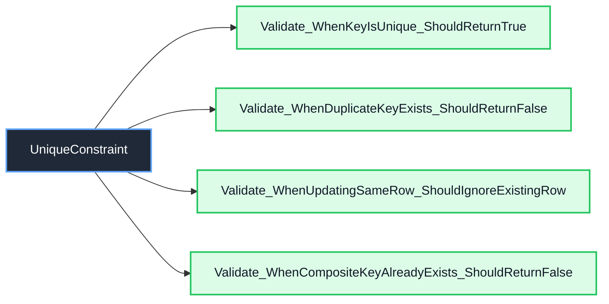
```mermaid
flowchart LR
    Class_UniqueConstraint["UniqueConstraint"]

    Class_UniqueConstraint --> UQ_001["Validate_WhenKeyIsUnique_ShouldReturnTrue"]
    Class_UniqueConstraint --> UQ_002["Validate_WhenDuplicateKeyExists_ShouldReturnFalse"]
    Class_UniqueConstraint --> UQ_003["Validate_WhenUpdatingSameRow_ShouldIgnoreExistingRow"]
    Class_UniqueConstraint --> UQ_004["Validate_WhenCompositeKeyAlreadyExists_ShouldReturnFalse"]

    classDef classNode fill:#1f2937,stroke:#60a5fa,color:#ffffff,stroke-width:2px
    classDef completedTest fill:#dcfce7,stroke:#22c55e,color:#111827,stroke-width:2px
    classDef missingTest fill:#fee2e2,stroke:#ef4444,color:#111827,stroke-width:2px,stroke-dasharray: 5 5

    class Class_UniqueConstraint classNode
    class UQ_001,UQ_002,UQ_003,UQ_004 completedTest
```

### PrimaryKeyConstraint

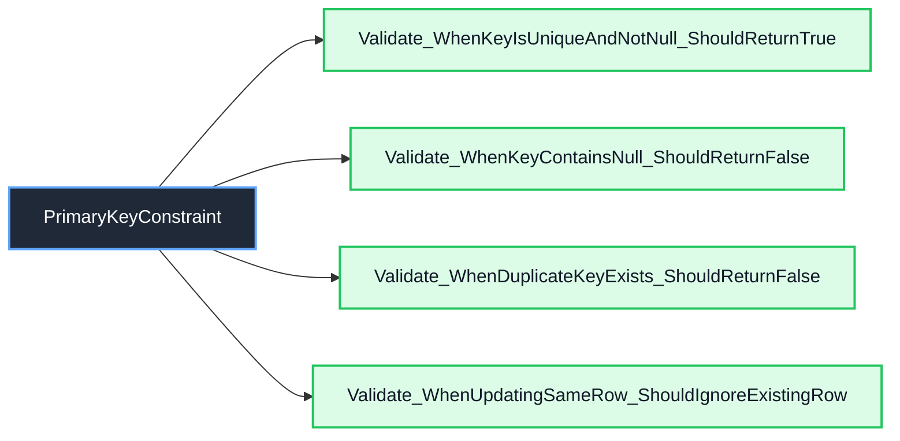
```mermaid
flowchart LR
    Class_PrimaryKeyConstraint["PrimaryKeyConstraint"]

    Class_PrimaryKeyConstraint --> PK_001["Validate_WhenKeyIsUniqueAndNotNull_ShouldReturnTrue"]
    Class_PrimaryKeyConstraint --> PK_002["Validate_WhenKeyContainsNull_ShouldReturnFalse"]
    Class_PrimaryKeyConstraint --> PK_003["Validate_WhenDuplicateKeyExists_ShouldReturnFalse"]
    Class_PrimaryKeyConstraint --> PK_004["Validate_WhenUpdatingSameRow_ShouldIgnoreExistingRow"]

    classDef classNode fill:#1f2937,stroke:#60a5fa,color:#ffffff,stroke-width:2px
    classDef completedTest fill:#dcfce7,stroke:#22c55e,color:#111827,stroke-width:2px
    classDef missingTest fill:#fee2e2,stroke:#ef4444,color:#111827,stroke-width:2px,stroke-dasharray: 5 5

    class Class_PrimaryKeyConstraint classNode
    class PK_001,PK_002,PK_003,PK_004 completedTest
```

### ForeignKeyConstraint

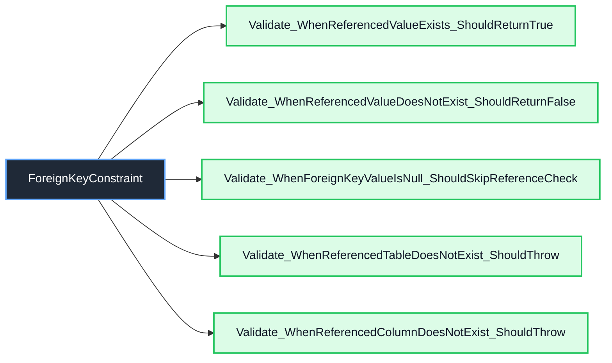
```mermaid
flowchart LR
    Class_ForeignKeyConstraint["ForeignKeyConstraint"]

    Class_ForeignKeyConstraint --> FK_001["Validate_WhenReferencedValueExists_ShouldReturnTrue"]
    Class_ForeignKeyConstraint --> FK_002["Validate_WhenReferencedValueDoesNotExist_ShouldReturnFalse"]
    Class_ForeignKeyConstraint --> FK_003["Validate_WhenForeignKeyValueIsNull_ShouldSkipReferenceCheck"]
    Class_ForeignKeyConstraint --> FK_004["Validate_WhenReferencedTableDoesNotExist_ShouldThrow"]
    Class_ForeignKeyConstraint --> FK_005["Validate_WhenReferencedColumnDoesNotExist_ShouldThrow"]

    classDef classNode fill:#1f2937,stroke:#60a5fa,color:#ffffff,stroke-width:2px
    classDef completedTest fill:#dcfce7,stroke:#22c55e,color:#111827,stroke-width:2px
    classDef missingTest fill:#fee2e2,stroke:#ef4444,color:#111827,stroke-width:2px,stroke-dasharray: 5 5

    class Class_ForeignKeyConstraint classNode
    class FK_001,FK_002,FK_003,FK_004,FK_005 completedTest
```

### Index

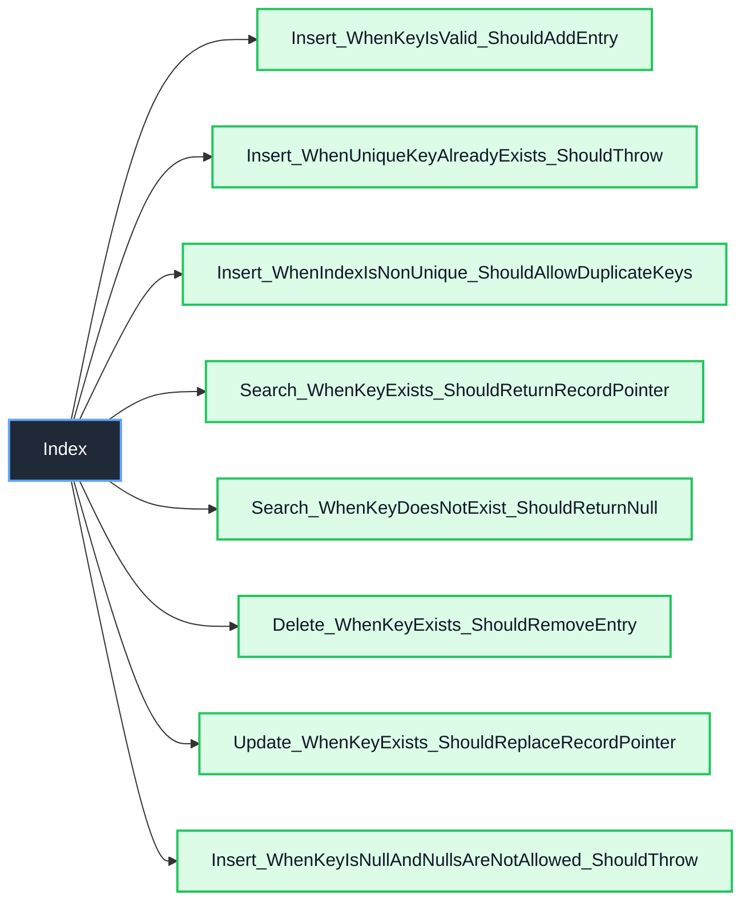
```mermaid
flowchart LR
    Class_Index["Index"]

    Class_Index --> IDX_001["Insert_WhenKeyIsValid_ShouldAddEntry"]
    Class_Index --> IDX_002["Insert_WhenUniqueKeyAlreadyExists_ShouldThrow"]
    Class_Index --> IDX_003["Insert_WhenIndexIsNonUnique_ShouldAllowDuplicateKeys"]
    Class_Index --> IDX_004["Search_WhenKeyExists_ShouldReturnRecordPointer"]
    Class_Index --> IDX_005["Search_WhenKeyDoesNotExist_ShouldReturnNull"]
    Class_Index --> IDX_006["Delete_WhenKeyExists_ShouldRemoveEntry"]
    Class_Index --> IDX_007["Update_WhenKeyExists_ShouldReplaceRecordPointer"]
    Class_Index --> IDX_008["Insert_WhenKeyIsNullAndNullsAreNotAllowed_ShouldThrow"]

    classDef classNode fill:#1f2937,stroke:#60a5fa,color:#ffffff,stroke-width:2px
    classDef completedTest fill:#dcfce7,stroke:#22c55e,color:#111827,stroke-width:2px
    classDef missingTest fill:#fee2e2,stroke:#ef4444,color:#111827,stroke-width:2px,stroke-dasharray: 5 5

    class Class_Index classNode
    class IDX_001,IDX_002,IDX_003,IDX_004,IDX_005,IDX_006,IDX_007,IDX_008 completedTest
```

## Database Management

### DatabaseServer

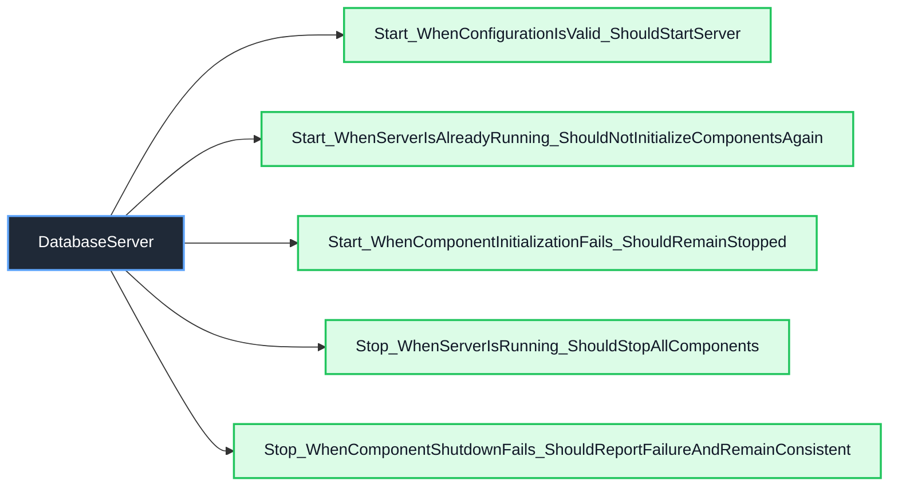
```mermaid
flowchart LR
    Class_DatabaseServer["DatabaseServer"]

    Class_DatabaseServer --> SRV_001["Start_WhenConfigurationIsValid_ShouldStartServer"]
    Class_DatabaseServer --> SRV_002["Start_WhenServerIsAlreadyRunning_ShouldNotInitializeComponentsAgain"]
    Class_DatabaseServer --> SRV_003["Start_WhenComponentInitializationFails_ShouldRemainStopped"]
    Class_DatabaseServer --> SRV_004["Stop_WhenServerIsRunning_ShouldStopAllComponents"]
    Class_DatabaseServer --> SRV_005["Stop_WhenComponentShutdownFails_ShouldReportFailureAndRemainConsistent"]

    classDef classNode fill:#1f2937,stroke:#60a5fa,color:#ffffff,stroke-width:2px
    classDef completedTest fill:#dcfce7,stroke:#22c55e,color:#111827,stroke-width:2px
    classDef missingTest fill:#fee2e2,stroke:#ef4444,color:#111827,stroke-width:2px,stroke-dasharray: 5 5

    class Class_DatabaseServer classNode
    class SRV_001,SRV_002,SRV_003,SRV_004,SRV_005 completedTest
```

### DatabaseManager

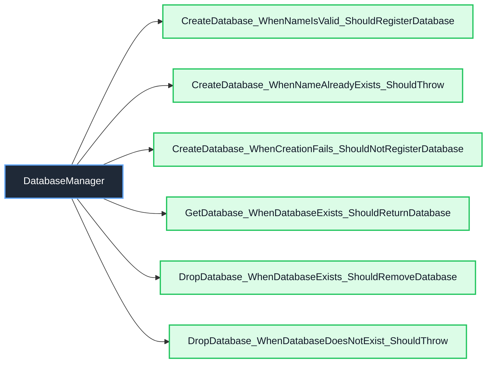
```mermaid
flowchart LR
    Class_DatabaseManager["DatabaseManager"]

    Class_DatabaseManager --> MGR_001["CreateDatabase_WhenNameIsValid_ShouldRegisterDatabase"]
    Class_DatabaseManager --> MGR_002["CreateDatabase_WhenNameAlreadyExists_ShouldThrow"]
    Class_DatabaseManager --> MGR_003["CreateDatabase_WhenCreationFails_ShouldNotRegisterDatabase"]
    Class_DatabaseManager --> MGR_004["GetDatabase_WhenDatabaseExists_ShouldReturnDatabase"]
    Class_DatabaseManager --> MGR_005["DropDatabase_WhenDatabaseExists_ShouldRemoveDatabase"]
    Class_DatabaseManager --> MGR_006["DropDatabase_WhenDatabaseDoesNotExist_ShouldThrow"]

    classDef classNode fill:#1f2937,stroke:#60a5fa,color:#ffffff,stroke-width:2px
    classDef completedTest fill:#dcfce7,stroke:#22c55e,color:#111827,stroke-width:2px
    classDef missingTest fill:#fee2e2,stroke:#ef4444,color:#111827,stroke-width:2px,stroke-dasharray: 5 5

    class Class_DatabaseManager classNode
    class MGR_001,MGR_002,MGR_003,MGR_004,MGR_005,MGR_006 completedTest
```

### Database

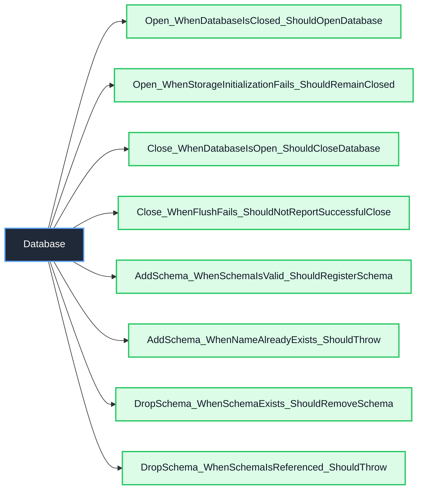
```mermaid
flowchart LR
    Class_Database["Database"]

    Class_Database --> DB_001["Open_WhenDatabaseIsClosed_ShouldOpenDatabase"]
    Class_Database --> DB_002["Open_WhenStorageInitializationFails_ShouldRemainClosed"]
    Class_Database --> DB_003["Close_WhenDatabaseIsOpen_ShouldCloseDatabase"]
    Class_Database --> DB_004["Close_WhenFlushFails_ShouldNotReportSuccessfulClose"]
    Class_Database --> DB_005["AddSchema_WhenSchemaIsValid_ShouldRegisterSchema"]
    Class_Database --> DB_006["AddSchema_WhenNameAlreadyExists_ShouldThrow"]
    Class_Database --> DB_007["DropSchema_WhenSchemaExists_ShouldRemoveSchema"]
    Class_Database --> DB_008["DropSchema_WhenSchemaIsReferenced_ShouldThrow"]

    classDef classNode fill:#1f2937,stroke:#60a5fa,color:#ffffff,stroke-width:2px
    classDef completedTest fill:#dcfce7,stroke:#22c55e,color:#111827,stroke-width:2px
    classDef missingTest fill:#fee2e2,stroke:#ef4444,color:#111827,stroke-width:2px,stroke-dasharray: 5 5

    class Class_Database classNode
    class DB_001,DB_002,DB_003,DB_004,DB_005,DB_006,DB_007,DB_008 completedTest
```

### CatalogManager

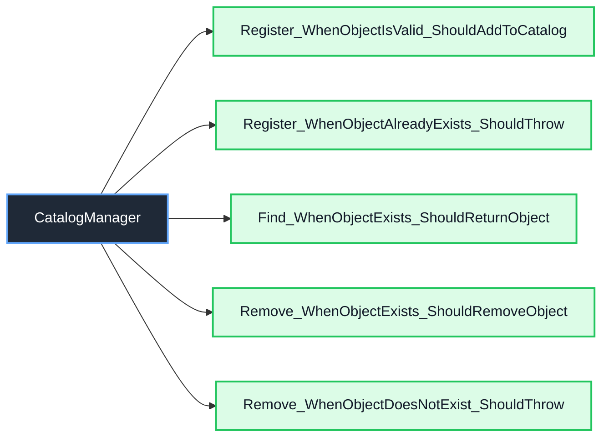
```mermaid
flowchart LR
    Class_CatalogManager["CatalogManager"]

    Class_CatalogManager --> CAT_001["Register_WhenObjectIsValid_ShouldAddToCatalog"]
    Class_CatalogManager --> CAT_002["Register_WhenObjectAlreadyExists_ShouldThrow"]
    Class_CatalogManager --> CAT_003["Find_WhenObjectExists_ShouldReturnObject"]
    Class_CatalogManager --> CAT_004["Remove_WhenObjectExists_ShouldRemoveObject"]
    Class_CatalogManager --> CAT_005["Remove_WhenObjectDoesNotExist_ShouldThrow"]

    classDef classNode fill:#1f2937,stroke:#60a5fa,color:#ffffff,stroke-width:2px
    classDef completedTest fill:#dcfce7,stroke:#22c55e,color:#111827,stroke-width:2px
    classDef missingTest fill:#fee2e2,stroke:#ef4444,color:#111827,stroke-width:2px,stroke-dasharray: 5 5

    class Class_CatalogManager classNode
    class CAT_001,CAT_002,CAT_003,CAT_004,CAT_005 completedTest
```

## Transaction Management

### Transaction

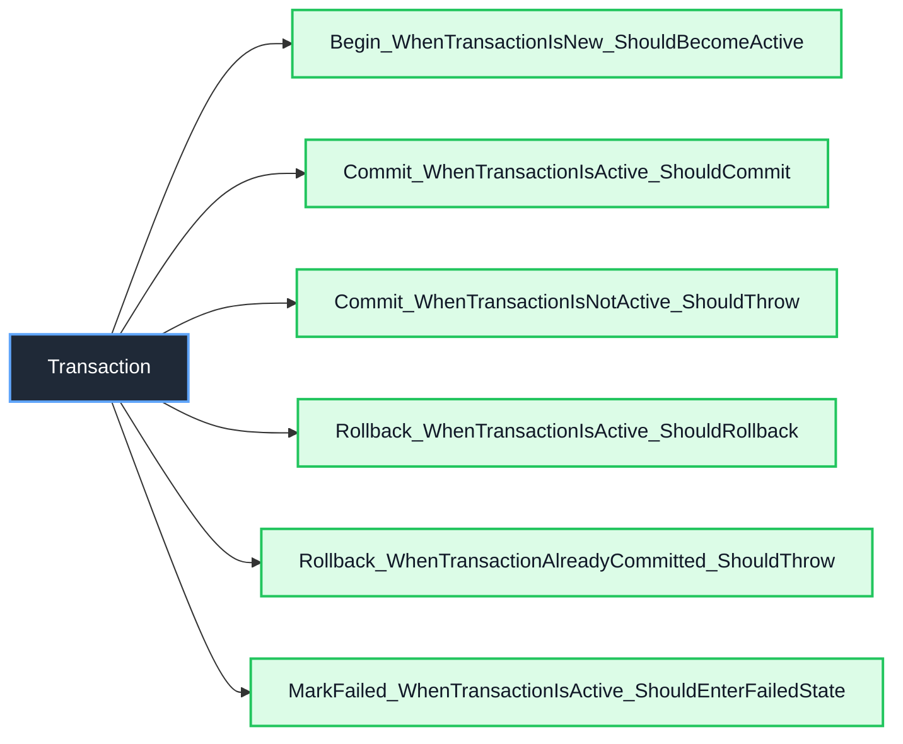
```mermaid
flowchart LR
    Class_Transaction["Transaction"]

    Class_Transaction --> TX_001["Begin_WhenTransactionIsNew_ShouldBecomeActive"]
    Class_Transaction --> TX_002["Commit_WhenTransactionIsActive_ShouldCommit"]
    Class_Transaction --> TX_003["Commit_WhenTransactionIsNotActive_ShouldThrow"]
    Class_Transaction --> TX_004["Rollback_WhenTransactionIsActive_ShouldRollback"]
    Class_Transaction --> TX_005["Rollback_WhenTransactionAlreadyCommitted_ShouldThrow"]
    Class_Transaction --> TX_006["MarkFailed_WhenTransactionIsActive_ShouldEnterFailedState"]

    classDef classNode fill:#1f2937,stroke:#60a5fa,color:#ffffff,stroke-width:2px
    classDef completedTest fill:#dcfce7,stroke:#22c55e,color:#111827,stroke-width:2px
    classDef missingTest fill:#fee2e2,stroke:#ef4444,color:#111827,stroke-width:2px,stroke-dasharray: 5 5

    class Class_Transaction classNode
    class TX_001,TX_002,TX_003,TX_004,TX_005,TX_006 completedTest
```

### TransactionManager

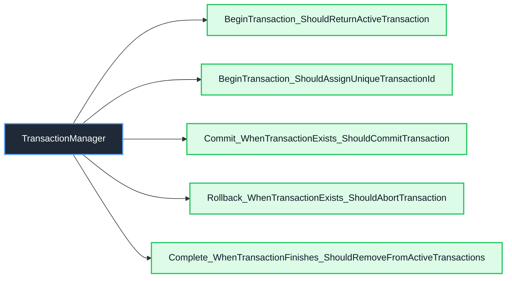
```mermaid
flowchart LR
    Class_TransactionManager["TransactionManager"]

    Class_TransactionManager --> MGR_001["BeginTransaction_ShouldReturnActiveTransaction"]
    Class_TransactionManager --> MGR_002["BeginTransaction_ShouldAssignUniqueTransactionId"]
    Class_TransactionManager --> MGR_003["Commit_WhenTransactionExists_ShouldCommitTransaction"]
    Class_TransactionManager --> MGR_004["Rollback_WhenTransactionExists_ShouldAbortTransaction"]
    Class_TransactionManager --> MGR_005["Complete_WhenTransactionFinishes_ShouldRemoveFromActiveTransactions"]

    classDef classNode fill:#1f2937,stroke:#60a5fa,color:#ffffff,stroke-width:2px
    classDef completedTest fill:#dcfce7,stroke:#22c55e,color:#111827,stroke-width:2px
    classDef missingTest fill:#fee2e2,stroke:#ef4444,color:#111827,stroke-width:2px,stroke-dasharray: 5 5

    class Class_TransactionManager classNode
    class MGR_001,MGR_002,MGR_003,MGR_004,MGR_005 completedTest
```

### LockManager

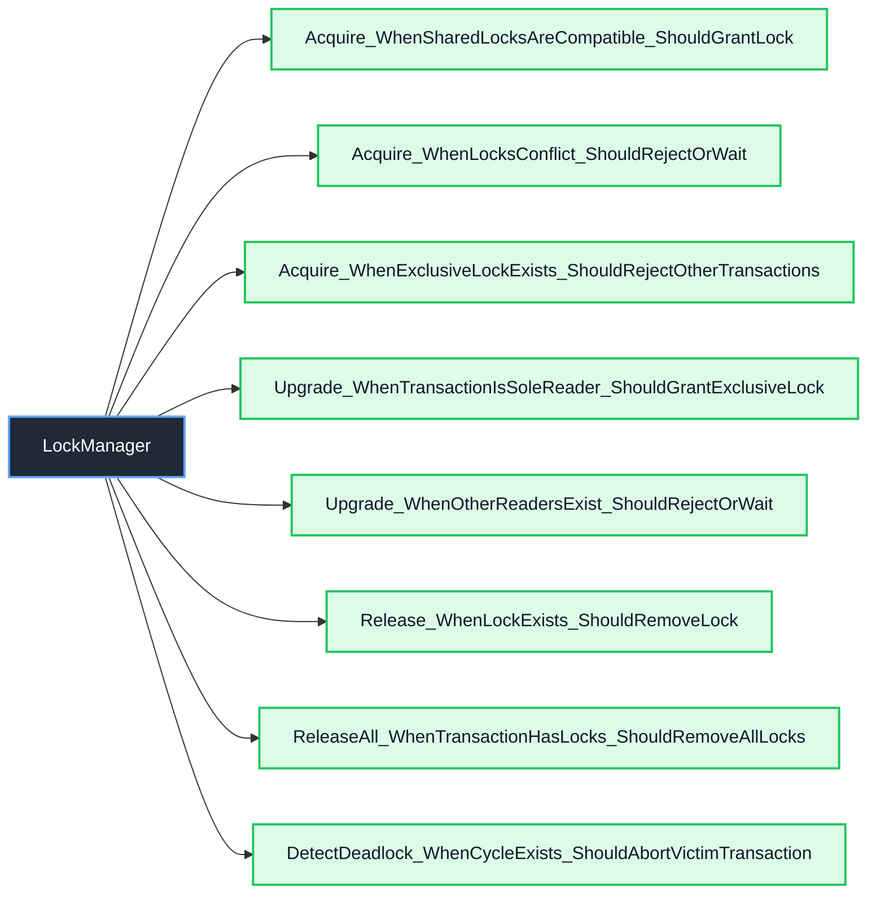
```mermaid
flowchart LR
    Class_LockManager["LockManager"]

    Class_LockManager --> LCK_001["Acquire_WhenSharedLocksAreCompatible_ShouldGrantLock"]
    Class_LockManager --> LCK_002["Acquire_WhenLocksConflict_ShouldRejectOrWait"]
    Class_LockManager --> LCK_003["Acquire_WhenExclusiveLockExists_ShouldRejectOtherTransactions"]
    Class_LockManager --> LCK_004["Upgrade_WhenTransactionIsSoleReader_ShouldGrantExclusiveLock"]
    Class_LockManager --> LCK_005["Upgrade_WhenOtherReadersExist_ShouldRejectOrWait"]
    Class_LockManager --> LCK_006["Release_WhenLockExists_ShouldRemoveLock"]
    Class_LockManager --> LCK_007["ReleaseAll_WhenTransactionHasLocks_ShouldRemoveAllLocks"]
    Class_LockManager --> LCK_008["DetectDeadlock_WhenCycleExists_ShouldAbortVictimTransaction"]

    classDef classNode fill:#1f2937,stroke:#60a5fa,color:#ffffff,stroke-width:2px
    classDef completedTest fill:#dcfce7,stroke:#22c55e,color:#111827,stroke-width:2px
    classDef missingTest fill:#fee2e2,stroke:#ef4444,color:#111827,stroke-width:2px,stroke-dasharray: 5 5

    class Class_LockManager classNode
    class LCK_001,LCK_002,LCK_003,LCK_004,LCK_005,LCK_006,LCK_007,LCK_008 completedTest
```

## Storage Engine

### BufferPool

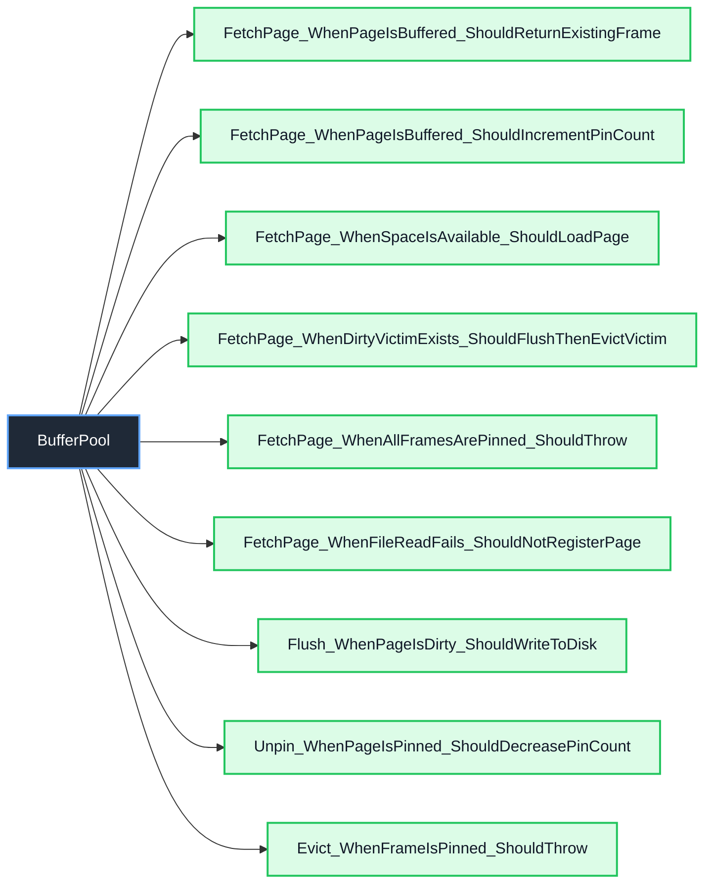
```mermaid
flowchart LR
    Class_BufferPool["BufferPool"]

    Class_BufferPool --> BP_001["FetchPage_WhenPageIsBuffered_ShouldReturnExistingFrame"]
    Class_BufferPool --> BP_002["FetchPage_WhenPageIsBuffered_ShouldIncrementPinCount"]
    Class_BufferPool --> BP_003["FetchPage_WhenSpaceIsAvailable_ShouldLoadPage"]
    Class_BufferPool --> BP_004["FetchPage_WhenDirtyVictimExists_ShouldFlushThenEvictVictim"]
    Class_BufferPool --> BP_005["FetchPage_WhenAllFramesArePinned_ShouldThrow"]
    Class_BufferPool --> BP_006["FetchPage_WhenFileReadFails_ShouldNotRegisterPage"]
    Class_BufferPool --> BP_007["Flush_WhenPageIsDirty_ShouldWriteToDisk"]
    Class_BufferPool --> BP_008["Unpin_WhenPageIsPinned_ShouldDecreasePinCount"]
    Class_BufferPool --> BP_009["Evict_WhenFrameIsPinned_ShouldThrow"]

    classDef classNode fill:#1f2937,stroke:#60a5fa,color:#ffffff,stroke-width:2px
    classDef completedTest fill:#dcfce7,stroke:#22c55e,color:#111827,stroke-width:2px
    classDef missingTest fill:#fee2e2,stroke:#ef4444,color:#111827,stroke-width:2px,stroke-dasharray: 5 5

    class Class_BufferPool classNode
    class BP_001,BP_002,BP_003,BP_004,BP_005,BP_006,BP_007,BP_008,BP_009 completedTest
```

### Page

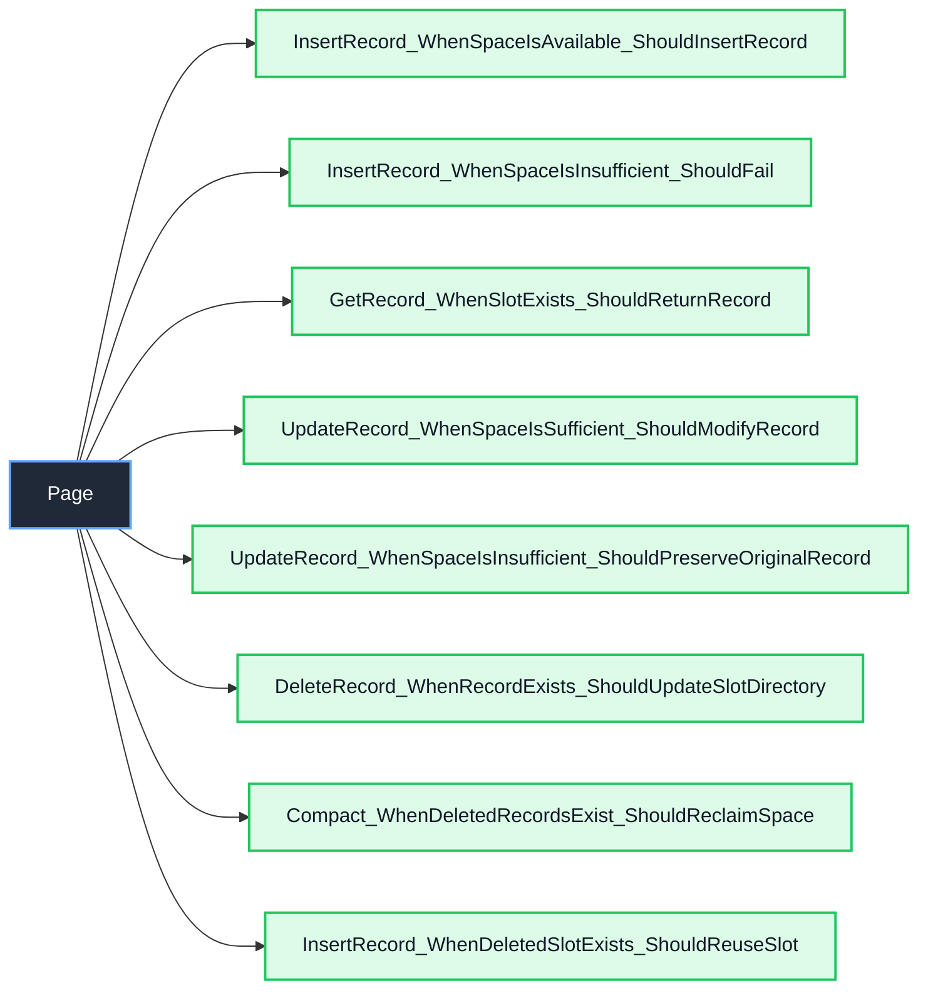
```mermaid
flowchart LR
    Class_Page["Page"]

    Class_Page --> PG_001["InsertRecord_WhenSpaceIsAvailable_ShouldInsertRecord"]
    Class_Page --> PG_002["InsertRecord_WhenSpaceIsInsufficient_ShouldFail"]
    Class_Page --> PG_003["GetRecord_WhenSlotExists_ShouldReturnRecord"]
    Class_Page --> PG_004["UpdateRecord_WhenSpaceIsSufficient_ShouldModifyRecord"]
    Class_Page --> PG_005["UpdateRecord_WhenSpaceIsInsufficient_ShouldPreserveOriginalRecord"]
    Class_Page --> PG_006["DeleteRecord_WhenRecordExists_ShouldUpdateSlotDirectory"]
    Class_Page --> PG_007["Compact_WhenDeletedRecordsExist_ShouldReclaimSpace"]
    Class_Page --> PG_008["InsertRecord_WhenDeletedSlotExists_ShouldReuseSlot"]

    classDef classNode fill:#1f2937,stroke:#60a5fa,color:#ffffff,stroke-width:2px
    classDef completedTest fill:#dcfce7,stroke:#22c55e,color:#111827,stroke-width:2px
    classDef missingTest fill:#fee2e2,stroke:#ef4444,color:#111827,stroke-width:2px,stroke-dasharray: 5 5

    class Class_Page classNode
    class PG_001,PG_002,PG_003,PG_004,PG_005,PG_006,PG_007,PG_008 completedTest
```

### StorageEngine

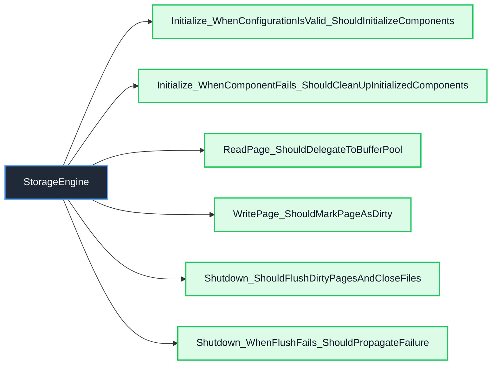
```mermaid
flowchart LR
    Class_StorageEngine["StorageEngine"]

    Class_StorageEngine --> ENG_001["Initialize_WhenConfigurationIsValid_ShouldInitializeComponents"]
    Class_StorageEngine --> ENG_002["Initialize_WhenComponentFails_ShouldCleanUpInitializedComponents"]
    Class_StorageEngine --> ENG_003["ReadPage_ShouldDelegateToBufferPool"]
    Class_StorageEngine --> ENG_004["WritePage_ShouldMarkPageAsDirty"]
    Class_StorageEngine --> ENG_005["Shutdown_ShouldFlushDirtyPagesAndCloseFiles"]
    Class_StorageEngine --> ENG_006["Shutdown_WhenFlushFails_ShouldPropagateFailure"]

    classDef classNode fill:#1f2937,stroke:#60a5fa,color:#ffffff,stroke-width:2px
    classDef completedTest fill:#dcfce7,stroke:#22c55e,color:#111827,stroke-width:2px
    classDef missingTest fill:#fee2e2,stroke:#ef4444,color:#111827,stroke-width:2px,stroke-dasharray: 5 5

    class Class_StorageEngine classNode
    class ENG_001,ENG_002,ENG_003,ENG_004,ENG_005,ENG_006 completedTest
```

### FileManager

```mermaid
flowchart LR
    Class_FileManager["FileManager"]

    Class_FileManager --> FM_001["CreateFile_WhenPathIsValid_ShouldCreateFile"]
    Class_FileManager --> FM_002["CreateFile_WhenFileAlreadyExists_ShouldThrow"]
    Class_FileManager --> FM_003["CreateFile_WhenPhysicalCreationFails_ShouldNotRegisterFile"]
    Class_FileManager --> FM_004["OpenFile_WhenFileExists_ShouldReturnHandle"]
    Class_FileManager --> FM_005["OpenFile_WhenAccessModeConflicts_ShouldThrow"]
    Class_FileManager --> FM_006["ReadPage_WhenFileIsClosed_ShouldThrow"]
    Class_FileManager --> FM_007["WritePage_WhenFileIsReadOnly_ShouldThrow"]
    Class_FileManager --> FM_008["CloseFile_WhenFileIsOpen_ShouldCloseHandle"]
    Class_FileManager --> FM_009["DeleteFile_WhenFileIsInUse_ShouldThrow"]

    classDef classNode fill:#1f2937,stroke:#60a5fa,color:#ffffff,stroke-width:2px
    classDef completedTest fill:#dcfce7,stroke:#22c55e,color:#111827,stroke-width:2px
    classDef missingTest fill:#fee2e2,stroke:#ef4444,color:#111827,stroke-width:2px,stroke-dasharray: 5 5

    class Class_FileManager classNode
    class FM_001,FM_002,FM_003,FM_004,FM_005,FM_006,FM_007,FM_008,FM_009 completedTest
```

## Recovery & WAL

### WAL

```mermaid
flowchart LR
    Class_WAL["WAL"]

    Class_WAL --> WAL_001["Append_WhenRecordIsValid_ShouldAssignLSN"]
    Class_WAL --> WAL_002["Append_WhenWriteFails_ShouldNotAdvanceDurableLSN"]
    Class_WAL --> WAL_003["Flush_WhenTargetLSNExists_ShouldPersistRecords"]
    Class_WAL --> WAL_004["Flush_WhenTargetLSNIsAlreadyDurable_ShouldDoNothing"]
    Class_WAL --> WAL_005["Flush_WhenTargetLSNDoesNotExist_ShouldThrow"]

    classDef classNode fill:#1f2937,stroke:#60a5fa,color:#ffffff,stroke-width:2px
    classDef completedTest fill:#dcfce7,stroke:#22c55e,color:#111827,stroke-width:2px
    classDef missingTest fill:#fee2e2,stroke:#ef4444,color:#111827,stroke-width:2px,stroke-dasharray: 5 5

    class Class_WAL classNode
    class WAL_001,WAL_002,WAL_003,WAL_004,WAL_005 missingTest
```

### Recovery

```mermaid
flowchart LR
    Class_Recovery["Recovery"]

    Class_Recovery --> REC_001["Recover_ShouldRedoCommittedTransactions"]
    Class_Recovery --> REC_002["Recover_ShouldUndoUncommittedTransactions"]
    Class_Recovery --> REC_003["Recover_WhenLogIsEmpty_ShouldCompleteSuccessfully"]
    Class_Recovery --> REC_004["Recover_WhenLogRecordIsCorrupted_ShouldFailSafely"]
    Class_Recovery --> REC_005["Recover_WhenRedoFails_ShouldNotReportSuccessfulRecovery"]

    classDef classNode fill:#1f2937,stroke:#60a5fa,color:#ffffff,stroke-width:2px
    classDef completedTest fill:#dcfce7,stroke:#22c55e,color:#111827,stroke-width:2px
    classDef missingTest fill:#fee2e2,stroke:#ef4444,color:#111827,stroke-width:2px,stroke-dasharray: 5 5

    class Class_Recovery classNode
    class REC_001,REC_002,REC_003,REC_004,REC_005 missingTest
```

## Query Processor

### Unit Test Execution Sequence

```mermaid
sequenceDiagram
    participant Test as Unit Test
    participant QP as QueryProcessor
    participant L as Lexer
    participant P as Parser
    participant SA as SemanticAnalyzer
    participant O as Optimizer
    participant E as Executor

    Test->>QP: ExecuteQuery(sqlString)
    QP->>L: Tokenize(sqlString)
    L-->>QP: List<Token>
    QP->>P: Parse(tokens)
    P-->>QP: AST
    QP->>SA: Analyze(AST)
    SA-->>QP: LogicalPlan
    QP->>O: Optimize(LogicalPlan)
    O-->>QP: PhysicalPlan
    QP->>E: Execute(PhysicalPlan)
    E-->>QP: ResultSet
    QP-->>Test: ResultSet
    Test->>Test: Assert result / state
```

### Lexer

```mermaid
flowchart LR
    Class_Lexer["Lexer"]

    Class_Lexer --> LEX_001["Tokenize_WhenSQLIsValid_ShouldReturnTokens"]
    Class_Lexer --> LEX_002["Tokenize_WhenTokenIsInvalid_ShouldThrow"]

    classDef classNode fill:#1f2937,stroke:#60a5fa,color:#ffffff,stroke-width:2px
    classDef completedTest fill:#dcfce7,stroke:#22c55e,color:#111827,stroke-width:2px
    classDef missingTest fill:#fee2e2,stroke:#ef4444,color:#111827,stroke-width:2px,stroke-dasharray: 5 5

    class Class_Lexer classNode
    class LEX_001,LEX_002 completedTest
```

### Parser

```mermaid
flowchart LR
    Class_Parser["Parser"]

    Class_Parser --> PAR_001["Parse_WhenSelectIsValid_ShouldReturnAST"]
    Class_Parser --> PAR_002["Parse_WhenSyntaxIsInvalid_ShouldThrow"]
    Class_Parser --> PAR_003["Parse_WhenInputIsEmpty_ShouldThrow"]

    classDef classNode fill:#1f2937,stroke:#60a5fa,color:#ffffff,stroke-width:2px
    classDef completedTest fill:#dcfce7,stroke:#22c55e,color:#111827,stroke-width:2px
    classDef missingTest fill:#fee2e2,stroke:#ef4444,color:#111827,stroke-width:2px,stroke-dasharray: 5 5

    class Class_Parser classNode
    class PAR_001,PAR_002,PAR_003 completedTest
```

### Semantic Analyzer

```mermaid
flowchart LR
    Class_Semantic["SemanticAnalyzer"]

    Class_Semantic --> SEM_001["Analyze_WhenASTIsValid_ShouldReturnLogicalPlan"]
    Class_Semantic --> SEM_002["Analyze_WhenTableDoesNotExist_ShouldThrow"]

    classDef classNode fill:#1f2937,stroke:#60a5fa,color:#ffffff,stroke-width:2px
    classDef completedTest fill:#dcfce7,stroke:#22c55e,color:#111827,stroke-width:2px
    classDef missingTest fill:#fee2e2,stroke:#ef4444,color:#111827,stroke-width:2px,stroke-dasharray: 5 5

    class Class_Semantic classNode
    class SEM_001,SEM_002 completedTest
```

### Optimizer

```mermaid
flowchart LR
    Class_Optimizer["Optimizer"]

    Class_Optimizer --> OPT_001["Optimize_WhenLogicalPlanIsValid_ShouldReturnPhysicalPlan"]
    Class_Optimizer --> OPT_002["Optimize_ShouldPreserveQuerySemantics"]

    classDef classNode fill:#1f2937,stroke:#60a5fa,color:#ffffff,stroke-width:2px
    classDef completedTest fill:#dcfce7,stroke:#22c55e,color:#111827,stroke-width:2px
    classDef missingTest fill:#fee2e2,stroke:#ef4444,color:#111827,stroke-width:2px,stroke-dasharray: 5 5

    class Class_Optimizer classNode
    class OPT_001,OPT_002 completedTest
```

### Executor

```mermaid
flowchart LR
    Class_Executor["Executor"]

    Class_Executor --> EXE_001["Execute_WhenPlanIsValid_ShouldReturnRows"]
    Class_Executor --> EXE_002["Execute_WhenStorageReadFails_ShouldPropagateFailure"]
    Class_Executor --> EXE_003["Execute_WhenTransactionFails_ShouldNotReturnPartialSuccess"]

    classDef classNode fill:#1f2937,stroke:#60a5fa,color:#ffffff,stroke-width:2px
    classDef completedTest fill:#dcfce7,stroke:#22c55e,color:#111827,stroke-width:2px
    classDef missingTest fill:#fee2e2,stroke:#ef4444,color:#111827,stroke-width:2px,stroke-dasharray: 5 5

    class Class_Executor classNode
    class EXE_001,EXE_002,EXE_003 completedTest
```

## Security

### Authentication

```mermaid
flowchart LR
    Class_Authentication["Authentication"]

    Class_Authentication --> AUTH_001["Authenticate_WhenCredentialsAreValid_ShouldSucceed"]
    Class_Authentication --> AUTH_002["Authenticate_WhenPasswordIsInvalid_ShouldFail"]
    Class_Authentication --> AUTH_003["Authenticate_WhenUserDoesNotExist_ShouldFail"]

    classDef classNode fill:#1f2937,stroke:#60a5fa,color:#ffffff,stroke-width:2px
    classDef completedTest fill:#dcfce7,stroke:#22c55e,color:#111827,stroke-width:2px
    classDef missingTest fill:#fee2e2,stroke:#ef4444,color:#111827,stroke-width:2px,stroke-dasharray: 5 5

    class Class_Authentication classNode
    class AUTH_001,AUTH_002,AUTH_003 missingTest
```

### Authorization

```mermaid
flowchart LR
    Class_Authorization["Authorization"]

    Class_Authorization --> AUTHZ_001["Authorize_WhenPermissionExists_ShouldAllowOperation"]
    Class_Authorization --> AUTHZ_002["Authorize_WhenPermissionDoesNotExist_ShouldDenyOperation"]
    Class_Authorization --> AUTHZ_003["Authorize_ShouldCheckPermissionBeforeExecutingOperation"]
    Class_Authorization --> ROLE_001["AssignRole_WhenRoleIsValid_ShouldAddRole"]
    Class_Authorization --> ROLE_002["RevokeRole_WhenRoleExists_ShouldRemoveRole"]

    classDef classNode fill:#1f2937,stroke:#60a5fa,color:#ffffff,stroke-width:2px
    classDef completedTest fill:#dcfce7,stroke:#22c55e,color:#111827,stroke-width:2px
    classDef missingTest fill:#fee2e2,stroke:#ef4444,color:#111827,stroke-width:2px,stroke-dasharray: 5 5

    class Class_Authorization classNode
    class AUTHZ_001,AUTHZ_002,AUTHZ_003,ROLE_001,ROLE_002 missingTest
```

